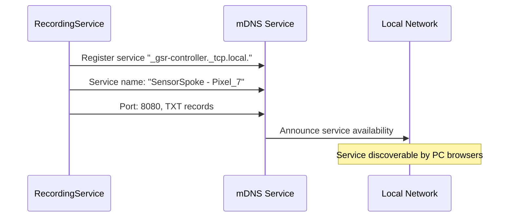

# Protocol Specification

This document defines the comprehensive JSON message protocol, framing rules, and mDNS service specifications required to establish connectivity and control between the PC Hub (PC Controller) and Android Spoke (Sensor Node).

## Table of Contents

1. [Message Framing and Transport](#message-framing-and-transport)
2. [Zeroconf Service Discovery](#zeroconf-service-discovery)
3. [Command Messages](#command-messages)
4. [Response and Acknowledgment Messages](#response-and-acknowledgment-messages)
5. [Event Messages](#event-messages)
6. [Error Handling and Codes](#error-handling-and-codes)
7. [Protocol State Transitions](#protocol-state-transitions)

---

## Message Framing and Transport

### Framing Protocol

The platform supports two message framing approaches for backward compatibility and robustness:

**Primary Framing (Length-Prefixed):**
```
${length}\n{json_payload}
```
- First line: ASCII decimal length of JSON payload in bytes
- Separator: Single newline character (`\n`) 
- Payload: Exactly `{length}` bytes of UTF-8 encoded JSON

**Legacy Framing (Line-Delimited):**
```  
{json_payload}\n
```
- Each message terminated with single newline (`\n`)
- Receiver must handle both framing methods
- New implementations should prefer length-prefixed framing

### Versioned Schema

All control and event messages include version metadata for forward/backward compatibility:

**Required Fields:**
- `v`: Protocol version integer (current: 1)
- `type`: Message discriminator (`"cmd"`, `"ack"`, `"event"`)
- Unknown fields must be ignored by receivers

### Transport Layer

**TCP Connection:**
- Persistent connection per Android device
- PC acts as server, Android devices as clients
- Connection maintained throughout session lifecycle
- Automatic reconnection on network interruption

**UDP Time Sync:**  
- Separate UDP channel for time synchronization
- PC time server on port 3333
- Android clients send sync requests as needed

---

## Zeroconf Service Discovery

### mDNS Service Registration (Android)

**Service Type:** `_gsr-controller._tcp.local.`  
**Service Name Format:** `SensorSpoke - {device_model}`  
**Example:** `SensorSpoke - Pixel_7`

**Service Properties:**
- **Port:** TCP port for incoming PC connections (default: 8080)
- **TXT Records:**
  - `device_id=pixel7_abc123` - Unique device identifier
  - `app_version=1.0.3` - Application version
  - `capabilities=rgb_camera,thermal_topdon_tc001,gsr_shimmer3` - **✅ PRODUCTION-READY** sensor capabilities
  - `api_level=33` - Android API level

**Registration Process:**


### Service Discovery (PC)

**Discovery Process:**
```python
# PC Zeroconf browser implementation
browser = ServiceBrowser(zeroconf, "_gsr-controller._tcp.local.", listener)

def on_service_state_change(zeroconf, service_type, name, state_change):
    if state_change is ServiceStateChange.Added:
        info = zeroconf.get_service_info(service_type, name)
        device_info = parse_service_info(info)
        connect_to_device(device_info)
```

---

## Command Messages

All command messages originate from PC Controller and are sent to Android devices.

### Message Structure Template

```json
{
  "v": 1,
  "id": <unique_integer>,
  "type": "cmd",
  "command": "<command_name>",
  "timestamp": "<ISO8601_timestamp>",
  ...additional_fields
}
```

### Query Capabilities Command

**Direction:** PC → Android  
**Purpose:** Discover device capabilities and current status  
**Response Required:** Yes  

**v1 Format (Preferred):**
```json
{
  "v": 1,
  "id": 1,
  "type": "cmd", 
  "command": "query_capabilities",
  "timestamp": "2024-12-18T14:30:52.123Z"
}
```

**Legacy Format (Supported):**
```json
{
  "id": 1,
  "command": "query_capabilities"
}
```

### Time Sync Command

**Direction:** PC → Android  
**Purpose:** Request time synchronization handshake  
**Response Required:** Yes  

```json
{
  "v": 1,
  "id": 2,
  "type": "cmd",
  "command": "time_sync", 
  "timestamp": "2024-12-18T14:30:52.123Z",
  "server_ip": "192.168.1.100",
  "server_port": 3333,
  "timeout_ms": 1500
}
```

### Start Recording Command

**Direction:** PC → Android  
**Purpose:** Begin data collection session  
**Response Required:** Yes  

```json
{
  "v": 1,
  "id": 3,
  "type": "cmd",
  "command": "start_recording",
  "timestamp": "2024-12-18T14:31:15.987Z",
  "session_id": "20241218_143052_001",
  "modalities": ["rgb", "thermal", "gsr"],
  "config": {
    "rgb": {
      "video_quality": "1080p",
      "frame_rate": 30,
      "still_interval_ms": 150
    },
    "thermal": {
      "sampling_rate_hz": 10,
      "emissivity": 0.95
    },
    "gsr": {
      "sampling_rate_hz": 128,
      "ble_device_mac": "00:11:22:33:44:55"
    }
  }
}
```

### Stop Recording Command

**Direction:** PC → Android  
**Purpose:** End data collection session  
**Response Required:** Yes  

```json
{
  "v": 1,
  "id": 4,
  "type": "cmd", 
  "command": "stop_recording",
  "timestamp": "2024-12-18T14:45:32.456Z",
  "session_id": "20241218_143052_001",
  "immediate": false
}
```

### Flash Sync Command

**Direction:** PC → Android  
**Purpose:** Trigger synchronization flash event  
**Response Required:** Yes  

```json
{
  "v": 1,
  "id": 5,
  "type": "cmd",
  "command": "flash_sync", 
  "timestamp": "2024-12-18T14:35:00.000Z",
  "sync_id": "sync_001",
  "method": "manual"
}
```

### File Transfer Command

**Direction:** PC → Android  
**Purpose:** Request session data upload  
**Response Required:** Yes  

```json
{
  "v": 1,
  "id": 6,
  "type": "cmd",
  "command": "transfer_files",
  "timestamp": "2024-12-18T14:46:00.123Z", 
  "session_id": "20241218_143052_001",
  "transfer_config": {
    "pc_ip": "192.168.1.100",
    "pc_port": 9090,
    "compression": "zip",
    "include_flash_events": true
  }
}
```

---

## Response and Acknowledgment Messages

All acknowledgment messages are sent from Android devices back to PC Controller in response to commands.

### Acknowledgment Structure Template

```json
{
  "v": 1,
  "ack_id": <original_command_id>,
  "type": "ack",
  "status": "ok|error",
  "timestamp": "<ISO8601_timestamp>",
  "message": "<human_readable_status>",
  ...response_data
}
```

### Capabilities Response

**Direction:** Android → PC  
**Responds to:** query_capabilities command  

```json
{
  "v": 1,
  "ack_id": 1,
  "type": "ack",
  "status": "ok",
  "timestamp": "2024-12-18T14:30:52.145Z",
  "message": "Capabilities retrieved successfully",
  "capabilities": {
    "device_model": "Google Pixel 7",
    "device_id": "pixel7_abc123",
    "android_version": "13", 
    "api_level": 33,
    "app_version": "1.0.3",
    "sensors": {
      "rgb_camera": {
        "available": true,
        "resolution": "4032x3024",
        "video_formats": ["1080p", "720p"],
        "status": "✅ PRODUCTION-READY"
      },
      "thermal_topdon_tc001": {
        "available": true,
        "model": "Topdon TC001",
        "resolution": "256x192",
        "sdk_integration": "✅ TRUE SDK",
        "temperature_accuracy": "±2°C",
        "color_palettes": ["Iron", "Rainbow", "Grayscale"],
        "emissivity_range": "0.1-1.0",
        "status": "✅ PRODUCTION-READY"
      },
      "gsr_shimmer3": {
        "available": true,
        "model": "Shimmer3 GSR+",
        "sampling_rate": "128 Hz",
        "adc_resolution": "12-bit (0-4095)",
        "sdk_integration": "✅ SHIMMER ANDROID API",
        "data_types": ["GSR (microsiemens)", "PPG (raw ADC)"],
        "ble_supported": true,
        "shimmer_version": "3+",
        "status": "✅ PRODUCTION-READY"
      }
    },
    "storage": {
      "available_space_mb": 15360,
      "sessions_path": "/Android/data/app/files/sessions"
    },
    "network": {
      "tcp_port": 8080,
      "mdns_service": "SensorSpoke - Pixel_7"
    }
  }
}
```

### Preview Frame Events

**Direction:** Android → PC  
**Purpose:** Real-time camera preview streaming  
**Frequency:** ~6.67 Hz (throttled)  

```json
{
  "v": 1,
  "type": "event",
  "event": "preview_frame",
  "timestamp": "2024-12-18T14:32:15.123Z",
  "device_id": "pixel7_abc123",
  "session_id": "20241218_143052_001",  
  "frame_data": {
    "jpeg_base64": "/9j/4AAQSkZJRgABAQEAYABgAAD...",
    "capture_timestamp_ns": 1703856735123456789,
    "width": 640,
    "height": 480,
    "compression_quality": 75
  }
}
```

This enhanced protocol specification provides comprehensive message definitions, error handling, and state management for reliable multi-device communication.
