# Visualization Elements Tracking Table

This document provides a comprehensive tracking table for all visualization elements across the thesis chapters, including their generation scripts, creation status, location, and current status.

## Executive Status Overview


## Overall Progress Dashboard

```mermaid
graph TB
    subgraph "Chapter 1: Introduction"
        C1[✅ Conceptual Overview Diagram]
        C1 --> C1_STATUS[✅ Complete - Mermaid]
    end
    
    subgraph "Chapter 2: Background"
        C2A[✅ Physiology of GSR]
        C2B[✅ Thermal Cues of Stress]
        C2C[✅ Stress Indicators Table]
        C2D[✅ Sensor Specifications Table]
        
        C2A --> C2A_STATUS[✅ Complete - Mermaid]
        C2B --> C2B_STATUS[✅ Complete - Mermaid]  
        C2C --> C2C_STATUS[✅ Created]
        C2D --> C2D_STATUS[✅ Created]
    end
    
    subgraph "Chapter 3: Requirements"
        C3A[✅ System Architecture]
        C3B[✅ UML Use Case Diagram]
        C3C[✅ Functional Requirements Table]
        C3D[✅ Non-Functional Requirements Table]
        
        C3A --> C3A_STATUS[✅ Complete - Mermaid]
        C3B --> C3B_STATUS[✅ Complete - Mermaid]
        C3C --> C3C_STATUS[✅ Complete - PNG]
        C3D --> C3D_STATUS[✅ Complete - PNG]
    end
    
    subgraph "Chapter 4: Implementation"
        C4A[✅ Android App Architecture]
        C4B[✅ PC Controller Threading]
        C4C[✅ Protocol Sequence Diagram]
        C4D[✅ Data Processing Pipeline]
        C4E[✅ Desktop GUI Screenshots]
        
        C4A --> C4A_STATUS[✅ Complete - Mermaid]
        C4B --> C4B_STATUS[✅ Complete - Mermaid]
        C4C --> C4C_STATUS[✅ Complete - Mermaid]
        C4D --> C4D_STATUS[✅ Complete - Mermaid]
        C4E --> C4E_STATUS[✅ Complete - PNG]
    end
    
    subgraph "Chapter 5: Evaluation"
        C5A[✅ Testing Strategy Pyramid]
        C5B[✅ Test Coverage Table]
        C5C[✅ Synchronization Accuracy]
        C5D[✅ Synchronization Failure]
        C5E[✅ Endurance Test Results]
        C5F[✅ Usability Testing Results]
        C5G[✅ Comprehensive Evaluation]
        
        C5A --> C5A_STATUS[✅ Created]
        C5B --> C5B_STATUS[✅ Created]
        C5C --> C5C_STATUS[✅ Created]
        C5D --> C5D_STATUS[✅ Created]
        C5E --> C5E_STATUS[✅ Created]
        C5F --> C5F_STATUS[✅ Created]
        C5G --> C5G_STATUS[✅ Created]
    end
    
    subgraph "Chapter 6: Conclusions"
        C6A[✅ Project Objectives Evaluation]
        C6A --> C6A_STATUS[✅ Created]
    end
```



## Detailed Tracking Table

| Chapter | Visualization Element | Script/Test to Create | Created | Location | Status | Format | Notes |
|---------|---------------------|----------------------|---------|----------|--------|--------|-------|
| **Chapter 1: Introduction** |
| 1 | Conceptual Overview Diagram | `scripts/generate_mermaid_visualizations.py` | ✅ Yes | `docs/diagrams/mermaid/chapter1_introduction/conceptual_overview.md` | Complete | Mermaid | System overview with research context |
| **Chapter 2: Background** |
| 2 | Physiology of Galvanic Skin Response | `scripts/generate_final_missing_visualizations.py` | ✅ Yes | `docs/diagrams/mermaid/chapter2_background/physiology_gsr.md` | Complete | Mermaid | Physiological flow diagram |
| 3 | Thermal Cues of Stress | `scripts/generate_final_missing_visualizations.py` | ✅ Yes | `docs/diagrams/mermaid/chapter2_background/thermal_stress_cues.md` | Complete | Mermaid | Thermal response visualization |
| 4 | Stress Indicators Comparison (Table) | `scripts/generate_missing_visualizations.py` | ✅ Yes | `images/chapter2_background/table_2_1_stress_indicators_comparison.png` | Complete | PNG | Comparison table generated |
| 5 | Sensor Specifications (Table) | `scripts/generate_missing_visualizations.py` | ✅ Yes | `images/chapter2_background/table_2_2_sensor_specifications.png` | Complete | PNG | Technical specifications table |
| **Chapter 3: Requirements** |
| 6 | High-Level System Architecture | `scripts/generate_mermaid_visualizations.py` | ✅ Yes | `docs/diagrams/mermaid/chapter3_requirements/system_architecture.md` | Complete | Mermaid | Hub-and-spoke architecture diagram |
| 7 | UML Use Case Diagram | `scripts/generate_mermaid_visualizations.py` | ✅ Yes | `docs/diagrams/mermaid/chapter3_requirements/use_case_diagram.md` | Complete | Mermaid | User interaction flows |
| 8 | Functional Requirements Summary (Table) | `scripts/generate_final_missing_visualizations.py` | ✅ Yes | `images/chapter3_requirements/table_3_1_functional_requirements.png` | Complete | PNG | Requirements traceability |
| 9 | Non-Functional Requirements Summary (Table) | `scripts/generate_final_missing_visualizations.py` | ✅ Yes | `images/chapter3_requirements/table_3_2_nonfunctional_requirements.png` | Complete | PNG | Performance/quality requirements |
| **Chapter 4: Implementation** |
| 10 | Detailed System Architecture | `scripts/generate_mermaid_visualizations.py` | ✅ Yes | `docs/diagrams/mermaid/chapter4_implementation/android_architecture.md` | Complete | Mermaid | MVVM Android architecture |
| 11 | Android Application Architecture | `scripts/generate_mermaid_visualizations.py` | ✅ Yes | `docs/diagrams/mermaid/chapter4_implementation/android_architecture.md` | Complete | Mermaid | Component-level architecture |
| 12 | PC Controller Threading Model | `scripts/generate_mermaid_visualizations.py` | ✅ Yes | `docs/diagrams/mermaid/chapter4_implementation/threading_model.md` | Complete | Mermaid | Thread interaction diagram |
| 13 | Protocol Sequence Diagram | `scripts/generate_mermaid_visualizations.py` | ✅ Yes | `docs/diagrams/mermaid/chapter4_implementation/protocol_sequence.md` | Complete | Mermaid | Communication protocol flow |
| 14 | Data Processing Pipeline | `scripts/generate_mermaid_visualizations.py` | ✅ Yes | `docs/diagrams/mermaid/chapter4_implementation/data_processing_pipeline.md` | Complete | Mermaid | End-to-end data flow |
| 15 | Desktop GUI Screenshots | `scripts/generate_final_missing_visualizations.py` | ✅ Yes | `images/chapter4_implementation/` | Complete | PNG | Application screenshots |
| **Chapter 5: Evaluation** |
| 16 | Testing Strategy Overview | `scripts/generate_chapter5_visualizations.py` | ✅ Yes | `images/chapter5_evaluation/fig_5_1_testing_strategy_pyramid.png` | Complete | PNG | Testing pyramid generated |
| 17 | Test Coverage Summary (Table) | `scripts/generate_chapter5_visualizations.py` | ✅ Yes | `images/chapter5_evaluation/comprehensive_evaluation_summary.png` | Complete | PNG | Coverage metrics table |
| 18 | Synchronization Accuracy Results (Graph) | `scripts/generate_chapter5_visualizations.py` | ✅ Yes | `images/chapter5_evaluation/synchronization_accuracy_results.png` | Complete | PNG | Box plot with statistics |
| 19 | Synchronization Failure Example (Graph) | `scripts/generate_chapter5_visualizations.py` | ✅ Yes | `images/chapter5_evaluation/synchronization_failure_example.png` | Complete | PNG | Time-series failure analysis |
| 20 | Endurance Test Results (Graphs) | `scripts/generate_chapter5_visualizations.py` | ✅ Yes | `images/chapter5_evaluation/endurance_test_performance.png` | Complete | PNG | 8-hour stability metrics |
| 21 | Usability Testing Results (Table) | `scripts/generate_chapter5_visualizations.py` | ✅ Yes | `images/chapter5_evaluation/usability_testing_results.png` | Complete | PNG | User experience metrics |
| 22 | Comprehensive Evaluation Summary | `scripts/generate_chapter5_visualizations.py` | ✅ Yes | `images/chapter5_evaluation/comprehensive_evaluation_summary.png` | Complete | PNG | Multi-panel dashboard |
| **Chapter 6: Conclusions** |
| 23 | Project Objectives Evaluation (Table) | `scripts/generate_missing_visualizations.py` | ✅ Yes | `images/chapter6_conclusions/table_6_1_project_objectives_evaluation.png` | Complete | PNG | Achievement assessment |
| **Additional Visualizations** |
| 24 | Data Quality Dashboard | `scripts/generate_sample_visualizations.py` | ✅ Yes | `images/data_quality_dashboard.png` | Complete | PNG | System monitoring dashboard |
| 25 | Multimodal Alignment Plot | `scripts/generate_sample_visualizations.py` | ✅ Yes | `images/multimodal_alignment_plot.png` | Complete | PNG | Sensor synchronization |
| 26 | Performance Telemetry Chart | `scripts/generate_sample_visualizations.py` | ✅ Yes | `images/performance_telemetry_chart.png` | Complete | PNG | System performance metrics |

## Script Dependencies and Capabilities


## Evidence File Mapping

| Evidence Category | Required Files | Present | Used By Script | Purpose |
|-------------------|----------------|---------|----------------|---------|
| **Unit Testing** | `junit_report_android.xml` | ✅ Yes | `generate_chapter5_visualizations.py` | Android test coverage |
| | `pytest_report_pc.xml` | ✅ Yes | `generate_chapter5_visualizations.py` | PC test coverage |
| | `coverage_report_pc.xml` | ✅ Yes | `generate_chapter5_visualizations.py` | Code coverage metrics |
| **Integration Testing** | `simulation_test_logs.txt` | ✅ Yes | `generate_chapter5_visualizations.py` | System integration evidence |
| | `system_integration_report.json` | ✅ Yes | `generate_chapter5_visualizations.py` | Integration test results |
| **Performance** | `endurance_test_report.json` | ✅ Yes | `generate_chapter5_visualizations.py` | 8-hour stability data |
| | `synchronization_accuracy_data.csv` | ✅ Yes | `generate_chapter5_visualizations.py` | Timing accuracy measurements |
| | `endurance_raw_data.csv` | ✅ Yes | `generate_chapter5_visualizations.py` | Raw performance metrics |
| **Stability** | `pc_threading_error_logs.txt` | ✅ Yes | `generate_chapter5_visualizations.py` | Threading analysis |
| | `wifi_roaming_sync_failures.csv` | ✅ Yes | `generate_chapter5_visualizations.py` | Network failure patterns |
| **Usability** | `setup_time_measurements.csv` | ✅ Yes | `generate_chapter5_visualizations.py` | User experience metrics |
| | `user_testing_session_notes.md` | ✅ Yes | `generate_chapter5_visualizations.py` | Qualitative feedback |

## Priority Implementation Plan


## Status Summary

### ✅ Completed (23 items - 100%)
- All Chapter 5 evaluation visualizations (7 items)
- Chapter 2 tables and physiological diagrams (4 items)  
- Chapter 6 objectives evaluation (1 item)
- Additional dashboard visualizations (3 items)
- Chapter 1 conceptual overview (Mermaid) (1 item)
- Chapter 3 architecture diagrams and requirements tables (Mermaid + PNG) (4 items)
- Chapter 4 implementation diagrams and GUI screenshots (Mermaid + PNG) (5 items)

### 🚧 In Progress (0 items)
- None

### ❌ Pending (0 items)
- None

### Completion Rate: 100% (23/23 core visualizations complete)

## Validation Commands

```bash
# Run comprehensive validation
python scripts/validate_issue_27_completion.py

# Generate missing visualizations
python scripts/generate_missing_visualizations.py

# Generate Chapter 5 specific plots
python scripts/generate_chapter5_visualizations.py

# Generate sample dashboards
python scripts/generate_sample_visualizations.py
```

## Mermaid Integration Plan

The user has requested Mermaid visualizations. The following diagrams should be converted from PNG to Mermaid format:

1. **System Architecture Diagrams** → Mermaid flowcharts
2. **Process Flow Diagrams** → Mermaid sequence diagrams  
3. **State Diagrams** → Mermaid state diagrams
4. **Component Relationships** → Mermaid graph diagrams

This provides better version control, easier maintenance, and dynamic rendering capabilities.