# Ready-to-Adapt Diagram Examples

**Purpose**: Compact Mermaid/PlantUML code snippets for immediate use in reports and presentations.

**Usage**: Copy and paste into Markdown documents, adjust labels and styling as needed.

## System Architecture Examples

### High-Level System (Mermaid)
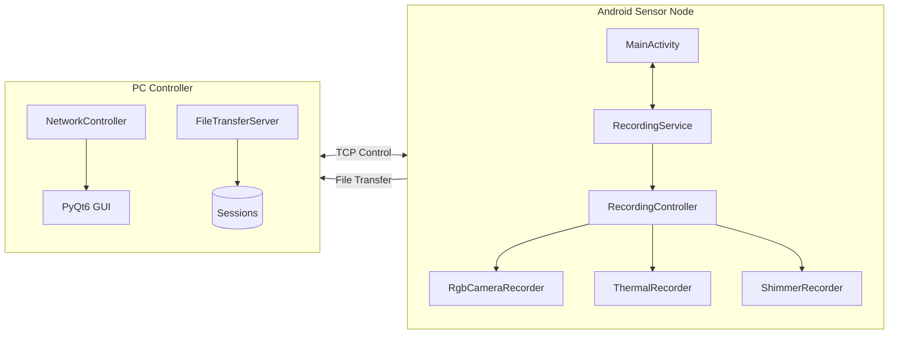

### Deployment View (Mermaid)
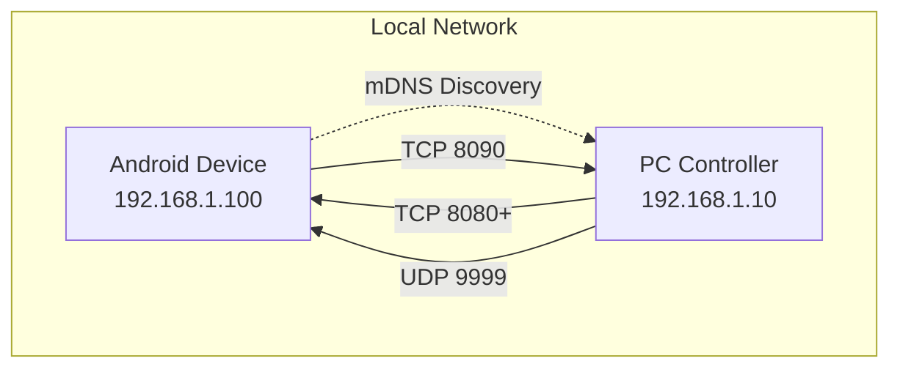

## Protocol Examples

### Command Sequence (PlantUML)
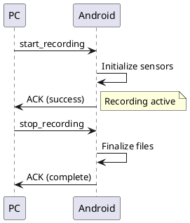

### State Machine (Mermaid)
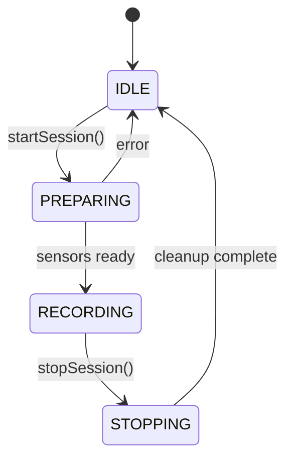

## Data Flow Examples

### Preview Pipeline (Mermaid)
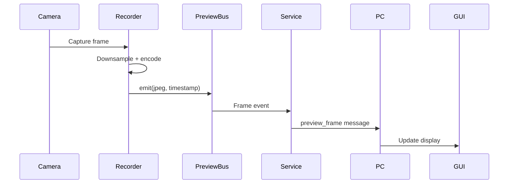

### File Structure (Tree View)
```
sessions/
└── 20250818_173012_123_Device_ab12cd34/
    ├── rgb/
    │   ├── video_1692374212345678901.mp4
    │   ├── frames/frame_*.jpg
    │   └── rgb.csv
    ├── thermal/
    │   ├── thermal.csv
    │   └── metadata.json
    ├── gsr/
    │   └── gsr.csv
    └── flash_sync_events.csv
```

## Performance Examples

### Timeline Chart (Mermaid)
```mermaid
gantt
  title Recording Session Timeline
  dateFormat X
  axisFormat %M:%S

  section RGB Camera
  Video Recording: 0, 600000
  JPEG Capture: 0, 600000

  section GSR Sensor
  Data Streaming: 0, 600000

  section File Transfer
  ZIP Creation: 600000, 630000
  Network Transfer: 630000, 660000
```

### Performance Chart (Mermaid)
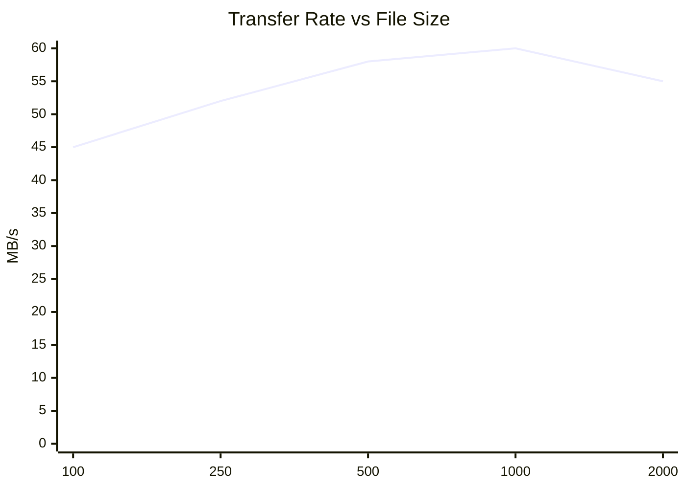

## Class Diagram (Mermaid)
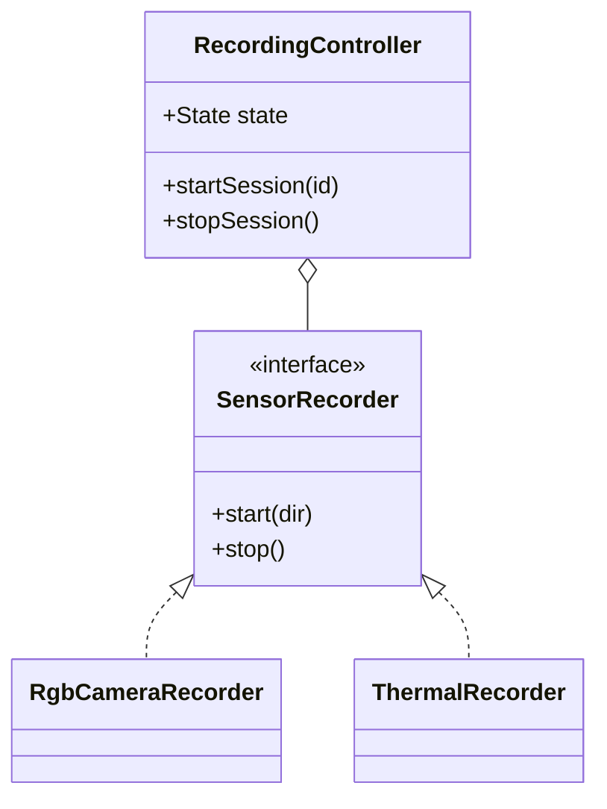

## Error Handling (Mermaid)
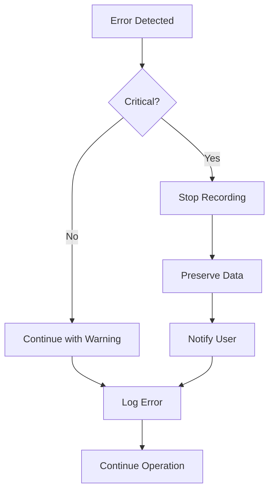

## Network Protocol (Table Format)

| Command | Request | Response |
|---------|---------|----------|
| `query_capabilities` | `{"v":1,"type":"cmd","id":1}` | `{"v":1,"type":"ack","ack_id":1,"capabilities":{...}}` |
| `start_recording` | `{"v":1,"type":"cmd","id":2,"session_id":"..."}` | `{"v":1,"type":"ack","ack_id":2,"status":"ok"}` |
| `time_sync` | `{"v":1,"type":"cmd","id":3}` | `{"v":1,"type":"ack","ack_id":3,"t1":...,"t2":...}` |

## Quick Reference

### Styling Options (Mermaid)
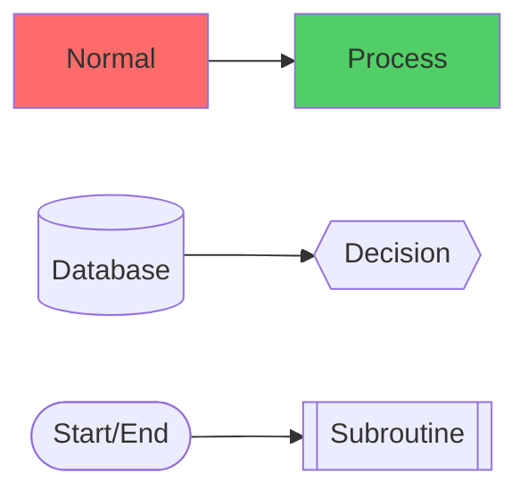

### PlantUML Skinparams
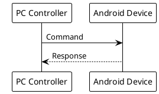

### Mermaid Configuration
```yaml
# In frontmatter or config
mermaid:
  theme: default
  themeVariables:
    primaryColor: "#00b4d8"
    primaryTextColor: "#023e8a"
    primaryBorderColor: "#0077b6"
```

## Usage Tips

1. **Copy-Paste Ready**: All examples use standard syntax
2. **Customizable**: Change labels, colors, and layout as needed
3. **Scalable**: Add or remove components easily
4. **Multiple Formats**: Both Mermaid and PlantUML versions provided
5. **Documented**: Each example includes purpose and context

## Rendering Tools

- **VS Code**: Mermaid Preview, PlantUML extensions
- **GitHub**: Native Mermaid support in markdown
- **Online**: mermaid.live, plantuml.com
- **Static Sites**: Hugo, Jekyll, Docusaurus support
- **Export**: SVG, PNG, PDF formats available
