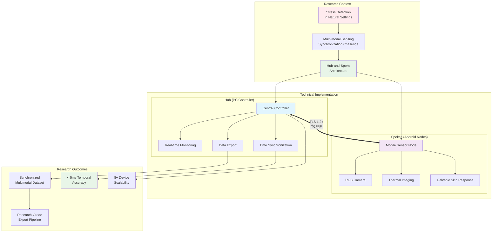

```mermaid
graph TB
    subgraph "Research Context"
        PROBLEM[Stress Detection<br/>in Natural Settings]
        CHALLENGE[Multi-Modal Sensing<br/>Synchronization Challenge]
        SOLUTION[Hub-and-Spoke<br/>Architecture]
    end

    subgraph "Technical Implementation"
        subgraph "Hub (PC Controller)"
            HUB[Central Controller]
            GUI_COMP[Real-time Monitoring]
            SYNC_COMP[Time Synchronization]
            EXPORT_COMP[Data Export]
        end

        subgraph "Spokes (Android Nodes)"
            ANDROID[Mobile Sensor Node]
            RGB[RGB Camera]
            THERMAL[Thermal Imaging]
            GSR[Galvanic Skin Response]
        end
    end

    subgraph "Research Outcomes"
        DATA[Synchronized<br/>Multimodal Dataset]
        ACCURACY[< 5ms Temporal<br/>Accuracy]
        SCALABLE[8+ Device<br/>Scalability]
        PIPELINE[Research-Grade<br/>Export Pipeline]
    end

    PROBLEM --> CHALLENGE
    CHALLENGE --> SOLUTION

    SOLUTION --> HUB
    HUB --> GUI_COMP
    HUB --> SYNC_COMP
    HUB --> EXPORT_COMP

    SOLUTION --> ANDROID
    ANDROID --> RGB
    ANDROID --> THERMAL
    ANDROID --> GSR

    HUB <==> |TLS 1.2+<br/>TCP/IP| ANDROID

    SYNC_COMP --> ACCURACY
    EXPORT_COMP --> DATA
    HUB --> SCALABLE
    DATA --> PIPELINE

    style PROBLEM fill:#ffebee
    style SOLUTION fill:#e8f5e8
    style HUB fill:#e1f5fe
    style ANDROID fill:#f3e5f5
    style ACCURACY fill:#e8f5e8
```
