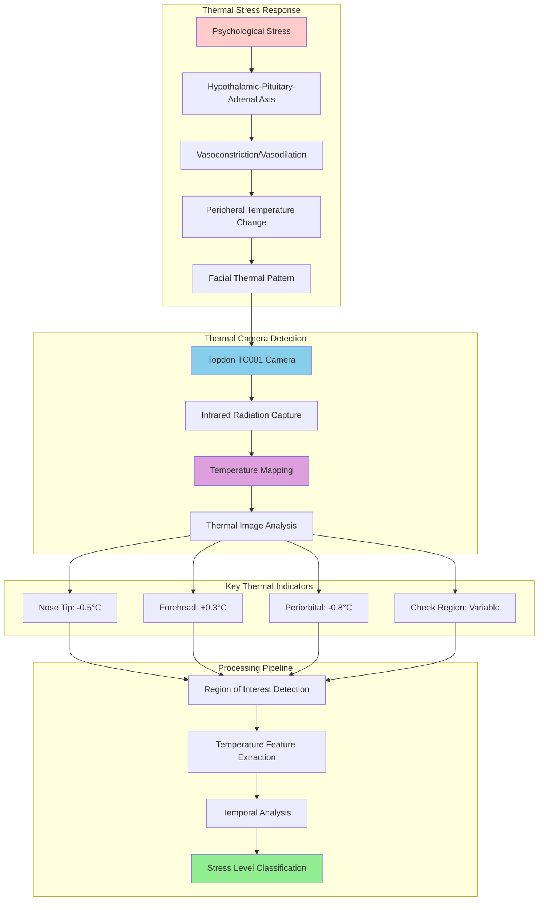

```mermaid
graph TD
    subgraph "Thermal Stress Response"
        A[Psychological Stress] --> B[Hypothalamic-Pituitary-Adrenal Axis]
        B --> C[Vasoconstriction/Vasodilation]
        C --> D[Peripheral Temperature Change]
        D --> E[Facial Thermal Pattern]
    end
    
    subgraph "Thermal Camera Detection"
        E --> F[Topdon TC001 Camera]
        F --> G[Infrared Radiation Capture]
        G --> H[Temperature Mapping]
        H --> I[Thermal Image Analysis]
    end
    
    subgraph "Key Thermal Indicators"
        I --> J[Nose Tip: -0.5°C]
        I --> K[Forehead: +0.3°C]
        I --> L[Periorbital: -0.8°C]
        I --> M[Cheek Region: Variable]
    end
    
    subgraph "Processing Pipeline"
        J --> N[Region of Interest Detection]
        K --> N
        L --> N
        M --> N
        N --> O[Temperature Feature Extraction]
        O --> P[Temporal Analysis]
        P --> Q[Stress Level Classification]
    end
    
    style A fill:#ffcccb
    style Q fill:#90ee90
    style F fill:#87ceeb
    style H fill:#dda0dd

```