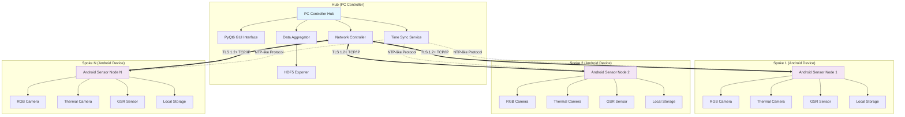

```mermaid
graph TB
    subgraph "Hub (PC Controller)"
        HUB[PC Controller Hub]
        GUI[PyQt6 GUI Interface]
        NET[Network Controller]
        SYNC[Time Sync Service]
        DATA[Data Aggregator]
        EXPORT[HDF5 Exporter]

        HUB --> GUI
        HUB --> NET
        HUB --> SYNC
        HUB --> DATA
        DATA --> EXPORT
    end

    subgraph "Spoke 1 (Android Device)"
        ANDROID1[Android Sensor Node 1]
        SENSOR1A[RGB Camera]
        SENSOR1B[Thermal Camera]
        SENSOR1C[GSR Sensor]
        STORAGE1[Local Storage]

        ANDROID1 --> SENSOR1A
        ANDROID1 --> SENSOR1B
        ANDROID1 --> SENSOR1C
        ANDROID1 --> STORAGE1
    end

    subgraph "Spoke 2 (Android Device)"
        ANDROID2[Android Sensor Node 2]
        SENSOR2A[RGB Camera]
        SENSOR2B[Thermal Camera]
        SENSOR2C[GSR Sensor]
        STORAGE2[Local Storage]

        ANDROID2 --> SENSOR2A
        ANDROID2 --> SENSOR2B
        ANDROID2 --> SENSOR2C
        ANDROID2 --> STORAGE2
    end

    subgraph "Spoke N (Android Device)"
        ANDROIDN[Android Sensor Node N]
        SENSORNA[RGB Camera]
        SENSORNB[Thermal Camera]
        SENSORNC[GSR Sensor]
        STORAGEN[Local Storage]

        ANDROIDN --> SENSORNA
        ANDROIDN --> SENSORNB
        ANDROIDN --> SENSORNC
        ANDROIDN --> STORAGEN
    end

    NET <==> |TLS 1.2+ TCP/IP| ANDROID1
    NET <==> |TLS 1.2+ TCP/IP| ANDROID2
    NET <==> |TLS 1.2+ TCP/IP| ANDROIDN

    SYNC -.-> |NTP-like Protocol| ANDROID1
    SYNC -.-> |NTP-like Protocol| ANDROID2
    SYNC -.-> |NTP-like Protocol| ANDROIDN

    style HUB fill:#e1f5fe
    style ANDROID1 fill:#f3e5f5
    style ANDROID2 fill:#f3e5f5
    style ANDROIDN fill:#f3e5f5
```
