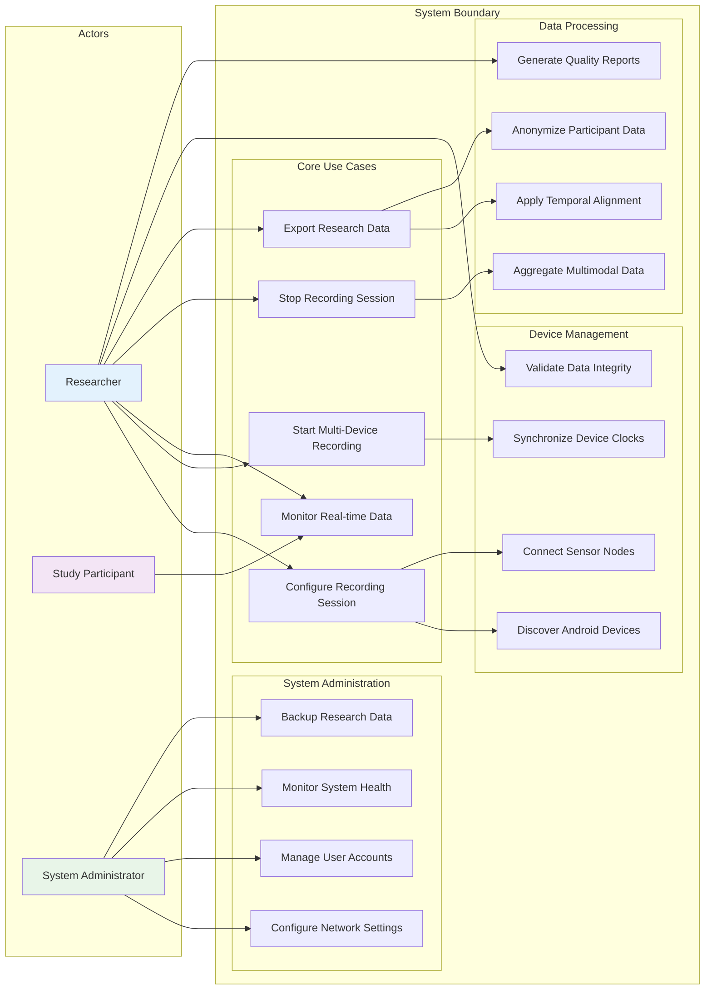

```mermaid
graph LR
    subgraph "Actors"
        RESEARCHER[Researcher]
        PARTICIPANT[Study Participant]
        SYSTEM[System Administrator]
    end
    
    subgraph "System Boundary"
        subgraph "Core Use Cases"
            UC1[Configure Recording Session]
            UC2[Start Multi-Device Recording]
            UC3[Monitor Real-time Data]
            UC4[Stop Recording Session]
            UC5[Export Research Data]
        end
        
        subgraph "Device Management"
            UC6[Discover Android Devices]
            UC7[Connect Sensor Nodes]
            UC8[Synchronize Device Clocks]
            UC9[Validate Data Integrity]
        end
        
        subgraph "Data Processing"
            UC10[Aggregate Multimodal Data]
            UC11[Apply Temporal Alignment]
            UC12[Anonymize Participant Data]
            UC13[Generate Quality Reports]
        end
        
        subgraph "System Administration"
            UC14[Configure Network Settings]
            UC15[Manage User Accounts]
            UC16[Monitor System Health]
            UC17[Backup Research Data]
        end
    end
    
    RESEARCHER --> UC1
    RESEARCHER --> UC2
    RESEARCHER --> UC3
    RESEARCHER --> UC4
    RESEARCHER --> UC5
    RESEARCHER --> UC9
    RESEARCHER --> UC13
    
    PARTICIPANT --> UC3
    
    SYSTEM --> UC14
    SYSTEM --> UC15
    SYSTEM --> UC16
    SYSTEM --> UC17
    
    UC1 --> UC6
    UC1 --> UC7
    UC2 --> UC8
    UC4 --> UC10
    UC5 --> UC11
    UC5 --> UC12
    
    style RESEARCHER fill:#e3f2fd
    style PARTICIPANT fill:#f3e5f5
    style SYSTEM fill:#e8f5e8
```