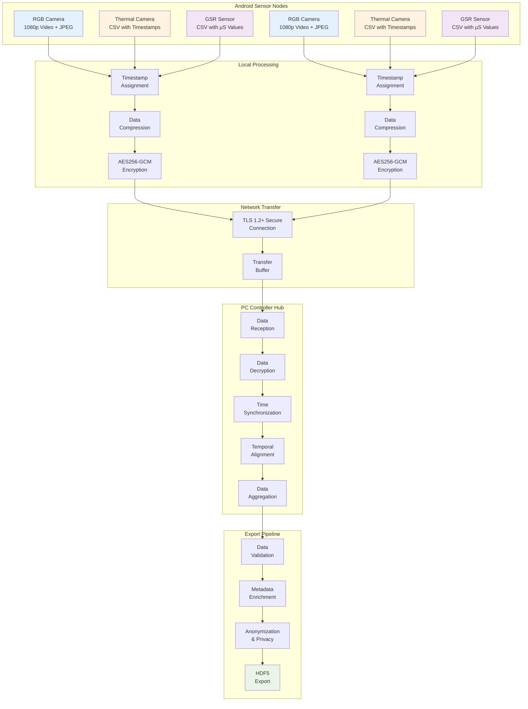

```mermaid
flowchart TD
    subgraph "Android Sensor Nodes"
        CAM1[RGB Camera<br/>1080p Video + JPEG]
        THERM1[Thermal Camera<br/>CSV with Timestamps]
        GSR1[GSR Sensor<br/>CSV with μS Values]

        CAM2[RGB Camera<br/>1080p Video + JPEG]
        THERM2[Thermal Camera<br/>CSV with Timestamps]
        GSR2[GSR Sensor<br/>CSV with μS Values]
    end

    subgraph "Local Processing"
        TIMESTAMP1[Timestamp<br/>Assignment]
        COMPRESS1[Data<br/>Compression]
        ENCRYPT1[AES256-GCM<br/>Encryption]

        TIMESTAMP2[Timestamp<br/>Assignment]
        COMPRESS2[Data<br/>Compression]
        ENCRYPT2[AES256-GCM<br/>Encryption]
    end

    subgraph "Network Transfer"
        TLS[TLS 1.2+ Secure<br/>Connection]
        BUFFER[Transfer<br/>Buffer]
    end

    subgraph "PC Controller Hub"
        RECEIVE[Data<br/>Reception]
        DECRYPT[Data<br/>Decryption]
        SYNC[Time<br/>Synchronization]
        ALIGN[Temporal<br/>Alignment]
        AGGREGATE[Data<br/>Aggregation]
    end

    subgraph "Export Pipeline"
        VALIDATE[Data<br/>Validation]
        METADATA[Metadata<br/>Enrichment]
        HDF5[HDF5<br/>Export]
        ANON[Anonymization<br/>& Privacy]
    end

    CAM1 --> TIMESTAMP1
    THERM1 --> TIMESTAMP1
    GSR1 --> TIMESTAMP1

    CAM2 --> TIMESTAMP2
    THERM2 --> TIMESTAMP2
    GSR2 --> TIMESTAMP2

    TIMESTAMP1 --> COMPRESS1
    COMPRESS1 --> ENCRYPT1
    ENCRYPT1 --> TLS

    TIMESTAMP2 --> COMPRESS2
    COMPRESS2 --> ENCRYPT2
    ENCRYPT2 --> TLS

    TLS --> BUFFER
    BUFFER --> RECEIVE

    RECEIVE --> DECRYPT
    DECRYPT --> SYNC
    SYNC --> ALIGN
    ALIGN --> AGGREGATE

    AGGREGATE --> VALIDATE
    VALIDATE --> METADATA
    METADATA --> ANON
    ANON --> HDF5

    style CAM1 fill:#e3f2fd
    style CAM2 fill:#e3f2fd
    style THERM1 fill:#fff3e0
    style THERM2 fill:#fff3e0
    style GSR1 fill:#f3e5f5
    style GSR2 fill:#f3e5f5
    style HDF5 fill:#e8f5e8
```
