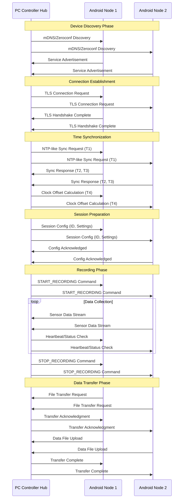

```mermaid
sequenceDiagram
    participant PC as PC Controller Hub
    participant A1 as Android Node 1
    participant A2 as Android Node 2

    Note over PC,A2: Device Discovery Phase
    PC->>A1: mDNS/Zeroconf Discovery
    PC->>A2: mDNS/Zeroconf Discovery
    A1->>PC: Service Advertisement
    A2->>PC: Service Advertisement

    Note over PC,A2: Connection Establishment
    PC->>A1: TLS Connection Request
    PC->>A2: TLS Connection Request
    A1->>PC: TLS Handshake Complete
    A2->>PC: TLS Handshake Complete

    Note over PC,A2: Time Synchronization
    PC->>A1: NTP-like Sync Request (T1)
    PC->>A2: NTP-like Sync Request (T1)
    A1->>PC: Sync Response (T2, T3)
    A2->>PC: Sync Response (T2, T3)
    PC->>A1: Clock Offset Calculation (T4)
    PC->>A2: Clock Offset Calculation (T4)

    Note over PC,A2: Session Preparation
    PC->>A1: Session Config (ID, Settings)
    PC->>A2: Session Config (ID, Settings)
    A1->>PC: Config Acknowledged
    A2->>PC: Config Acknowledged

    Note over PC,A2: Recording Phase
    PC->>A1: START_RECORDING Command
    PC->>A2: START_RECORDING Command

    loop Data Collection
        A1->>PC: Sensor Data Stream
        A2->>PC: Sensor Data Stream
        PC->>A1: Heartbeat/Status Check
        PC->>A2: Heartbeat/Status Check
    end

    PC->>A1: STOP_RECORDING Command
    PC->>A2: STOP_RECORDING Command

    Note over PC,A2: Data Transfer Phase
    A1->>PC: File Transfer Request
    A2->>PC: File Transfer Request
    PC->>A1: Transfer Acknowledgment
    PC->>A2: Transfer Acknowledgment

    A1->>PC: Data File Upload
    A2->>PC: Data File Upload
    PC->>A1: Transfer Complete
    PC->>A2: Transfer Complete
```
