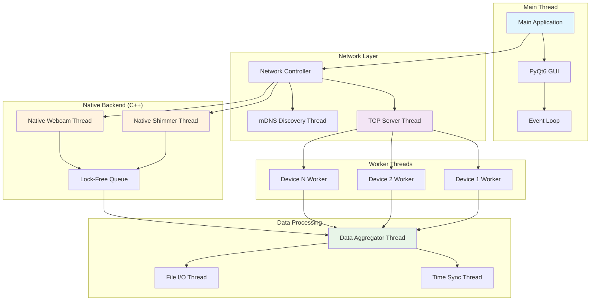

```mermaid
graph TB
    subgraph "Main Thread"
        MAIN[Main Application]
        GUI[PyQt6 GUI]
        EVENT[Event Loop]
    end
    
    subgraph "Network Layer"
        NET_MAIN[Network Controller]
        TCP_SERVER[TCP Server Thread]
        DISCOVERY[mDNS Discovery Thread]
    end
    
    subgraph "Worker Threads"
        WORKER1[Device 1 Worker]
        WORKER2[Device 2 Worker]  
        WORKERN[Device N Worker]
    end
    
    subgraph "Data Processing"
        AGGREGATOR[Data Aggregator Thread]
        SYNC_SERVICE[Time Sync Thread]
        FILE_HANDLER[File I/O Thread]
    end
    
    subgraph "Native Backend (C++)"
        CPP_SHIMMER[Native Shimmer Thread]
        CPP_WEBCAM[Native Webcam Thread]
        LOCK_FREE_Q[Lock-Free Queue]
    end
    
    MAIN --> GUI
    GUI --> EVENT
    MAIN --> NET_MAIN
    
    NET_MAIN --> TCP_SERVER
    NET_MAIN --> DISCOVERY
    
    TCP_SERVER --> WORKER1
    TCP_SERVER --> WORKER2
    TCP_SERVER --> WORKERN
    
    WORKER1 --> AGGREGATOR
    WORKER2 --> AGGREGATOR
    WORKERN --> AGGREGATOR
    
    AGGREGATOR --> SYNC_SERVICE
    AGGREGATOR --> FILE_HANDLER
    
    NET_MAIN --> CPP_SHIMMER
    NET_MAIN --> CPP_WEBCAM
    
    CPP_SHIMMER --> LOCK_FREE_Q
    CPP_WEBCAM --> LOCK_FREE_Q
    LOCK_FREE_Q --> AGGREGATOR
    
    style MAIN fill:#e1f5fe
    style TCP_SERVER fill:#f3e5f5
    style AGGREGATOR fill:#e8f5e8
    style CPP_SHIMMER fill:#fff3e0
    style CPP_WEBCAM fill:#fff3e0
```