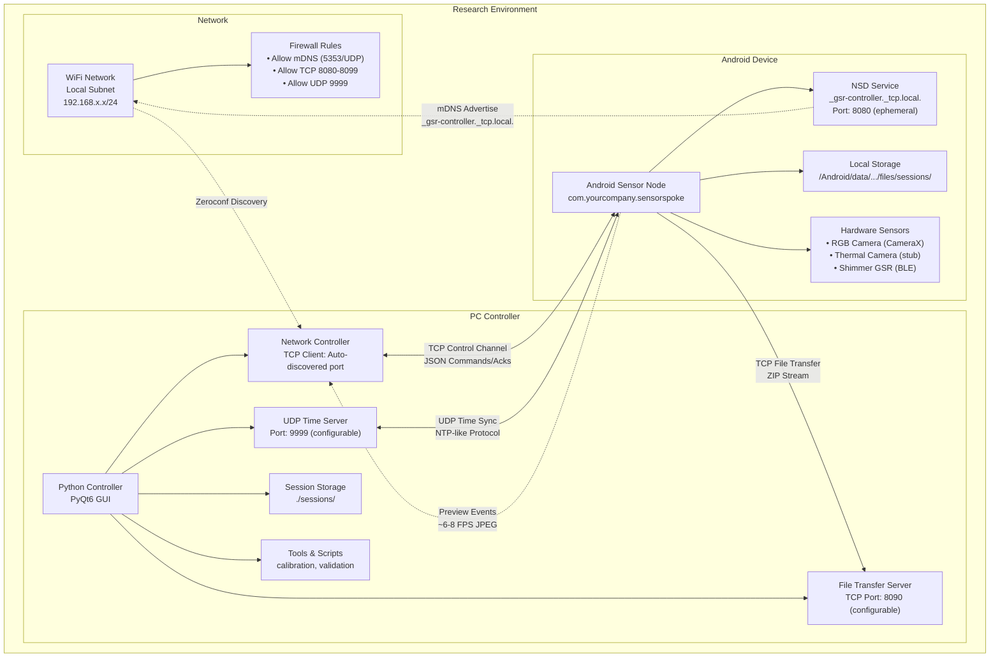

# Deployment View Diagram

**Purpose**: Show runtime placement (Android device, PC), ports, discovery, firewalls.

**Placement**: Chapter 3: System Architecture or Deployment section.

**Content**: Android advertises `_gsr-controller._tcp.` on ephemeral port; PC discovers. PC runs UDP time server (port configurable in docs). TCP control channel separate from TCP file upload target.

**Tools**: Mermaid deployment diagram

## Mermaid Diagram

## Network Configuration Details

### Port Assignments
- **Android NSD Service**: Ephemeral port (typically 8080+), advertised via mDNS
- **PC UDP Time Server**: Port 9999 (configurable in `config.py`)
- **PC File Transfer Server**: Port 8090 (configurable in `config.py`)
- **mDNS/Zeroconf**: Port 5353/UDP (standard)

### Firewall Requirements
- **Incoming on PC**:
  - UDP 9999 (time server)
  - TCP 8090 (file transfer server)
  - UDP 5353 (mDNS responses)
- **Outgoing from PC**:
  - TCP 8080+ (dynamic connection to Android devices)
  - UDP 5353 (mDNS queries)
- **Android**: Standard app permissions for network access

### Discovery Flow
1. Android app starts `RecordingService`
2. `NetworkClient.register()` advertises `_gsr-controller._tcp.local.` with current port
3. PC `NetworkController` uses Zeroconf to browse for services
4. PC connects TCP socket to discovered Android device
5. Initial handshake: `query_capabilities` command

### Network Protocols
- **Control Channel**: TCP with length-prefixed JSON framing (v=1) or legacy newline-delimited
- **Time Sync**: UDP echo protocol for offset calculation
- **File Transfer**: TCP connection with JSON header line followed by ZIP stream
- **Preview Stream**: Push events over control channel (base64-encoded JPEG)

## Security Considerations
- Local network operation only (no internet exposure)
- No authentication in current implementation (research environment)
- Future: TLS support available in `tls_enhanced.py` module
- Data integrity via ZIP checksums and session validation
