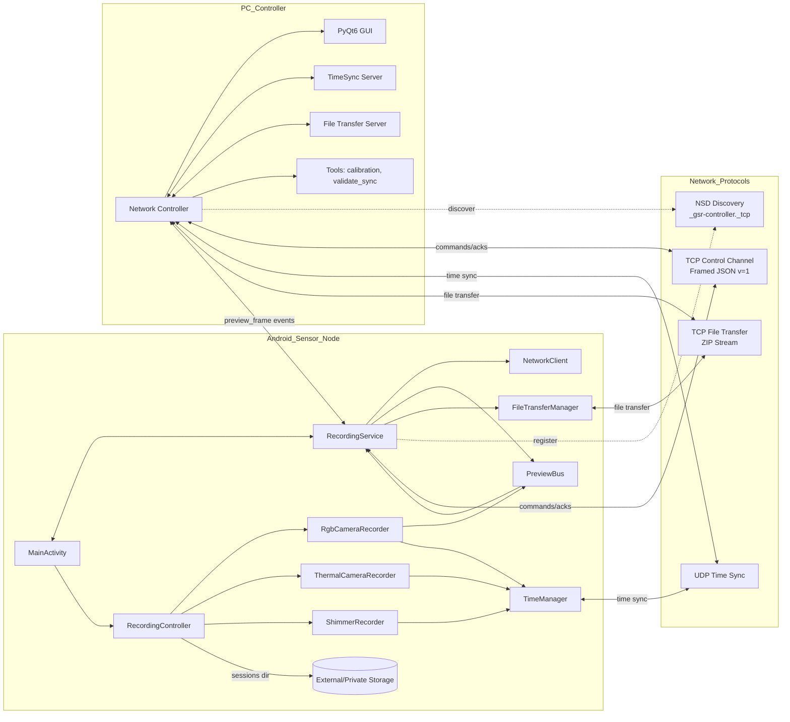

# System Architecture Diagram

**Purpose**: Show the end-to-end system architecture with Android Sensor Node, PC Controller, network protocols, data paths, and external sensors.

**Placement**: Chapter 3: System Architecture (first figure)

**Content**: 
- Android app components: MainActivity, RecordingService, RecordingController, SensorRecorders (RGB, Thermal, Shimmer), NetworkClient, FileTransferManager, PreviewBus, TimeManager
- PC components: Network controller, time server, CSV/HDF5 tools, calibration and validation tools  
- Protocols: NSD (Zeroconf), TCP framed JSON, UDP time sync, file transfer (TCP ZIP stream)

**Tools**: Mermaid component diagram

## Mermaid Diagram



## PlantUML Alternative

```plantuml
@startuml
!define RECTANGLE class

package "Android Sensor Node" {
  RECTANGLE MainActivity
  RECTANGLE RecordingService
  RECTANGLE RecordingController
  RECTANGLE RgbCameraRecorder
  RECTANGLE ThermalCameraRecorder  
  RECTANGLE ShimmerRecorder
  RECTANGLE NetworkClient
  RECTANGLE FileTransferManager
  RECTANGLE PreviewBus
  RECTANGLE TimeManager
  database "External/Private\nStorage"
}

package "PC Controller" {
  RECTANGLE NetworkController
  RECTANGLE TimeSyncServer
  RECTANGLE FileTransferServer
  RECTANGLE "Tools: calibration,\nvalidate_sync"
  RECTANGLE "PyQt6 GUI"
}

MainActivity <--> RecordingService
MainActivity --> RecordingController  
RecordingService --> NetworkClient
RecordingController --> RgbCameraRecorder
RecordingController --> ThermalCameraRecorder
RecordingController --> ShimmerRecorder
RecordingController --> "External/Private\nStorage"
RgbCameraRecorder --> PreviewBus
PreviewBus --> RecordingService
RecordingService --> FileTransferManager

NetworkController ..> NetworkClient : NSD Discovery
NetworkController <--> RecordingService : TCP Control
TimeSyncServer <--> TimeManager : UDP Time Sync  
FileTransferServer <--> FileTransferManager : TCP File Transfer
@enduml
```

## Key Components

### Android Sensor Node
- **MainActivity**: Main UI entry point, coordinates with RecordingService
- **RecordingService**: Foreground service managing NSD registration and TCP server  
- **RecordingController**: Central orchestrator managing sensor recorder lifecycle
- **SensorRecorders**: RGB (CameraX MP4+JPEG), Thermal (CSV stub), GSR (Shimmer BLE)
- **NetworkClient**: NSD service registration wrapper
- **FileTransferManager**: ZIP streaming to PC file transfer server
- **PreviewBus**: In-process event bus for downsampled preview frames (~6-8 FPS)
- **TimeManager**: Monotonic timestamps with UDP synchronization

### PC Controller  
- **NetworkController**: Zeroconf discovery, TCP client for device control
- **TimeSyncServer**: UDP server providing monotonic time references
- **FileTransferServer**: TCP server receiving ZIP streams from Android devices
- **Tools**: Calibration utilities, sync validation, data processing
- **PyQt6 GUI**: Dashboard with device grid, live previews, session control

### Network Protocols
- **NSD**: Service type `_gsr-controller._tcp.local.` for automatic discovery
- **TCP Control**: Length-prefixed JSON frames (v=1) or legacy newline-delimited  
- **UDP Time Sync**: NTP-like protocol for <5ms accuracy requirement
- **File Transfer**: TCP connection streaming ZIP archives of session directories