# PC Controller Module Map

**Purpose**: Clarify how network, timing, and tools relate in the Python-based PC Controller application.

**Placement**: Chapter 4: PC Architecture section.

**Content**: Components found in actual implementation plus planned/optional modules from documentation.

## Architecture Diagram

### Mermaid Component Diagram

```mermaid
graph TB
    subgraph "PC Controller Application"
        subgraph "GUI Layer (PyQt6)"
            MainWindow["MainWindow.py<br/>Main application window"]
            Dashboard["Dashboard<br/>Device grid + live previews"]
            LogsTab["Logs Tab<br/>Real-time system messages"]
            PlaybackTab["Playback & Annotation<br/>Post-session analysis"]
        end

        subgraph "Network Layer"
            NetworkController["network_controller.py<br/>Device discovery + control"]
            FileTransferServer["file_transfer_server.py<br/>TCP file receiver"]
            TimeServer["time_server.py<br/>UDP time synchronization"]
            Protocol["protocol.py<br/>Message encoding/decoding"]
            TLSEnhanced["tls_enhanced.py<br/>Optional TLS support"]
        end

        subgraph "Core Services"
            DeviceManager["device_manager.py<br/>Connected device tracking"]
            SessionManager["Session Manager<br/>Lifecycle control"]
            Config["config.py<br/>Application configuration"]
        end

        subgraph "Data Processing"
            DataAggregator["data_aggregator.py<br/>File organization"]
            HDF5Exporter["hdf5_exporter.py<br/>HDF5 export (planned)"]
            DataLoader["data_loader.py<br/>Session loading (planned)"]
        end

        subgraph "Tools & Utilities"
            ValidateSync["validate_sync_core.py<br/>Synchronization validation"]
            CameraCalibration["camera_calibration.py<br/>Calibration utilities"]
            GSRTools["gsr_csv.py<br/>GSR data processing"]
            PerformanceTest["run_performance_test.py<br/>System benchmarking"]
        end

        subgraph "Native Backend (Optional)"
            NativeShimmer["Native Shimmer Module<br/>C++ high-integrity capture"]
            PyBind11["PyBind11 Integration<br/>Python-C++ bridge"]
        end
    end

    subgraph "External Systems"
        AndroidDevices["Android Sensor Nodes<br/>Zeroconf discovery"]
        FileSystem["Session Storage<br/>./sessions/ directory"]
        Hardware["PC Hardware<br/>Webcam, Shimmer dock"]
    end

    %% GUI connections
    MainWindow --> Dashboard
    MainWindow --> LogsTab
    MainWindow --> PlaybackTab
    MainWindow --> NetworkController

    %% Network layer
    NetworkController --> Protocol
    NetworkController --> DeviceManager
    NetworkController --> TimeServer
    FileTransferServer --> DataAggregator
    TimeServer --> Config

    %% Data flow
    DataAggregator --> FileSystem
    DataAggregator --> HDF5Exporter
    HDF5Exporter --> DataLoader

    %% Tools integration
    ValidateSync --> GSRTools
    CameraCalibration --> Config
    PerformanceTest --> NetworkController

    %% Native integration
    NativeShimmer --> PyBind11
    PyBind11 --> DeviceManager

    %% External connections
    NetworkController <--> AndroidDevices
    FileTransferServer <--> AndroidDevices
    TimeServer <--> AndroidDevices
    DataAggregator --> FileSystem
    DeviceManager --> Hardware
```



## Module Descriptions

### GUI Layer (PyQt6)

#### MainWindow.py
- **Purpose**: Primary application entry point and window management
- **Location**: `pc_controller/src/gui/main_window.py`
- **Key Features**: Menu bar, tab management, status bar, global shortcuts
- **Size**: ~487 lines (from appendix documentation)

#### Dashboard
- **Purpose**: Real-time device monitoring with live preview grid
- **Features**: Dynamic device tiles, preview frame display, connection status
- **Threading**: Background QThread for each device connection
- **Performance**: Handles 4-8 concurrent device previews at 6-8 FPS each

#### Logs Tab
- **Purpose**: Real-time system logging and debugging output
- **Features**: Filterable log levels, searchable history, export functionality
- **Integration**: Python logging module bridge to PyQt text widget

#### Playback & Annotation Tab
- **Purpose**: Post-session data analysis and temporal annotation
- **Features**: Synchronized timeline, multi-modal data visualization
- **Status**: Planned feature (not yet implemented)

### Network Layer

#### network_controller.py
- **Purpose**: Zeroconf discovery and TCP device communication
- **Key Functions**: Device discovery, command sending, response handling
- **Threading**: Dedicated QThread per connected device
- **Protocol Support**: v=1 framed JSON + legacy newline-delimited

#### file_transfer_server.py
- **Purpose**: TCP server receiving ZIP streams from Android devices
- **Implementation**: Multi-threaded server with 1MB header size limits
- **Performance**: Handles concurrent transfers from multiple devices
- **Storage**: Organizes files into session directories with metadata

#### time_server.py
- **Purpose**: UDP server providing monotonic time references
- **Protocol**: NTP-like echo protocol for offset calculation
- **Accuracy**: Target <5ms synchronization across all devices
- **Port**: Configurable (default 9999/UDP)

#### protocol.py
- **Purpose**: Message serialization/deserialization utilities
- **Features**: v=1 frame encoding, legacy support, command builders
- **Validation**: JSON schema validation, error handling

### Core Services

#### device_manager.py (from core/)
- **Purpose**: Track connected devices and their capabilities
- **State Management**: Device lifecycle, capability caching
- **Integration**: Bridge between network layer and GUI

#### Session Manager
- **Purpose**: Recording session lifecycle control
- **States**: IDLE → CREATED → RECORDING → STOPPED → COMPLETE
- **Features**: Unique directory creation, metadata management
- **Status**: Partially implemented in existing modules

#### config.py
- **Purpose**: Application-wide configuration management
- **Settings**: Network ports, storage paths, device parameters
- **Format**: Python module with type hints and validation

### Data Processing

#### data_aggregator.py (from data/)
- **Purpose**: Organize received files into structured session directories
- **Features**: File validation, integrity checking, metadata generation
- **Integration**: Called by FileTransferServer on successful transfers

#### HDF5 Exporter (Planned)
- **Purpose**: Convert CSV session data to HDF5 format for analysis
- **Target**: MATLAB/Python scientific computing compatibility
- **Features**: Hierarchical data organization, compression, metadata

#### Data Loader (Planned)
- **Purpose**: Session data loading and preprocessing
- **Features**: Multi-modal data alignment, timestamp synchronization
- **Integration**: Support for playback and annotation features

### Tools & Utilities

#### validate_sync_core.py (from tools/)
- **Purpose**: Cross-device synchronization validation
- **Algorithm**: Timestamp drift analysis, offset calculation
- **Input**: Flash sync events, time sync logs
- **Output**: Synchronization quality metrics

#### camera_calibration.py (from tools/)
- **Purpose**: Camera calibration utilities for RGB sensors
- **Features**: OpenCV integration, distortion correction parameters
- **Storage**: Calibration matrices saved to config files

#### gsr_csv.py (from core/)
- **Purpose**: GSR data format handling and conversion
- **Features**: Shimmer data parsing, unit conversion, quality assessment
- **Integration**: Used by validation tools and data exporters

#### run_performance_test.py (from scripts/)
- **Purpose**: System performance benchmarking and validation
- **Metrics**: Throughput, latency, CPU/memory usage
- **Integration**: Automated testing pipeline component

### Native Backend (Optional)

#### Native Shimmer Module
- **Purpose**: High-integrity GSR data capture via C++
- **Benefits**: Lower latency, higher precision, dedicated processing
- **Integration**: PyBind11 bridge to Python application
- **Status**: Available but optional (Python fallback exists)

#### PyBind11 Integration
- **Purpose**: Seamless Python-C++ interoperability
- **Features**: Automatic type conversion, exception handling
- **Build**: CMake integration with Python setuptools

## Configuration and Deployment

### Directory Structure
```
pc_controller/
├── src/
│   ├── gui/           # PyQt6 user interface
│   ├── network/       # Communication protocols
│   ├── core/          # Core business logic
│   ├── data/          # Data processing utilities
│   └── tools/         # Analysis and calibration tools
├── native_backend/    # Optional C++ modules
├── tests/             # Unit and integration tests
└── scripts/           # Utility scripts
```

### Dependencies
- **Core**: PyQt6, numpy, opencv-python, zeroconf
- **Data**: pandas, h5py for analysis tools
- **Development**: pytest, mypy, ruff for quality assurance
- **Native**: pybind11, CMake for C++ integration

### Build Configuration
- **Python Environment**: `pyproject.toml` with setuptools
- **Package Management**: pip-installable with optional dependencies
- **Platform Support**: Windows, macOS, Linux (cross-platform PyQt6)

## Integration Points

### Android Communication
- **Discovery**: Zeroconf `_gsr-controller._tcp.local.` service browsing
- **Control**: TCP connection per device with JSON messaging
- **File Transfer**: Separate TCP server for ZIP stream reception
- **Time Sync**: UDP echo protocol for timestamp alignment

### Hardware Integration
- **PC Sensors**: Direct USB/serial connection for Shimmer dock
- **Webcam**: OpenCV or PyQt camera integration (optional)
- **Storage**: Local filesystem with configurable session directories

### External Tools
- **MATLAB**: HDF5 export compatibility for analysis workflows
- **Calibration**: OpenCV parameter files for camera correction
- **Validation**: Command-line tools for data quality assessment
