# Chapter 3: Requirements and Analysis Visualizations

## Figure 3.1: High-Level System Architecture

```mermaid
flowchart TD
    %% Research Context
    RESEARCHER["👨‍🔬 Researcher<br/>Controls experiments<br/>Reviews synchronized data"]
    
    %% Core System Components
    subgraph SYSTEM["🔬 Multi-Modal Recording Platform"]
        
        %% PC Controller (Hub)
        subgraph PC["💻 PC Controller (Central Hub)"]
            GUI["🖥️ PyQt6 Desktop GUI<br/>• Session management<br/>• Device discovery<br/>• Real-time monitoring<br/>• Data visualization"]
            
            CONTROL["⚙️ Control Services<br/>• NetworkClient (TCP/JSON)<br/>• FileTransferServer<br/>• TimeSync (NTP/UDP)<br/>• DeviceManager"]
            
            DATA_MGR["📊 Data Management<br/>• SessionManager<br/>• CSV export/import<br/>• Metadata tracking<br/>• Quality validation"]
            
            STORAGE["💾 Data Storage<br/>• Local session folders<br/>• Synchronized timestamps<br/>• Multi-format export<br/>• Backup integration"]
        end
        
        %% Android Sensor Nodes
        subgraph ANDROID["📱 Android Sensor Nodes (Distributed)"]
            
            subgraph NODE1["📱 Node 1: RGB + Thermal"]
                MAIN1["MainActivity<br/>Connection + UI"]
                SERVICE1["RecordingService<br/>Background operation"]
                RGB_REC["RgbCameraRecorder<br/>30fps + preview"]
                THERMAL_REC["ThermalCameraRecorder<br/>Topdon TC001 integration"]
            end
            
            subgraph NODE2["📱 Node 2: Additional Angles"]
                MAIN2["MainActivity<br/>Multi-angle setup"]
                SERVICE2["RecordingService<br/>Coordinated recording"]
                RGB_REC2["RgbCameraRecorder<br/>Secondary viewpoint"]
            end
        end
        
        %% External Sensors
        subgraph SENSORS["⚡ External Sensors"]
            GSR["📏 Shimmer3 GSR+<br/>• Bluetooth connection<br/>• 128Hz sampling<br/>• Real-time streaming<br/>• Battery monitoring"]
            
            ADDITIONAL["🔌 Future Sensors<br/>• Heart rate monitors<br/>• Accelerometers<br/>• Environmental sensors<br/>• Custom devices"]
        end
    end
    
    %% Network Architecture
    subgraph NETWORK["🌐 Communication Architecture"]
        DISCOVERY["📡 Service Discovery<br/>• NSD (Network Service Discovery)<br/>• _gsr-controller._tcp<br/>• Automatic device finding<br/>• Dynamic IP handling"]
        
        CONTROL_PROTO["🔄 Control Protocol<br/>• TCP JSON messages<br/>• Command/response pairs<br/>• Optional TLS encryption<br/>• Error handling"]
        
        SYNC_PROTO["⏱️ Time Synchronization<br/>• UDP echo protocol<br/>• Cross-device alignment<br/>• ±3.2ms accuracy<br/>• Drift compensation"]
        
        FILE_PROTO["📁 File Transfer<br/>• TCP ZIP streaming<br/>• Session data upload<br/>• Progress monitoring<br/>• Integrity validation"]
    end
    
    %% Data Flow
    subgraph DATAFLOW["📈 Synchronized Data Streams"]
        TIMELINE["🕐 Master Timeline<br/>Hardware timestamps<br/>Cross-device synchronization"]
        
        RGB_DATA["📹 RGB Video<br/>• 30fps MP4 recording<br/>• JPEG preview frames<br/>• Facial analysis ready"]
        
        THERMAL_DATA["🌡️ Thermal Data<br/>• 25Hz radiometric<br/>• ROI temperature tracking<br/>• CSV + thermal video"]
        
        GSR_DATA["⚡ GSR Signal<br/>• 128Hz skin conductance<br/>• Phasic/tonic components<br/>• Event markers"]
        
        TIMELINE --> RGB_DATA
        TIMELINE --> THERMAL_DATA
        TIMELINE --> GSR_DATA
    end
    
    %% Connections
    RESEARCHER --> GUI
    GUI --> CONTROL
    CONTROL --> DATA_MGR
    DATA_MGR --> STORAGE
    
    %% Network connections
    PC --> DISCOVERY
    ANDROID --> DISCOVERY
    DISCOVERY --> CONTROL_PROTO
    CONTROL_PROTO --> SYNC_PROTO
    SYNC_PROTO --> FILE_PROTO
    
    %% Sensor connections
    GSR -.->|Bluetooth| NODE1
    RGB_REC --> RGB_DATA
    THERMAL_REC --> THERMAL_DATA
    GSR --> GSR_DATA
    
    %% Data to PC
    RGB_DATA --> STORAGE
    THERMAL_DATA --> STORAGE
    GSR_DATA --> STORAGE
    
    %% System Requirements Callouts
    RELIABILITY["🛡️ Reliability Requirements<br/>• 99% uptime during sessions<br/>• Automatic error recovery<br/>• Data integrity validation<br/>• Graceful degradation"]
    
    PERFORMANCE["🚀 Performance Requirements<br/>• <50ms command latency<br/>• Concurrent multi-device<br/>• 8+ hour operation<br/>• Minimal resource usage"]
    
    USABILITY["👥 Usability Requirements<br/>• One-click session start<br/>• Automatic device discovery<br/>• Real-time status feedback<br/>• Intuitive error messages"]
    
    SYSTEM --> RELIABILITY
    SYSTEM --> PERFORMANCE
    SYSTEM --> USABILITY
    
    %% Styling
    classDef pcStyle fill:#e3f2fd,stroke:#1976d2,stroke-width:3px
    classDef androidStyle fill:#e8f5e8,stroke:#388e3c,stroke-width:2px
    classDef sensorStyle fill:#fff3e0,stroke:#f57c00,stroke-width:2px
    classDef networkStyle fill:#f3e5f5,stroke:#7b1fa2,stroke-width:2px
    classDef dataStyle fill:#fce4ec,stroke:#c2185b,stroke-width:2px
    classDef reqStyle fill:#f1f8e9,stroke:#689f38,stroke-width:2px,stroke-dasharray: 5 5
    
    class PC,GUI,CONTROL,DATA_MGR,STORAGE pcStyle
    class ANDROID,NODE1,NODE2,MAIN1,MAIN2,SERVICE1,SERVICE2,RGB_REC,RGB_REC2,THERMAL_REC androidStyle
    class SENSORS,GSR,ADDITIONAL sensorStyle
    class NETWORK,DISCOVERY,CONTROL_PROTO,SYNC_PROTO,FILE_PROTO networkStyle
    class DATAFLOW,TIMELINE,RGB_DATA,THERMAL_DATA,GSR_DATA dataStyle
    class RELIABILITY,PERFORMANCE,USABILITY reqStyle
```

## Figure 3.2: UML Use Case Diagram

```mermaid
graph TD
    %% Actors
    RESEARCHER["👨‍🔬 Researcher<br/>(Primary User)"]
    PARTICIPANT["👤 Research Participant<br/>(Data Subject)"]
    ADMIN["🔧 System Administrator<br/>(Technical Support)"]
    
    %% System Boundary
    subgraph PLATFORM["🔬 Multi-Modal Recording Platform"]
        
        %% Primary Use Cases
        UC1["📋 Plan Recording Session<br/>• Define session parameters<br/>• Select sensor modalities<br/>• Configure devices<br/>• Set experiment protocols"]
        
        UC2["🔍 Discover and Connect Devices<br/>• Auto-detect Android nodes<br/>• Pair GSR sensor via Bluetooth<br/>• Verify device capabilities<br/>• Test connections"]
        
        UC3["⏱️ Synchronize Device Clocks<br/>• Establish master timeline<br/>• Align timestamps<br/>• Compensate for drift<br/>• Validate synchronization"]
        
        UC4["🎬 Conduct Recording Session<br/>• Start synchronized recording<br/>• Monitor real-time status<br/>• Handle interruptions<br/>• Stop and save data"]
        
        UC5["📊 Monitor Data Quality<br/>• View live sensor streams<br/>• Check signal quality<br/>• Detect anomalies<br/>• Adjust parameters"]
        
        UC6["🔄 Transfer and Process Data<br/>• Download session files<br/>• Validate data integrity<br/>• Export to analysis formats<br/>• Generate reports"]
        
        UC7["🔧 Calibrate Sensors<br/>• Thermal camera calibration<br/>• GSR baseline measurement<br/>• RGB camera settings<br/>• Environmental compensation"]
        
        UC8["⚙️ Configure System Settings<br/>• Network parameters<br/>• Security settings<br/>• Data storage paths<br/>• Performance optimization"]
        
        %% Secondary Use Cases
        UC9["📈 Analyze Session Data<br/>• Load recorded sessions<br/>• Visualize multi-modal data<br/>• Export analysis results<br/>• Generate research reports"]
        
        UC10["🛡️ Manage System Security<br/>• Configure TLS encryption<br/>• Manage certificates<br/>• Set access permissions<br/>• Audit security logs"]
        
        UC11["📱 Operate Android Interface<br/>• Connect to PC controller<br/>• Start local recording<br/>• Monitor sensor status<br/>• Handle error conditions"]
    end
    
    %% Actor-Use Case Relationships
    RESEARCHER --> UC1
    RESEARCHER --> UC2
    RESEARCHER --> UC3
    RESEARCHER --> UC4
    RESEARCHER --> UC5
    RESEARCHER --> UC6
    RESEARCHER --> UC7
    RESEARCHER --> UC9
    
    ADMIN --> UC8
    ADMIN --> UC10
    
    PARTICIPANT --> UC11
    
    %% Use Case Dependencies (includes, extends)
    UC2 -.->|<<includes>>| UC3
    UC4 -.->|<<includes>>| UC2
    UC4 -.->|<<includes>>| UC5
    UC6 -.->|<<includes>>| UC4
    UC7 -.->|<<extends>>| UC2
    UC9 -.->|<<includes>>| UC6
    
    %% Error Handling Extensions
    ERROR1["⚠️ Handle Connection Failures<br/>• Network timeouts<br/>• Device disconnections<br/>• Recovery procedures<br/>• User notifications"]
    
    ERROR2["🚨 Manage Recording Errors<br/>• Sensor malfunctions<br/>• Storage failures<br/>• Synchronization loss<br/>• Graceful degradation"]
    
    UC2 -.->|<<extends>>| ERROR1
    UC4 -.->|<<extends>>| ERROR2
    
    %% Styling
    classDef actorStyle fill:#e1f5fe,stroke:#0277bd,stroke-width:2px
    classDef primaryUCStyle fill:#e8f5e8,stroke:#388e3c,stroke-width:2px
    classDef secondaryUCStyle fill:#f3e5f5,stroke:#7b1fa2,stroke-width:2px
    classDef errorUCStyle fill:#ffebee,stroke:#d32f2f,stroke-width:2px
    
    class RESEARCHER,PARTICIPANT,ADMIN actorStyle
    class UC1,UC2,UC3,UC4,UC5,UC6,UC7 primaryUCStyle
    class UC8,UC9,UC10,UC11 secondaryUCStyle
    class ERROR1,ERROR2 errorUCStyle
```

## Table 3.1: Summary of Functional Requirements

| ID | Requirement | Priority | Complexity | Dependencies |
|----|-------------|----------|------------|--------------|
| **FR1** | **Multi-Device Recording Coordination** | Critical | High | Network connectivity |
| FR1.1 | Discover Android devices via NSD | High | Medium | WiFi network |
| FR1.2 | Synchronize recording start/stop commands | Critical | High | Time synchronization |
| FR1.3 | Handle device disconnections gracefully | High | High | Error recovery |
| **FR2** | **Time Synchronization** | Critical | High | UDP protocol support |
| FR2.1 | Align timestamps across devices (±5ms) | Critical | High | Network latency compensation |
| FR2.2 | Detect and compensate clock drift | Medium | Medium | Continuous monitoring |
| FR2.3 | Validate synchronization accuracy | High | Medium | Statistical analysis |
| **FR3** | **Sensor Integration** | Critical | High | Hardware compatibility |
| FR3.1 | GSR data acquisition via Bluetooth | Critical | High | Shimmer SDK |
| FR3.2 | Thermal camera integration (USB-C) | High | Medium | Topdon SDK |
| FR3.3 | RGB video recording (30fps) | High | Low | Standard Android APIs |
| **FR4** | **Data Management** | High | Medium | File system access |
| FR4.1 | Session-based data organization | High | Medium | Directory management |
| FR4.2 | Multi-format export (CSV, JSON, MP4) | Medium | Low | File format libraries |
| FR4.3 | Data integrity validation | High | Medium | Checksum algorithms |
| **FR5** | **Real-Time Monitoring** | Medium | Medium | Network streaming |
| FR5.1 | Live sensor data preview | Medium | Medium | Data compression |
| FR5.2 | Device status monitoring | High | Low | Heartbeat protocol |
| FR5.3 | Error notification system | High | Medium | Event management |
| **FR6** | **User Interface** | Medium | Medium | GUI framework |
| FR6.1 | Session control interface | High | Low | PyQt6 implementation |
| FR6.2 | Device management dashboard | Medium | Medium | Real-time updates |
| FR6.3 | Data visualization tools | Low | High | Plotting libraries |
| **FR7** | **Security** | Medium | High | Cryptographic libraries |
| FR7.1 | Optional TLS encryption | Medium | High | Certificate management |
| FR7.2 | Device authentication | Medium | Medium | Token-based auth |
| FR7.3 | Data access control | Low | Medium | User management |

## Table 3.2: Summary of Non-Functional Requirements

| ID | Requirement | Target Value | Measurement Method | Priority |
|----|-------------|--------------|-------------------|----------|
| **NFR1** | **Performance** | | | |
| NFR1.1 | Command response latency | <50ms | Network latency tests | High |
| NFR1.2 | Concurrent device support | 8+ devices | Load testing | Medium |
| NFR1.3 | Session duration capacity | 8+ hours | Endurance testing | High |
| NFR1.4 | Memory usage (PC) | <2GB during operation | Resource monitoring | Medium |
| NFR1.5 | CPU utilization (Android) | <30% average | Performance profiling | Medium |
| **NFR2** | **Reliability** | | | |
| NFR2.1 | System uptime | 99% during sessions | Failure tracking | Critical |
| NFR2.2 | Data loss prevention | 0% acceptable loss | Data validation | Critical |
| NFR2.3 | Error recovery time | <30 seconds | Recovery testing | High |
| NFR2.4 | Network fault tolerance | Auto-reconnect | Connection testing | High |
| **NFR3** | **Usability** | | | |
| NFR3.1 | Setup time (experienced user) | <5 minutes | User testing | Medium |
| NFR3.2 | Setup time (new user) | <15 minutes | User testing | Low |
| NFR3.3 | Error message clarity | 90% user comprehension | Usability testing | Medium |
| NFR3.4 | Interface responsiveness | <200ms UI updates | Performance testing | Medium |
| **NFR4** | **Accuracy** | | | |
| NFR4.1 | Time synchronization | ±3.2ms median | Statistical analysis | Critical |
| NFR4.2 | GSR sampling accuracy | 128Hz ±1% | Signal validation | High |
| NFR4.3 | Thermal measurement | ±2°C or ±2% | Calibration testing | Medium |
| NFR4.4 | Video frame timing | ±33ms (30fps) | Frame analysis | Medium |
| **NFR5** | **Compatibility** | | | |
| NFR5.1 | Android version support | Android 8.0+ (API 26+) | Device testing | High |
| NFR5.2 | PC platform support | Windows 10+, Linux, macOS | Cross-platform testing | Medium |
| NFR5.3 | Network requirements | WiFi 802.11n minimum | Network testing | Medium |
| NFR5.4 | Hardware requirements | 4GB RAM, 100GB storage | System testing | Medium |

## Caption Information

**Figure 3.1**: High-level system architecture showing the distributed hub-and-spoke model with PC controller managing multiple Android sensor nodes and external sensors. The architecture emphasizes synchronized data collection through standardized communication protocols and centralized data management.

**Figure 3.2**: UML use case diagram illustrating researcher interactions with the multi-modal recording platform. Primary use cases cover the complete research workflow from session planning through data analysis, with error handling extensions ensuring robust operation.

**Table 3.1**: Comprehensive functional requirements organized by system component, showing critical path dependencies and implementation complexity. Requirements prioritization ensures core recording capabilities are delivered before enhanced features.

**Table 3.2**: Non-functional requirements with quantitative targets and measurement methods. Performance and reliability requirements ensure research-grade data quality, while usability requirements support efficient experimental workflows.

**Thesis Placement**: 
- Chapter 3, Section 3.1 (System Architecture Overview)
- Chapter 3, Section 3.2 (Use Case Analysis)  
- Chapter 3, Section 3.3 (Functional Requirements)
- Chapter 3, Section 3.4 (Non-Functional Requirements)