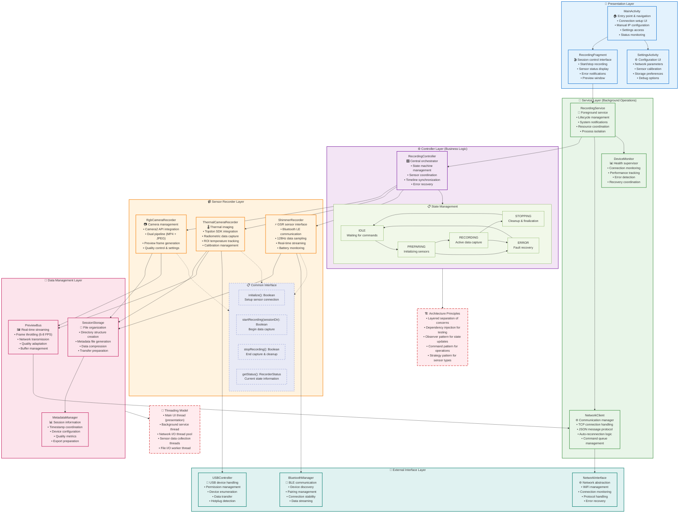

# Chapter 4: Design and Implementation Visualizations

## Figure 4.1: Detailed System Architecture

```mermaid
flowchart TD
    %% PC Controller Detail
    subgraph PC["💻 PC Controller (Python 3.8+)"]
        %% GUI Layer
        subgraph GUI_LAYER["🖥️ Presentation Layer"]
            MAIN_WIN["MainWindow (PyQt6)<br/>• Session controls<br/>• Device status display<br/>• Real-time monitoring<br/>• Settings management"]
            
            DEVICE_PANEL["DevicePanel<br/>• Connection status<br/>• Signal preview<br/>• Configuration UI<br/>• Error indicators"]
            
            DATA_VIZ["DataVisualization<br/>• Live sensor plots<br/>• Timeline display<br/>• Quality metrics<br/>• Export controls"]
        end
        
        %% Business Logic Layer  
        subgraph BUSINESS["⚙️ Business Logic Layer"]
            DEVICE_MGR["DeviceManager<br/>• Discovery coordination<br/>• Connection pooling<br/>• Health monitoring<br/>• Command routing"]
            
            SESSION_MGR["SessionManager<br/>• Lifecycle control<br/>• Data aggregation<br/>• Metadata management<br/>• Export coordination"]
            
            SYNC_CTRL["TimeSync Controller<br/>• UDP echo protocol<br/>• Clock offset calculation<br/>• Drift compensation<br/>• Accuracy validation"]
        end
        
        %% Network Layer
        subgraph NETWORK["🌐 Network Layer"]
            NSD_CLIENT["NSDClient<br/>• Service discovery<br/>• Device enumeration<br/>• Address resolution<br/>• Service monitoring"]
            
            TCP_SERVER["TCPServer<br/>• Command/response handling<br/>• JSON message processing<br/>• Optional TLS encryption<br/>• Connection management"]
            
            FILE_SERVER["FileTransferServer<br/>• ZIP stream handling<br/>• Progress tracking<br/>• Integrity validation<br/>• Storage coordination"]
        end
        
        %% Data Layer
        subgraph DATA_LAYER["💾 Data Layer"]
            CSV_EXPORTER["CSVExporter<br/>• Multi-format export<br/>• Schema validation<br/>• Timestamp alignment<br/>• Quality metrics"]
            
            FILE_MGR["FileManager<br/>• Directory organization<br/>• Session archival<br/>• Backup coordination<br/>• Metadata storage"]
            
            CONFIG_MGR["ConfigManager<br/>• Settings persistence<br/>• Device profiles<br/>• Security configuration<br/>• Performance tuning"]
        end
    end
    
    %% Android Application Detail
    subgraph ANDROID["📱 Android Application (Kotlin, API 26+)"]
        %% UI Layer
        subgraph UI_LAYER["📱 UI Layer"]
            MAIN_ACTIVITY["MainActivity<br/>• Connection interface<br/>• Manual IP entry<br/>• Status indicators<br/>• Settings access"]
            
            RECORDING_FRAG["RecordingFragment<br/>• Session controls<br/>• Sensor status<br/>• Preview display<br/>• Error handling"]
        end
        
        %% Service Layer
        subgraph SERVICE_LAYER["🔄 Service Layer"]
            RECORDING_SERVICE["RecordingService<br/>• Foreground operation<br/>• Lifecycle management<br/>• Notification handling<br/>• Resource coordination"]
            
            NETWORK_CLIENT["NetworkClient<br/>• TCP connection<br/>• JSON messaging<br/>• Auto-reconnection<br/>• Command processing"]
        end
        
        %% Recording Layer
        subgraph REC_LAYER["📹 Recording Layer"]
            REC_CONTROLLER["RecordingController<br/>• State management<br/>• Sensor coordination<br/>• Timeline synchronization<br/>• Error recovery"]
            
            RGB_RECORDER["RgbCameraRecorder<br/>• Camera2 API<br/>• Dual pipeline (MP4+JPEG)<br/>• Preview generation<br/>• Quality control"]
            
            THERMAL_RECORDER["ThermalCameraRecorder<br/>• Topdon SDK integration<br/>• Radiometric data<br/>• ROI processing<br/>• Temperature calibration"]
            
            GSR_RECORDER["ShimmerRecorder<br/>• Bluetooth integration<br/>• 128Hz sampling<br/>• Real-time streaming<br/>• Battery monitoring"]
        end
        
        %% Storage Layer
        subgraph STORAGE_LAYER["💾 Storage Layer"]
            SESSION_STORAGE["SessionStorage<br/>• File organization<br/>• Metadata tracking<br/>• Compression<br/>• Transfer preparation"]
            
            PREVIEW_BUS["PreviewBus<br/>• Frame throttling<br/>• Network streaming<br/>• Quality adaptation<br/>• Buffer management"]
        end
    end
    
    %% External Systems
    subgraph EXTERNAL["🔌 External Systems"]
        SHIMMER["Shimmer3 GSR+<br/>• Bluetooth LE<br/>• Real-time streaming<br/>• Battery status<br/>• Configuration API"]
        
        TOPDON["Topdon TC001<br/>• USB-C interface<br/>• SDK integration<br/>• Radiometric output<br/>• Calibration data"]
        
        NETWORK_INFRA["Network Infrastructure<br/>• WiFi 802.11n+<br/>• NSD/mDNS support<br/>• TCP/UDP protocols<br/>• Optional internet"]
    end
    
    %% Communication Flows
    MAIN_WIN --> DEVICE_MGR
    DEVICE_MGR --> SESSION_MGR
    SESSION_MGR --> SYNC_CTRL
    
    NSD_CLIENT --> TCP_SERVER
    TCP_SERVER --> FILE_SERVER
    
    CSV_EXPORTER --> FILE_MGR
    FILE_MGR --> CONFIG_MGR
    
    %% Android internal flows
    MAIN_ACTIVITY --> RECORDING_SERVICE
    RECORDING_SERVICE --> REC_CONTROLLER
    REC_CONTROLLER --> RGB_RECORDER
    REC_CONTROLLER --> THERMAL_RECORDER
    REC_CONTROLLER --> GSR_RECORDER
    
    %% Cross-system communication
    TCP_SERVER <--> NETWORK_CLIENT
    FILE_SERVER <--> SESSION_STORAGE
    SYNC_CTRL <--> REC_CONTROLLER
    
    %% External connections
    GSR_RECORDER <--> SHIMMER
    THERMAL_RECORDER <--> TOPDON
    NSD_CLIENT <--> NETWORK_INFRA
    NETWORK_CLIENT <--> NETWORK_INFRA
    
    %% Data flow
    RGB_RECORDER --> SESSION_STORAGE
    THERMAL_RECORDER --> SESSION_STORAGE  
    GSR_RECORDER --> SESSION_STORAGE
    SESSION_STORAGE --> FILE_SERVER
    PREVIEW_BUS --> TCP_SERVER
    
    %% Component styling
    classDef guiStyle fill:#e3f2fd,stroke:#1976d2,stroke-width:2px
    classDef businessStyle fill:#e8f5e8,stroke:#388e3c,stroke-width:2px
    classDef networkStyle fill:#f3e5f5,stroke:#7b1fa2,stroke-width:2px
    classDef dataStyle fill:#fff3e0,stroke:#f57c00,stroke-width:2px
    classDef androidUIStyle fill:#e0f2f1,stroke:#00796b,stroke-width:2px
    classDef androidServiceStyle fill:#fce4ec,stroke:#c2185b,stroke-width:2px
    classDef androidRecStyle fill:#f1f8e9,stroke:#689f38,stroke-width:2px
    classDef androidStorageStyle fill:#e8eaf6,stroke:#3f51b5,stroke-width:2px
    classDef externalStyle fill:#ffebee,stroke:#d32f2f,stroke-width:2px
    
    class GUI_LAYER,MAIN_WIN,DEVICE_PANEL,DATA_VIZ guiStyle
    class BUSINESS,DEVICE_MGR,SESSION_MGR,SYNC_CTRL businessStyle
    class NETWORK,NSD_CLIENT,TCP_SERVER,FILE_SERVER networkStyle
    class DATA_LAYER,CSV_EXPORTER,FILE_MGR,CONFIG_MGR dataStyle
    class UI_LAYER,MAIN_ACTIVITY,RECORDING_FRAG androidUIStyle
    class SERVICE_LAYER,RECORDING_SERVICE,NETWORK_CLIENT androidServiceStyle
    class REC_LAYER,REC_CONTROLLER,RGB_RECORDER,THERMAL_RECORDER,GSR_RECORDER androidRecStyle
    class STORAGE_LAYER,SESSION_STORAGE,PREVIEW_BUS androidStorageStyle
    class EXTERNAL,SHIMMER,TOPDON,NETWORK_INFRA externalStyle
```



## Figure 4.2: Android Application Architecture



## Figure 4.3: PC Controller Threading Model (Intended Design)

```mermaid
flowchart TD
    %% Main Thread
    subgraph MAIN["🖥️ Main UI Thread (PyQt6)"]
        EVENT_LOOP["Qt Event Loop<br/>• GUI event processing<br/>• User interactions<br/>• Timer events<br/>• Signal/slot connections"]
        
        UI_COMPONENTS["UI Components<br/>• MainWindow updates<br/>• Device status display<br/>• Real-time charts<br/>• User input handling"]
        
        UI_CONTROLLERS["UI Controllers<br/>• Session control logic<br/>• Settings management<br/>• Error dialog display<br/>• Progress indicators"]
    end
    
    %% Worker Threads
    subgraph WORKERS["👷 Worker Threads (QThread)"]
        
        subgraph NETWORK_WORKER["🌐 Network Worker"]
            TCP_THREAD["TCP Server Thread<br/>• Command handling<br/>• Connection management<br/>• JSON processing<br/>• Response generation"]
            
            UDP_THREAD["UDP Sync Thread<br/>• Time sync protocol<br/>• Clock offset calculation<br/>• Drift monitoring<br/>• Accuracy validation"]
            
            FILE_THREAD["File Transfer Thread<br/>• ZIP stream processing<br/>• Progress tracking<br/>• Data validation<br/>• Storage coordination"]
        end
        
        subgraph DATA_WORKER["📊 Data Processing Worker"]
            STREAM_PROC["Stream Processor<br/>• Real-time data parsing<br/>• Quality validation<br/>• Buffer management<br/>• Preview generation"]
            
            EXPORT_PROC["Export Processor<br/>• CSV generation<br/>• Format conversion<br/>• Metadata aggregation<br/>• Archive creation"]
        end
        
        subgraph DEVICE_WORKER["🔌 Device Management Worker"]
            DISCOVERY["Device Discovery<br/>• NSD scanning<br/>• Service enumeration<br/>• Address resolution<br/>• Availability monitoring"]
            
            HEALTH_MON["Health Monitor<br/>• Connection testing<br/>• Performance tracking<br/>• Error detection<br/>• Recovery coordination"]
        end
    end
    
    %% Thread Pool
    subgraph THREAD_POOL["🏊 Thread Pool (QThreadPool)"]
        IO_TASKS["I/O Tasks<br/>• File operations<br/>• Database queries<br/>• Configuration loading<br/>• Log writing"]
        
        COMPUTE_TASKS["Compute Tasks<br/>• Data analysis<br/>• Statistical calculations<br/>• Image processing<br/>• Compression operations"]
    end
    
    %% Signal/Slot Communication
    subgraph COMMUNICATION["📡 Signal/Slot Communication"]
        
        subgraph SIGNALS["📤 Custom Signals"]
            DEVICE_SIGNALS["Device Signals<br/>• deviceConnected(info)<br/>• deviceDisconnected(id)<br/>• deviceError(error)<br/>• deviceStatusChanged(status)"]
            
            DATA_SIGNALS["Data Signals<br/>• dataReceived(stream)<br/>• sessionStarted(id)<br/>• sessionStopped(id)<br/>• exportCompleted(path)"]
            
            ERROR_SIGNALS["Error Signals<br/>• networkError(msg)<br/>• storageError(msg)<br/>• syncError(msg)<br/>• recoveryRequired(type)"]
        end
        
        subgraph SLOTS["📥 UI Slot Handlers"]
            UPDATE_SLOTS["Update Slots<br/>• updateDeviceStatus()<br/>• updateDataView()<br/>• showErrorMessage()<br/>• refreshDisplay()"]
            
            CONTROL_SLOTS["Control Slots<br/>• startSession()<br/>• stopSession()<br/>• connectDevice()<br/>• exportData()"]
        end
    end
    
    %% Thread Communication Rules
    subgraph RULES["📋 Threading Rules & Best Practices"]
        RULE1["❌ NEVER: Direct UI updates from worker threads<br/>Use signals/slots instead"]
        
        RULE2["✅ ALWAYS: Move heavy operations to workers<br/>Keep UI thread responsive"]
        
        RULE3["🔄 PATTERN: Worker emits signal → UI slot updates<br/>Thread-safe communication"]
        
        RULE4["🛡️ SAFETY: Use QMutex for shared data<br/>Protect critical sections"]
        
        RULE5["⚡ PERFORMANCE: Use QThreadPool for short tasks<br/>QThread for long-running operations"]
    end
    
    %% Problem Areas (Current Implementation Issues)
    subgraph PROBLEMS["⚠️ Current Implementation Issues"]
        BLOCKING_UI["🚫 Blocking UI Operations<br/>• DeviceManager.scan_network()<br/>• Synchronous file operations<br/>• Direct database queries<br/>• Network timeouts"]
        
        THREAD_MIXING["🔀 Thread Safety Issues<br/>• GUI updates from workers<br/>• Shared state access<br/>• Race conditions<br/>• Deadlock potential"]
        
        POOR_ERROR["💥 Error Handling<br/>• Unhandled worker exceptions<br/>• UI freezing on errors<br/>• Resource leaks<br/>• Recovery failures"]
    end
    
    %% Connections
    EVENT_LOOP --> UI_COMPONENTS
    UI_COMPONENTS --> UI_CONTROLLERS
    
    %% Worker to Main communication
    TCP_THREAD --> DEVICE_SIGNALS
    UDP_THREAD --> DATA_SIGNALS  
    FILE_THREAD --> DATA_SIGNALS
    STREAM_PROC --> DATA_SIGNALS
    DISCOVERY --> DEVICE_SIGNALS
    HEALTH_MON --> ERROR_SIGNALS
    
    %% Signals to Slots
    DEVICE_SIGNALS --> UPDATE_SLOTS
    DATA_SIGNALS --> UPDATE_SLOTS
    ERROR_SIGNALS --> UPDATE_SLOTS
    
    UI_CONTROLLERS --> CONTROL_SLOTS
    CONTROL_SLOTS --> TCP_THREAD
    CONTROL_SLOTS --> DISCOVERY
    
    %% Thread Pool usage
    EXPORT_PROC --> IO_TASKS
    STREAM_PROC --> COMPUTE_TASKS
    
    %% Problem indicators
    BLOCKING_UI -.->|Causes| UI_COMPONENTS
    THREAD_MIXING -.->|Affects| COMMUNICATION
    POOR_ERROR -.->|Impacts| ERROR_SIGNALS
    
    %% Styling
    classDef mainStyle fill:#e3f2fd,stroke:#1976d2,stroke-width:3px
    classDef workerStyle fill:#e8f5e8,stroke:#388e3c,stroke-width:2px
    classDef poolStyle fill:#f3e5f5,stroke:#7b1fa2,stroke-width:2px
    classDef commStyle fill:#fff3e0,stroke:#f57c00,stroke-width:2px
    classDef signalStyle fill:#e0f2f1,stroke:#00796b,stroke-width:2px
    classDef slotStyle fill:#fce4ec,stroke:#c2185b,stroke-width:2px
    classDef ruleStyle fill:#f1f8e9,stroke:#689f38,stroke-width:2px
    classDef problemStyle fill:#ffebee,stroke:#d32f2f,stroke-width:2px,stroke-dasharray: 5 5
    
    class MAIN,EVENT_LOOP,UI_COMPONENTS,UI_CONTROLLERS mainStyle
    class WORKERS,NETWORK_WORKER,DATA_WORKER,DEVICE_WORKER,TCP_THREAD,UDP_THREAD,FILE_THREAD,STREAM_PROC,EXPORT_PROC,DISCOVERY,HEALTH_MON workerStyle
    class THREAD_POOL,IO_TASKS,COMPUTE_TASKS poolStyle
    class COMMUNICATION commStyle
    class SIGNALS,DEVICE_SIGNALS,DATA_SIGNALS,ERROR_SIGNALS signalStyle  
    class SLOTS,UPDATE_SLOTS,CONTROL_SLOTS slotStyle
    class RULES,RULE1,RULE2,RULE3,RULE4,RULE5 ruleStyle
    class PROBLEMS,BLOCKING_UI,THREAD_MIXING,POOR_ERROR problemStyle
```

**Key Implementation Notes:**
- **Current Issue**: `DeviceManager.scan_network()` runs on main UI thread causing freezing
- **Solution**: Move to `DISCOVERY` worker thread, emit `deviceFound` signals
- **Pattern**: All network I/O, file operations, and computationally expensive tasks must run on worker threads
- **Communication**: Workers never directly update UI - only through Qt's signal/slot mechanism