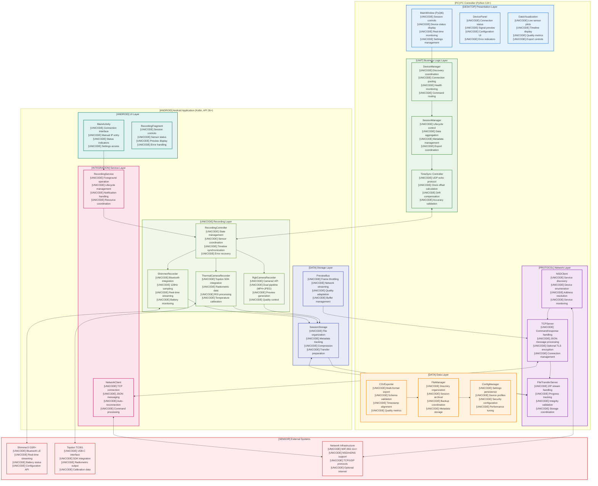
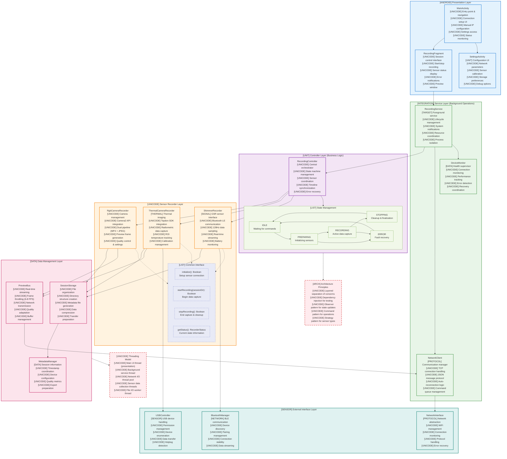

# Chapter 4: Design and Implementation Visualizations

## Figure 4.1: Detailed System Architecture



## Figure 4.2: Android Application Architecture



## Figure 4.3: PC Controller Threading Model (Intended Design)

```mermaid
flowchart TD
    %% Main Thread
    subgraph MAIN["[DESKTOP] Main UI Thread (PyQt6)"]
        EVENT_LOOP["Qt Event Loop<br/>[UNICODE] GUI event processing<br/>[UNICODE] User interactions<br/>[UNICODE] Timer events<br/>[UNICODE] Signal/slot connections"]
        
        UI_COMPONENTS["UI Components<br/>[UNICODE] MainWindow updates<br/>[UNICODE] Device status display<br/>[UNICODE] Real-time charts<br/>[UNICODE] User input handling"]
        
        UI_CONTROLLERS["UI Controllers<br/>[UNICODE] Session control logic<br/>[UNICODE] Settings management<br/>[UNICODE] Error dialog display<br/>[UNICODE] Progress indicators"]
    end
    
    %% Worker Threads
    subgraph WORKERS["[UNICODE] Worker Threads (QThread)"]
        
        subgraph NETWORK_WORKER["[PROTOCOL] Network Worker"]
            TCP_THREAD["TCP Server Thread<br/>[UNICODE] Command handling<br/>[UNICODE] Connection management<br/>[UNICODE] JSON processing<br/>[UNICODE] Response generation"]
            
            UDP_THREAD["UDP Sync Thread<br/>[UNICODE] Time sync protocol<br/>[UNICODE] Clock offset calculation<br/>[UNICODE] Drift monitoring<br/>[UNICODE] Accuracy validation"]
            
            FILE_THREAD["File Transfer Thread<br/>[UNICODE] ZIP stream processing<br/>[UNICODE] Progress tracking<br/>[UNICODE] Data validation<br/>[UNICODE] Storage coordination"]
        end
        
        subgraph DATA_WORKER["[DATA] Data Processing Worker"]
            STREAM_PROC["Stream Processor<br/>[UNICODE] Real-time data parsing<br/>[UNICODE] Quality validation<br/>[UNICODE] Buffer management<br/>[UNICODE] Preview generation"]
            
            EXPORT_PROC["Export Processor<br/>[UNICODE] CSV generation<br/>[UNICODE] Format conversion<br/>[UNICODE] Metadata aggregation<br/>[UNICODE] Archive creation"]
        end
        
        subgraph DEVICE_WORKER["[SENSOR] Device Management Worker"]
            DISCOVERY["Device Discovery<br/>[UNICODE] NSD scanning<br/>[UNICODE] Service enumeration<br/>[UNICODE] Address resolution<br/>[UNICODE] Availability monitoring"]
            
            HEALTH_MON["Health Monitor<br/>[UNICODE] Connection testing<br/>[UNICODE] Performance tracking<br/>[UNICODE] Error detection<br/>[UNICODE] Recovery coordination"]
        end
    end
    
    %% Thread Pool
    subgraph THREAD_POOL["[UNICODE] Thread Pool (QThreadPool)"]
        IO_TASKS["I/O Tasks<br/>[UNICODE] File operations<br/>[UNICODE] Database queries<br/>[UNICODE] Configuration loading<br/>[UNICODE] Log writing"]
        
        COMPUTE_TASKS["Compute Tasks<br/>[UNICODE] Data analysis<br/>[UNICODE] Statistical calculations<br/>[UNICODE] Image processing<br/>[UNICODE] Compression operations"]
    end
    
    %% Signal/Slot Communication
    subgraph COMMUNICATION["[NETWORK] Signal/Slot Communication"]
        
        subgraph SIGNALS["[UNICODE] Custom Signals"]
            DEVICE_SIGNALS["Device Signals<br/>[UNICODE] deviceConnected(info)<br/>[UNICODE] deviceDisconnected(id)<br/>[UNICODE] deviceError(error)<br/>[UNICODE] deviceStatusChanged(status)"]
            
            DATA_SIGNALS["Data Signals<br/>[UNICODE] dataReceived(stream)<br/>[UNICODE] sessionStarted(id)<br/>[UNICODE] sessionStopped(id)<br/>[UNICODE] exportCompleted(path)"]
            
            ERROR_SIGNALS["Error Signals<br/>[UNICODE] networkError(msg)<br/>[UNICODE] storageError(msg)<br/>[UNICODE] syncError(msg)<br/>[UNICODE] recoveryRequired(type)"]
        end
        
        subgraph SLOTS["[UNICODE] UI Slot Handlers"]
            UPDATE_SLOTS["Update Slots<br/>[UNICODE] updateDeviceStatus()<br/>[UNICODE] updateDataView()<br/>[UNICODE] showErrorMessage()<br/>[UNICODE] refreshDisplay()"]
            
            CONTROL_SLOTS["Control Slots<br/>[UNICODE] startSession()<br/>[UNICODE] stopSession()<br/>[UNICODE] connectDevice()<br/>[UNICODE] exportData()"]
        end
    end
    
    %% Thread Communication Rules
    subgraph RULES["[LIST] Threading Rules & Best Practices"]
        RULE1["[FAIL] NEVER: Direct UI updates from worker threads<br/>Use signals/slots instead"]
        
        RULE2["[OK] ALWAYS: Move heavy operations to workers<br/>Keep UI thread responsive"]
        
        RULE3["[INTEGRATION] PATTERN: Worker emits signal -> UI slot updates<br/>Thread-safe communication"]
        
        RULE4["[SECURITY] SAFETY: Use QMutex for shared data<br/>Protect critical sections"]
        
        RULE5["[SIGNAL] PERFORMANCE: Use QThreadPool for short tasks<br/>QThread for long-running operations"]
    end
    
    %% Problem Areas (Current Implementation Issues)
    subgraph PROBLEMS["[WARNING] Current Implementation Issues"]
        BLOCKING_UI["[UNICODE] Blocking UI Operations<br/>[UNICODE] DeviceManager.scan_network()<br/>[UNICODE] Synchronous file operations<br/>[UNICODE] Direct database queries<br/>[UNICODE] Network timeouts"]
        
        THREAD_MIXING["[UNICODE] Thread Safety Issues<br/>[UNICODE] GUI updates from workers<br/>[UNICODE] Shared state access<br/>[UNICODE] Race conditions<br/>[UNICODE] Deadlock potential"]
        
        POOR_ERROR["[UNICODE] Error Handling<br/>[UNICODE] Unhandled worker exceptions<br/>[UNICODE] UI freezing on errors<br/>[UNICODE] Resource leaks<br/>[UNICODE] Recovery failures"]
    end
    
    %% Connections
    EVENT_LOOP --> UI_COMPONENTS
    UI_COMPONENTS --> UI_CONTROLLERS
    
    %% Worker to Main communication
    TCP_THREAD --> DEVICE_SIGNALS
    UDP_THREAD --> DATA_SIGNALS  
    FILE_THREAD --> DATA_SIGNALS
    STREAM_PROC --> DATA_SIGNALS
    DISCOVERY --> DEVICE_SIGNALS
    HEALTH_MON --> ERROR_SIGNALS
    
    %% Signals to Slots
    DEVICE_SIGNALS --> UPDATE_SLOTS
    DATA_SIGNALS --> UPDATE_SLOTS
    ERROR_SIGNALS --> UPDATE_SLOTS
    
    UI_CONTROLLERS --> CONTROL_SLOTS
    CONTROL_SLOTS --> TCP_THREAD
    CONTROL_SLOTS --> DISCOVERY
    
    %% Thread Pool usage
    EXPORT_PROC --> IO_TASKS
    STREAM_PROC --> COMPUTE_TASKS
    
    %% Problem indicators
    BLOCKING_UI -.->|Causes| UI_COMPONENTS
    THREAD_MIXING -.->|Affects| COMMUNICATION
    POOR_ERROR -.->|Impacts| ERROR_SIGNALS
    
    %% Styling
    classDef mainStyle fill:#e3f2fd,stroke:#1976d2,stroke-width:3px
    classDef workerStyle fill:#e8f5e8,stroke:#388e3c,stroke-width:2px
    classDef poolStyle fill:#f3e5f5,stroke:#7b1fa2,stroke-width:2px
    classDef commStyle fill:#fff3e0,stroke:#f57c00,stroke-width:2px
    classDef signalStyle fill:#e0f2f1,stroke:#00796b,stroke-width:2px
    classDef slotStyle fill:#fce4ec,stroke:#c2185b,stroke-width:2px
    classDef ruleStyle fill:#f1f8e9,stroke:#689f38,stroke-width:2px
    classDef problemStyle fill:#ffebee,stroke:#d32f2f,stroke-width:2px,stroke-dasharray: 5 5
    
    class MAIN,EVENT_LOOP,UI_COMPONENTS,UI_CONTROLLERS mainStyle
    class WORKERS,NETWORK_WORKER,DATA_WORKER,DEVICE_WORKER,TCP_THREAD,UDP_THREAD,FILE_THREAD,STREAM_PROC,EXPORT_PROC,DISCOVERY,HEALTH_MON workerStyle
    class THREAD_POOL,IO_TASKS,COMPUTE_TASKS poolStyle
    class COMMUNICATION commStyle
    class SIGNALS,DEVICE_SIGNALS,DATA_SIGNALS,ERROR_SIGNALS signalStyle  
    class SLOTS,UPDATE_SLOTS,CONTROL_SLOTS slotStyle
    class RULES,RULE1,RULE2,RULE3,RULE4,RULE5 ruleStyle
    class PROBLEMS,BLOCKING_UI,THREAD_MIXING,POOR_ERROR problemStyle
```

**Key Implementation Notes:**
- **Current Issue**: `DeviceManager.scan_network()` runs on main UI thread causing freezing
- **Solution**: Move to `DISCOVERY` worker thread, emit `deviceFound` signals
- **Pattern**: All network I/O, file operations, and computationally expensive tasks must run on worker threads
- **Communication**: Workers never directly update UI - only through Qt's signal/slot mechanism