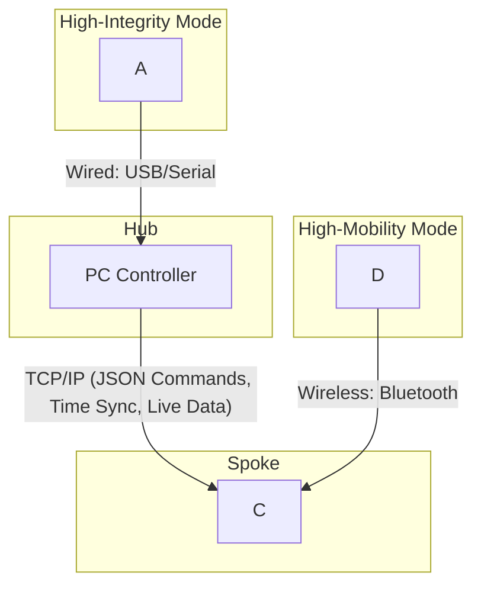

Here is the high-level design proposal in plaintext markdown format, including the Mermaid diagram for the architecture.

### High-Level System Design Proposal

#### 1\. Architectural Pattern: Hub-and-Spoke Model

The system will be built upon a **Hub-and-Spoke architecture**. This is a client-server model where a central PC acts as
the "Hub," and one or more Android devices function as mobile sensor "Spokes".

This architectural pattern was chosen because it directly satisfies several key requirements:

* **Centralized Control (FR6):** A single PC Hub provides a unified interface for a researcher to manage, monitor, and
  control the entire data collection session.
* **Scalability (NFR7):** The design can easily scale to include multiple Android spokes without significant changes to
  the core architecture.
* **Modularity (NFR8):** The Hub and each Spoke are distinct, self-contained applications. Furthermore, the components
  within each application can be developed and maintained independently.
* **Fault Tolerance (FR8):** If one Spoke fails or disconnects, the Hub can continue to operate with the remaining
  Spokes, enhancing the system's overall reliability.

#### 2\. Component Breakdown

The system is divided into two primary applications: the PC Controller (Hub) and the Android Sensor Node (Spoke).

**A. PC Controller (The Hub)**

The Hub is a desktop application responsible for overall session management and data aggregation. Its key software
modules include:

* **GUI Module:** Provides the graphical user interface for researchers to control sessions, monitor the status of
  connected devices, and view live data previews (FR6).
* **Session Manager:** Manages the lifecycle of a recording session, including creating unique session IDs, generating
  metadata files, and logging start/end times (FR4).
* **Network Controller:** A TCP/IP server that manages connections to all Android Spokes. It is responsible for sending
  JSON-based commands and receiving status updates and real-time data streams (FR2, FR7).
* **Time Synchronization Service:** Acts as the master clock for the entire system. It implements an NTP-like protocol
  to allow all Spokes to synchronize their internal clocks, ensuring temporal accuracy across all data streams (FR3,
  NFR2).
* **Sensor Manager:** Manages any sensors connected directly to the PC. This includes a dedicated sub-module for the
  Shimmer GSR+ sensor, which can handle a high-integrity wired connection via a USB dock and serial port (FR1).
* **Data Aggregator:** Responsible for receiving all data files transferred from the Spokes at the end of a session and
  organizing them into the correct session directory on the PC's local storage (FR10).

**B. Android Sensor Node (The Spoke)**

The Spoke is a mobile application that runs on each Android device, turning it into a powerful, synchronized sensor
node. Its main components are:

* **Network Client:** Establishes and maintains the TCP/IP connection to the PC Hub. It listens for incoming commands
  and sends back acknowledgements, status updates, and live data.
* **Recording Controller:** The core of the Spoke application. It receives high-level commands from the Hub (e.g., "
  Start Recording") and orchestrates the actions of all local hardware and recording modules.
* **Sensor Recorders:** A collection of modular, independent recorders for each data source. This includes an
  `RgbCameraRecorder`, a `ThermalCameraRecorder`, and a `ShimmerRecorder` (for handling a wireless Bluetooth
  connection). Each recorder is responsible for interfacing with its specific hardware and writing data to the device's
  local storage with high-precision timestamps (FR5).
* **File Transfer Manager:** After a recording session is complete, this module packages all locally stored data files (
  e.g., into a ZIP archive) and manages the network transfer to the Data Aggregator on the PC Hub (FR10).

#### 3\. Key Mechanisms and Data Flows

The following diagram illustrates the high-level architecture and primary communication pathways:

**A. Control and Time Synchronization**

* **Control Protocol:** All high-level commands (e.g., `START_RECORDING`, `STOP_RECORDING`, `FLASH_SYNC`) are sent from
  the Hub to all Spokes as JSON-formatted messages over a persistent TCP/IP connection. This ensures reliable and
  coordinated actions across the distributed system.
* **Time Synchronization:** Upon connection, each Spoke synchronizes its clock with the Hub's Time Synchronization
  Service. This process calculates the clock offset between the Spoke and the Hub. All data recorded on the Spoke is
  timestamped using its local high-resolution clock. During post-processing, the calculated offset is used to align all
  timestamps to a single master timeline, satisfying the requirement for millisecond-level accuracy (FR3, NFR2).

**B. Data Handling Strategy**

The system employs a dual strategy for data handling to balance network load with the need for real-time monitoring:

* **High-Bandwidth Data (Video and Thermal):** To prevent network saturation during a session, all high-resolution video
  and thermal data are recorded directly to the local storage of each Android Spoke (FR5). Once the session is
  concluded, the `FileTransferManager` on the Spoke sends these large files to the Hub for aggregation (FR10).
* **Low-Bandwidth and Real-Time Data (GSR and Telemetry):** Lower-bandwidth data, such as live telemetry (device status,
  battery level) and physiological signals, are streamed to the Hub in real time for monitoring. The system provides two
  distinct pathways for the ground-truth GSR signal, allowing researchers to choose the best method for their
  experimental design (FR1):
    1. **High-Integrity Wired Mode:** For stationary tasks requiring the highest possible data fidelity, the Shimmer
       sensor is connected via its USB dock directly to the PC. This eliminates wireless interference and provides the
       most stable, low-latency data stream.
    2. **High-Mobility Wireless Mode:** For tasks where the participant must be untethered, the Shimmer sensor connects
       via Bluetooth to the Android Spoke, which then forwards the data stream to the Hub over Wi-Fi.