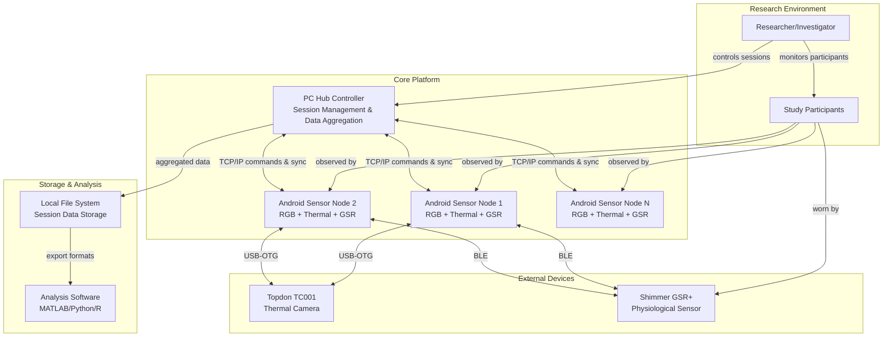
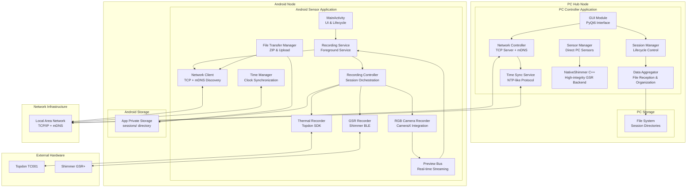
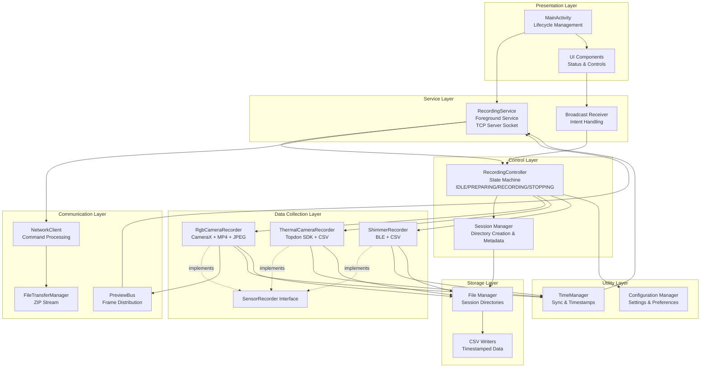
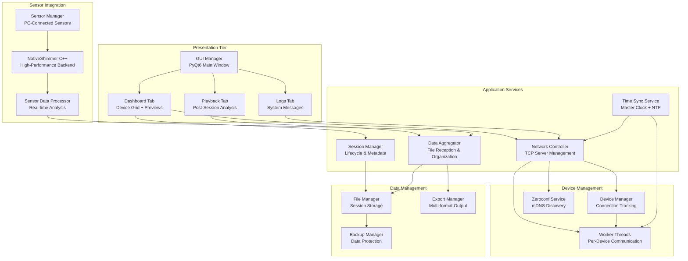

# System Architecture - Multi-Modal Physiological Sensing Platform

This document provides comprehensive architectural views of the multi-modal physiological sensing platform using the C4 model, from high-level context to detailed component structures.

## Table of Contents

1. [C1 - System Context](#c1---system-context)
2. [C2 - Container Architecture](#c2---container-architecture) 
3. [C3 - Component Architecture](#c3---component-architecture)
4. [C4 - Code Level Views](#c4---code-level-views)
5. [Deployment Architecture](#deployment-architecture)

---

## C1 - System Context

The multi-modal physiological sensing platform operates within a research environment where investigators collect synchronized physiological data using multiple sensor modalities.



**Key External Actors:**
- **Researcher/Investigator**: Controls recording sessions, monitors system status, analyzes collected data
- **Study Participants**: Subjects being monitored, wear/interact with physiological sensors

**Key External Systems:**
- **Topdon TC001 Thermal Camera**: USB-connected thermal imaging device providing temperature matrices
- **Shimmer GSR+ Sensor**: BLE-connected galvanic skin response and photoplethysmography sensor
- **Local File System**: Persistent storage for session data, metadata, and exports
- **Analysis Software**: External tools (MATLAB, Python, R) for post-processing and research analysis

---

## C2 - Container Architecture

The platform consists of two primary application containers running on different deployment nodes, connected via TCP/IP networking.



**Container Descriptions:**

**PC Controller Application (Python + PyQt6):**
- Centralized hub for session management and device coordination
- Provides researcher interface and real-time monitoring capabilities
- Handles time synchronization, data aggregation, and storage organization
- Includes performance-critical C++ backend for direct Shimmer integration

**Android Sensor Application (Kotlin):**  
- Mobile sensor node supporting multiple simultaneous data streams
- Manages hardware interfaces (camera, USB, BLE) and local data storage
- Provides real-time preview streaming and command/response communication
- Handles session lifecycle, file compression, and upload coordination

**Key Communication Protocols:**
- TCP/IP for command/control and data transfer
- mDNS for automatic device discovery
- UDP for time synchronization
- USB-OTG for thermal camera integration
- BLE for GSR sensor communication

---

## C3 - Component Architecture

### Android Sensor Node Components



**Key Component Interactions:**

**RecordingController (Central Orchestrator):**
- Implements state machine: IDLE → PREPARING → RECORDING → STOPPING → IDLE
- Coordinates all sensor recorders during session lifecycle
- Handles error recovery and graceful shutdown via `safeStopAll()`

**SensorRecorder Interface:**
- Common contract for all sensor implementations
- Defines `start(sessionDir)` and `stop()` methods
- Enables polymorphic handling in RecordingController

**PreviewBus (Event Distribution):**
- Decouples preview frame generation from network transmission  
- Allows multiple consumers of real-time camera frames
- Implements throttling to prevent network congestion

### PC Controller Components



---

## C4 - Code Level Views

### Critical Interfaces and Classes

#### SensorRecorder Interface (Android)
```kotlin
interface SensorRecorder {
    suspend fun start(sessionDir: File)
    suspend fun stop()
    val isRecording: Boolean
}
```

#### RecordingController State Management
```kotlin
class RecordingController {
    enum class State { IDLE, PREPARING, RECORDING, STOPPING }
    
    private val _state = MutableStateFlow(State.IDLE)
    val state: StateFlow<State> = _state
    
    suspend fun startSession(sessionId: String) {
        if (_state.value != State.IDLE) return
        _state.value = State.PREPARING
        // ... session initialization
        _state.value = State.RECORDING
    }
    
    suspend fun stopSession() {
        if (_state.value != State.RECORDING) return
        _state.value = State.STOPPING
        safeStopAll()
        _state.value = State.IDLE
    }
}
```

#### Network Protocol Message Types
```python
@dataclass
class CommandMessage:
    v: int = 1
    id: int
    type: str = "cmd" 
    command: str
    
@dataclass  
class AckMessage:
    v: int = 1
    ack_id: int
    type: str = "ack"
    status: str  # "ok" | "error"
```

---

## Deployment Architecture

The system deploys across heterogeneous nodes with specific hardware and network requirements.

```mermaid
graph TB
    subgraph "Physical Infrastructure"
        subgraph "PC Hub Node"
            PC[Windows 10/11 PC<br/>Intel/AMD x64<br/>8GB+ RAM, 500GB+ SSD]
            subgraph "PC Processes"
                PCP[pc_controller.exe<br/>PyInstaller Bundle<br/>Port: Dynamic TCP Server]
                NSP[NativeShimmer.dll<br/>C++ Backend<br/>Serial: COM3/COM4]
            end
            subgraph "PC Storage"
                SD[Sessions Directory<br/>C:\Users\{user}\Documents\Sessions]
                CD[Config Directory<br/>App Data\Local\PCController]
            end
        end
        
        subgraph "Android Node 1"
            AD1[Android Device<br/>API 26+ (Android 8.0+)<br/>4GB+ RAM, 64GB+ Storage]
            subgraph "Android Processes 1"
                AS1[SensorSpoke.apk<br/>Foreground Service<br/>Port: 8080]
            end
            subgraph "Android Storage 1"  
                ASD1[Private App Storage<br/>/Android/data/app/files/sessions]
            end
        end
        
        subgraph "Android Node N"
            ADN[Android Device N<br/>API 26+ (Android 8.0+)<br/>4GB+ RAM, 64GB+ Storage]
            subgraph "Android Processes N"
                ASN[SensorSpoke.apk<br/>Foreground Service<br/>Port: 8080]
            end
            subgraph "Android Storage N"
                ASDN[Private App Storage<br/>/Android/data/app/files/sessions]
            end
        end
    end
    
    subgraph "Network Infrastructure"
        LAN[Local Area Network<br/>1Gbps Ethernet/WiFi<br/>mDNS Enabled]
        subgraph "Protocols"
            TCP[TCP/IP<br/>Commands & Data Transfer]
            UDP[UDP<br/>Time Sync]
            MDNS[mDNS<br/>Service: _gsr-controller._tcp.local.]
        end
    end
    
    subgraph "External Hardware"
        TC1[Topdon TC001<br/>USB 2.0 Connection]
        SH1[Shimmer GSR+<br/>BLE 4.0+ Connection]
        TCN[Topdon TC001<br/>USB 2.0 Connection]  
        SHN[Shimmer GSR+<br/>BLE 4.0+ Connection]
    end
    
    PCP <--> LAN
    AS1 <--> LAN
    ASN <--> LAN
    
    LAN -.-> TCP
    LAN -.-> UDP
    LAN -.-> MDNS
    
    PCP --> SD
    PCP --> CD
    PCP <--> NSP
    
    AS1 --> ASD1
    AS1 <--> TC1
    AS1 <--> SH1
    
    ASN --> ASDN  
    ASN <--> TCN
    ASN <--> SHN
```

### Deployment Specifications

**PC Hub Requirements:**
- **OS**: Windows 10/11 (64-bit) or Linux (Ubuntu 20.04+)
- **CPU**: Intel Core i5 8th gen or AMD Ryzen 5 3600 equivalent  
- **RAM**: 8GB minimum, 16GB recommended
- **Storage**: 500GB SSD minimum for session data
- **Network**: Gigabit Ethernet or 802.11ac WiFi
- **Ports**: TCP server (dynamic), UDP 3333 (time sync)

**Android Node Requirements:**
- **OS**: Android 8.0 (API 26) or higher
- **RAM**: 4GB minimum, 8GB recommended  
- **Storage**: 64GB minimum, 128GB recommended
- **Network**: 802.11ac WiFi (5GHz preferred)
- **Hardware**: USB-OTG support, BLE 4.0+, rear camera
- **Ports**: TCP server 8080, UDP client

**Network Infrastructure:**
- **Bandwidth**: 100 Mbps minimum for multi-node deployments
- **Latency**: <10ms between nodes for time sync accuracy
- **mDNS**: Must support Bonjour/Zeroconf service discovery
- **Security**: WPA2/WPA3 WiFi encryption (TLS upgrade planned)

### Process Communication Matrix

| Source Process | Target Process | Protocol | Port | Purpose |
|----------------|----------------|----------|------|---------|
| PC Controller | Android Service | TCP | 8080 | Commands & Control |
| PC Time Sync | Android Time Manager | UDP | 3333 | Clock Synchronization |
| Android Service | PC Controller | TCP | Dynamic | Status & Events |
| Android File Transfer | PC File Receiver | TCP | Dynamic | Session Data Upload |
| PC mDNS Browser | Android mDNS Advertiser | mDNS | 5353 | Device Discovery |

This architecture provides scalable, fault-tolerant operation with clear separation of concerns and standardized communication protocols.