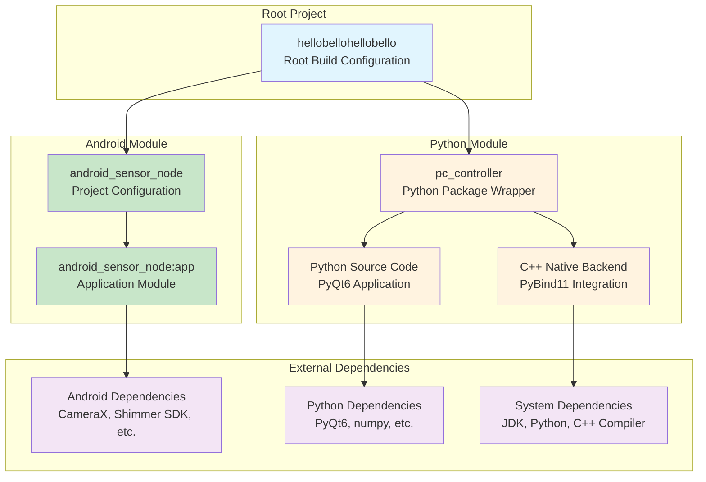

# Build System and Module Dependencies

This document outlines the build system architecture, module dependencies, packaging processes, and development workflows for the multi-modal physiological sensing platform.

## Table of Contents

1. [Build System Architecture](#build-system-architecture)
2. [Module Dependency Graph](#module-dependency-graph)
3. [Build Processes and Workflows](#build-processes-and-workflows)
4. [Packaging and Distribution](#packaging-and-distribution)
5. [Development Environment Setup](#development-environment-setup)
6. [Continuous Integration](#continuous-integration)

---

## Build System Architecture

### Multi-Project Gradle Build

The platform uses Gradle as the primary build system, managing both Android and Python components through a unified build configuration:

```
hellobellohellobello/
├── build.gradle.kts                 # Root build script
├── settings.gradle.kts              # Multi-project configuration
├── gradle.properties                # Global build properties
├── android_sensor_node/
│   ├── app/
│   │   └── build.gradle.kts         # Android app module
│   └── build.gradle.kts             # Android project configuration
├── pc_controller/
│   ├── build.gradle.kts             # Python project wrapper
│   ├── requirements.txt             # Python dependencies
│   └── pyproject.toml               # Python project metadata
└── gradle/
    └── wrapper/                     # Gradle wrapper files
```

### Root Build Configuration

**Root `build.gradle.kts`:**
```kotlin
plugins {
    base
}

// Root orchestrator for multi-project build (Android + Python)
allprojects {
    group = "org.hellobellohellobello"
    version = "1.0-SNAPSHOT"
}

// Detect whether an Android SDK is available on this machine
fun detectAndroidSdk(): Boolean {
    // Check local.properties
    val localPropsFile = rootProject.file("local.properties")
    if (localPropsFile.exists()) {
        val props = java.util.Properties()
        localPropsFile.inputStream().use { props.load(it) }
        val sdkDir = props.getProperty("sdk.dir")
        if (sdkDir != null && file(sdkDir).exists()) {
            return true
        }
    }
    
    // Check environment variables
    val envSdk = System.getenv("ANDROID_SDK_ROOT") ?: System.getenv("ANDROID_HOME")
    return envSdk != null && file(envSdk).exists()
}

val hasAndroidSdk = detectAndroidSdk()

// Root-level pytest task
val pyTest = tasks.register<Exec>("pyTest") {
    group = "verification"
    description = "Run Python pytest suite as defined by pytest.ini"
    workingDir = rootDir
    commandLine("python3", "-m", "pytest")
}

// Combined check task
tasks.register("checkAll") {
    group = "verification"
    description = if (hasAndroidSdk) {
        "Run Android unit tests and Python pytest"
    } else {
        "Run Python pytest (Android SDK not found; skipping Android unit tests)"
    }
    dependsOn(pyTest)
    if (hasAndroidSdk) {
        // Android unit test task (Debug)
        dependsOn(":android_sensor_node:app:testDebugUnitTest")
    } else {
        doFirst {
            println("[checkAll] Android SDK not found; skipping Android unit tests")
        }
    }
}
    }
}

// Unified packaging task
tasks.register("packageAll") {
    group = "build"
    description = "Package all components for distribution"
    dependsOn(":pc_controller:assemblePcController")
    
    if (hasAndroidSdk) {
        dependsOn(":android_sensor_node:app:assembleRelease")
    }
}
```

### Settings Configuration

**`settings.gradle.kts`:**
```kotlin
rootProject.name = "hellobellohellobello"

// Centralized Android SDK detection function
fun detectAndroidSdk(): Boolean {
    // Check local.properties
    val localPropsFile = file("local.properties")
    if (localPropsFile.exists()) {
        val props = java.util.Properties()
        localPropsFile.inputStream().use { props.load(it) }
        val sdkDir = props.getProperty("sdk.dir")
        if (sdkDir != null && file(sdkDir).exists()) {
            return true
        }
    }
    
    // Check environment variables
    val envSdk = System.getenv("ANDROID_SDK_ROOT") ?: System.getenv("ANDROID_HOME")
    return envSdk != null && file(envSdk).exists()
}

// Detect Android SDK presence to conditionally include Android modules
val hasAndroidSdk = detectAndroidSdk()

if (hasAndroidSdk) {
    include(":android_sensor_node")
    project(":android_sensor_node").projectDir = file("android_sensor_node")
    include(":android_sensor_node:app")
    project(":android_sensor_node:app").projectDir = file("android_sensor_node/app")
} else {
    println("[settings] Android SDK not found; skipping inclusion of :android_sensor_node modules")
}

include(":pc_controller")
project(":pc_controller").projectDir = file("pc_controller")
```

---

## Module Dependency Graph

### High-Level Module Architecture



### Android Module Dependencies

**Android App `build.gradle.kts`:**
```kotlin
plugins {
    id("com.android.application")
    id("org.jetbrains.kotlin.android")
}

android {
    compileSdk = 34
    
    defaultConfig {
        applicationId = "com.yourcompany.sensorspoke"
        minSdk = 26  // Android 8.0 (API 26)
        targetSdk = 34
        versionCode = 1
        versionName = "1.0.0"
    }
    
    buildFeatures {
        viewBinding = true
    }
    
    compileOptions {
        sourceCompatibility = JavaVersion.VERSION_17
        targetCompatibility = JavaVersion.VERSION_17
    }
}

dependencies {
    // Core Android
    implementation("androidx.core:core-ktx:1.13.1")
    implementation("androidx.appcompat:appcompat:1.7.0")
    implementation("com.google.android.material:material:1.12.0")
    implementation("androidx.activity:activity-ktx:1.9.2")
    implementation("androidx.lifecycle:lifecycle-viewmodel-ktx:2.8.4")
    implementation("androidx.lifecycle:lifecycle-livedata-ktx:2.8.4")
    implementation("org.jetbrains.kotlinx:kotlinx-coroutines-android:1.8.1")

    // CameraX for RGB recording
    val cameraxVersion = "1.3.4"
    implementation("androidx.camera:camera-core:$cameraxVersion")
    implementation("androidx.camera:camera-camera2:$cameraxVersion")
    implementation("androidx.camera:camera-lifecycle:$cameraxVersion")
    implementation("androidx.camera:camera-video:$cameraxVersion")
    implementation("androidx.camera:camera-view:$cameraxVersion")

    // TLS networking, background work, and encryption
    implementation("com.squareup.okhttp3:okhttp:4.12.0")
    implementation("androidx.work:work-runtime-ktx:2.9.1")
    implementation("androidx.security:security-crypto:1.1.0-alpha06")

    // Local SDKs (Topdon TC001 and Shimmer Android API)
    implementation(files("src/main/libs/topdon_1.3.7.aar"))
    implementation(files("src/main/libs/libusbdualsdk_1.3.4_2406271906_standard.aar"))
    implementation(files("src/main/libs/opengl_1.3.2_standard.aar"))
    implementation(files("src/main/libs/suplib-release.aar"))
    implementation(files("src/main/libs/shimmerandroidinstrumentdriver-3.2.3_beta.aar"))
    implementation(files("src/main/libs/shimmerbluetoothmanager-0.11.4_beta.jar"))
    implementation(files("src/main/libs/shimmerdriver-0.11.4_beta.jar"))
    implementation(files("src/main/libs/shimmerdriverpc-0.11.4_beta.jar"))

    // Unit testing
    testImplementation("junit:junit:4.13.2")
    testImplementation("org.robolectric:robolectric:4.11.1")
    testImplementation("androidx.test:core:1.5.0")
    testImplementation("org.jetbrains.kotlinx:kotlinx-coroutines-test:1.8.1")
    testImplementation("com.google.truth:truth:1.4.2")
}
```

### Python Module Dependencies

**PC Controller `build.gradle.kts`:**
```kotlin
plugins {
    base
}

// Python environment management
val pythonExecutable = findProperty("python.executable")?.toString() ?: "python3"
val venvDir = file(".venv")

// Create virtual environment
val createVenv = tasks.register<Exec>("createVenv") {
    group = "python"
    description = "Create Python virtual environment"
    
    commandLine(pythonExecutable, "-m", "venv", venvDir.absolutePath)
    
    doFirst {
        if (venvDir.exists()) {
            logger.info("Virtual environment already exists at ${venvDir.absolutePath}")
        }
    }
    
    onlyIf { !venvDir.exists() }
}

// Install Python dependencies
val installRequirements = tasks.register<Exec>("installRequirements") {
    group = "python"
    description = "Install Python dependencies from requirements.txt"
    
    dependsOn(createVenv)
    
    val pipExecutable = if (org.gradle.internal.os.OperatingSystem.current().isWindows) {
        file("$venvDir/Scripts/pip.exe")
    } else {
        file("$venvDir/bin/pip")
    }
    
    commandLine(pipExecutable.absolutePath, "install", "-r", "requirements.txt")
    
    inputs.file("requirements.txt")
    outputs.dir("$venvDir/lib")
}

// Run Python tests
val pyTest = tasks.register<Exec>("pyTest") {
    group = "verification"
    description = "Run Python tests with pytest"
    
    dependsOn(installRequirements)
    
    val pythonVenvExecutable = if (org.gradle.internal.os.OperatingSystem.current().isWindows) {
        file("$venvDir/Scripts/python.exe")
    } else {
        file("$venvDir/bin/python")
    }
    
    commandLine(pythonVenvExecutable.absolutePath, "-m", "pytest", "tests/", "-v")
}

// Build executable with PyInstaller
val pyInstaller = tasks.register<Exec>("pyInstaller") {
    group = "distribution"
    description = "Create executable with PyInstaller"
    
    dependsOn(installRequirements)
    
    val pythonVenvExecutable = if (org.gradle.internal.os.OperatingSystem.current().isWindows) {
        file("$venvDir/Scripts/python.exe")
    } else {
        file("$venvDir/bin/python")
    }
    
    commandLine(
        pythonVenvExecutable.absolutePath, "-m", "PyInstaller",
        "--onefile",
        "--windowed",
        "--name", "pc_controller",
        "--distpath", "build/dist",
        "src/main.py"
    )
    
    inputs.dir("src")
    outputs.dir("build/dist")
}

// Assembly task for packaging
val assemblePcController = tasks.register("assemblePcController") {
    group = "build"
    description = "Assemble PC Controller for distribution"
    dependsOn(pyInstaller)
}
```

**Python Dependencies (`requirements.txt`):**
```txt
# GUI Framework
PyQt6==6.6.1
PyQt6-Qt6==6.6.1

# Scientific Computing
numpy==1.24.3
pandas==2.0.3

# Networking and Communication
zeroconf==0.71.0
requests==2.31.0

# File Processing
h5py==3.9.0
Pillow==10.0.0

# Development and Packaging
PyInstaller==6.3.0
pybind11==2.11.1

# Testing
pytest==7.4.0
pytest-qt==4.2.0
pytest-mock==3.11.1

# Optional: Native backend compilation
setuptools==68.0.0
wheel==0.41.0
```

---

## Build Processes and Workflows

### Development Build Workflow

**Full System Build:**
```bash
# Clean build of all components
./gradlew clean checkAll packageAll

# Output locations:
# - Android APK: android_sensor_node/app/build/outputs/apk/release/
# - PC Executable: pc_controller/build/dist/pc_controller.exe
```

**Component-Specific Builds:**
```bash
# Android only (requires Android SDK)
./gradlew :android_sensor_node:app:assembleDebug
./gradlew :android_sensor_node:app:testDebugUnitTest

# Python only
./gradlew :pc_controller:pyTest
./gradlew :pc_controller:assemblePcController

# Individual tasks
./gradlew :pc_controller:createVenv
./gradlew :pc_controller:installRequirements
```

### Build Environment Requirements

**System Dependencies:**
- **JDK 17+**: Required for Gradle and Android builds
- **Python 3.9+**: Required for PC Controller application
- **C++ Compiler**: Required for native backend compilation (PyBind11)
- **Git**: Version control and dependency management

**Optional Dependencies:**
- **Android SDK**: Required only for Android app development and testing
- **Android NDK**: Required for native Android components (if any)

**Environment Detection:**
```kotlin
// Gradle build logic for environment detection
fun detectBuildEnvironment(): BuildEnvironment {
    val jdkVersion = JavaVersion.current()
    val pythonVersion = getPythonVersion()
    val hasAndroidSdk = detectAndroidSdk()
    val hasCppCompiler = detectCppCompiler()
    
    return BuildEnvironment(
        jdkVersion = jdkVersion,
        pythonVersion = pythonVersion,
        androidSdkAvailable = hasAndroidSdk,
        cppCompilerAvailable = hasCppCompiler,
        buildCapabilities = determineBuildCapabilities(jdkVersion, pythonVersion, hasAndroidSdk, hasCppCompiler)
    )
}
```

### Build Optimization

**Gradle Build Cache:**
```kotlin
// gradle.properties
org.gradle.caching=true
org.gradle.parallel=true
org.gradle.configureondemand=true
org.gradle.jvmargs=-Xmx2g -XX:MaxMetaspaceSize=512m
```

**Incremental Builds:**
```kotlin
// Task input/output configuration for proper incremental builds
tasks.register<Exec>("compileNativeBackend") {
    inputs.dir("src/native")
    inputs.file("CMakeLists.txt")
    outputs.dir("build/native")
    
    // Only run if inputs have changed
    onlyIf { inputs.hasInputs() && !upToDateWhen { outputs.files.every { it.exists() } } }
}
```

---

## Packaging and Distribution

### Android APK Packaging

**Release Build Configuration:**
```kotlin
android {
    signingConfigs {
        create("release") {
            // Production signing configuration
            storeFile = file(project.findProperty("KEYSTORE_FILE") ?: "release.keystore")
            storePassword = project.findProperty("KEYSTORE_PASSWORD") as String? ?: ""
            keyAlias = project.findProperty("KEY_ALIAS") as String? ?: "release"
            keyPassword = project.findProperty("KEY_PASSWORD") as String? ?: ""
        }
    }
    
    buildTypes {
        getByName("release") {
            isMinifyEnabled = true
            proguardFiles(getDefaultProguardFile("proguard-android-optimize.txt"), "proguard-rules.pro")
            signingConfig = signingConfigs.getByName("release")
        }
    }
}
```

**APK Optimization:**
```kotlin
// ProGuard/R8 optimization rules (proguard-rules.pro)
-keep class com.yourcompany.sensorspoke.sensors.** { *; }
-keep class com.yourcompany.sensorspoke.network.** { *; }

# Keep sensor SDK classes
-keep class com.shimmerresearch.** { *; }
-keep class com.topdon.thermal.** { *; }

# Optimize resource usage  
-shrinkresources
```

### PC Controller Executable

**PyInstaller Configuration:**
```python
# pyinstaller.spec
# -*- mode: python ; coding: utf-8 -*-

block_cipher = None

a = Analysis(
    ['src/main.py'],
    pathex=[],
    binaries=[],
    datas=[
        ('src/ui/*.ui', 'ui'),
        ('src/resources/*', 'resources'),
    ],
    hiddenimports=[
        'PyQt6.QtCore',
        'PyQt6.QtWidgets', 
        'PyQt6.QtNetwork',
        'numpy',
        'h5py',
    ],
    hookspath=[],
    hooksconfig={},
    runtime_hooks=[],
    excludes=[],
    win_no_prefer_redirects=False,
    win_private_assemblies=False,
    cipher=block_cipher,
    noarchive=False,
)

pyz = PYZ(a.pure, a.zipped_data, cipher=block_cipher)

exe = EXE(
    pyz,
    a.scripts,
    a.binaries,
    a.zipfiles,
    a.datas,
    [],
    name='pc_controller',
    debug=False,
    bootloader_ignore_signals=False,
    strip=False,
    upx=True,  # Compress executable
    upx_exclude=[],
    runtime_tmpdir=None,
    console=False,  # Windowed application
    disable_windowed_traceback=False,
    target_arch=None,
    codesign_identity=None,
    entitlements_file=None,
)
```

### Distribution Package Structure

**Release Package Layout:**
```
MultiModalSensing-v1.0.0/
├── README.md                        # Installation and usage instructions
├── LICENSE.md                       # Software license
├── CHANGELOG.md                     # Version history
├── android/
│   ├── SensorSpoke-release.apk     # Android application
│   ├── install_android.md          # Android installation guide
│   └── sensor_libraries/           # Required sensor SDK files
│       ├── shimmer_android.aar
│       └── topdon_thermal.jar
├── pc_controller/
│   ├── pc_controller.exe           # Windows executable
│   ├── pc_controller              # Linux executable  
│   ├── install_requirements.txt   # System requirements
│   └── sample_configs/            # Example configuration files
├── documentation/
│   ├── user_manual.pdf            # End-user documentation
│   ├── api_reference.pdf          # Technical API documentation
│   └── troubleshooting.pdf        # Common issues and solutions
└── tools/
    ├── backup_script.py           # Data backup utility
    ├── data_validator.py          # Session data validation
    └── export_converter.py        # Data format conversion
```

---

## Development Environment Setup

### Automated Development Setup

**Setup Script (`setup_dev_environment.sh`):**
```bash
#!/bin/bash
set -e

echo "Setting up Multi-Modal Sensing development environment..."

# Check Java installation
if ! command -v java &> /dev/null; then
    echo "❌ Java not found. Please install JDK 17 or later."
    exit 1
fi

JAVA_VERSION=$(java -version 2>&1 | head -n 1 | cut -d'"' -f 2)
echo "✓ Java version: $JAVA_VERSION"

# Check Python installation
if ! command -v python3 &> /dev/null; then
    echo "❌ Python 3 not found. Please install Python 3.9 or later."
    exit 1
fi

PYTHON_VERSION=$(python3 --version)
echo "✓ $PYTHON_VERSION"

# Check Android SDK (optional)
if [ -n "$ANDROID_SDK_ROOT" ] && [ -d "$ANDROID_SDK_ROOT" ]; then
    echo "✓ Android SDK found at: $ANDROID_SDK_ROOT"
    ANDROID_AVAILABLE=true
else
    echo "⚠ Android SDK not found (optional for PC-only development)"
    ANDROID_AVAILABLE=false
fi

# Create Python virtual environment
echo "Creating Python virtual environment..."
cd pc_controller
python3 -m venv .venv

# Activate virtual environment
source .venv/bin/activate

# Install Python dependencies
echo "Installing Python dependencies..."
pip install --upgrade pip
pip install -r requirements.txt

echo "✓ Python environment ready"

cd ..

# Run initial build to verify setup
echo "Running initial build to verify setup..."
if [ "$ANDROID_AVAILABLE" = true ]; then
    ./gradlew checkAll
    echo "✓ Full build successful (Android + PC)"
else
    ./gradlew :pc_controller:pyTest
    echo "✓ PC Controller build successful"
fi

echo ""
echo "🎉 Development environment setup complete!"
echo ""
echo "To get started:"
echo "  • Open project in your IDE (Android Studio for full development, VS Code/PyCharm for PC-only)"
echo "  • Run './gradlew tasks' to see available build tasks"
echo "  • Check docs/Developer_Guide.md for detailed development instructions"
```

### IDE Configuration

**Android Studio Configuration:**
```xml
<!-- .idea/gradle.xml -->
<?xml version="1.0" encoding="UTF-8"?>
<project version="4">
  <component name="GradleSettings">
    <option name="linkedExternalProjectsSettings">
      <GradleProjectSettings>
        <option name="distributionType" value="DEFAULT_WRAPPED" />
        <option name="externalProjectPath" value="$PROJECT_DIR$" />
        <option name="modules">
          <set>
            <option value="$PROJECT_DIR$" />
            <option value="$PROJECT_DIR$/android_sensor_node" />
            <option value="$PROJECT_DIR$/android_sensor_node/app" />
            <option value="$PROJECT_DIR$/pc_controller" />
          </set>
        </option>
      </GradleProjectSettings>
    </option>
  </component>
</project>
```

**VS Code Configuration:**
```json
// .vscode/settings.json
{
    "python.pythonPath": "./pc_controller/.venv/bin/python",
    "python.terminal.activateEnvironment": true,
    "java.configuration.updateBuildConfiguration": "automatic",
    "gradle.nestedProjects": true,
    "files.exclude": {
        "**/.gradle": true,
        "**/build": true,
        "**/.venv": false
    }
}
```

---

## Continuous Integration

### GitHub Actions Workflow

**CI Pipeline (`.github/workflows/ci.yml`):**
```yaml
name: CI

on:
  push:
    branches: [ main, develop ]
  pull_request:
    branches: [ main ]

jobs:
  test-pc-controller:
    runs-on: ubuntu-latest
    steps:
    - uses: actions/checkout@v4
    
    - name: Set up Python 3.11
      uses: actions/setup-python@v4
      with:
        python-version: '3.11'
    
    - name: Install dependencies
      run: |
        cd pc_controller
        python -m pip install --upgrade pip
        pip install -r requirements.txt
    
    - name: Run Python tests
      run: |
        cd pc_controller
        python -m pytest tests/ -v
    
    - name: Upload test results
      uses: actions/upload-artifact@v3
      if: always()
      with:
        name: python-test-results
        path: pc_controller/test-results/

  test-android:
    runs-on: ubuntu-latest
    steps:
    - uses: actions/checkout@v4
    
    - name: Set up JDK 17
      uses: actions/setup-java@v3
      with:
        java-version: '17'
        distribution: 'adopt'
    
    - name: Setup Android SDK
      uses: android-actions/setup-android@v2
    
    - name: Cache Gradle packages
      uses: actions/cache@v3
      with:
        path: |
          ~/.gradle/caches
          ~/.gradle/wrapper
        key: ${{ runner.os }}-gradle-${{ hashFiles('**/*.gradle*', '**/gradle-wrapper.properties') }}
        restore-keys: |
          ${{ runner.os }}-gradle-
    
    - name: Run Android unit tests
      run: ./gradlew :android_sensor_node:app:testDebugUnitTest
    
    - name: Upload Android test results
      uses: actions/upload-artifact@v3
      if: always()
      with:
        name: android-test-results
        path: android_sensor_node/app/build/reports/tests/

  build-packages:
    needs: [test-pc-controller, test-android]
    runs-on: ubuntu-latest
    if: github.ref == 'refs/heads/main'
    
    steps:
    - uses: actions/checkout@v4
    
    - name: Set up build environment
      run: |
        sudo apt-get update
        sudo apt-get install -y openjdk-17-jdk python3.11 python3.11-venv
    
    - name: Build all packages
      run: ./gradlew packageAll
    
    - name: Upload build artifacts
      uses: actions/upload-artifact@v3
      with:
        name: release-packages
        path: |
          android_sensor_node/app/build/outputs/apk/release/
          pc_controller/build/dist/
```

This comprehensive build system documentation provides developers with clear guidance on building, testing, and packaging the multi-modal sensing platform across all supported platforms and environments.