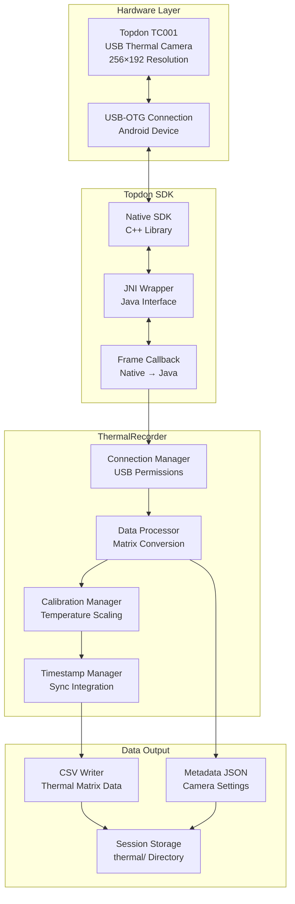

# Thermal Camera Integration Pipeline

This document details the thermal camera integration using the Topdon TC001 USB thermal camera, including SDK integration, data processing, and CSV output formatting.

## Table of Contents

1. [Pipeline Overview](#pipeline-overview)
2. [Topdon TC001 Integration](#topdon-tc001-integration)  
3. [USB-OTG Connection Management](#usb-otg-connection-management)
4. [Thermal Data Processing](#thermal-data-processing)
5. [CSV Output Format](#csv-output-format)
6. [Calibration and Metadata](#calibration-and-metadata)
7. [Performance Optimization](#performance-optimization)

---

## Pipeline Overview

The thermal camera pipeline manages USB-OTG connectivity, processes thermal matrix data from the Topdon TC001, and outputs timestamped CSV data with accompanying metadata.



---

## Topdon TC001 Integration

### Hardware Specifications

**Topdon TC001 Thermal Camera:**
- **Resolution**: 256×192 pixels (49,152 temperature points)
- **Temperature Range**: -20°C to +550°C
- **Accuracy**: ±2°C or ±2% of reading
- **Thermal Sensitivity**: <0.1°C (NETD)
- **Frame Rate**: Up to 25 Hz (configurable)
- **Interface**: USB 2.0 connection
- **Power**: Bus-powered (no external power required)

### SDK Integration Architecture

**Native SDK Components:**
```cpp
// C++ SDK Interface (Simplified)
class TopdonThermalCamera {
public:
    bool Initialize();
    bool StartStream();
    bool StopStream();
    void SetFrameCallback(FrameCallbackFunc callback);
    bool SetEmissivity(float emissivity);
    ThermalFrame* GetLatestFrame();
    void Release();
};

struct ThermalFrame {
    uint32_t timestamp_us;
    uint16_t width;
    uint16_t height;
    float* temperature_data;  // Celsius values
    float ambient_temp;
    float emissivity;
};
```

**JNI Wrapper Implementation:**
```kotlin
class TopdonThermalSDK private constructor() {
    companion object {
        init {
            System.loadLibrary("topdon_thermal")
        }
    }
    
    // Native method declarations
    private external fun nativeInitialize(): Boolean
    private external fun nativeStartStream(): Boolean  
    private external fun nativeStopStream(): Boolean
    private external fun nativeSetEmissivity(emissivity: Float): Boolean
    private external fun nativeGetLatestFrame(): ThermalFrameData?
    private external fun nativeRelease()
    
    // Frame callback from native code
    @JvmStatic
    fun onFrameReceived(
        timestampUs: Long,
        width: Int, 
        height: Int,
        temperatureData: FloatArray,
        ambientTemp: Float,
        emissivity: Float
    ) {
        frameCallback?.invoke(ThermalFrameData(
            timestamp = timestampUs * 1000, // Convert to nanoseconds
            width = width,
            height = height,
            temperatures = temperatureData,
            ambientTemperature = ambientTemp,
            emissivity = emissivity
        ))
    }
}
```

---

## USB-OTG Connection Management

### Permission Handling

Android requires explicit USB permissions for external devices:

```kotlin
class ThermalCameraRecorder : SensorRecorder {
    
    private fun requestUsbPermission(): Boolean {
        val usbManager = context.getSystemService(Context.USB_SERVICE) as UsbManager
        val deviceFilter = IntentFilter(ACTION_USB_PERMISSION)
        
        context.registerReceiver(usbReceiver, deviceFilter)
        
        // Find Topdon device
        val topdonDevice = usbManager.deviceList.values.find { device ->
            device.vendorId == TOPDON_VENDOR_ID && 
            device.productId == TC001_PRODUCT_ID
        }
        
        return if (topdonDevice != null && !usbManager.hasPermission(topdonDevice)) {
            val permissionIntent = PendingIntent.getBroadcast(
                context, 0, Intent(ACTION_USB_PERMISSION), 0
            )
            usbManager.requestPermission(topdonDevice, permissionIntent)
            false // Permission pending
        } else {
            topdonDevice != null // Permission granted or device not found
        }
    }
    
    private val usbReceiver = object : BroadcastReceiver() {
        override fun onReceive(context: Context, intent: Intent) {
            when (intent.action) {
                ACTION_USB_PERMISSION -> {
                    val granted = intent.getBooleanExtra(UsbManager.EXTRA_PERMISSION_GRANTED, false)
                    if (granted) {
                        initializeThermalCamera()
                    } else {
                        Log.e(TAG, "USB permission denied for thermal camera")
                    }
                }
                UsbManager.ACTION_USB_DEVICE_DETACHED -> {
                    Log.w(TAG, "Thermal camera disconnected")
                    handleDeviceDisconnection()
                }
            }
        }
    }
}
```

### Connection State Management

```kotlin
enum class ThermalCameraState {
    DISCONNECTED,
    CONNECTING,
    CONNECTED,
    STREAMING,
    ERROR
}

class ThermalConnectionManager {
    private val _state = MutableStateFlow(ThermalCameraState.DISCONNECTED)
    val state: StateFlow<ThermalCameraState> = _state
    
    suspend fun connect(): Boolean {
        _state.value = ThermalCameraState.CONNECTING
        
        return try {
            if (TopdonThermalSDK.initialize()) {
                _state.value = ThermalCameraState.CONNECTED
                true
            } else {
                _state.value = ThermalCameraState.ERROR
                false
            }
        } catch (e: Exception) {
            Log.e(TAG, "Failed to connect to thermal camera", e)
            _state.value = ThermalCameraState.ERROR
            false
        }
    }
    
    suspend fun startStreaming(): Boolean {
        if (_state.value != ThermalCameraState.CONNECTED) {
            return false
        }
        
        return try {
            if (TopdonThermalSDK.startStream()) {
                _state.value = ThermalCameraState.STREAMING
                true
            } else {
                _state.value = ThermalCameraState.ERROR
                false
            }
        } catch (e: Exception) {
            Log.e(TAG, "Failed to start thermal streaming", e)
            _state.value = ThermalCameraState.ERROR
            false
        }
    }
}
```

---

## Thermal Data Processing

### Frame Processing Pipeline

```kotlin
class ThermalRecorder(private val context: Context) : SensorRecorder {
    
    private var csvWriter: BufferedWriter? = null
    private var frameCount = 0L
    private var startTimestamp = 0L
    
    override suspend fun start(sessionDir: File) {
        val thermalDir = sessionDir
        thermalDir.mkdirs()
        
        // Initialize CSV output
        val csvFile = File(thermalDir, "thermal.csv")
        csvWriter = BufferedWriter(FileWriter(csvFile))
        writeCsvHeader()
        
        // Initialize metadata
        startTimestamp = TimeManager.nowNanos()
        initializeMetadata(thermalDir)
        
        // Set up frame callback
        TopdonThermalSDK.setFrameCallback { frame ->
            processFrame(frame)
        }
        
        // Start streaming
        connectionManager.startStreaming()
    }
    
    private fun writeCsvHeader() {
        val header = buildString {
            append("timestamp_ns,w,h")
            // Add temperature value columns v0 to v49151
            for (i in 0 until 49152) {
                append(",v$i")
            }
            append("\n")
        }
        csvWriter?.write(header)
        csvWriter?.flush()
    }
    
    private fun processFrame(frame: ThermalFrameData) {
        val syncedTimestamp = TimeManager.getSyncedTimestamp()
        
        // Validate frame data
        if (frame.temperatures.size != 49152) {
            Log.e(TAG, "Invalid frame size: ${frame.temperatures.size}")
            return
        }
        
        // Write CSV row
        val csvRow = buildString {
            append("$syncedTimestamp,${frame.width},${frame.height}")
            frame.temperatures.forEach { temp ->
                append(",${String.format("%.1f", temp)}")
            }
            append("\n")
        }
        
        try {
            csvWriter?.write(csvRow)
            
            // Periodic flush to ensure data persistence
            frameCount++
            if (frameCount % 50 == 0L) { // Flush every 50 frames (~5 seconds at 10 Hz)
                csvWriter?.flush()
            }
            
        } catch (e: IOException) {
            Log.e(TAG, "Error writing thermal data", e)
        }
    }
}
```

### Temperature Matrix Layout

The thermal data is stored in row-major order matching the physical sensor layout:

**Matrix Indexing:**
```kotlin
// Convert 2D coordinates to 1D array index
fun getTemperatureAt(row: Int, col: Int, temperatures: FloatArray): Float {
    val index = row * 256 + col  // 256 = width
    return if (index < temperatures.size) temperatures[index] else Float.NaN
}

// Convert 1D array index to 2D coordinates  
fun indexToCoordinates(index: Int): Pair<Int, Int> {
    val row = index / 256
    val col = index % 256
    return Pair(row, col)
}
```

**Data Validation:**
```kotlin
private fun validateTemperatureData(temperatures: FloatArray): Boolean {
    var validCount = 0
    var invalidCount = 0
    
    temperatures.forEach { temp ->
        when {
            temp.isNaN() -> invalidCount++
            temp < -50.0f || temp > 600.0f -> invalidCount++ // Outside reasonable range
            else -> validCount++
        }
    }
    
    val invalidRatio = invalidCount.toFloat() / temperatures.size
    if (invalidRatio > 0.1f) { // More than 10% invalid pixels
        Log.w(TAG, "High invalid pixel ratio: ${invalidRatio * 100}%")
    }
    
    return invalidRatio < 0.5f // Reject frames with >50% invalid data
}
```

---

## CSV Output Format

### Thermal CSV Schema

**File**: `sessions/{session_id}/thermal/thermal.csv`

| Column | Type | Range | Description |
|--------|------|-------|-------------|
| `timestamp_ns` | int64 | 0 to 2^63-1 | Synced nanosecond timestamp |
| `w` | int32 | 256 | Frame width (constant) |
| `h` | int32 | 192 | Frame height (constant) |
| `v0` to `v49151` | float32 | -50.0 to 600.0 | Temperature in °C (row-major order) |

**Example CSV Data:**
```csv
timestamp_ns,w,h,v0,v1,v2,...,v49151
1703856123456789012,256,192,23.5,23.6,23.4,...,24.1
1703856123556789013,256,192,23.6,23.7,23.5,...,24.2
1703856123656789014,256,192,23.7,23.8,23.6,...,24.3
```

### Data Compression and Storage

**CSV Compression:**
```kotlin
// Optional: Compress large thermal CSV files
private fun compressThermalData(csvFile: File) {
    val gzipFile = File(csvFile.parent, "${csvFile.name}.gz")
    
    FileInputStream(csvFile).use { fis ->
        GZIPOutputStream(FileOutputStream(gzipFile)).use { gzos ->
            fis.copyTo(gzos)
        }
    }
    
    // Verify compression ratio
    val originalSize = csvFile.length()
    val compressedSize = gzipFile.length()
    val ratio = (originalSize.toDouble() / compressedSize.toDouble())
    
    Log.i(TAG, "Thermal CSV compressed: ${originalSize / 1024}KB → ${compressedSize / 1024}KB (${String.format("%.1fx", ratio)})")
}
```

---

## Calibration and Metadata

### Metadata JSON Structure

**File**: `sessions/{session_id}/thermal/metadata.json`

```json
{
  "camera_info": {
    "model": "Topdon TC001",
    "firmware_version": "1.2.3",
    "serial_number": "TC001-2024-001234",
    "resolution": {
      "width": 256,
      "height": 192
    }
  },
  "calibration": {
    "emissivity": 0.95,
    "ambient_temperature_c": 23.5,
    "calibration_date": "2024-12-15T10:30:00Z",
    "factory_calibration": true,
    "user_calibration": null
  },
  "measurement_range": {
    "min_temperature_c": -20.0,
    "max_temperature_c": 550.0,
    "accuracy_c": 2.0,
    "resolution_c": 0.1,
    "netd_mk": 100
  },
  "acquisition_settings": {
    "sampling_rate_hz": 10.0,
    "exposure_time_us": 8000,
    "gain": "auto",
    "noise_reduction": true
  },
  "session_info": {
    "session_id": "20241218_143052_001",
    "start_timestamp_ns": 1703856123456789012,
    "end_timestamp_ns": 1703856979925123456,
    "frames_captured": 8560,
    "frames_dropped": 12,
    "average_fps": 9.98
  },
  "sync_info": {
    "time_sync_enabled": true,
    "initial_offset_ns": 1234567,
    "drift_correction": true,
    "sync_accuracy_ms": 2.1
  }
}
```

### Dynamic Calibration

```kotlin
class ThermalCalibrationManager {
    
    fun updateEmissivity(emissivity: Float): Boolean {
        return if (emissivity in 0.1f..1.0f) {
            TopdonThermalSDK.setEmissivity(emissivity)
            currentEmissivity = emissivity
            Log.i(TAG, "Emissivity updated to $emissivity")
            true
        } else {
            Log.e(TAG, "Invalid emissivity value: $emissivity")
            false
        }
    }
    
    fun performUserCalibration(knownTemperature: Float, measuredAverage: Float) {
        val offset = knownTemperature - measuredAverage
        calibrationOffset = offset
        
        Log.i(TAG, "User calibration: offset = ${String.format("%.2f", offset)}°C")
        
        // Apply calibration to future readings
        userCalibrationEnabled = true
    }
    
    private fun applyCalibratedTemperature(rawTemp: Float): Float {
        return if (userCalibrationEnabled) {
            rawTemp + calibrationOffset
        } else {
            rawTemp
        }
    }
}
```

---

## Performance Optimization

### Memory and CPU Optimization

**Frame Buffer Management:**
```kotlin
class ThermalFrameBufferPool {
    private val availableBuffers = ConcurrentLinkedQueue<FloatArray>()
    private val maxBuffers = 5
    
    fun acquireBuffer(): FloatArray {
        return availableBuffers.poll() ?: FloatArray(49152)
    }
    
    fun releaseBuffer(buffer: FloatArray) {
        if (availableBuffers.size < maxBuffers) {
            availableBuffers.offer(buffer)
        }
    }
}
```

**Async Processing:**
```kotlin
private val thermalProcessingScope = CoroutineScope(
    Dispatchers.IO + SupervisorJob()
)

private fun processFrameAsync(frame: ThermalFrameData) {
    thermalProcessingScope.launch {
        try {
            // Process frame on background thread
            processFrame(frame)
        } catch (e: Exception) {
            Log.e(TAG, "Thermal frame processing error", e)
        }
    }
}
```

### Error Handling and Recovery

**Connection Recovery:**
```kotlin
private fun handleConnectionError() {
    thermalProcessingScope.launch {
        var retryCount = 0
        val maxRetries = 3
        
        while (retryCount < maxRetries) {
            delay(1000 * (retryCount + 1)) // Exponential backoff
            
            if (connectionManager.connect()) {
                Log.i(TAG, "Thermal camera reconnected after $retryCount retries")
                return@launch
            }
            
            retryCount++
        }
        
        Log.e(TAG, "Failed to reconnect thermal camera after $maxRetries attempts")
        broadcastError("THERMAL_CAMERA_DISCONNECTED")
    }
}
```

**Data Integrity Checks:**
```kotlin
private fun validateAndCorrectFrame(frame: ThermalFrameData): ThermalFrameData {
    val correctedTemperatures = frame.temperatures.mapIndexed { index, temp ->
        when {
            temp.isNaN() -> interpolateFromNeighbors(index, frame.temperatures)
            temp < -50.0f -> -50.0f // Clamp to reasonable range
            temp > 600.0f -> 600.0f
            else -> temp
        }
    }.toFloatArray()
    
    return frame.copy(temperatures = correctedTemperatures)
}
```

This thermal camera integration provides robust, high-precision temperature data collection with comprehensive error handling and calibration capabilities.