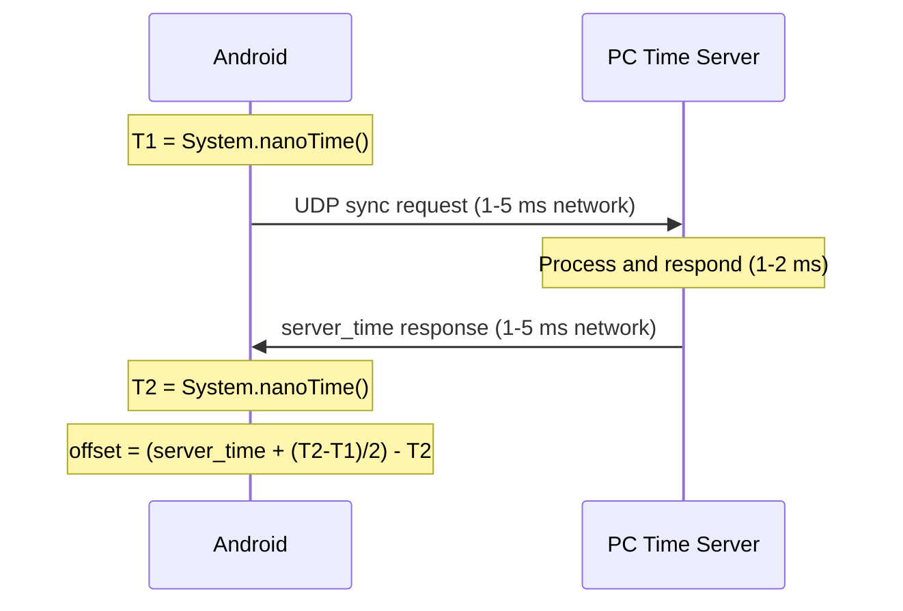

# Performance and Non-Functional Requirements

This document defines performance budgets, timing constraints, data rate specifications, and latency requirements for the multi-modal physiological sensing platform.

## Table of Contents

1. [Data Rate and Storage Budgets](#data-rate-and-storage-budgets)
2. [Latency Budget and Timing Alignment](#latency-budget-and-timing-alignment)
3. [Performance Benchmarks](#performance-benchmarks)
4. [Scalability Analysis](#scalability-analysis)
5. [Resource Utilization Limits](#resource-utilization-limits)

---

## Data Rate and Storage Budgets

### Data Generation Rates by Modality

| Modality | Data Type | Rate | Size per Sample | Data Rate | Storage per Hour |
|----------|-----------|------|-----------------|-----------|------------------|
| **RGB Video** | H.264 MP4 | 30 FPS | Variable bitrate | ~8-12 Mbps | ~3.6-5.4 GB |
| **RGB Stills** | JPEG Images | ~6.67 Hz | 2-4 MB each | ~16-32 Mbps | ~7.2-14.4 GB |
| **RGB CSV** | Frame Index | ~6.67 Hz | ~50 bytes/row | ~0.3 KB/s | ~1.1 MB |
| **Thermal** | CSV Matrix | 10 Hz | ~590 KB/row | ~5.9 MB/s | ~21.2 GB |
| **GSR/PPG** | CSV Timeseries | 128 Hz | ~35 bytes/row | ~4.5 KB/s | ~16.2 MB |
| **Preview Stream** | JPEG Base64 | ~6.67 Hz | ~50-100 KB | ~400-800 KB/s | ~1.4-2.9 GB |

### Total System Data Budget

**Per Device Per Hour:**
- **High Quality Mode**: 32-53 GB/hour (RGB stills + thermal + video)
- **Standard Mode**: 25-40 GB/hour (video priority, reduced still rate)
- **Compact Mode**: 4-6 GB/hour (video only + thermal + GSR)

**Multi-Device Session (4 devices, 2 hours):**
- **High Quality**: 256-424 GB total
- **Standard**: 200-320 GB total
- **Compact**: 32-48 GB total

### Storage Headroom Scenarios

**Android Device Storage Planning:**
| Available Space | Session Duration | Devices Supported | Recommended Mode |
|----------------|------------------|-------------------|------------------|
| 64 GB | 1 hour | 1-2 devices | Compact |
| 128 GB | 1 hour | 2-3 devices | Standard |
| 256 GB | 2 hours | 3-4 devices | Standard |
| 512 GB | 2 hours | 4+ devices | High Quality |

**PC Hub Storage Planning:**
- **Minimum**: 1 TB SSD for 10-15 standard sessions
- **Recommended**: 2-4 TB SSD for 30-50 high-quality sessions
- **Enterprise**: 8+ TB for 100+ sessions with exports

### Compression and Optimization

**Data Reduction Techniques:**
- H.264 hardware encoding: ~40-60% size reduction vs uncompressed
- JPEG quality scaling: 95% (minimal loss) to 75% (30% reduction)
- Thermal CSV compression: ZIP reduces size by ~15-25%
- GSR data filtering: Remove outliers and duplicate timestamps

**Network Transmission Optimization:**
- Preview frames: 640×480 JPEG at 75% quality (~40 KB each)
- Throttling: Max 150ms intervals to prevent network saturation
- TCP buffering: 64 KB send/receive buffers per connection
- File transfer: ZIP streaming with 64 KB chunks

---

## Latency Budget and Timing Alignment

### End-to-End Preview Latency Budget

```mermaid
gantt
    title Preview Frame Latency Pipeline
    dateFormat X
    axisFormat %L

    section Camera
    Capture          :0, 20

    section Processing
    JPEG Compress    :20, 60
    Base64 Encode    :60, 80

    section Network
    TCP Transmit     :80, 120

    section PC Display
    Decode Base64    :120, 140
    JPEG Decompress  :140, 170
    UI Update        :170, 200

    section Budget
    Total Latency    :0, 200
```

**Latency Breakdown:**
- **Camera Capture**: 10-20 ms (CameraX processing)
- **JPEG Compression**: 30-50 ms (hardware encoder preferred)
- **Base64 Encoding**: 15-25 ms (CPU bound)
- **Network Transmission**: 20-50 ms (depends on WiFi quality)
- **PC Processing**: 40-60 ms (decode + display)
- **Total Target**: <200 ms end-to-end

### Time Synchronization Accuracy

**NTP-like Sync Protocol Timing:**

**Sync Accuracy Targets:**
- **Network RTT**: <10 ms (local WiFi)
- **Clock Resolution**: 1 ns (System.nanoTime())
- **Sync Accuracy**: <5 ms between devices (NFR requirement)
- **Drift Correction**: Re-sync every 60 seconds during recording

### Frame Timing and Alignment

**RGB Camera Timing:**
- **Video Frame Rate**: 30 FPS (33.33 ms intervals)
- **Still Capture Rate**: 6.67 Hz (150 ms intervals)
- **Timestamp Precision**: Nanosecond (System.nanoTime())
- **Jitter Tolerance**: ±10 ms from expected intervals

**Thermal Camera Timing:**
- **Sampling Rate**: 10 Hz (100 ms intervals)
- **Acquisition Time**: 8-15 ms per frame
- **Processing Latency**: 5-10 ms (SDK processing)
- **CSV Write Latency**: 2-5 ms (buffered I/O)

**GSR Sensor Timing:**
- **Sampling Rate**: 128 Hz (7.8125 ms intervals)
- **BLE Latency**: 10-20 ms (connection interval dependent)
- **Buffering**: 10-20 samples per transmission
- **Data Loss Tolerance**: <1% missing samples

---

## Performance Benchmarks

### Android Device Performance

**CPU Utilization Targets:**
- **Recording Idle**: <10% average CPU
- **Recording Active**: 25-45% average CPU
- **Peak Load**: <80% sustained (thermal throttling prevention)
- **Background Services**: <5% when not recording

**Memory Usage Targets:**
- **App Baseline**: <200 MB RAM
- **Recording Active**: 300-500 MB RAM
- **Preview Buffers**: 50-100 MB allocated
- **File I/O Buffers**: 20-50 MB allocated

**Storage I/O Performance:**
- **Sequential Write**: 50+ MB/s sustained (thermal CSV)
- **Random Write**: 10+ MB/s (RGB stills)
- **Sync Operations**: <100 ms (CSV flush)
- **Directory Operations**: <50 ms (session creation)

### PC Controller Performance

**Multi-Device Handling:**
- **Device Connections**: 8+ simultaneous TCP connections
- **Preview Rendering**: 60+ FPS UI updates with 4+ device previews
- **Network Throughput**: 100+ Mbps aggregate (preview streams)
- **File Reception**: 50+ MB/s per device during transfer

**UI Responsiveness:**
- **Command Response**: <100 ms from button click to device command
- **Preview Update**: <16.7 ms (60 FPS target)
- **Status Refresh**: <500 ms for device grid updates
- **Session Management**: <1 second for session creation/deletion

### Network Performance Requirements

**WiFi Network Specifications:**
- **Bandwidth**: 802.11ac (100+ Mbps available)
- **Frequency**: 5 GHz preferred (reduced congestion)
- **Range**: <30 meters from access point
- **Device Density**: <20 total devices on network

**Protocol Performance:**
- **TCP Connection Setup**: <500 ms per device
- **Command Round-trip**: <50 ms (local network)
- **mDNS Discovery**: <2 seconds for new device detection
- **File Transfer Rate**: 10+ MB/s per device

---

## Scalability Analysis

### Device Scaling Limits

| Devices | Network Load | PC CPU | PC Memory | Storage Rate | Session Duration |
|---------|--------------|--------|-----------|--------------|------------------|
| 1 | 1-2 Mbps | 5-10% | 100 MB | 10 GB/hour | 4+ hours |
| 2 | 2-4 Mbps | 8-15% | 150 MB | 20 GB/hour | 3-4 hours |
| 4 | 4-8 Mbps | 15-25% | 250 MB | 40 GB/hour | 2-3 hours |
| 8 | 8-16 Mbps | 25-40% | 400 MB | 80 GB/hour | 1-2 hours |
| 16 | 16-32 Mbps | 40-60% | 750 MB | 160 GB/hour | <1 hour |

**Scaling Bottlenecks:**
1. **Network Bandwidth**: WiFi saturation at 8+ devices
2. **Storage I/O**: PC disk write limits at 12+ devices
3. **CPU Processing**: Preview decoding limits at 16+ devices
4. **Memory Usage**: Preview buffers grow linearly

### Performance Optimization Strategies

**Network Optimization:**
- **Preview Quality Scaling**: Reduce JPEG quality with device count
- **Frame Rate Throttling**: Lower preview rate for >6 devices
- **Compression**: Enable ZIP compression for file transfers
- **Connection Pooling**: Reuse TCP connections where possible

**Storage Optimization:**
- **Write Coalescing**: Batch CSV writes to reduce I/O operations
- **Background Compression**: Compress completed sessions offline
- **Tiered Storage**: Move old sessions to slower storage
- **Parallel Transfers**: Concurrent file uploads from multiple devices

**Processing Optimization:**
- **Hardware Acceleration**: Use GPU for JPEG decode where available
- **Multi-threading**: Separate threads for preview rendering
- **Memory Pooling**: Reuse image buffers to reduce allocations
- **Background Processing**: Process previews on worker threads

---

## Resource Utilization Limits

### Android Device Limits

**Critical Thresholds:**
- **Battery Level**: Stop recording at <15% charge
- **Storage Space**: Block new sessions at <500 MB available
- **CPU Temperature**: Throttle sampling rates at >65°C
- **Memory Pressure**: Flush buffers at >80% RAM usage

**Graceful Degradation:**
- **Low Battery**: Disable preview streaming, reduce sampling rates
- **Storage Full**: Complete current session, block new sessions
- **High Temperature**: Reduce CPU load, lower frame rates
- **Memory Pressure**: Reduce buffer sizes, increase flush frequency

### PC Controller Limits

**System Requirements:**
- **CPU**: Intel i5-8400 / AMD Ryzen 5 3600 or equivalent
- **RAM**: 8 GB minimum, 16 GB recommended for 8+ devices
- **Storage**: 1 TB SSD minimum, NVMe preferred
- **Network**: Gigabit Ethernet or 802.11ac WiFi

**Resource Monitoring:**
- **CPU Usage**: Alert at >80% sustained
- **Memory Usage**: Alert at >90% system RAM
- **Disk Space**: Alert at <100 GB available
- **Network Utilization**: Alert at >80% bandwidth

### Monitoring and Alerting

**Key Performance Indicators (KPIs):**
- Time sync accuracy across all devices
- Preview frame drop rate per device
- Storage consumption rate vs available space
- Network packet loss and retransmission rates
- Session completion success rate

**Alert Conditions:**
- Sync accuracy >10 ms between any two devices
- Preview latency >500 ms sustained
- Storage consumption >90% of available space
- Network packet loss >1% sustained
- Device disconnection rate >5% per hour

This comprehensive performance specification ensures the system operates within defined resource constraints while maintaining data quality and user experience across various deployment scenarios.
