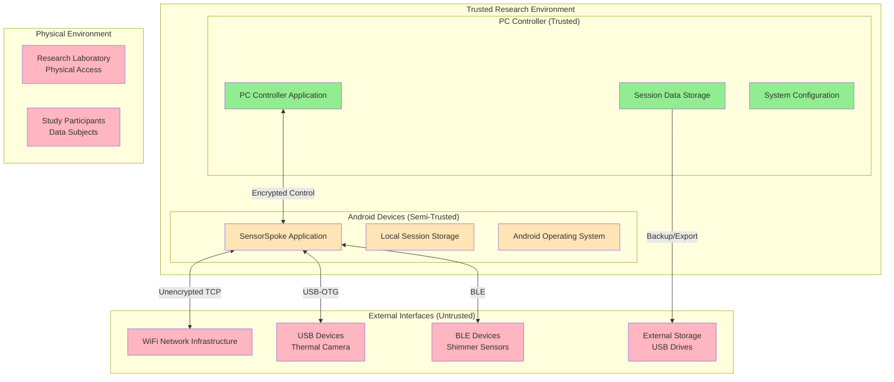
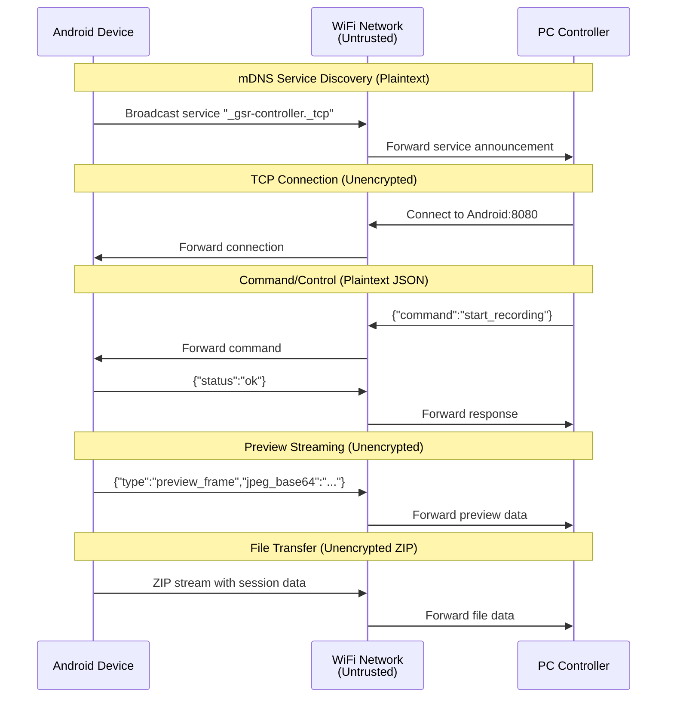

# Security Analysis and Trust Boundaries

This document analyzes the security posture of the multi-modal physiological sensing platform, identifies trust boundaries, and outlines the roadmap for implementing comprehensive security measures.

## Table of Contents

1. [Security Overview](#security-overview)
2. [Trust Boundaries and Attack Surface](#trust-boundaries-and-attack-surface)
3. [Current Security Posture](#current-security-posture)
4. [Data Protection and Privacy](#data-protection-and-privacy)
5. [Network Security Analysis](#network-security-analysis)
6. [Future Security Enhancements](#future-security-enhancements)
7. [Compliance and Regulatory Considerations](#compliance-and-regulatory-considerations)

---

## Security Overview

### Security Objectives

**Confidentiality:**
- Protect physiological data from unauthorized access during collection, transmission, and storage
- Ensure participant privacy through data anonymization and access controls
- Prevent eavesdropping on network communications between devices

**Integrity:**
- Maintain data accuracy and prevent tampering throughout the collection pipeline
- Detect and prevent unauthorized modifications to sensor readings or metadata
- Ensure authenticity of commands and control messages

**Availability:**
- Protect against denial-of-service attacks that could disrupt data collection
- Maintain system resilience against network interruptions and device failures
- Ensure timely data collection and transfer for research continuity

### Threat Model

**Primary Threat Actors:**
- **Passive Network Attackers**: Eavesdropping on WiFi communications
- **Malicious Insiders**: Researchers with unauthorized access to participant data
- **Device Tampering**: Physical access to Android devices or PC controller
- **Supply Chain Attacks**: Compromised hardware or software dependencies

**Assets to Protect:**
- **Physiological Data**: GSR, thermal, and video recordings with biometric identifiers
- **Research Metadata**: Session configurations, participant identifiers, timestamps
- **System Configuration**: Device credentials, network settings, calibration data
- **Research Integrity**: Prevention of data fabrication or manipulation

---

## Trust Boundaries and Attack Surface

### System Trust Boundaries



### Attack Surface Analysis

**Network Attack Surface:**
- **TCP Control Channel**: Unencrypted command/response messages (Port 8080)
- **UDP Time Sync**: Unencrypted timestamp exchange (Port 3333)
- **mDNS Discovery**: Broadcast service advertisements
- **File Transfer**: Unencrypted ZIP stream uploads

**Device Attack Surface:**
- **Android Permissions**: Camera, storage, location, network access
- **USB-OTG Interface**: Physical access to thermal camera communication
- **BLE Interface**: Proximity-based access to GSR sensor data
- **Local Storage**: Unencrypted session files on device storage

**Physical Attack Surface:**
- **Device Theft**: Mobile devices contain unprotected participant data
- **Screen Observation**: Sensitive data visible on device displays
- **USB Port Access**: Direct data extraction via USB debugging
- **Network Infrastructure**: Rogue access points and man-in-the-middle attacks

---

## Current Security Posture

### Existing Security Measures

**Authentication and Access Control:**
```
Current State: MINIMAL
- No device authentication between PC and Android
- No user authentication on PC Controller application  
- Android devices rely on OS-level screen lock protection
- No role-based access controls for research data
```

**Network Security:**
```
Current State: UNPROTECTED  
- All TCP/IP communications are plaintext
- No encryption for command/control messages
- No message authentication or integrity checking
- mDNS broadcasts device information openly
```

**Data Protection:**
```
Current State: BASIC
- Android app data stored in private app directory (OS protection)
- PC session data stored in user documents folder (filesystem permissions)
- No encryption of data at rest
- No data anonymization or pseudonymization
```

**Input Validation:**
```
Current State: MODERATE
- JSON message parsing with basic validation
- File path sanitization for session directories
- Network message size limits to prevent buffer overflows
- Basic bounds checking on sensor data values
```

### Security Gaps and Vulnerabilities

**High-Risk Vulnerabilities:**
1. **Unencrypted Network Communications**: All control and data traffic susceptible to interception
2. **No Device Authentication**: Any device can impersonate legitimate sensor nodes
3. **Plaintext Data Storage**: Participant data stored without encryption
4. **No Access Controls**: No authentication required for PC controller access

**Medium-Risk Vulnerabilities:**  
1. **Network Discovery**: mDNS broadcasts expose device information
2. **USB Device Trust**: Automatic trust of connected thermal cameras
3. **BLE Security**: Limited pairing security for Shimmer sensors
4. **Physical Device Access**: No protection against device theft or tampering

**Low-Risk Vulnerabilities:**
1. **Log File Exposure**: Detailed system logs may contain sensitive information
2. **Timing Attacks**: Time sync protocol may leak information about network topology
3. **Resource Exhaustion**: Limited protection against DoS through resource consumption
4. **Update Mechanism**: No secure update mechanism for application components

---

## Data Protection and Privacy

### Data Classification

**Highly Sensitive Data (Biometric Identifiers):**
- Thermal camera recordings (facial thermal patterns)
- RGB camera recordings (facial features, identifying characteristics)
- Combined physiological signatures (unique GSR/PPG patterns)

**Sensitive Data (Research Measurements):**
- Individual GSR/PPG readings
- Thermal temperature measurements  
- Session metadata with timestamps
- Device identifiers and configurations

**Internal Data (System Operations):**
- Network communication logs
- System performance metrics
- Error and diagnostic information
- Configuration settings

### Current Privacy Protection

**Data Minimization:**
```kotlin
// Current Implementation - Basic data collection
class SessionManager {
    fun createSession(participantId: String?) {
        // Stores participant ID directly - NO ANONYMIZATION
        val metadata = SessionMetadata(
            participantId = participantId,  // PRIVACY RISK
            researcherId = getCurrentUser(), // PRIVACY RISK  
            timestamp = System.currentTimeMillis()
        )
    }
}
```

**Access Control:**
```
Current State: FILE SYSTEM PERMISSIONS ONLY
- PC: Session data readable by user account and administrators
- Android: App private directory (Android OS protection)
- No application-level access controls
- No audit logging of data access
```

### Privacy Enhancement Requirements

**Data Anonymization Pipeline:**
```kotlin
// Proposed Implementation - Privacy-preserving data collection
class PrivacyManager {
    fun anonymizeParticipant(participantId: String): String {
        return generatePseudonym(participantId, sessionSalt)
    }
    
    fun redactSensitiveMetadata(metadata: SessionMetadata): SessionMetadata {
        return metadata.copy(
            participantId = anonymizeParticipant(metadata.participantId),
            location = null, // Remove location data
            researcherId = hashUserId(metadata.researcherId)
        )
    }
}
```

---

## Network Security Analysis

### Current Network Communication Flow



### Network Threat Scenarios

**Scenario 1: WiFi Eavesdropping**
```
Threat: Attacker on same WiFi network captures all communications
Impact: Complete access to participant physiological data and research metadata
Likelihood: HIGH (unsecured or weakly secured research networks)
Mitigation: Implement TLS encryption for all TCP communications
```

**Scenario 2: Man-in-the-Middle Attack**
```
Threat: Attacker intercepts and modifies commands between PC and Android
Impact: Unauthorized control of recording sessions, data tampering
Likelihood: MEDIUM (requires network position or rogue access point)
Mitigation: Mutual authentication and message integrity verification
```

**Scenario 3: Rogue Device Impersonation**
```
Threat: Malicious device advertises as legitimate sensor node
Impact: Injection of false data, collection of researcher commands
Likelihood: LOW (requires physical proximity and technical sophistication)
Mitigation: Device certificates and authentication protocols
```

### Network Security Vulnerabilities

**Protocol-Level Issues:**
- **No Transport Security**: TCP communications entirely unprotected
- **Message Authenticity**: No verification that messages originate from legitimate devices
- **Replay Attacks**: Commands can be captured and retransmitted
- **Service Enumeration**: mDNS broadcasts expose device capabilities

**Implementation Issues:**
- **Weak Input Validation**: Limited sanitization of network inputs
- **Resource Exhaustion**: No rate limiting or connection throttling
- **Error Information Leakage**: Detailed error messages may expose system information
- **Timing Vulnerabilities**: Time sync protocol may be exploitable

---

## Future Security Enhancements

### Phase 1: Transport Layer Security (TLS)

**Objective**: Encrypt all network communications and establish device identity

**Implementation Roadmap:**

**TLS Configuration:**
```kotlin
// Enhanced Network Security Implementation
class SecureNetworkController {
    
    fun setupTLSServer(): TLSServerSocket {
        val keyStore = loadOrGenerateKeyStore()
        val sslContext = SSLContext.getInstance("TLSv1.3")
        
        val keyManagerFactory = KeyManagerFactory.getInstance("X509")
        keyManagerFactory.init(keyStore, keyStorePassword)
        
        sslContext.init(keyManagerFactory.keyManagers, null, SecureRandom())
        
        return sslContext.serverSocketFactory.createServerSocket(8443) // HTTPS port
    }
    
    fun establishMutualTLS(clientCertificate: X509Certificate): Boolean {
        // Verify client certificate against trusted CA
        return certificateValidator.validateClientCertificate(clientCertificate)
    }
}
```

**Certificate Management:**
```kotlin
class CertificateManager {
    
    fun generateDeviceCertificate(deviceId: String): X509Certificate {
        // Generate device-specific certificate with unique identity
        val keyPair = generateRSAKeyPair(2048)
        
        val certBuilder = X509CertificateBuilder()
            .setSubject("CN=$deviceId,O=MultiModalSensing")
            .setValidityPeriod(365) // 1 year validity
            .setKeyUsage(KeyUsage.DIGITAL_SIGNATURE or KeyUsage.KEY_ENCIPHERMENT)
            
        return certBuilder.build(keyPair, signingCertificate)
    }
    
    fun validateCertificateChain(certificate: X509Certificate): Boolean {
        return try {
            certificate.verify(caCertificate.publicKey)
            !certificate.isExpired()
        } catch (e: Exception) {
            false
        }
    }
}
```

### Phase 2: Data Encryption at Rest

**Objective**: Protect stored session data through encryption

**Android Storage Encryption:**
```kotlin
class SecureStorageManager {
    
    private val encryptedSharedPrefs = EncryptedSharedPreferences.create(
        "secure_config",
        MasterKeys.AES256_GCM_SPEC,
        context,
        EncryptedSharedPreferences.PrefKeyEncryptionScheme.AES256_SIV,
        EncryptedSharedPreferences.PrefValueEncryptionScheme.AES256_GCM
    )
    
    fun encryptSessionData(sessionDir: File, password: CharArray) {
        val cipher = createAESGCMCipher()
        val secretKey = deriveKeyFromPassword(password, generateSalt())
        
        sessionDir.walkTopDown().forEach { file ->
            if (file.isFile) {
                val encryptedFile = File(file.parent, "${file.name}.enc")
                encryptFile(file, encryptedFile, secretKey, cipher)
                file.delete() // Remove plaintext
            }
        }
    }
    
    private fun createAESGCMCipher(): Cipher {
        return Cipher.getInstance("AES/GCM/NoPadding")
    }
}
```

**PC Data Protection:**
```python
# Python PC Controller - Secure Data Handling
class SecureDataManager:
    
    def encrypt_session_directory(self, session_path: Path, key: bytes):
        """Encrypt all files in session directory using AES-256-GCM"""
        
        for file_path in session_path.rglob('*'):
            if file_path.is_file() and not file_path.suffix == '.enc':
                encrypted_path = file_path.with_suffix(file_path.suffix + '.enc')
                
                with open(file_path, 'rb') as plaintext_file:
                    data = plaintext_file.read()
                
                # Encrypt with AES-256-GCM
                cipher = AES.new(key, AES.MODE_GCM)
                ciphertext, auth_tag = cipher.encrypt_and_digest(data)
                
                # Store IV, auth tag, and ciphertext
                with open(encrypted_path, 'wb') as encrypted_file:
                    encrypted_file.write(cipher.nonce)  # 16 bytes
                    encrypted_file.write(auth_tag)      # 16 bytes  
                    encrypted_file.write(ciphertext)
                
                file_path.unlink()  # Delete plaintext
    
    def generate_session_key(self) -> bytes:
        """Generate cryptographically strong session key"""
        return os.urandom(32)  # 256-bit key
```

### Phase 3: Authentication and Access Control

**Objective**: Implement comprehensive authentication and authorization

**Multi-Factor Authentication:**
```kotlin
class AuthenticationManager {
    
    fun authenticateResearcher(credentials: UserCredentials): AuthResult {
        // Primary authentication (username/password)
        val primaryAuth = validateCredentials(credentials)
        if (!primaryAuth.success) {
            return AuthResult.FAILURE
        }
        
        // Secondary authentication (mobile app or hardware token)
        val secondaryAuth = requestSecondaryAuthentication(credentials.username)
        if (!secondaryAuth.success) {
            return AuthResult.FAILURE  
        }
        
        // Generate session token with limited lifetime
        val sessionToken = generateSessionToken(
            userId = credentials.username,
            permissions = getUserPermissions(credentials.username),
            expiryMinutes = 480 // 8 hour session
        )
        
        return AuthResult.SUCCESS(sessionToken)
    }
    
    fun authorizeAction(sessionToken: String, action: String, resource: String): Boolean {
        val session = validateSessionToken(sessionToken)
        if (session == null || session.isExpired()) {
            return false
        }
        
        return session.permissions.contains("$action:$resource")
    }
}
```

**Role-Based Access Control:**
```python
class AccessControlManager:
    
    ROLES = {
        'principal_investigator': {
            'permissions': ['create_session', 'view_all_data', 'export_data', 'manage_users']
        },
        'research_assistant': {
            'permissions': ['create_session', 'view_assigned_data', 'export_assigned_data']  
        },
        'data_analyst': {
            'permissions': ['view_anonymized_data', 'export_anonymized_data']
        }
    }
    
    def check_permission(self, user_id: str, action: str, resource_id: str) -> bool:
        user_roles = self.get_user_roles(user_id)
        required_permission = f"{action}:{resource_id}"
        
        for role in user_roles:
            role_permissions = self.ROLES[role]['permissions']
            if any(self.permission_matches(perm, required_permission) 
                   for perm in role_permissions):
                return True
                
        return False
```

### Phase 4: Advanced Security Features

**Data Loss Prevention:**
```kotlin
class DataLossPrevention {
    
    fun scanForSensitiveData(filePath: String): ScanResult {
        val content = File(filePath).readText()
        val violations = mutableListOf<PolicyViolation>()
        
        // Check for PII patterns
        if (containsPersonalIdentifiers(content)) {
            violations.add(PolicyViolation.PII_DETECTED)
        }
        
        // Check for unencrypted biometric data
        if (containsBiometricData(content) && !isEncrypted(filePath)) {
            violations.add(PolicyViolation.UNENCRYPTED_BIOMETRIC)
        }
        
        return ScanResult(violations)
    }
    
    fun quarantineSensitiveFile(filePath: String) {
        val quarantineDir = File(context.cacheDir, "quarantine")
        quarantineDir.mkdirs()
        
        val originalFile = File(filePath)
        val quarantineFile = File(quarantineDir, originalFile.name)
        
        originalFile.renameTo(quarantineFile)
        logSecurityEvent("FILE_QUARANTINED", filePath)
    }
}
```

**Audit Logging and Monitoring:**
```python
class SecurityAuditLogger:
    
    def log_security_event(self, event_type: str, user_id: str, 
                          resource: str, outcome: str, details: dict):
        """Log security-relevant events for compliance and monitoring"""
        
        audit_entry = {
            'timestamp': datetime.utcnow().isoformat(),
            'event_type': event_type,
            'user_id': hash_user_id(user_id),  # Anonymized
            'resource': resource,
            'outcome': outcome,
            'source_ip': self.get_client_ip(),
            'details': details
        }
        
        # Write to secure audit log (append-only, integrity protected)
        with open(self.audit_log_path, 'a') as log_file:
            log_file.write(json.dumps(audit_entry) + '\n')
        
        # Send critical events to SIEM
        if event_type in ['AUTHENTICATION_FAILURE', 'UNAUTHORIZED_ACCESS', 'DATA_EXPORT']:
            self.send_to_siem(audit_entry)
```

---

## Compliance and Regulatory Considerations

### Data Protection Regulations

**GDPR Compliance (EU):**
- **Right to Erasure**: Implement secure data deletion procedures
- **Data Portability**: Provide encrypted export formats for participant data
- **Consent Management**: Track and validate participant consent for data use
- **Breach Notification**: Automated detection and reporting of data breaches

**HIPAA Compliance (US Healthcare Research):**
- **Administrative Safeguards**: User training, access controls, audit procedures
- **Physical Safeguards**: Device encryption, secure disposal, facility access controls  
- **Technical Safeguards**: Data encryption, authentication, audit logging

**Research Ethics Requirements:**
- **IRB Approval**: Document security measures in research protocols
- **Participant Consent**: Clear disclosure of data security and privacy protections
- **Data Minimization**: Collect only data necessary for research objectives
- **Retention Limits**: Automatic deletion of data after research completion

### Security Compliance Framework

**Implementation Timeline:**
```
Phase 1 (0-6 months): TLS encryption, basic authentication
Phase 2 (6-12 months): Data encryption at rest, access controls
Phase 3 (12-18 months): Advanced authentication, audit logging
Phase 4 (18-24 months): DLP, compliance automation, security monitoring
```

**Compliance Validation:**
- Regular security assessments by qualified third parties
- Penetration testing of network communications and device security
- Code security reviews focusing on cryptographic implementations
- Compliance audits against relevant regulatory frameworks

This comprehensive security analysis provides the foundation for transforming the multi-modal sensing platform from a research prototype into a production-ready, secure system suitable for handling sensitive physiological data in compliance with applicable regulations.