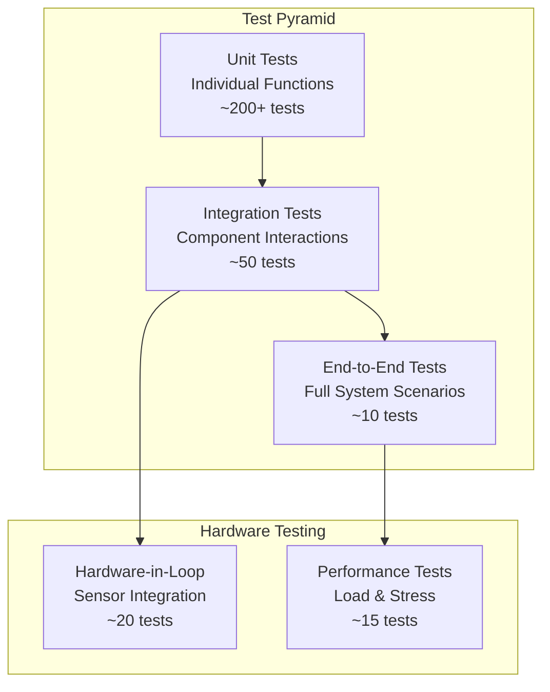

# Testing Strategy and Coverage Matrix

This document outlines the comprehensive testing approach for the multi-modal physiological sensing platform, including unit tests, integration tests, and hardware validation procedures.

## Table of Contents

1. [Testing Philosophy and Approach](#testing-philosophy-and-approach)
2. [Test Coverage Matrix](#test-coverage-matrix)
3. [Unit Testing Strategy](#unit-testing-strategy)
4. [Integration Testing](#integration-testing)
5. [Hardware-in-the-Loop Testing](#hardware-in-the-loop-testing)
6. [Performance and Load Testing](#performance-and-load-testing)
7. [Data Quality Validation](#data-quality-validation)

---

## Testing Philosophy and Approach

### Test Pyramid Structure



### Testing Principles

**Test-Driven Development (TDD):**
- Write tests before implementation for critical components
- Focus on API contracts and data transformations
- Maintain >80% code coverage for core modules

**Behavioral Testing:**
- Test what the code should do, not how it does it
- Use descriptive test names that explain the scenario
- Group tests by functional behavior, not code structure

**Reliability Focus:**
- Test error conditions and edge cases extensively  
- Validate data integrity throughout the pipeline
- Ensure graceful degradation under resource constraints

---

## Test Coverage Matrix

### Android Components Coverage

| Component | Unit Tests | Integration Tests | Hardware Tests | Coverage Target |
|-----------|------------|------------------|----------------|-----------------|
| **RecordingController** | State transitions, session lifecycle | Service integration | Multi-sensor coordination | 90% |
| **RgbCameraRecorder** | CameraX mocking, file operations | Preview streaming | Camera hardware validation | 85% |
| **ThermalRecorder** | Data processing, CSV formatting | USB-OTG integration | Topdon TC001 validation | 80% |
| **ShimmerRecorder** | BLE data parsing, calibration | Connection management | Shimmer3 device testing | 85% |
| **NetworkClient** | Protocol parsing, framing | TCP communication | Network resilience | 90% |
| **TimeManager** | Sync calculations, offset handling | UDP time protocol | Cross-device accuracy | 95% |
| **FileTransferManager** | ZIP creation, streaming | File upload integration | Large file handling | 85% |
| **PreviewBus** | Event emission, throttling | Service broadcasting | Frame rate validation | 80% |

### PC Controller Coverage

| Component | Unit Tests | Integration Tests | System Tests | Coverage Target |
|-----------|------------|------------------|--------------|-----------------|
| **SessionManager** | State machine, metadata | Device coordination | Multi-session handling | 90% |
| **NetworkController** | TCP server, device management | Multi-device communication | Scalability testing | 85% |
| **TimeSync Service** | NTP algorithm, accuracy | Network latency handling | Cross-platform sync | 95% |
| **DataAggregator** | File processing, validation | ZIP extraction, organization | Data integrity checks | 90% |
| **GUI Components** | Widget behavior, user actions | Real-time updates | User experience validation | 75% |
| **FileReceiver** | Stream processing, checksums | Concurrent uploads | Performance limits | 85% |

### Protocol and Communication

| Protocol Area | Unit Tests | Integration Tests | End-to-End Tests | Coverage Target |
|---------------|------------|------------------|------------------|-----------------|
| **Message Framing** | JSON parsing, length validation | Framing consistency | Cross-platform compatibility | 95% |
| **Command Processing** | Individual commands, responses | Command sequences | Full session workflows | 90% |
| **mDNS Discovery** | Service registration, parsing | Discovery timing | Multi-device scenarios | 80% |
| **Error Handling** | Error codes, recovery logic | Network interruption | Fault injection testing | 85% |
| **Data Transfer** | ZIP streaming, checksums | Large file handling | Performance benchmarks | 85% |

---

## Unit Testing Strategy

### Android Unit Tests (Robolectric)

**RecordingController Tests:**
```kotlin
@RunWith(RobolectricTestRunner::class)
class RecordingControllerTest {
    
    private lateinit var controller: RecordingController
    private lateinit var mockRecorder: SensorRecorder
    private lateinit var testSessionDir: File
    
    @Before
    fun setup() {
        testSessionDir = File.createTempFile("session", "test")
        testSessionDir.delete()
        testSessionDir.mkdirs()
        
        mockRecorder = mock()
        controller = RecordingController(null, testSessionDir.parentFile)
        controller.addRecorder("test", mockRecorder)
    }
    
    @Test
    fun `startSession should transition from IDLE to RECORDING`() = runTest {
        // Given: Controller in IDLE state
        assertEquals(RecordingController.State.IDLE, controller.state.value)
        
        // When: Starting a session
        controller.startSession("test_session_001")
        
        // Then: State should be RECORDING and session directory created
        assertEquals(RecordingController.State.RECORDING, controller.state.value)
        assertEquals("test_session_001", controller.currentSessionId.value)
        assertTrue(File(testSessionDir.parentFile, "test_session_001").exists())
        
        // And: Mock recorder should be started
        verify(mockRecorder).start(any())
    }
    
    @Test
    fun `startSession while RECORDING should be ignored`() = runTest {
        // Given: Controller already recording
        controller.startSession("session_001")
        assertEquals(RecordingController.State.RECORDING, controller.state.value)
        
        // When: Attempting to start another session
        controller.startSession("session_002")
        
        // Then: State and session ID should remain unchanged
        assertEquals(RecordingController.State.RECORDING, controller.state.value)
        assertEquals("session_001", controller.currentSessionId.value)
    }
    
    @Test
    fun `recorder failure should trigger safeStopAll`() = runTest {
        // Given: Mock recorder that will throw exception
        whenever(mockRecorder.start(any())).thenThrow(RuntimeException("Camera not available"))
        
        // When: Starting session with failing recorder
        assertThrows<RuntimeException> {
            controller.startSession("failing_session")
        }
        
        // Then: State should return to IDLE and session cleaned up
        assertEquals(RecordingController.State.IDLE, controller.state.value)
        assertNull(controller.currentSessionId.value)
        verify(mockRecorder).stop() // safeStopAll should be called
    }
}
```

**TimeManager Tests:**
```kotlin
class TimeManagerTest {
    
    @Test
    fun `sync_with_server should calculate correct offset`() {
        // Mock UDP communication
        val mockSocket = mock<DatagramSocket>()
        val serverTime = 1703856123456789012L
        val mockResponse = serverTime.toString().toByteArray()
        
        // Simulate network round-trip timing
        val t1 = System.nanoTime()
        val t2 = t1 + 5_000_000 // 5ms round trip
        
        // Calculate expected offset
        val expectedOffset = (serverTime + ((t2 - t1) / 2)) - t2
        
        // Test sync calculation (would need to mock System.nanoTime())
        // This is a conceptual test - actual implementation would use dependency injection
        val calculatedOffset = TimeManager.calculateOffset(serverTime, t1, t2)
        assertEquals(expectedOffset, calculatedOffset)
    }
    
    @Test
    fun `getSyncedTimestamp should apply offset correctly`() {
        // Given: Known offset
        TimeManager.setOffsetForTesting(1000000) // 1ms offset
        
        // When: Getting synced timestamp
        val baseTime = System.nanoTime()
        val syncedTime = TimeManager.getSyncedTimestamp()
        
        // Then: Offset should be applied
        assertTrue(syncedTime >= baseTime + 1000000 - 100000) // Allow 0.1ms tolerance
        assertTrue(syncedTime <= baseTime + 1000000 + 100000)
    }
}
```

### Protocol Message Tests

**Message Parsing Tests:**
```kotlin
class ProtocolMessageTest {
    
    @Test
    fun `parseFramedMessage should handle length-prefixed JSON`() {
        // Given: Length-prefixed message
        val jsonPayload = """{"v":1,"id":123,"type":"cmd","command":"test"}"""
        val framedMessage = "${jsonPayload.length}\n$jsonPayload"
        
        // When: Parsing message
        val parsed = MessageParser.parseFramedMessage(framedMessage.toByteArray())
        
        // Then: Should extract JSON correctly
        assertNotNull(parsed)
        assertEquals(1, parsed.v)
        assertEquals(123, parsed.id)
        assertEquals("cmd", parsed.type)
        assertEquals("test", (parsed as CommandMessage).command)
    }
    
    @Test
    fun `parseFramedMessage should handle legacy newline-delimited`() {
        // Given: Legacy newline-delimited message
        val jsonMessage = """{"id":456,"command":"legacy_test"}""" + "\n"
        
        // When: Parsing message
        val parsed = MessageParser.parseFramedMessage(jsonMessage.toByteArray())
        
        // Then: Should parse correctly with defaults
        assertNotNull(parsed)
        assertEquals(456, parsed.id)
        assertEquals("legacy_test", (parsed as CommandMessage).command)
    }
    
    @Test
    fun `parseFramedMessage should reject malformed messages`() {
        // Given: Various malformed messages
        val testCases = listOf(
            "invalid_length\n{}",  // Invalid length prefix
            "10\n{invalid_json}",  // Invalid JSON
            "5\n{\"too\":\"long\"}", // Length mismatch
            "",                    // Empty message
            "999999\n{\"id\":1}"   // Length too large
        )
        
        testCases.forEach { malformed ->
            // When/Then: Should return null for malformed messages
            val parsed = MessageParser.parseFramedMessage(malformed.toByteArray())
            assertNull(parsed, "Should reject: $malformed")
        }
    }
}
```

---

## Integration Testing

### Network Communication Tests

**TCP Connection Integration:**
```kotlin
@Test
fun `full command response cycle should work end-to-end`() = runTest {
    // Given: Mock Android service and PC client
    val androidServer = MockRecordingService()
    val pcClient = NetworkClient("localhost", androidServer.port)
    
    androidServer.start()
    
    try {
        // When: PC sends query_capabilities command
        val response = pcClient.sendCommand(
            CommandMessage(
                v = 1,
                id = 1,
                type = "cmd", 
                command = "query_capabilities"
            )
        )
        
        // Then: Should receive valid capabilities response
        assertNotNull(response)
        assertEquals("ack", response.type)
        assertEquals(1, response.ack_id)
        assertEquals("ok", response.status)
        assertNotNull(response.capabilities)
        
    } finally {
        androidServer.stop()
        pcClient.disconnect()
    }
}
```

### File Transfer Integration

```kotlin
@Test
fun `file transfer should preserve data integrity`() = runTest {
    // Given: Test session directory with sample data
    val sessionDir = createTestSessionWithData()
    val fileTransfer = FileTransferManager()
    val mockReceiver = MockFileReceiver()
    
    // When: Transferring session data
    fileTransfer.transferSessionToPC(
        sessionId = "test_session",
        pcIp = "localhost", 
        pcPort = mockReceiver.port
    )
    
    // Then: Received ZIP should contain all session files
    val receivedZip = mockReceiver.getReceivedFile()
    assertNotNull(receivedZip)
    
    // And: ZIP contents should match original session
    val extractedFiles = extractZipContents(receivedZip)
    verifySessionDataIntegrity(sessionDir, extractedFiles)
}

private fun verifySessionDataIntegrity(
    original: File, 
    extracted: Map<String, ByteArray>
) {
    // Check required files exist
    assertTrue(extracted.containsKey("rgb.csv"))
    assertTrue(extracted.containsKey("thermal.csv"))
    assertTrue(extracted.containsKey("gsr.csv"))
    
    // Verify file sizes and checksums
    val originalRgbCsv = File(original, "rgb.csv")
    val extractedRgbCsv = extracted["rgb.csv"]!!
    
    assertEquals(originalRgbCsv.length(), extractedRgbCsv.size.toLong())
    assertEquals(
        originalRgbCsv.readBytes().contentHashCode(),
        extractedRgbCsv.contentHashCode()
    )
}
```

---

## Hardware-in-the-Loop Testing

### Sensor Hardware Tests

**Camera Hardware Validation:**
```kotlin
@Test
fun `camera should capture frames at expected rate`() = runTest {
    // Given: Real camera hardware
    assumeTrue("Camera hardware required", isCameraAvailable())
    
    val recorder = RgbCameraRecorder(context, lifecycleOwner)
    val testSessionDir = createTempSessionDir()
    val frameCounter = AtomicInteger(0)
    
    // Monitor preview frames
    PreviewBus.frames.collect { frame ->
        frameCounter.incrementAndGet()
    }
    
    // When: Recording for 10 seconds
    recorder.start(testSessionDir)
    delay(10_000)
    recorder.stop()
    
    // Then: Should capture ~67 frames (6.67 Hz * 10 seconds)
    val capturedFrames = frameCounter.get()
    assertTrue(capturedFrames >= 60, "Too few frames: $capturedFrames")
    assertTrue(capturedFrames <= 75, "Too many frames: $capturedFrames")
    
    // And: CSV should have matching entries
    val csvFile = File(testSessionDir, "rgb.csv")
    val csvLines = csvFile.readLines().drop(1) // Skip header
    assertEquals(capturedFrames, csvLines.size)
}
```

**Time Sync Hardware Test:**
```kotlin
@Test
fun `time sync should achieve sub-5ms accuracy across devices`() = runTest {
    // Given: Multiple Android devices on same network
    val devices = discoverShimmerDevices()
    assumeTrue("Multiple devices required", devices.size >= 2)
    
    val syncResults = mutableListOf<TimeSyncResult>()
    
    // When: Performing time sync with each device
    devices.forEach { device ->
        val result = performTimeSyncTest(device)
        syncResults.add(result)
    }
    
    // Then: All devices should sync within 5ms of each other
    val maxOffset = syncResults.maxOf { abs(it.offsetNs) }
    val minOffset = syncResults.minOf { abs(it.offsetNs) }
    val spread = maxOffset - minOffset
    
    assertTrue(
        spread < 5_000_000, // 5ms in nanoseconds
        "Time sync spread too large: ${spread / 1_000_000.0}ms"
    )
}
```

### Thermal Camera Hardware Test

```kotlin
@Test
fun `thermal camera should provide stable temperature readings`() = runTest {
    // Given: Connected Topdon TC001
    assumeTrue("Thermal camera required", isThermalCameraConnected())
    
    val recorder = ThermalRecorder(context)
    val testSessionDir = createTempSessionDir()
    val temperatureReadings = mutableListOf<FloatArray>()
    
    // When: Recording thermal data for 30 seconds
    recorder.start(testSessionDir)
    
    // Collect temperature frames
    val job = launch {
        repeat(300) { // 30 seconds at 10 Hz
            delay(100)
            val frame = recorder.getLatestFrame()
            if (frame != null) {
                temperatureReadings.add(frame.temperatures)
            }
        }
    }
    
    job.join()
    recorder.stop()
    
    // Then: Should have stable ambient temperature readings
    val ambientTemps = temperatureReadings.map { frame ->
        frame.take(1000).average() // Sample 1000 pixels
    }
    
    val tempStdDev = calculateStandardDeviation(ambientTemps)
    assertTrue(
        tempStdDev < 2.0, // Less than 2°C standard deviation
        "Temperature readings too unstable: ${tempStdDev}°C std dev"
    )
}
```

---

## Performance and Load Testing

### Scalability Tests

```kotlin
@Test
fun `system should handle 8 concurrent devices`() = runTest {
    // Given: PC controller and 8 simulated Android devices
    val pcController = PCController()
    val mockDevices = (1..8).map { MockAndroidDevice("device_$it") }
    
    pcController.start()
    
    try {
        // When: All devices connect simultaneously
        val connections = mockDevices.map { device ->
            async { device.connectToPC(pcController.address) }
        }
        
        val connectionResults = connections.awaitAll()
        assertTrue(connectionResults.all { it }, "Not all devices connected")
        
        // And: Starting recording on all devices
        val sessionId = "multi_device_test_${System.currentTimeMillis()}"
        val startResults = mockDevices.map { device ->
            async { device.startRecording(sessionId) }
        }
        
        val allStarted = startResults.awaitAll().all { it }
        assertTrue(allStarted, "Not all devices started recording")
        
        // Then: System should maintain performance
        val performanceMetrics = pcController.getPerformanceMetrics()
        assertTrue(performanceMetrics.cpuUsage < 0.6, "CPU usage too high: ${performanceMetrics.cpuUsage}")
        assertTrue(performanceMetrics.memoryUsage < 800_000_000, "Memory usage too high: ${performanceMetrics.memoryUsage}")
        
        // And: All preview streams should be flowing
        val previewRates = mockDevices.map { device ->
            measurePreviewFrameRate(device, duration = 5.seconds)
        }
        
        assertTrue(previewRates.all { it > 5.0 }, "Preview frame rates too low: $previewRates")
        
    } finally {
        mockDevices.forEach { it.disconnect() }
        pcController.stop()
    }
}
```

### Memory Leak Tests

```kotlin
@Test
fun `repeated session cycles should not leak memory`() = runTest {
    // Given: System baseline memory
    System.gc()
    val baselineMemory = Runtime.getRuntime().totalMemory() - Runtime.getRuntime().freeMemory()
    
    val controller = RecordingController(context)
    
    // When: Running 50 recording cycles
    repeat(50) { cycle ->
        val sessionId = "leak_test_${cycle}"
        val sessionDir = createTempSessionDir(sessionId)
        
        controller.startSession(sessionId)
        delay(1000) // Record for 1 second
        controller.stopSession()
        
        // Clean up session directory
        sessionDir.deleteRecursively()
        
        // Force garbage collection every 10 cycles
        if (cycle % 10 == 0) {
            System.gc()
        }
    }
    
    // Then: Memory usage should not increase significantly
    System.gc()
    val finalMemory = Runtime.getRuntime().totalMemory() - Runtime.getRuntime().freeMemory()
    val memoryIncrease = finalMemory - baselineMemory
    
    assertTrue(
        memoryIncrease < 50_000_000, // Less than 50MB increase
        "Memory leak detected: ${memoryIncrease / 1_000_000}MB increase"
    )
}
```

---

## Data Quality Validation

### CSV Format Validation

```kotlin
@Test
fun `generated CSV files should conform to schema specifications`() = runTest {
    // Given: Complete recording session
    val sessionId = "validation_test"
    val sessionDir = createTestSession(sessionId, duration = 30.seconds)
    
    // When: Validating generated CSV files
    val validators = mapOf(
        "rgb.csv" to RgbCsvValidator(),
        "thermal.csv" to ThermalCsvValidator(), 
        "gsr.csv" to GsrCsvValidator()
    )
    
    validators.forEach { (filename, validator) ->
        val csvFile = File(sessionDir, filename)
        assertTrue(csvFile.exists(), "CSV file missing: $filename")
        
        // Then: Each CSV should pass validation
        val validationResult = validator.validate(csvFile)
        assertTrue(
            validationResult.isValid,
            "CSV validation failed for $filename: ${validationResult.errors}"
        )
        
        // And: Should have expected number of rows
        val expectedRows = calculateExpectedRows(filename, 30.seconds)
        val actualRows = validationResult.rowCount
        val rowTolerance = (expectedRows * 0.05).toInt() // 5% tolerance
        
        assertTrue(
            actualRows >= expectedRows - rowTolerance,
            "Too few rows in $filename: $actualRows < ${expectedRows - rowTolerance}"
        )
        assertTrue(
            actualRows <= expectedRows + rowTolerance,
            "Too many rows in $filename: $actualRows > ${expectedRows + rowTolerance}"
        )
    }
}

private fun calculateExpectedRows(filename: String, duration: Duration): Int {
    return when (filename) {
        "rgb.csv" -> (duration.inWholeMilliseconds / 150).toInt() // 150ms intervals
        "thermal.csv" -> (duration.inWholeSeconds * 10).toInt() // 10 Hz
        "gsr.csv" -> (duration.inWholeSeconds * 128).toInt() // 128 Hz
        else -> 0
    }
}
```

### Time Synchronization Validation

```kotlin
@Test
fun `cross-device timestamps should be synchronized within tolerance`() = runTest {
    // Given: Multi-device recording session with flash sync events
    val devices = listOf("device_1", "device_2", "device_3")
    val sessionId = "sync_validation_test"
    
    // When: Analyzing flash sync events from all devices
    val flashEvents = devices.map { deviceId ->
        parseFlashSyncEvents(getSessionFile(deviceId, sessionId, "flash_sync_events.csv"))
    }
    
    // Then: Corresponding flash events should have similar timestamps
    val syncedEvents = correlateFlashEvents(flashEvents)
    
    syncedEvents.forEach { eventGroup ->
        val timestamps = eventGroup.map { it.timestamp_ns }
        val minTime = timestamps.minOrNull() ?: 0L
        val maxTime = timestamps.maxOrNull() ?: 0L
        val spread = maxTime - minTime
        
        assertTrue(
            spread < 5_000_000, // 5ms tolerance
            "Flash sync spread too large: ${spread / 1_000_000.0}ms"
        )
    }
}
```

This comprehensive testing strategy ensures robust validation of the multi-modal sensing platform across all integration points, hardware interfaces, and data quality requirements.