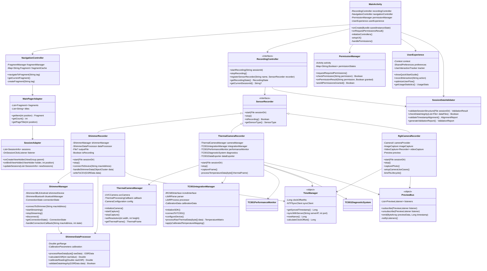

```mermaid
classDiagram
    %% Core Activity and UI
    class MainActivity {
        -RecordingController recordingController
        -NavigationController navigationController
        -PermissionManager permissionManager
        -UserExperience userExperience
        
        +onCreate(Bundle savedInstanceState)
        +onRequestPermissionsResult()
        -initializeControllers()
        -setupUI()
        -handlePermissions()
    }
    
    %% Navigation and Adapters
    class NavigationController {
        -FragmentManager fragmentManager
        -Map~String,Fragment~ fragmentCache
        
        +navigateToFragment(String tag)
        +getCurrentFragment()
        -createFragment(String tag)
    }
    
    class MainPagerAdapter {
        -List~Fragment~ fragments
        -List~String~ titles
        
        +getItem(int position) Fragment
        +getCount() int
        +getPageTitle(int position)
    }
    
    class SessionAdapter {
        -List~SessionInfo~ sessions
        -OnSessionClickListener listener
        
        +onCreateViewHolder(ViewGroup parent)
        +onBindViewHolder(ViewHolder holder, int position)
        +updateSessions(List~SessionInfo~ newSessions)
    }

    %% Core Recording System
    class RecordingController {
        <<interface>>
        +startRecording(String sessionId)
        +stopRecording()
        +registerSensorRecorder(String name, SensorRecorder recorder)
        +getRecordingState() RecordingState
        +getCurrentSessionId() String?
    }

    %% Sensor Interface and Implementations
    class SensorRecorder {
        <<interface>>
        +start(File sessionDir)
        +stop()
        +isRecording() Boolean
        +getSensorType() SensorType
    }

    %% GSR Sensor Implementation
    class ShimmerRecorder {
        -ShimmerManager shimmerManager
        -ShimmerDataProcessor dataProcessor
        -File? outputFile
        -Boolean isRecording
        
        +start(File sessionDir)
        +stop()
        +connectToDevice(String macAddress)
        -handleShimmerData(ObjectCluster data)
        -writeToCSV(GSRData data)
    }

    class ShimmerManager {
        -Shimmer3BLEAndroid shimmerDevice
        -ShimmerBluetooth bluetoothManager
        -ConnectionState connectionState
        
        +connectToShimmer(String macAddress)
        +startStreaming()
        +stopStreaming()
        +disconnect()
        +getConnectionState() ConnectionState
        -handleConnectionCallback(String macAddress, int state)
    }

    class ShimmerDataProcessor {
        -Double gsrRange
        -CalibrationParameters calibration
        
        +processRawData(byte[] rawData) GSRData
        +calculateGSR(int rawValue) Double
        +calibrateReading(Double rawGSR) Double
        -validateDataIntegrity(GSRData data) Boolean
    }

    %% Thermal Camera Implementation  
    class ThermalCameraRecorder {
        -ThermalCameraManager cameraManager
        -TC001IntegrationManager integrationManager
        -TC001PerformanceMonitor performanceMonitor
        -TC001DiagnosticSystem diagnostics
        -TC001DataExporter dataExporter
        
        +start(File sessionDir)
        +stop()
        +captureFrame()
        -processTemperatureData(byte[] thermalFrame)
    }

    class ThermalCameraManager {
        -UVCCamera uvcCamera
        -ThermalProcessingCallback callback
        -CameraConfiguration config
        
        +initializeCamera()
        +startCapture()
        +stopCapture()
        +setResolution(int width, int height)
        +getThermalFrame() ThermalFrame
    }

    class TC001IntegrationManager {
        -IRCMDInterface ircmdInterface
        -LibIRParse parser
        -LibIRProcess processor
        -CalibrationData calibrationData
        
        +initializeSDK()
        +connectToTC001()
        +configureDevice()
        +processRawThermalData(byte[] data) TemperatureMatrix
        +applyCalibratedTemperatureMapping()
    }

    %% RGB Camera Implementation
    class RgbCameraRecorder {
        -CameraX cameraProvider
        -ImageCapture imageCapture
        -VideoCapture~Recorder~ videoCapture
        -Preview preview
        
        +start(File sessionDir)
        +stop()
        +capturePhoto()
        -setupCameraUseCases()
        -bindToLifecycle()
    }

    %% Utility Classes
    class TimeManager {
        <<object>>
        -Long clockOffsetNs
        -NTPSyncClient syncClient
        
        +getSyncedTimestamp() Long
        +syncWithServer(String serverIP, int port)
        +nowNanos() Long
        -calculateClockOffset() Long
    }

    class PreviewBus {
        <<object>>
        -List~PreviewListener~ listeners
        
        +subscribe(PreviewListener listener)
        +unsubscribe(PreviewListener listener)
        +emit(ByteArray previewData, Long timestamp)
        -notifyListeners()
    }

    class PermissionManager {
        -Activity activity
        -Map~String,Boolean~ permissionStates
        
        +requestRequiredPermissions()
        +checkPermission(String permission) Boolean
        +onPermissionResult(String permission, Boolean granted)
        +areAllPermissionsGranted() Boolean
    }

    class SessionDataValidator {
        +validateSessionStructure(File sessionDir) ValidationResult
        +checkDataIntegrity(List~File~ dataFiles) Boolean
        +validateTimestampAlignment() AlignmentReport
        +generateValidationReport() ValidationReport
    }

    class UserExperience {
        -Context context
        -SharedPreferences preferences
        -UserInteractionTracker tracker
        
        +showQuickStartGuide()
        +recordInteraction(String action)
        +optimizeUserFlow()
        +getUsageStatistics() UsageStats
    }

    %% Relationships
    MainActivity --> NavigationController
    MainActivity --> RecordingController
    MainActivity --> PermissionManager
    MainActivity --> UserExperience
    
    NavigationController --> MainPagerAdapter
    MainPagerAdapter --> SessionAdapter
    
    RecordingController --> SensorRecorder
    SensorRecorder <|-- ShimmerRecorder
    SensorRecorder <|-- ThermalCameraRecorder
    SensorRecorder <|-- RgbCameraRecorder
    
    ShimmerRecorder --> ShimmerManager
    ShimmerRecorder --> ShimmerDataProcessor
    ShimmerManager --> ShimmerDataProcessor
    
    ThermalCameraRecorder --> ThermalCameraManager
    ThermalCameraRecorder --> TC001IntegrationManager
    ThermalCameraRecorder --> TC001PerformanceMonitor
    ThermalCameraRecorder --> TC001DiagnosticSystem
    
    RgbCameraRecorder --> TimeManager
    ShimmerRecorder --> TimeManager
    ThermalCameraRecorder --> TimeManager
    
    RgbCameraRecorder --> PreviewBus
    ThermalCameraRecorder --> PreviewBus
    
    MainActivity --> SessionDataValidator
    RecordingController --> SessionDataValidator
```