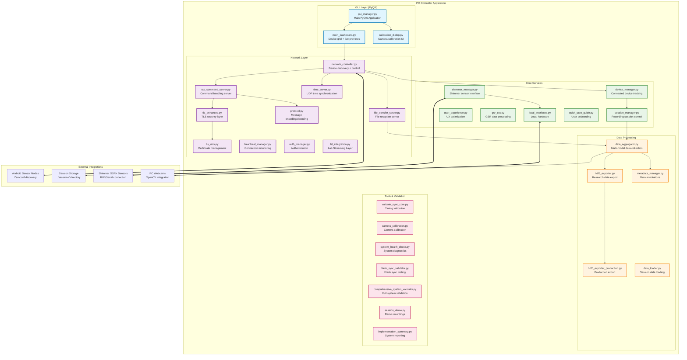

```mermaid
graph TB
    subgraph "PC Controller Application"
        subgraph "GUI Layer (PyQt6)"
            MainWindow["gui_manager.py<br/>Main PyQt6 Application"]
            Dashboard["main_dashboard.py<br/>Device grid + live previews"]
            CalibrationDialog["calibration_dialog.py<br/>Camera calibration UI"]
        end

        subgraph "Network Layer"
            NetworkController["network_controller.py<br/>Device discovery + control"]
            TCPCommandServer["tcp_command_server.py<br/>Command handling server"]
            FileTransferServer["file_transfer_server.py<br/>File reception server"]
            TimeServer["time_server.py<br/>UDP time synchronization"]
            Protocol["protocol.py<br/>Message encoding/decoding"]
            TLSEnhanced["tls_enhanced.py<br/>TLS security layer"]
            TLSUtils["tls_utils.py<br/>Certificate management"]
            HeartbeatManager["heartbeat_manager.py<br/>Connection monitoring"]
            AuthManager["auth_manager.py<br/>Authentication"]
            LSLIntegration["lsl_integration.py<br/>Lab Streaming Layer"]
        end

        subgraph "Core Services"
            DeviceManager["device_manager.py<br/>Connected device tracking"]
            SessionManager["session_manager.py<br/>Recording session control"]
            ShimmerManager["shimmer_manager.py<br/>Shimmer sensor interface"]
            UserExperience["user_experience.py<br/>UX optimization"]
            GSRProcessor["gsr_csv.py<br/>GSR data processing"]
            LocalInterfaces["local_interfaces.py<br/>Local hardware"]
            QuickStartGuide["quick_start_guide.py<br/>User onboarding"]
        end

        subgraph "Data Processing"
            DataAggregator["data_aggregator.py<br/>Multi-modal data collection"]
            HDF5Exporter["hdf5_exporter.py<br/>Research data export"]
            HDF5ExporterProduction["hdf5_exporter_production.py<br/>Production export"]
            DataLoader["data_loader.py<br/>Session data loading"]
            MetadataManager["metadata_manager.py<br/>Data annotations"]
        end

        subgraph "Tools & Validation"
            ValidateSyncCore["validate_sync_core.py<br/>Timing validation"]
            CameraCalibration["camera_calibration.py<br/>Camera calibration"]
            SystemHealthCheck["system_health_check.py<br/>System diagnostics"]
            FlashSyncValidator["flash_sync_validator.py<br/>Flash sync testing"]
            ComprehensiveValidator["comprehensive_system_validator.py<br/>Full system validation"]
            SessionDemo["session_demo.py<br/>Demo recordings"]
            ImplementationSummary["implementation_summary.py<br/>System reporting"]
        end
    end

    subgraph "External Integrations"
        AndroidDevices["Android Sensor Nodes<br/>Zeroconf discovery"]
        FileSystem["Session Storage<br/>./sessions/ directory"]
        ShimmerHardware["Shimmer GSR+ Sensors<br/>BLE/Serial connection"]
        LocalCameras["PC Webcams<br/>OpenCV integration"]
    end

    %% Connections
    MainWindow --> Dashboard
    MainWindow --> CalibrationDialog
    Dashboard --> NetworkController
    
    NetworkController --> TCPCommandServer
    NetworkController --> FileTransferServer
    NetworkController --> TimeServer
    NetworkController --> DeviceManager
    
    TCPCommandServer --> Protocol
    TCPCommandServer --> TLSEnhanced
    TLSEnhanced --> TLSUtils
    FileTransferServer --> DataAggregator
    
    DeviceManager --> SessionManager
    SessionManager --> DataAggregator
    ShimmerManager --> LocalInterfaces
    
    DataAggregator --> HDF5Exporter
    DataAggregator --> MetadataManager
    HDF5Exporter --> HDF5ExporterProduction
    
    NetworkController <==> AndroidDevices
    DataAggregator --> FileSystem
    ShimmerManager <==> ShimmerHardware
    LocalInterfaces <==> LocalCameras
    
    %% Styling
    classDef guiLayer fill:#e1f5fe,stroke:#0277bd,stroke-width:2px
    classDef networkLayer fill:#f3e5f5,stroke:#7b1fa2,stroke-width:2px
    classDef coreServices fill:#e8f5e8,stroke:#388e3c,stroke-width:2px
    classDef dataProcessing fill:#fff3e0,stroke:#f57c00,stroke-width:2px
    classDef validation fill:#fce4ec,stroke:#c2185b,stroke-width:2px
    
    class MainWindow,Dashboard,CalibrationDialog guiLayer
    class NetworkController,TCPCommandServer,FileTransferServer,TimeServer,Protocol,TLSEnhanced,TLSUtils,HeartbeatManager,AuthManager,LSLIntegration networkLayer
    class DeviceManager,SessionManager,ShimmerManager,UserExperience,GSRProcessor,LocalInterfaces,QuickStartGuide coreServices
    class DataAggregator,HDF5Exporter,HDF5ExporterProduction,DataLoader,MetadataManager dataProcessing
    class ValidateSyncCore,CameraCalibration,SystemHealthCheck,FlashSyncValidator,ComprehensiveValidator,SessionDemo,ImplementationSummary validation
```