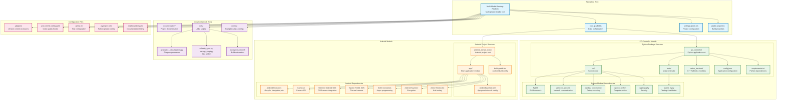

```mermaid
graph TB
    subgraph "Repository Root"
        ROOT["Multi-Modal-Sensing-Platform<br/>Multi-project Gradle root"]
        BUILD_SYSTEM["build.gradle.kts<br/>Build orchestration"]
        SETTINGS["settings.gradle.kts<br/>Project configuration"]
        GRADLE_PROPS["gradle.properties<br/>Build properties"]
    end

    subgraph "PC Controller Module"
        subgraph "Python Package Structure"
            PC_ROOT["pc_controller/<br/>Python application root"]
            PC_SRC["src/<br/>Source code"]
            PC_TESTS["tests/<br/>pytest test suite"]
            PC_NATIVE["native_backend/<br/>C++ PyBind11 modules"]
            PC_CONFIG["config.json<br/>Application configuration"]
            PC_REQUIREMENTS["requirements.txt<br/>Python dependencies"]
        end

        subgraph "Python Module Dependencies"
            PC_GUI["PyQt6<br/>GUI framework"]
            PC_NETWORK["zeroconf, sockets<br/>Network communication"]
            PC_DATA["pandas, h5py, numpy<br/>Data processing"]
            PC_VISION["opencv-python<br/>Computer vision"]
            PC_CRYPTO["cryptography<br/>Security"]
            PC_TESTING["pytest, mypy<br/>Testing & validation"]
        end
    end

    subgraph "Android Module"
        subgraph "Android Project Structure"
            AND_ROOT["android_sensor_node/<br/>Android project root"]
            AND_APP["app/<br/>Main application module"]
            AND_GRADLE["build.gradle.kts<br/>Android build config"]
            AND_MANIFEST["AndroidManifest.xml<br/>App permissions & config"]
        end

        subgraph "Android Dependencies"
            AND_ANDROIDX["AndroidX Libraries<br/>Lifecycle, Navigation, etc."]
            AND_CAMERAX["CameraX<br/>Camera API"]
            AND_SHIMMER["Shimmer Android SDK<br/>GSR sensor integration"]
            AND_TOPDON["Topdon TC001 SDK<br/>Thermal camera"]
            AND_KOTLIN["Kotlin Coroutines<br/>Async programming"]
            AND_CRYPTO_AND["Android Keystore<br/>Encryption"]
            AND_TESTING["JUnit, Robolectric<br/>Unit testing"]
        end
    end

    subgraph "Documentation & Tools"
        DOCS["documentation/<br/>Project documentation"]
        TOOLS["tools/<br/>Utility scripts"]
        MERMAID_GEN["generate_*_visualizations.py<br/>Diagram generators"]
        DATA_TOOLS["validate_sync.py, backup_script.py<br/>Data utilities"]
        BUILD_TOOLS["build_production.sh<br/>Build automation"]
        DEMOS["demos/<br/>Example data & configs"]
    end

    subgraph "Configuration Files"
        GITIGNORE[".gitignore<br/>Version control exclusions"]
        PRECOMMIT[".pre-commit-config.yaml<br/>Code quality hooks"]
        PYTEST_INI["pytest.ini<br/>Test configuration"]
        PYPROJECT["pyproject.toml<br/>Python project config"]
        MARKDOWN_LINT[".markdownlint.yaml<br/>Documentation linting"]
    end

    %% Root dependencies
    ROOT --> BUILD_SYSTEM
    ROOT --> SETTINGS
    ROOT --> GRADLE_PROPS
    BUILD_SYSTEM --> PC_ROOT
    BUILD_SYSTEM --> AND_ROOT

    %% PC Controller dependencies  
    PC_ROOT --> PC_SRC
    PC_ROOT --> PC_TESTS
    PC_ROOT --> PC_NATIVE
    PC_ROOT --> PC_CONFIG
    PC_ROOT --> PC_REQUIREMENTS

    PC_SRC --> PC_GUI
    PC_SRC --> PC_NETWORK
    PC_SRC --> PC_DATA
    PC_SRC --> PC_VISION
    PC_SRC --> PC_CRYPTO
    PC_TESTS --> PC_TESTING

    %% Android dependencies
    AND_ROOT --> AND_APP
    AND_ROOT --> AND_GRADLE
    AND_APP --> AND_MANIFEST

    AND_APP --> AND_ANDROIDX
    AND_APP --> AND_CAMERAX
    AND_APP --> AND_SHIMMER
    AND_APP --> AND_TOPDON
    AND_APP --> AND_KOTLIN
    AND_APP --> AND_CRYPTO_AND
    AND_APP --> AND_TESTING

    %% Tools and documentation
    ROOT --> DOCS
    ROOT --> TOOLS
    ROOT --> DEMOS
    
    TOOLS --> MERMAID_GEN
    TOOLS --> DATA_TOOLS
    TOOLS --> BUILD_TOOLS

    ROOT --> GITIGNORE
    ROOT --> PRECOMMIT
    ROOT --> PYTEST_INI
    ROOT --> PYPROJECT
    ROOT --> MARKDOWN_LINT

    %% Styling
    classDef rootModule fill:#e1f5fe,stroke:#0277bd,stroke-width:3px
    classDef pythonModule fill:#e8f5e8,stroke:#2e7d32,stroke-width:2px
    classDef androidModule fill:#fff3e0,stroke:#ef6c00,stroke-width:2px
    classDef toolsModule fill:#f3e5f5,stroke:#7b1fa2,stroke-width:2px
    classDef configModule fill:#fce4ec,stroke:#c2185b,stroke-width:2px

    class ROOT,BUILD_SYSTEM,SETTINGS,GRADLE_PROPS rootModule
    class PC_ROOT,PC_SRC,PC_TESTS,PC_NATIVE,PC_CONFIG,PC_REQUIREMENTS,PC_GUI,PC_NETWORK,PC_DATA,PC_VISION,PC_CRYPTO,PC_TESTING pythonModule
    class AND_ROOT,AND_APP,AND_GRADLE,AND_MANIFEST,AND_ANDROIDX,AND_CAMERAX,AND_SHIMMER,AND_TOPDON,AND_KOTLIN,AND_CRYPTO_AND,AND_TESTING androidModule
    class DOCS,TOOLS,MERMAID_GEN,DATA_TOOLS,BUILD_TOOLS,DEMOS toolsModule
    class GITIGNORE,PRECOMMIT,PYTEST_INI,PYPROJECT,MARKDOWN_LINT configModule
```