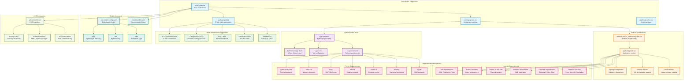

```mermaid
graph TB
    subgraph "Root Build Configuration"
        ROOT_GRADLE[build.gradle.kts<br/>Root orchestrator]
        SETTINGS_GRADLE[settings.gradle.kts<br/>Multi-project settings]
        GRADLE_PROPS[gradle.properties<br/>JVM & build optimization]
        GRADLE_WRAPPER[gradlew/gradlew.bat<br/>Gradle wrapper]
    end

    subgraph "Build Performance Optimization"
        JVM_OPTS[JVM Memory<br/>6GB heap, G1GC]
        PARALLEL_BUILD[Parallel Execution<br/>All CPU cores]
        BUILD_CACHE[Build Cache<br/>Incremental builds]
        CONFIG_CACHE[Configuration Cache<br/>Problem warnings enabled]
        HTTP_POOL[HTTP Connection Pool<br/>10 max connections]
    end

    subgraph "Android Module Build"
        AND_BUILD[android_sensor_node/build.gradle.kts<br/>Android project config]
        APP_BUILD[app/build.gradle.kts<br/>Application module]
        BUILD_VARIANTS[Build Variants<br/>debug, release, staging]
        FLAVORS[Product Flavors<br/>full, lite hardware support]
        SIGNING_CONFIG[Signing Configuration<br/>Debug & release keys]
    end

    subgraph "Python Module Build"
        PYPROJECT[pyproject.toml<br/>Python project config]
        REQUIREMENTS[requirements.txt<br/>Python dependencies]
        PYTEST_CONFIG[pytest.ini<br/>Test configuration]
        PYTHON_BUILD[Python Package Build<br/>Wheel & source dist]
    end

    subgraph "Dependencies Management"
        subgraph "Android Dependencies"
            ANDROIDX[AndroidX Libraries<br/>Core, Lifecycle, Navigation]
            CAMERAX_DEP[CameraX Dependencies<br/>Camera2, Video, Core]
            SHIMMER_SDK[Shimmer Android SDK<br/>BLE integration]
            TOPDON_SDK[Topdon TC001 SDK<br/>Thermal camera]
            KOTLIN_COROUTINES[Kotlin Coroutines<br/>Async programming]
            TEST_DEPS[Test Dependencies<br/>JUnit, Robolectric, Truth]
        end

        subgraph "Python Dependencies"
            PYQT6[PyQt6<br/>GUI framework]
            NUMPY[NumPy<br/>Numerical computing]
            OPENCV[OpenCV<br/>Computer vision]
            PANDAS[Pandas<br/>Data processing]
            HDF5[h5py<br/>HDF5 file format]
            ZEROCONF[zeroconf<br/>Network discovery]
            PYTEST_DEPS[pytest ecosystem<br/>Testing framework]
        end
    end

    subgraph "Quality Assurance"
        LINT_CONFIG[.markdownlint.yaml<br/>Documentation linting]
        PRECOMMIT[.pre-commit-config.yaml<br/>Code quality hooks]
        KTLINT[ktlint<br/>Kotlin code style]
        RUFF[ruff<br/>Python linting]
        MYPY[mypy<br/>Python type checking]
    end

    subgraph "CI/CD Integration"
        GITHUB_ACTIONS[.github/workflows/<br/>CI/CD pipelines]
        BUILD_AUTOMATION[Automated builds<br/>Multi-platform testing]
        ARTIFACT_PUBLISH[Artifact Publishing<br/>APK & Python packages]
        QUALITY_GATES[Quality Gates<br/>Coverage & security]
    end

    %% Root connections
    ROOT_GRADLE --> SETTINGS_GRADLE
    ROOT_GRADLE --> GRADLE_PROPS
    SETTINGS_GRADLE --> AND_BUILD
    SETTINGS_GRADLE --> PYPROJECT

    %% Performance optimization
    GRADLE_PROPS --> JVM_OPTS
    GRADLE_PROPS --> PARALLEL_BUILD
    GRADLE_PROPS --> BUILD_CACHE
    GRADLE_PROPS --> CONFIG_CACHE
    GRADLE_PROPS --> HTTP_POOL

    %% Android build chain
    AND_BUILD --> APP_BUILD
    APP_BUILD --> BUILD_VARIANTS
    APP_BUILD --> FLAVORS
    APP_BUILD --> SIGNING_CONFIG

    APP_BUILD --> ANDROIDX
    APP_BUILD --> CAMERAX_DEP
    APP_BUILD --> SHIMMER_SDK
    APP_BUILD --> TOPDON_SDK
    APP_BUILD --> KOTLIN_COROUTINES
    APP_BUILD --> TEST_DEPS

    %% Python build chain
    PYPROJECT --> REQUIREMENTS
    PYPROJECT --> PYTEST_CONFIG
    PYPROJECT --> PYTHON_BUILD

    REQUIREMENTS --> PYQT6
    REQUIREMENTS --> NUMPY
    REQUIREMENTS --> OPENCV
    REQUIREMENTS --> PANDAS
    REQUIREMENTS --> HDF5
    REQUIREMENTS --> ZEROCONF
    REQUIREMENTS --> PYTEST_DEPS

    %% Quality assurance
    ROOT_GRADLE --> LINT_CONFIG
    ROOT_GRADLE --> PRECOMMIT
    PRECOMMIT --> KTLINT
    PRECOMMIT --> RUFF
    PRECOMMIT --> MYPY

    %% CI/CD integration
    ROOT_GRADLE --> GITHUB_ACTIONS
    GITHUB_ACTIONS --> BUILD_AUTOMATION
    GITHUB_ACTIONS --> ARTIFACT_PUBLISH
    GITHUB_ACTIONS --> QUALITY_GATES

    %% Styling
    classDef rootConfig fill:#e1f5fe,stroke:#0277bd,stroke-width:2px
    classDef performance fill:#e8f5e8,stroke:#2e7d32,stroke-width:2px
    classDef androidBuild fill:#fff3e0,stroke:#ef6c00,stroke-width:2px
    classDef pythonBuild fill:#f3e5f5,stroke:#7b1fa2,stroke-width:2px
    classDef dependencies fill:#fce4ec,stroke:#c2185b,stroke-width:2px
    classDef quality fill:#e0f2f1,stroke:#00695c,stroke-width:2px
    classDef cicd fill:#f1f8e9,stroke:#33691e,stroke-width:2px

    class ROOT_GRADLE,SETTINGS_GRADLE,GRADLE_PROPS,GRADLE_WRAPPER rootConfig
    class JVM_OPTS,PARALLEL_BUILD,BUILD_CACHE,CONFIG_CACHE,HTTP_POOL performance
    class AND_BUILD,APP_BUILD,BUILD_VARIANTS,FLAVORS,SIGNING_CONFIG androidBuild
    class PYPROJECT,REQUIREMENTS,PYTEST_CONFIG,PYTHON_BUILD pythonBuild
    class ANDROIDX,CAMERAX_DEP,SHIMMER_SDK,TOPDON_SDK,KOTLIN_COROUTINES,TEST_DEPS,PYQT6,NUMPY,OPENCV,PANDAS,HDF5,ZEROCONF,PYTEST_DEPS dependencies
    class LINT_CONFIG,PRECOMMIT,KTLINT,RUFF,MYPY quality
    class GITHUB_ACTIONS,BUILD_AUTOMATION,ARTIFACT_PUBLISH,QUALITY_GATES cicd
```