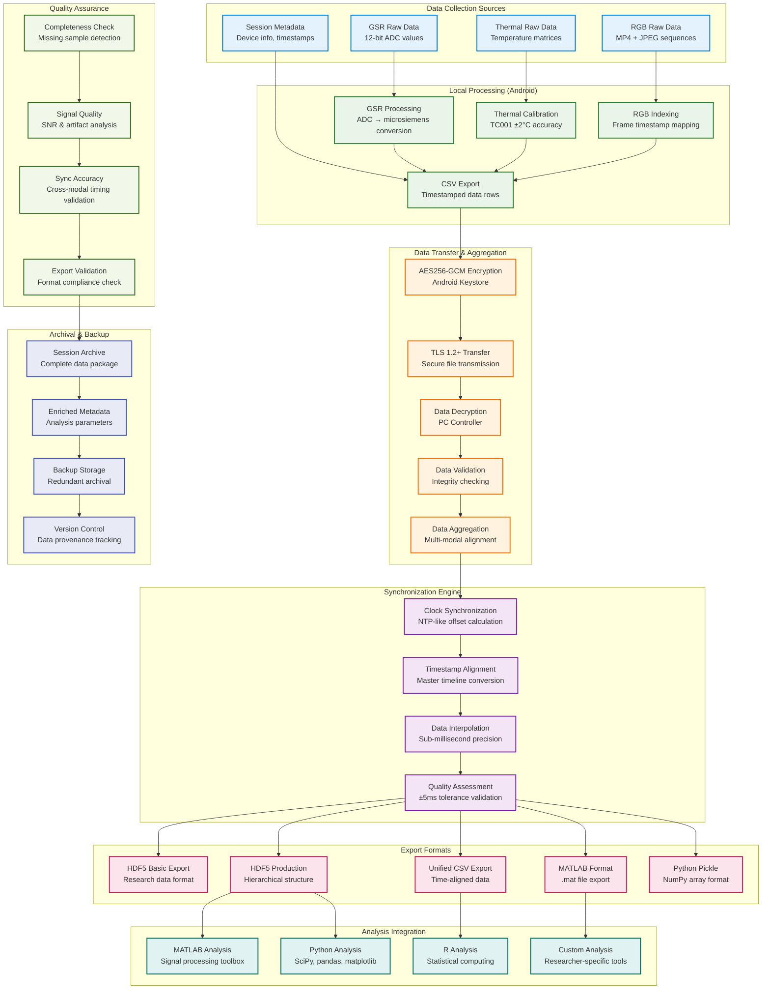

```mermaid
flowchart TB
    subgraph "Data Collection Sources"
        GSR_RAW[GSR Raw Data<br/>12-bit ADC values]
        THERMAL_RAW[Thermal Raw Data<br/>Temperature matrices]
        RGB_RAW[RGB Raw Data<br/>MP4 + JPEG sequences]
        METADATA[Session Metadata<br/>Device info, timestamps]
    end

    subgraph "Local Processing (Android)"
        GSR_PROC[GSR Processing<br/>ADC → microsiemens conversion]
        THERMAL_CALIB[Thermal Calibration<br/>TC001 ±2°C accuracy]
        RGB_INDEX[RGB Indexing<br/>Frame timestamp mapping]
        CSV_EXPORT[CSV Export<br/>Timestamped data rows]
    end

    subgraph "Data Transfer & Aggregation"
        ENCRYPTION[AES256-GCM Encryption<br/>Android Keystore]
        TLS_TRANSFER[TLS 1.2+ Transfer<br/>Secure file transmission]
        DECRYPTION[Data Decryption<br/>PC Controller]
        VALIDATION[Data Validation<br/>Integrity checking]
        AGGREGATION[Data Aggregation<br/>Multi-modal alignment]
    end

    subgraph "Synchronization Engine"
        CLOCK_SYNC[Clock Synchronization<br/>NTP-like offset calculation]
        TIMESTAMP_ALIGN[Timestamp Alignment<br/>Master timeline conversion]
        INTERPOLATION[Data Interpolation<br/>Sub-millisecond precision]
        QUALITY_CHECK[Quality Assessment<br/>±5ms tolerance validation]
    end

    subgraph "Export Formats"
        HDF5_BASIC[HDF5 Basic Export<br/>Research data format]
        HDF5_PRODUCTION[HDF5 Production<br/>Hierarchical structure]
        CSV_UNIFIED[Unified CSV Export<br/>Time-aligned data]
        MATLAB_FORMAT[MATLAB Format<br/>.mat file export]
        PYTHON_PICKLE[Python Pickle<br/>NumPy array format]
    end

    subgraph "Analysis Integration"
        MATLAB_ANALYSIS[MATLAB Analysis<br/>Signal processing toolbox]
        PYTHON_ANALYSIS[Python Analysis<br/>SciPy, pandas, matplotlib]
        R_ANALYSIS[R Analysis<br/>Statistical computing]
        CUSTOM_TOOLS[Custom Analysis<br/>Researcher-specific tools]
    end

    subgraph "Quality Assurance"
        DATA_COMPLETENESS[Completeness Check<br/>Missing sample detection]
        SIGNAL_QUALITY[Signal Quality<br/>SNR & artifact analysis]
        SYNC_ACCURACY[Sync Accuracy<br/>Cross-modal timing validation]
        EXPORT_VALIDATION[Export Validation<br/>Format compliance check]
    end

    subgraph "Archival & Backup"
        SESSION_ARCHIVE[Session Archive<br/>Complete data package]
        METADATA_ENRICHED[Enriched Metadata<br/>Analysis parameters]
        BACKUP_STORAGE[Backup Storage<br/>Redundant archival]
        VERSION_CONTROL[Version Control<br/>Data provenance tracking]
    end

    %% Data flow connections
    GSR_RAW --> GSR_PROC
    THERMAL_RAW --> THERMAL_CALIB
    RGB_RAW --> RGB_INDEX
    METADATA --> CSV_EXPORT

    GSR_PROC --> CSV_EXPORT
    THERMAL_CALIB --> CSV_EXPORT
    RGB_INDEX --> CSV_EXPORT

    CSV_EXPORT --> ENCRYPTION
    ENCRYPTION --> TLS_TRANSFER
    TLS_TRANSFER --> DECRYPTION
    DECRYPTION --> VALIDATION
    VALIDATION --> AGGREGATION

    CLOCK_SYNC --> TIMESTAMP_ALIGN
    TIMESTAMP_ALIGN --> INTERPOLATION
    INTERPOLATION --> QUALITY_CHECK
    AGGREGATION --> CLOCK_SYNC

    QUALITY_CHECK --> HDF5_BASIC
    QUALITY_CHECK --> HDF5_PRODUCTION
    QUALITY_CHECK --> CSV_UNIFIED
    QUALITY_CHECK --> MATLAB_FORMAT
    QUALITY_CHECK --> PYTHON_PICKLE

    HDF5_PRODUCTION --> MATLAB_ANALYSIS
    HDF5_PRODUCTION --> PYTHON_ANALYSIS
    CSV_UNIFIED --> R_ANALYSIS
    MATLAB_FORMAT --> CUSTOM_TOOLS

    DATA_COMPLETENESS --> SIGNAL_QUALITY
    SIGNAL_QUALITY --> SYNC_ACCURACY
    SYNC_ACCURACY --> EXPORT_VALIDATION

    EXPORT_VALIDATION --> SESSION_ARCHIVE
    SESSION_ARCHIVE --> METADATA_ENRICHED
    METADATA_ENRICHED --> BACKUP_STORAGE
    BACKUP_STORAGE --> VERSION_CONTROL

    %% Styling
    classDef dataSource fill:#e3f2fd,stroke:#0277bd,stroke-width:2px
    classDef processing fill:#e8f5e8,stroke:#2e7d32,stroke-width:2px
    classDef transfer fill:#fff3e0,stroke:#ef6c00,stroke-width:2px
    classDef sync fill:#f3e5f5,stroke:#7b1fa2,stroke-width:2px
    classDef export fill:#fce4ec,stroke:#c2185b,stroke-width:2px
    classDef analysis fill:#e0f2f1,stroke:#00695c,stroke-width:2px
    classDef quality fill:#f1f8e9,stroke:#33691e,stroke-width:2px
    classDef archive fill:#e8eaf6,stroke:#3f51b5,stroke-width:2px

    class GSR_RAW,THERMAL_RAW,RGB_RAW,METADATA dataSource
    class GSR_PROC,THERMAL_CALIB,RGB_INDEX,CSV_EXPORT processing
    class ENCRYPTION,TLS_TRANSFER,DECRYPTION,VALIDATION,AGGREGATION transfer
    class CLOCK_SYNC,TIMESTAMP_ALIGN,INTERPOLATION,QUALITY_CHECK sync
    class HDF5_BASIC,HDF5_PRODUCTION,CSV_UNIFIED,MATLAB_FORMAT,PYTHON_PICKLE export
    class MATLAB_ANALYSIS,PYTHON_ANALYSIS,R_ANALYSIS,CUSTOM_TOOLS analysis
    class DATA_COMPLETENESS,SIGNAL_QUALITY,SYNC_ACCURACY,EXPORT_VALIDATION quality
    class SESSION_ARCHIVE,METADATA_ENRICHED,BACKUP_STORAGE,VERSION_CONTROL archive
```