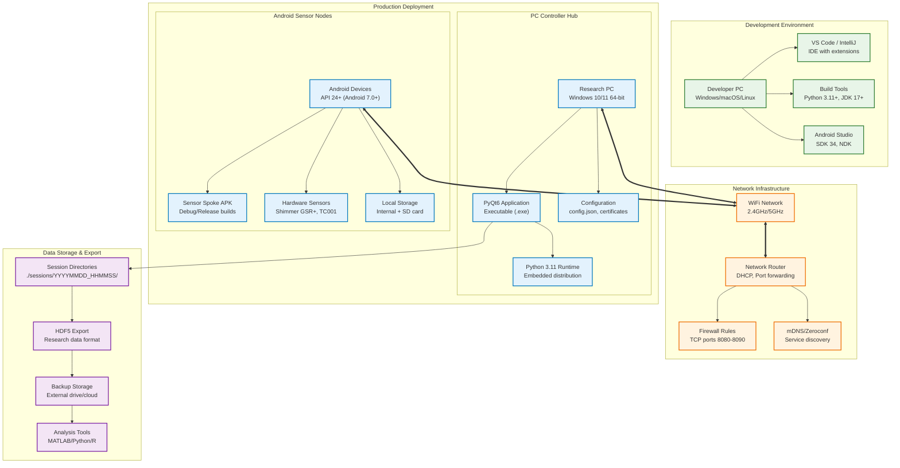

```mermaid
graph TB
    subgraph "Development Environment"
        DEV_PC["Developer PC<br/>Windows/macOS/Linux"]
        DEV_IDE["VS Code / IntelliJ<br/>IDE with extensions"]
        DEV_TOOLS["Build Tools<br/>Python 3.11+, JDK 17+"]
        DEV_ANDROID["Android Studio<br/>SDK 34, NDK"]
    end

    subgraph "Production Deployment"
        subgraph "PC Controller Hub"
            PROD_PC["Research PC<br/>Windows 10/11 64-bit"]
            PYQT_APP["PyQt6 Application<br/>Executable (.exe)"]
            PYTHON_RUNTIME["Python 3.11 Runtime<br/>Embedded distribution"]
            PC_CONFIG["Configuration<br/>config.json, certificates"]
        end

        subgraph "Android Sensor Nodes"
            ANDROID_DEVICES["Android Devices<br/>API 24+ (Android 7.0+)"]
            APK_INSTALL["Sensor Spoke APK<br/>Debug/Release builds"]
            SENSOR_HARDWARE["Hardware Sensors<br/>Shimmer GSR+, TC001"]
            STORAGE["Local Storage<br/>Internal + SD card"]
        end
    end

    subgraph "Network Infrastructure"
        WIFI_NETWORK["WiFi Network<br/>2.4GHz/5GHz"]
        ROUTER["Network Router<br/>DHCP, Port forwarding"]
        FIREWALL["Firewall Rules<br/>TCP ports 8080-8090"]
        DNS["mDNS/Zeroconf<br/>Service discovery"]
    end

    subgraph "Data Storage & Export"
        SESSION_DIR["Session Directories<br/>./sessions/YYYYMMDD_HHMMSS/"]
        HDF5_FILES["HDF5 Export<br/>Research data format"]
        BACKUP_STORAGE["Backup Storage<br/>External drive/cloud"]
        MATLAB_PYTHON["Analysis Tools<br/>MATLAB/Python/R"]
    end

    %% Development connections
    DEV_PC --> DEV_IDE
    DEV_PC --> DEV_TOOLS
    DEV_PC --> DEV_ANDROID

    %% Production connections
    PROD_PC --> PYQT_APP
    PYQT_APP --> PYTHON_RUNTIME
    PROD_PC --> PC_CONFIG

    ANDROID_DEVICES --> APK_INSTALL
    ANDROID_DEVICES --> SENSOR_HARDWARE
    ANDROID_DEVICES --> STORAGE

    %% Network connections
    PROD_PC <==> WIFI_NETWORK
    ANDROID_DEVICES <==> WIFI_NETWORK
    WIFI_NETWORK <==> ROUTER
    ROUTER --> FIREWALL
    ROUTER --> DNS

    %% Data flow
    PYQT_APP --> SESSION_DIR
    SESSION_DIR --> HDF5_FILES
    HDF5_FILES --> BACKUP_STORAGE
    BACKUP_STORAGE --> MATLAB_PYTHON

    %% Styling
    classDef development fill:#e8f5e8,stroke:#2e7d32,stroke-width:2px
    classDef production fill:#e3f2fd,stroke:#0277bd,stroke-width:2px
    classDef network fill:#fff3e0,stroke:#ef6c00,stroke-width:2px
    classDef storage fill:#f3e5f5,stroke:#7b1fa2,stroke-width:2px

    class DEV_PC,DEV_IDE,DEV_TOOLS,DEV_ANDROID development
    class PROD_PC,PYQT_APP,PYTHON_RUNTIME,PC_CONFIG,ANDROID_DEVICES,APK_INSTALL,SENSOR_HARDWARE,STORAGE production
    class WIFI_NETWORK,ROUTER,FIREWALL,DNS network
    class SESSION_DIR,HDF5_FILES,BACKUP_STORAGE,MATLAB_PYTHON storage
```