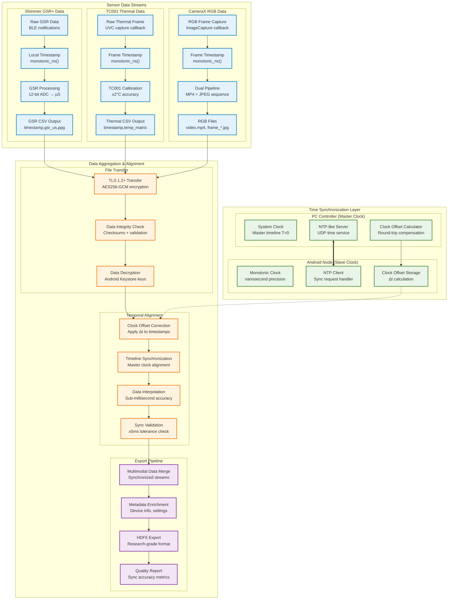

```mermaid
flowchart TD
    subgraph "Time Synchronization Layer"
        subgraph "PC Controller (Master Clock)"
            MASTER_CLOCK["System Clock<br/>Master timeline T=0"]
            NTP_SERVER["NTP-like Server<br/>UDP time service"]
            SYNC_ALGORITHM["Clock Offset Calculator<br/>Round-trip compensation"]
        end

        subgraph "Android Node (Slave Clock)"  
            DEVICE_CLOCK["Monotonic Clock<br/>nanosecond precision"]
            NTP_CLIENT["NTP Client<br/>Sync request handler"]
            OFFSET_STORAGE["Clock Offset Storage<br/>Δt calculation"]
        end
        
        NTP_SERVER <==> NTP_CLIENT
        SYNC_ALGORITHM --> OFFSET_STORAGE
    end

    subgraph "Sensor Data Streams"
        subgraph "Shimmer GSR+ Data"
            GSR_RAW["Raw GSR Data<br/>BLE notifications"]
            GSR_TIMESTAMP["Local Timestamp<br/>monotonic_ns()"]
            GSR_PROCESS["GSR Processing<br/>12-bit ADC → μS"]
            GSR_CSV["GSR CSV Output<br/>timestamp,gsr_us,ppg"]
        end

        subgraph "TC001 Thermal Data"
            THERMAL_RAW["Raw Thermal Frame<br/>UVC capture callback"]
            THERMAL_TIMESTAMP["Frame Timestamp<br/>monotonic_ns()"]
            THERMAL_CALIBRATION["TC001 Calibration<br/>±2°C accuracy"]
            THERMAL_CSV["Thermal CSV Output<br/>timestamp,temp_matrix"]
        end

        subgraph "CameraX RGB Data"
            RGB_FRAME["RGB Frame Capture<br/>ImageCapture callback"]
            RGB_TIMESTAMP["Frame Timestamp<br/>monotonic_ns()"]
            RGB_DUAL["Dual Pipeline<br/>MP4 + JPEG sequence"]
            RGB_FILES["RGB Files<br/>video.mp4, frame_*.jpg"]
        end

        GSR_RAW --> GSR_TIMESTAMP
        GSR_TIMESTAMP --> GSR_PROCESS
        GSR_PROCESS --> GSR_CSV

        THERMAL_RAW --> THERMAL_TIMESTAMP
        THERMAL_TIMESTAMP --> THERMAL_CALIBRATION
        THERMAL_CALIBRATION --> THERMAL_CSV

        RGB_FRAME --> RGB_TIMESTAMP
        RGB_TIMESTAMP --> RGB_DUAL
        RGB_DUAL --> RGB_FILES
    end

    subgraph "Data Aggregation & Alignment"
        subgraph "File Transfer"
            ENCRYPTED_TRANSFER["TLS 1.2+ Transfer<br/>AES256-GCM encryption"]
            FILE_VALIDATION["Data Integrity Check<br/>Checksums + validation"]
            DECRYPTION["Data Decryption<br/>Android Keystore keys"]
        end

        subgraph "Temporal Alignment"
            OFFSET_CORRECTION["Clock Offset Correction<br/>Apply Δt to timestamps"]
            TIMELINE_SYNC["Timeline Synchronization<br/>Master clock alignment"]
            INTERPOLATION["Data Interpolation<br/>Sub-millisecond accuracy"]
            VALIDATION["Sync Validation<br/>±5ms tolerance check"]
        end

        subgraph "Export Pipeline"
            MULTIMODAL_MERGE["Multimodal Data Merge<br/>Synchronized streams"]
            METADATA_ENRICHMENT["Metadata Enrichment<br/>Device info, settings"]
            HDF5_EXPORT["HDF5 Export<br/>Research-grade format"]
            QUALITY_REPORT["Quality Report<br/>Sync accuracy metrics"]
        end

        GSR_CSV --> ENCRYPTED_TRANSFER
        THERMAL_CSV --> ENCRYPTED_TRANSFER  
        RGB_FILES --> ENCRYPTED_TRANSFER
        
        ENCRYPTED_TRANSFER --> FILE_VALIDATION
        FILE_VALIDATION --> DECRYPTION
        DECRYPTION --> OFFSET_CORRECTION
        
        OFFSET_STORAGE -.-> OFFSET_CORRECTION
        OFFSET_CORRECTION --> TIMELINE_SYNC
        TIMELINE_SYNC --> INTERPOLATION
        INTERPOLATION --> VALIDATION
        
        VALIDATION --> MULTIMODAL_MERGE
        MULTIMODAL_MERGE --> METADATA_ENRICHMENT
        METADATA_ENRICHMENT --> HDF5_EXPORT
        HDF5_EXPORT --> QUALITY_REPORT
    end

    %% Styling
    classDef timeSync fill:#e8f5e8,stroke:#2e7d32,stroke-width:2px
    classDef sensorData fill:#e3f2fd,stroke:#0277bd,stroke-width:2px  
    classDef dataProcess fill:#fff3e0,stroke:#ef6c00,stroke-width:2px
    classDef export fill:#f3e5f5,stroke:#7b1fa2,stroke-width:2px

    class MASTER_CLOCK,NTP_SERVER,SYNC_ALGORITHM,DEVICE_CLOCK,NTP_CLIENT,OFFSET_STORAGE timeSync
    class GSR_RAW,GSR_TIMESTAMP,GSR_PROCESS,GSR_CSV,THERMAL_RAW,THERMAL_TIMESTAMP,THERMAL_CALIBRATION,THERMAL_CSV,RGB_FRAME,RGB_TIMESTAMP,RGB_DUAL,RGB_FILES sensorData
    class ENCRYPTED_TRANSFER,FILE_VALIDATION,DECRYPTION,OFFSET_CORRECTION,TIMELINE_SYNC,INTERPOLATION,VALIDATION dataProcess
    class MULTIMODAL_MERGE,METADATA_ENRICHMENT,HDF5_EXPORT,QUALITY_REPORT export
```