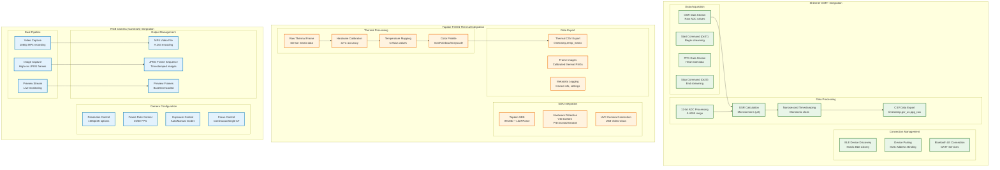

```mermaid
graph TB
    subgraph "Shimmer GSR+ Integration"
        subgraph "Connection Management"
            BLE_DISCOVERY["BLE Device Discovery<br/>Nordic BLE Library"]
            PAIRING["Device Pairing<br/>MAC Address Binding"]
            CONNECTION["Bluetooth LE Connection<br/>GATT Services"]
        end
        
        subgraph "Data Acquisition"
            START_CMD["Start Command (0x07)<br/>Begin streaming"]
            GSR_STREAM["GSR Data Stream<br/>Raw ADC values"]
            PPG_STREAM["PPG Data Stream<br/>Heart rate data"]
            STOP_CMD["Stop Command (0x20)<br/>End streaming"]
        end
        
        subgraph "Data Processing"
            ADC_CONVERSION["12-bit ADC Processing<br/>0-4095 range"]
            GSR_CALCULATION["GSR Calculation<br/>Microsiemens (μS)"]
            TIMESTAMP_SYNC["Nanosecond Timestamping<br/>Monotonic clock"]
            CSV_OUTPUT["CSV Data Export<br/>timestamp,gsr_us,ppg_raw"]
        end
    end

    subgraph "Topdon TC001 Thermal Integration" 
        subgraph "SDK Integration"
            TOPDON_SDK["Topdon SDK<br/>IRCMD + LibIRParse"]
            DEVICE_DETECTION["Hardware Detection<br/>VID:0x0525 PID:0xa4a2/0xa4a5"]
            UVC_CONNECTION["UVC Camera Connection<br/>USB Video Class"]
        end
        
        subgraph "Thermal Processing"
            RAW_THERMAL["Raw Thermal Frame<br/>Sensor matrix data"]
            CALIBRATION["Hardware Calibration<br/>±2°C accuracy"]
            TEMPERATURE_MAP["Temperature Mapping<br/>Celsius values"]
            COLOR_PALETTE["Color Palette<br/>Iron/Rainbow/Grayscale"]
        end
        
        subgraph "Data Export"
            THERMAL_CSV["Thermal CSV Export<br/>timestamp,temp_matrix"]
            FRAME_IMAGES["Frame Images<br/>Calibrated thermal PNGs"]
            METADATA["Metadata Logging<br/>Device info, settings"]
        end
    end

    subgraph "RGB Camera (CameraX) Integration"
        subgraph "Dual Pipeline"
            VIDEO_CAPTURE["Video Capture<br/>1080p MP4 recording"]
            IMAGE_CAPTURE["Image Capture<br/>High-res JPEG frames"]
            PREVIEW_STREAM["Preview Stream<br/>Live monitoring"]
        end
        
        subgraph "Camera Configuration"
            RESOLUTION["Resolution Control<br/>1080p/4K options"]
            FRAME_RATE["Frame Rate Control<br/>30/60 FPS"]
            EXPOSURE["Exposure Control<br/>Auto/Manual modes"]
            FOCUS["Focus Control<br/>Continuous/Single AF"]
        end
        
        subgraph "Output Management"
            MP4_FILE["MP4 Video File<br/>H.264 encoding"]
            JPEG_SEQUENCE["JPEG Frame Sequence<br/>Timestamped images"]
            PREVIEW_FRAMES["Preview Frames<br/>Base64 encoded"]
        end
    end

    %% Inter-sensor connections
    GSR_STREAM --> GSR_CALCULATION
    ADC_CONVERSION --> GSR_CALCULATION
    GSR_CALCULATION --> TIMESTAMP_SYNC
    TIMESTAMP_SYNC --> CSV_OUTPUT

    RAW_THERMAL --> CALIBRATION
    CALIBRATION --> TEMPERATURE_MAP
    TEMPERATURE_MAP --> COLOR_PALETTE
    COLOR_PALETTE --> THERMAL_CSV

    VIDEO_CAPTURE --> MP4_FILE
    IMAGE_CAPTURE --> JPEG_SEQUENCE
    PREVIEW_STREAM --> PREVIEW_FRAMES

    %% Styling
    classDef shimmer fill:#e8f5e8,stroke:#2e7d32,stroke-width:2px
    classDef thermal fill:#fff3e0,stroke:#ef6c00,stroke-width:2px
    classDef rgb fill:#e3f2fd,stroke:#0277bd,stroke-width:2px
    
    class BLE_DISCOVERY,PAIRING,CONNECTION,START_CMD,GSR_STREAM,PPG_STREAM,STOP_CMD,ADC_CONVERSION,GSR_CALCULATION,TIMESTAMP_SYNC,CSV_OUTPUT shimmer
    class TOPDON_SDK,DEVICE_DETECTION,UVC_CONNECTION,RAW_THERMAL,CALIBRATION,TEMPERATURE_MAP,COLOR_PALETTE,THERMAL_CSV,FRAME_IMAGES,METADATA thermal
    class VIDEO_CAPTURE,IMAGE_CAPTURE,PREVIEW_STREAM,RESOLUTION,FRAME_RATE,EXPOSURE,FOCUS,MP4_FILE,JPEG_SEQUENCE,PREVIEW_FRAMES rgb
```