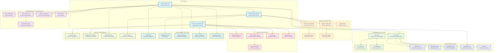

```mermaid
graph TB
    subgraph "Core Platform"
        PC_CONTROLLER[PC Controller Hub<br/>Central orchestrator]
        ANDROID_NODES[Android Sensor Nodes<br/>Data collection devices]
        DATA_ENGINE[Data Processing Engine<br/>Aggregation & export]
    end

    subgraph "Lab Streaming Layer (LSL)"
        LSL_OUTLET[LSL Outlet<br/>Real-time data streaming]
        LSL_INLET[LSL Inlet<br/>External tool consumption]
        LSL_RESOLVER[LSL Resolver<br/>Stream discovery]
        LSL_METADATA[LSL Metadata<br/>Stream descriptions]
    end

    subgraph "Hardware Integration APIs"
        SHIMMER_API[Shimmer Android SDK<br/>com.shimmerresearch.*]
        TOPDON_API[Topdon TC001 SDK<br/>IRCMD, LibIRParse]
        CAMERAX_API[CameraX API<br/>androidx.camera.*]
        BLE_API[Nordic BLE Library<br/>Bluetooth LE GATT]
        UVC_API[UVC Camera Library<br/>USB Video Class]
    end

    subgraph "Network Discovery & Communication"
        ZEROCONF[Zeroconf/mDNS<br/>Service discovery]
        TCP_SOCKETS[TCP Socket API<br/>Control communication]
        UDP_TIME[UDP Time Service<br/>NTP-like synchronization]
        TLS_LAYER[TLS Security Layer<br/>Certificate management]
        HTTP_CLIENT[HTTP Client<br/>API integration]
    end

    subgraph "Analysis Tool Integration"
        MATLAB_ENGINE[MATLAB Engine API<br/>Signal processing]
        PYTHON_SCIPY[Python SciPy Stack<br/>NumPy, pandas, matplotlib]
        R_INTERFACE[R Interface<br/>Statistical analysis]
        JUPYTER_NOTEBOOKS[Jupyter Notebooks<br/>Interactive analysis]
        HDF5_VIEWERS[HDF5 Viewers<br/>HDFView, h5dump]
    end

    subgraph "Development & CI/CD Tools"
        GITHUB_API[GitHub API<br/>Repository integration]
        GRADLE_ECOSYSTEM[Gradle Ecosystem<br/>Build plugins]
        PYTEST_FRAMEWORK[pytest Ecosystem<br/>Test runners & plugins]
        DOCKER_CONTAINERS[Docker Containers<br/>Isolated environments]
        MONITORING_TOOLS[Monitoring Tools<br/>Performance metrics]
    end

    subgraph "Cloud & Storage Integration"
        CLOUD_STORAGE[Cloud Storage<br/>AWS S3, Google Drive]
        DATABASE_CONNECTORS[Database Connectors<br/>PostgreSQL, MongoDB]
        BACKUP_SERVICES[Backup Services<br/>Automated data backup]
        SYNC_SERVICES[Sync Services<br/>Multi-device coordination]
    end

    subgraph "Research Platform APIs"
        BIOPAC_API[BIOPAC API<br/>Physiological equipment]
        EMPATICA_API[Empatica E4 API<br/>Wearable sensors]
        OPENSIGNALS_API[OpenSignals API<br/>BITalino integration]
        PSYCHOPY_API[PsychoPy API<br/>Experimental control]
        UNITY_API[Unity API<br/>VR/AR environments]
    end

    %% Core platform connections
    PC_CONTROLLER --> ANDROID_NODES
    ANDROID_NODES --> DATA_ENGINE
    DATA_ENGINE --> PC_CONTROLLER

    %% LSL integration
    PC_CONTROLLER --> LSL_OUTLET
    LSL_OUTLET --> LSL_RESOLVER
    LSL_INLET --> LSL_METADATA
    DATA_ENGINE --> LSL_OUTLET

    %% Hardware API connections
    ANDROID_NODES --> SHIMMER_API
    ANDROID_NODES --> TOPDON_API
    ANDROID_NODES --> CAMERAX_API
    SHIMMER_API --> BLE_API
    TOPDON_API --> UVC_API

    %% Network connections
    PC_CONTROLLER --> ZEROCONF
    PC_CONTROLLER --> TCP_SOCKETS
    PC_CONTROLLER --> UDP_TIME
    TCP_SOCKETS --> TLS_LAYER
    PC_CONTROLLER --> HTTP_CLIENT

    %% Analysis tool connections
    DATA_ENGINE --> MATLAB_ENGINE
    DATA_ENGINE --> PYTHON_SCIPY
    DATA_ENGINE --> R_INTERFACE
    PYTHON_SCIPY --> JUPYTER_NOTEBOOKS
    DATA_ENGINE --> HDF5_VIEWERS

    %% Development tool connections
    PC_CONTROLLER --> GITHUB_API
    ANDROID_NODES --> GRADLE_ECOSYSTEM
    PC_CONTROLLER --> PYTEST_FRAMEWORK
    DATA_ENGINE --> DOCKER_CONTAINERS
    PC_CONTROLLER --> MONITORING_TOOLS

    %% Cloud integration
    DATA_ENGINE --> CLOUD_STORAGE
    DATA_ENGINE --> DATABASE_CONNECTORS
    PC_CONTROLLER --> BACKUP_SERVICES
    ANDROID_NODES --> SYNC_SERVICES

    %% Research platform integration
    LSL_OUTLET --> BIOPAC_API
    LSL_OUTLET --> EMPATICA_API
    LSL_OUTLET --> OPENSIGNALS_API
    PC_CONTROLLER --> PSYCHOPY_API
    LSL_OUTLET --> UNITY_API

    %% Styling
    classDef core fill:#e1f5fe,stroke:#0277bd,stroke-width:3px
    classDef lsl fill:#e8f5e8,stroke:#2e7d32,stroke-width:2px
    classDef hardware fill:#fff3e0,stroke:#ef6c00,stroke-width:2px
    classDef network fill:#f3e5f5,stroke:#7b1fa2,stroke-width:2px
    classDef analysis fill:#fce4ec,stroke:#c2185b,stroke-width:2px
    classDef devtools fill:#e0f2f1,stroke:#00695c,stroke-width:2px
    classDef cloud fill:#f1f8e9,stroke:#33691e,stroke-width:2px
    classDef research fill:#e8eaf6,stroke:#3f51b5,stroke-width:2px

    class PC_CONTROLLER,ANDROID_NODES,DATA_ENGINE core
    class LSL_OUTLET,LSL_INLET,LSL_RESOLVER,LSL_METADATA lsl
    class SHIMMER_API,TOPDON_API,CAMERAX_API,BLE_API,UVC_API hardware
    class ZEROCONF,TCP_SOCKETS,UDP_TIME,TLS_LAYER,HTTP_CLIENT network
    class MATLAB_ENGINE,PYTHON_SCIPY,R_INTERFACE,JUPYTER_NOTEBOOKS,HDF5_VIEWERS analysis
    class GITHUB_API,GRADLE_ECOSYSTEM,PYTEST_FRAMEWORK,DOCKER_CONTAINERS,MONITORING_TOOLS devtools
    class CLOUD_STORAGE,DATABASE_CONNECTORS,BACKUP_SERVICES,SYNC_SERVICES cloud
    class BIOPAC_API,EMPATICA_API,OPENSIGNALS_API,PSYCHOPY_API,UNITY_API research
```