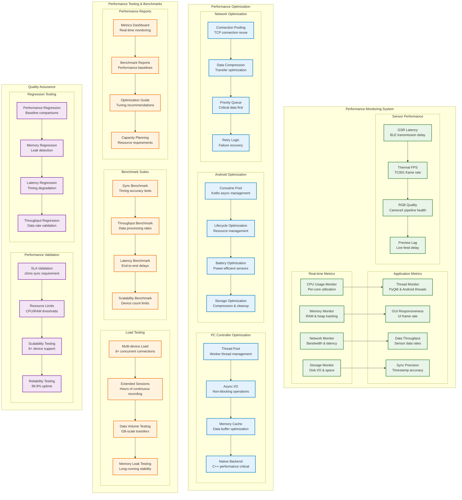

```mermaid
graph TB
    subgraph "Performance Monitoring System"
        subgraph "Real-time Metrics"
            CPU_MONITOR["CPU Usage Monitor<br/>Per-core utilization"]
            MEMORY_MONITOR["Memory Monitor<br/>RAM & heap tracking"]
            NETWORK_MONITOR["Network Monitor<br/>Bandwidth & latency"]
            STORAGE_MONITOR["Storage Monitor<br/>Disk I/O & space"]
        end

        subgraph "Application Metrics"
            THREAD_MONITOR["Thread Monitor<br/>PyQt6 & Android threads"]
            GUI_RESPONSIVE["GUI Responsiveness<br/>UI frame rate"]
            DATA_THROUGHPUT["Data Throughput<br/>Sensor data rates"]
            SYNC_PRECISION["Sync Precision<br/>Timestamp accuracy"]
        end

        subgraph "Sensor Performance"
            GSR_LATENCY["GSR Latency<br/>BLE transmission delay"]
            THERMAL_FPS["Thermal FPS<br/>TC001 frame rate"]
            RGB_QUALITY["RGB Quality<br/>CameraX pipeline health"]
            PREVIEW_LAG["Preview Lag<br/>Live feed delay"]
        end
    end

    subgraph "Performance Optimization"
        subgraph "PC Controller Optimization"
            THREAD_POOL["Thread Pool<br/>Worker thread management"]
            ASYNC_IO["Async I/O<br/>Non-blocking operations"]
            MEMORY_CACHE["Memory Cache<br/>Data buffer optimization"]
            NATIVE_BACKEND["Native Backend<br/>C++ performance critical"]
        end

        subgraph "Android Optimization"
            COROUTINE_POOL["Coroutine Pool<br/>Kotlin async management"]
            LIFECYCLE_OPT["Lifecycle Optimization<br/>Resource management"]
            BATTERY_OPT["Battery Optimization<br/>Power-efficient sensors"]
            STORAGE_OPT["Storage Optimization<br/>Compression & cleanup"]
        end

        subgraph "Network Optimization"
            CONNECTION_POOL["Connection Pooling<br/>TCP connection reuse"]
            DATA_COMPRESSION["Data Compression<br/>Transfer optimization"]
            PRIORITY_QUEUE["Priority Queue<br/>Critical data first"]
            RETRY_LOGIC["Retry Logic<br/>Failure recovery"]
        end
    end

    subgraph "Performance Testing & Benchmarks"
        subgraph "Load Testing"
            MULTI_DEVICE["Multi-device Load<br/>8+ concurrent connections"]
            EXTENDED_SESSION["Extended Sessions<br/>Hours of continuous recording"]
            DATA_VOLUME["Data Volume Testing<br/>GB-scale transfers"]
            MEMORY_LEAK["Memory Leak Testing<br/>Long-running stability"]
        end

        subgraph "Benchmark Suites"
            SYNC_BENCHMARK["Sync Benchmark<br/>Timing accuracy tests"]
            THROUGHPUT_BENCH["Throughput Benchmark<br/>Data processing rates"]
            LATENCY_BENCH["Latency Benchmark<br/>End-to-end delays"]
            SCALABILITY_BENCH["Scalability Benchmark<br/>Device count limits"]
        end

        subgraph "Performance Reports"
            METRICS_DASHBOARD["Metrics Dashboard<br/>Real-time monitoring"]
            BENCHMARK_REPORTS["Benchmark Reports<br/>Performance baselines"]
            OPTIMIZATION_GUIDE["Optimization Guide<br/>Tuning recommendations"]
            CAPACITY_PLANNING["Capacity Planning<br/>Resource requirements"]
        end
    end

    subgraph "Quality Assurance"
        subgraph "Performance Validation"
            SLA_VALIDATION["SLA Validation<br/>±5ms sync requirement"]
            RESOURCE_LIMITS["Resource Limits<br/>CPU/RAM thresholds"]
            SCALABILITY_TEST["Scalability Testing<br/>8+ device support"]
            RELIABILITY_TEST["Reliability Testing<br/>99.9% uptime"]
        end

        subgraph "Regression Testing"
            PERFORMANCE_REGRESSION["Performance Regression<br/>Baseline comparisons"]
            MEMORY_REGRESSION["Memory Regression<br/>Leak detection"]
            LATENCY_REGRESSION["Latency Regression<br/>Timing degradation"]
            THROUGHPUT_REGRESSION["Throughput Regression<br/>Data rate validation"]
        end
    end

    %% Performance monitoring connections
    CPU_MONITOR --> THREAD_MONITOR
    MEMORY_MONITOR --> GUI_RESPONSIVE
    NETWORK_MONITOR --> DATA_THROUGHPUT
    STORAGE_MONITOR --> SYNC_PRECISION

    GSR_LATENCY --> THERMAL_FPS
    THERMAL_FPS --> RGB_QUALITY
    RGB_QUALITY --> PREVIEW_LAG

    %% Optimization connections
    THREAD_POOL --> ASYNC_IO
    ASYNC_IO --> MEMORY_CACHE
    MEMORY_CACHE --> NATIVE_BACKEND

    COROUTINE_POOL --> LIFECYCLE_OPT
    LIFECYCLE_OPT --> BATTERY_OPT
    BATTERY_OPT --> STORAGE_OPT

    CONNECTION_POOL --> DATA_COMPRESSION
    DATA_COMPRESSION --> PRIORITY_QUEUE
    PRIORITY_QUEUE --> RETRY_LOGIC

    %% Testing connections
    MULTI_DEVICE --> EXTENDED_SESSION
    EXTENDED_SESSION --> DATA_VOLUME
    DATA_VOLUME --> MEMORY_LEAK

    SYNC_BENCHMARK --> THROUGHPUT_BENCH
    THROUGHPUT_BENCH --> LATENCY_BENCH
    LATENCY_BENCH --> SCALABILITY_BENCH

    METRICS_DASHBOARD --> BENCHMARK_REPORTS
    BENCHMARK_REPORTS --> OPTIMIZATION_GUIDE
    OPTIMIZATION_GUIDE --> CAPACITY_PLANNING

    %% Quality assurance connections
    SLA_VALIDATION --> RESOURCE_LIMITS
    RESOURCE_LIMITS --> SCALABILITY_TEST
    SCALABILITY_TEST --> RELIABILITY_TEST

    PERFORMANCE_REGRESSION --> MEMORY_REGRESSION
    MEMORY_REGRESSION --> LATENCY_REGRESSION
    LATENCY_REGRESSION --> THROUGHPUT_REGRESSION

    %% Styling
    classDef monitoring fill:#e8f5e8,stroke:#2e7d32,stroke-width:2px
    classDef optimization fill:#e3f2fd,stroke:#0277bd,stroke-width:2px
    classDef testing fill:#fff3e0,stroke:#ef6c00,stroke-width:2px
    classDef quality fill:#f3e5f5,stroke:#7b1fa2,stroke-width:2px

    class CPU_MONITOR,MEMORY_MONITOR,NETWORK_MONITOR,STORAGE_MONITOR,THREAD_MONITOR,GUI_RESPONSIVE,DATA_THROUGHPUT,SYNC_PRECISION,GSR_LATENCY,THERMAL_FPS,RGB_QUALITY,PREVIEW_LAG monitoring
    class THREAD_POOL,ASYNC_IO,MEMORY_CACHE,NATIVE_BACKEND,COROUTINE_POOL,LIFECYCLE_OPT,BATTERY_OPT,STORAGE_OPT,CONNECTION_POOL,DATA_COMPRESSION,PRIORITY_QUEUE,RETRY_LOGIC optimization
    class MULTI_DEVICE,EXTENDED_SESSION,DATA_VOLUME,MEMORY_LEAK,SYNC_BENCHMARK,THROUGHPUT_BENCH,LATENCY_BENCH,SCALABILITY_BENCH,METRICS_DASHBOARD,BENCHMARK_REPORTS,OPTIMIZATION_GUIDE,CAPACITY_PLANNING testing
    class SLA_VALIDATION,RESOURCE_LIMITS,SCALABILITY_TEST,RELIABILITY_TEST,PERFORMANCE_REGRESSION,MEMORY_REGRESSION,LATENCY_REGRESSION,THROUGHPUT_REGRESSION quality
```