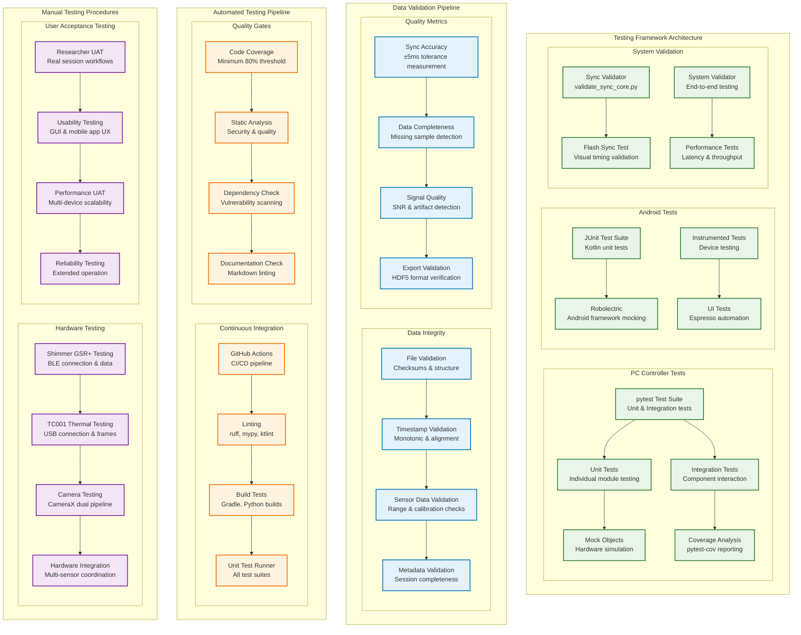

```mermaid
graph TB
    subgraph "Testing Framework Architecture"
        subgraph "PC Controller Tests"
            PC_PYTEST["pytest Test Suite<br/>Unit & Integration tests"]
            PC_UNIT["Unit Tests<br/>Individual module testing"]
            PC_INTEGRATION["Integration Tests<br/>Component interaction"]
            PC_MOCK["Mock Objects<br/>Hardware simulation"]
            PC_COVERAGE["Coverage Analysis<br/>pytest-cov reporting"]
        end

        subgraph "Android Tests"
            AND_JUNIT["JUnit Test Suite<br/>Kotlin unit tests"]
            AND_ROBOLECTRIC["Robolectric<br/>Android framework mocking"]
            AND_INSTRUMENTED["Instrumented Tests<br/>Device testing"]
            AND_UI["UI Tests<br/>Espresso automation"]
        end

        subgraph "System Validation"
            SYNC_VALIDATOR["Sync Validator<br/>validate_sync_core.py"]
            FLASH_SYNC["Flash Sync Test<br/>Visual timing validation"]
            COMPREHENSIVE["System Validator<br/>End-to-end testing"]
            PERFORMANCE["Performance Tests<br/>Latency & throughput"]
        end
    end

    subgraph "Data Validation Pipeline"
        subgraph "Data Integrity"
            FILE_VALIDATION["File Validation<br/>Checksums & structure"]
            TIMESTAMP_CHECK["Timestamp Validation<br/>Monotonic & alignment"]
            SENSOR_VALIDATION["Sensor Data Validation<br/>Range & calibration checks"]
            METADATA_CHECK["Metadata Validation<br/>Session completeness"]
        end

        subgraph "Quality Metrics"
            SYNC_ACCURACY["Sync Accuracy<br/>±5ms tolerance measurement"]
            DATA_COMPLETENESS["Data Completeness<br/>Missing sample detection"]
            SIGNAL_QUALITY["Signal Quality<br/>SNR & artifact detection"]
            EXPORT_VALIDATION["Export Validation<br/>HDF5 format verification"]
        end
    end

    subgraph "Automated Testing Pipeline"
        subgraph "Continuous Integration"
            GITHUB_ACTIONS["GitHub Actions<br/>CI/CD pipeline"]
            LINT_CHECK["Linting<br/>ruff, mypy, ktlint"]
            BUILD_TEST["Build Tests<br/>Gradle, Python builds"]
            UNIT_RUNNER["Unit Test Runner<br/>All test suites"]
        end

        subgraph "Quality Gates"
            CODE_COVERAGE["Code Coverage<br/>Minimum 80% threshold"]
            STATIC_ANALYSIS["Static Analysis<br/>Security & quality"]
            DEPENDENCY_CHECK["Dependency Check<br/>Vulnerability scanning"]
            DOCUMENTATION["Documentation Check<br/>Markdown linting"]
        end
    end

    subgraph "Manual Testing Procedures"
        subgraph "Hardware Testing"
            SHIMMER_TEST["Shimmer GSR+ Testing<br/>BLE connection & data"]
            TC001_TEST["TC001 Thermal Testing<br/>USB connection & frames"]
            CAMERA_TEST["Camera Testing<br/>CameraX dual pipeline"]
            INTEGRATION_TEST["Hardware Integration<br/>Multi-sensor coordination"]
        end

        subgraph "User Acceptance Testing"
            RESEARCHER_UAT["Researcher UAT<br/>Real session workflows"]
            USABILITY_TEST["Usability Testing<br/>GUI & mobile app UX"]
            PERFORMANCE_UAT["Performance UAT<br/>Multi-device scalability"]
            RELIABILITY_TEST["Reliability Testing<br/>Extended operation"]
        end
    end

    %% Testing connections
    PC_PYTEST --> PC_UNIT
    PC_PYTEST --> PC_INTEGRATION
    PC_UNIT --> PC_MOCK
    PC_INTEGRATION --> PC_COVERAGE

    AND_JUNIT --> AND_ROBOLECTRIC
    AND_INSTRUMENTED --> AND_UI

    SYNC_VALIDATOR --> FLASH_SYNC
    COMPREHENSIVE --> PERFORMANCE

    %% Validation connections
    FILE_VALIDATION --> TIMESTAMP_CHECK
    TIMESTAMP_CHECK --> SENSOR_VALIDATION
    SENSOR_VALIDATION --> METADATA_CHECK

    SYNC_ACCURACY --> DATA_COMPLETENESS
    DATA_COMPLETENESS --> SIGNAL_QUALITY
    SIGNAL_QUALITY --> EXPORT_VALIDATION

    %% CI/CD connections
    GITHUB_ACTIONS --> LINT_CHECK
    LINT_CHECK --> BUILD_TEST
    BUILD_TEST --> UNIT_RUNNER

    CODE_COVERAGE --> STATIC_ANALYSIS
    STATIC_ANALYSIS --> DEPENDENCY_CHECK
    DEPENDENCY_CHECK --> DOCUMENTATION

    %% Manual testing connections
    SHIMMER_TEST --> TC001_TEST
    TC001_TEST --> CAMERA_TEST
    CAMERA_TEST --> INTEGRATION_TEST

    RESEARCHER_UAT --> USABILITY_TEST
    USABILITY_TEST --> PERFORMANCE_UAT
    PERFORMANCE_UAT --> RELIABILITY_TEST

    %% Styling
    classDef testing fill:#e8f5e8,stroke:#2e7d32,stroke-width:2px
    classDef validation fill:#e3f2fd,stroke:#0277bd,stroke-width:2px
    classDef automation fill:#fff3e0,stroke:#ef6c00,stroke-width:2px
    classDef manual fill:#f3e5f5,stroke:#7b1fa2,stroke-width:2px

    class PC_PYTEST,PC_UNIT,PC_INTEGRATION,PC_MOCK,PC_COVERAGE,AND_JUNIT,AND_ROBOLECTRIC,AND_INSTRUMENTED,AND_UI,SYNC_VALIDATOR,FLASH_SYNC,COMPREHENSIVE,PERFORMANCE testing
    class FILE_VALIDATION,TIMESTAMP_CHECK,SENSOR_VALIDATION,METADATA_CHECK,SYNC_ACCURACY,DATA_COMPLETENESS,SIGNAL_QUALITY,EXPORT_VALIDATION validation
    class GITHUB_ACTIONS,LINT_CHECK,BUILD_TEST,UNIT_RUNNER,CODE_COVERAGE,STATIC_ANALYSIS,DEPENDENCY_CHECK,DOCUMENTATION automation
    class SHIMMER_TEST,TC001_TEST,CAMERA_TEST,INTEGRATION_TEST,RESEARCHER_UAT,USABILITY_TEST,PERFORMANCE_UAT,RELIABILITY_TEST manual
```