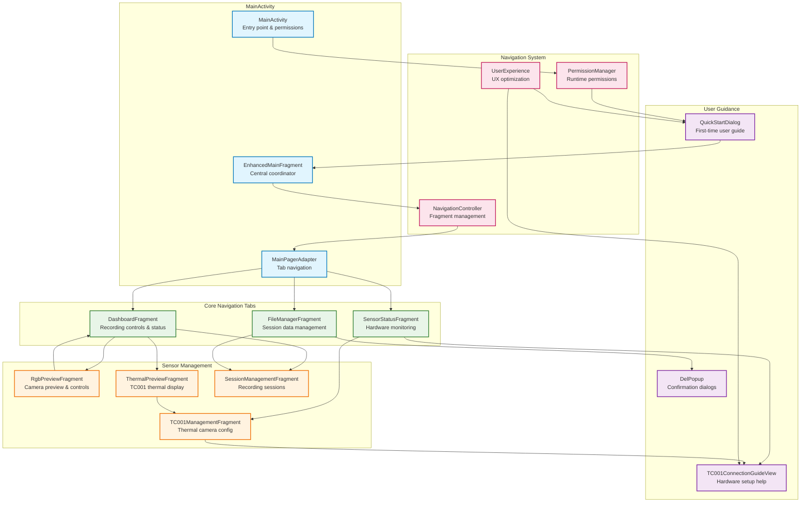

```mermaid
flowchart TD
    subgraph "MainActivity"
        MAIN[MainActivity<br/>Entry point & permissions]
        MAIN_FRAGMENT[EnhancedMainFragment<br/>Central coordinator]
        PAGER[MainPagerAdapter<br/>Tab navigation]
    end

    subgraph "Core Navigation Tabs"
        DASHBOARD[DashboardFragment<br/>Recording controls & status]
        SENSOR_STATUS[SensorStatusFragment<br/>Hardware monitoring]
        FILE_MANAGER[FileManagerFragment<br/>Session data management]
    end

    subgraph "Sensor Management"
        RGB_PREVIEW[RgbPreviewFragment<br/>Camera preview & controls]
        THERMAL_PREVIEW[ThermalPreviewFragment<br/>TC001 thermal display]
        TC001_MGMT[TC001ManagementFragment<br/>Thermal camera config]
        SESSION_MGMT[SessionManagementFragment<br/>Recording sessions]
    end

    subgraph "User Guidance"
        QUICK_START[QuickStartDialog<br/>First-time user guide]
        CONNECTION_GUIDE[TC001ConnectionGuideView<br/>Hardware setup help]
        DEL_POPUP[DelPopup<br/>Confirmation dialogs]
    end

    subgraph "Navigation System"
        NAV_CONTROLLER[NavigationController<br/>Fragment management]
        PERMISSION_MGR[PermissionManager<br/>Runtime permissions]
        USER_EXPERIENCE[UserExperience<br/>UX optimization]
    end

    %% Main flow
    MAIN --> PERMISSION_MGR
    PERMISSION_MGR --> QUICK_START
    QUICK_START --> MAIN_FRAGMENT
    MAIN_FRAGMENT --> NAV_CONTROLLER
    NAV_CONTROLLER --> PAGER

    %% Tab navigation
    PAGER --> DASHBOARD
    PAGER --> SENSOR_STATUS  
    PAGER --> FILE_MANAGER

    %% Dashboard interactions
    DASHBOARD --> SESSION_MGMT
    DASHBOARD --> RGB_PREVIEW
    DASHBOARD --> THERMAL_PREVIEW

    %% Sensor status interactions
    SENSOR_STATUS --> TC001_MGMT
    SENSOR_STATUS --> CONNECTION_GUIDE

    %% File management interactions
    FILE_MANAGER --> DEL_POPUP
    FILE_MANAGER --> SESSION_MGMT

    %% Preview interactions
    RGB_PREVIEW --> DASHBOARD
    THERMAL_PREVIEW --> TC001_MGMT
    TC001_MGMT --> CONNECTION_GUIDE

    %% User experience flow
    USER_EXPERIENCE --> QUICK_START
    USER_EXPERIENCE --> CONNECTION_GUIDE

    %% Styling
    classDef mainActivity fill:#e1f5fe,stroke:#0277bd,stroke-width:2px
    classDef coreTab fill:#e8f5e8,stroke:#2e7d32,stroke-width:2px
    classDef sensorMgmt fill:#fff3e0,stroke:#ef6c00,stroke-width:2px
    classDef userGuide fill:#f3e5f5,stroke:#7b1fa2,stroke-width:2px
    classDef navigation fill:#fce4ec,stroke:#c2185b,stroke-width:2px

    class MAIN,MAIN_FRAGMENT,PAGER mainActivity
    class DASHBOARD,SENSOR_STATUS,FILE_MANAGER coreTab
    class RGB_PREVIEW,THERMAL_PREVIEW,TC001_MGMT,SESSION_MGMT sensorMgmt
    class QUICK_START,CONNECTION_GUIDE,DEL_POPUP userGuide
    class NAV_CONTROLLER,PERMISSION_MGR,USER_EXPERIENCE navigation
```