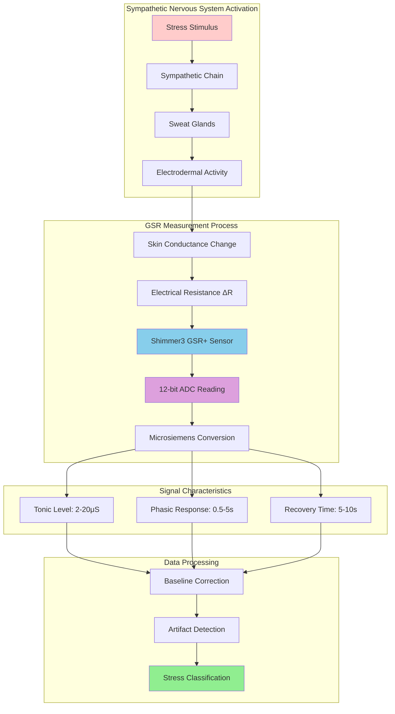

```mermaid
graph TD
    subgraph "Sympathetic Nervous System Activation"
        A[Stress Stimulus] --> B[Sympathetic Chain]
        B --> C[Sweat Glands]
        C --> D[Electrodermal Activity]
    end

    subgraph "GSR Measurement Process"
        D --> E[Skin Conductance Change]
        E --> F[Electrical Resistance ΔR]
        F --> G[Shimmer3 GSR+ Sensor]
        G --> H[12-bit ADC Reading]
        H --> I[Microsiemens Conversion]
    end

    subgraph "Signal Characteristics"
        I --> J[Tonic Level: 2-20μS]
        I --> K[Phasic Response: 0.5-5s]
        I --> L[Recovery Time: 5-10s]
    end

    subgraph "Data Processing"
        J --> M[Baseline Correction]
        K --> M
        L --> M
        M --> N[Artifact Detection]
        N --> O[Stress Classification]
    end

    style A fill:#ffcccb
    style O fill:#90ee90
    style G fill:#87ceeb
    style H fill:#dda0dd

```
