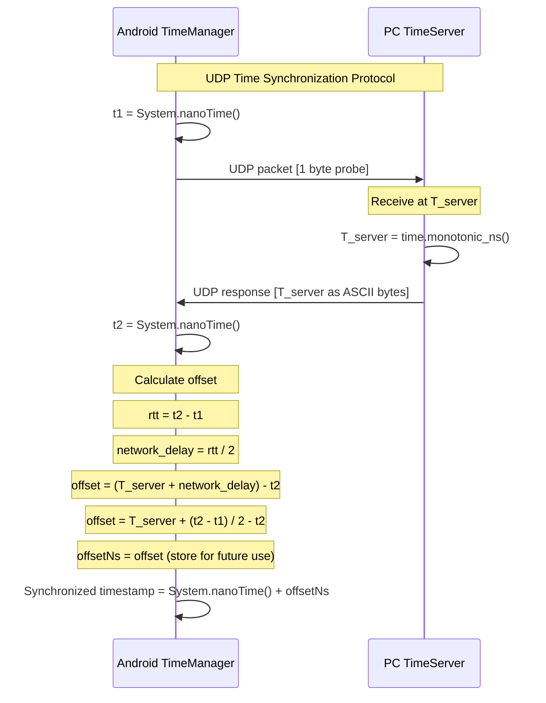
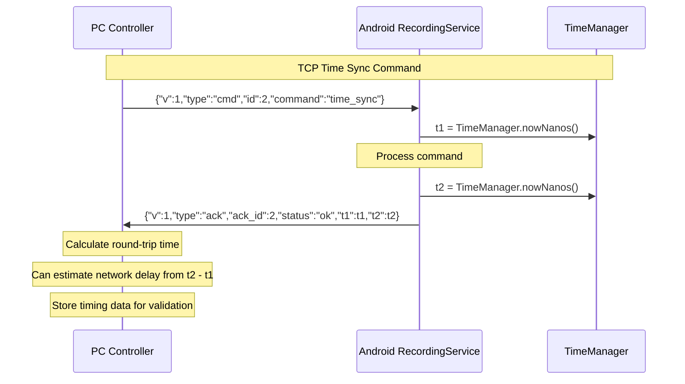
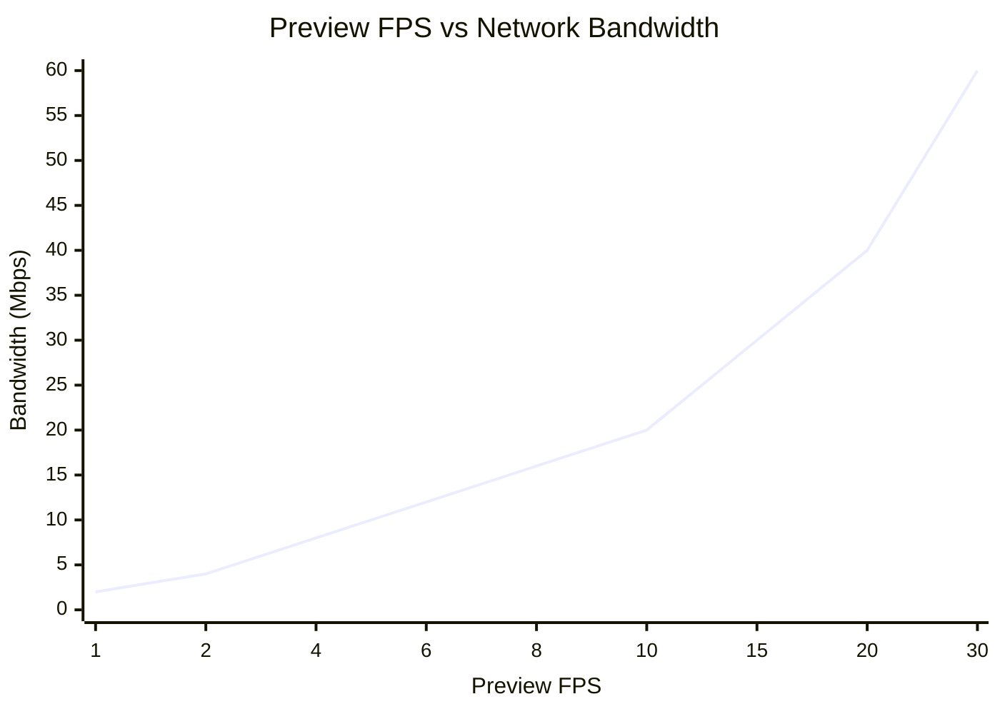
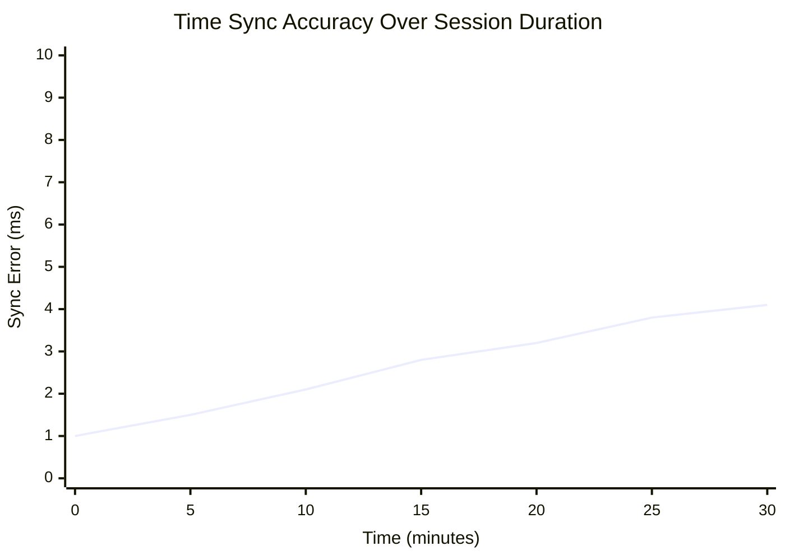
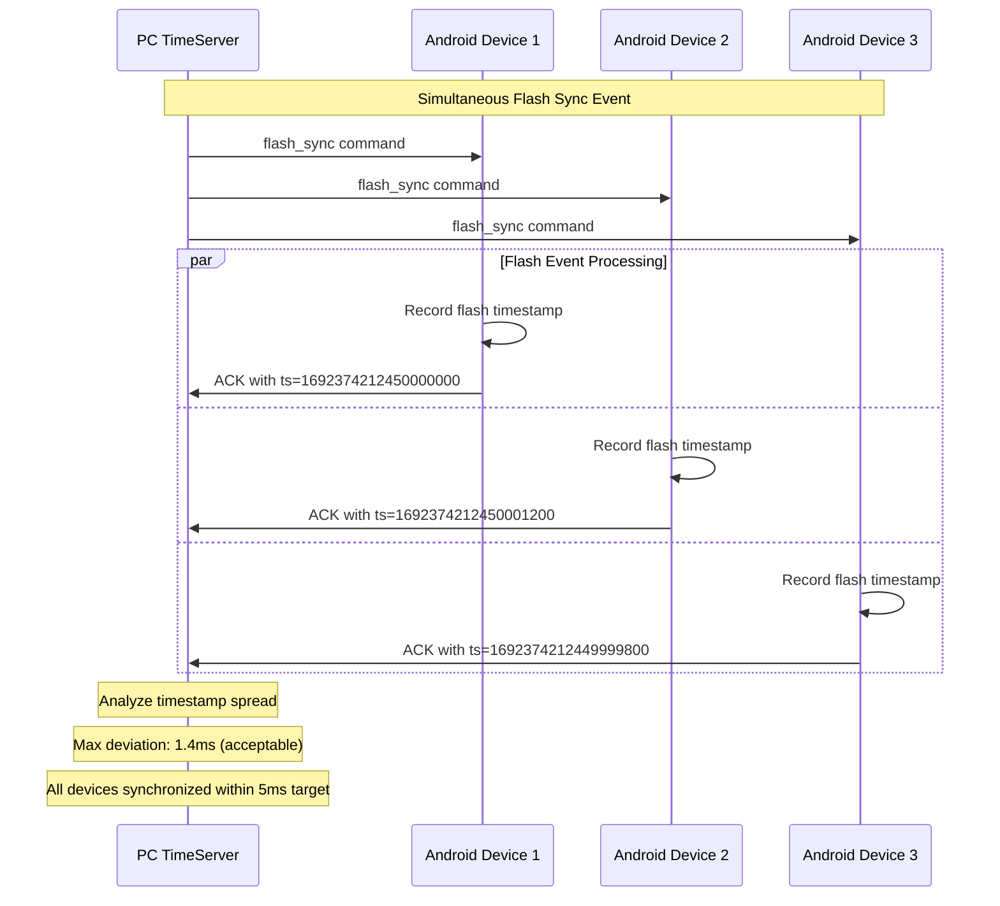

# Timing and Synchronization Diagrams

**Purpose**: Show derivation of offset and round-trip handling for both UDP echo and TCP time_sync protocols.

**Placement**: Chapter 3: NFRs timing subsection.

## UDP Time Synchronization Timeline

**Purpose**: Demonstrate NTP-like protocol for cross-device clock alignment.

### Sequence Diagram



### Mathematical Formula

**Offset Calculation**:
```
Given:
  t1 = Android timestamp when packet sent
  t2 = Android timestamp when response received
  T_server = PC server timestamp when packet processed

Round-trip time:
  rtt = t2 - t1

Network delay (assuming symmetric):
  network_delay = rtt / 2

Server time when response received:
  T_server_adjusted = T_server + network_delay
                    = T_server + (t2 - t1) / 2

Clock offset (PC time - Android time):
  offset = T_server_adjusted - t2
         = T_server + (t2 - t1) / 2 - t2
         = T_server - (t2 + t1) / 2
```

**Synchronized Timestamp**:
```kotlin
fun getSyncedTimestamp(): Long {
    val now = System.nanoTime()
    return now + offsetNs
}
```

## TCP Time Sync Command

**Purpose**: Alternative time synchronization via control channel.

### Sequence Diagram



### Usage Comparison

| Protocol | Purpose | Accuracy | Overhead | Use Case |
|----------|---------|----------|----------|----------|
| **UDP Echo** | Primary sync | High | Low | Real-time timestamp alignment |
| **TCP Command** | Validation | Medium | Higher | Sync quality assessment |

## Preview Frame Throttling

**Purpose**: Show PreviewBus throttling curve to explain bandwidth management.

### Throttling Timeline

```mermaid
gantt
    title Preview Frame Throttling (6-8 FPS Target)
    dateFormat X
    axisFormat %L ms

    section Camera Capture (30 FPS)
    Frame 1: 0, 33
    Frame 2: 33, 67
    Frame 3: 67, 100
    Frame 4: 100, 133
    Frame 5: 133, 167
    Frame 6: 167, 200

    section PreviewBus Emission (6-8 FPS)
    Emit Frame 1: 0, 10
    Throttled: 33, 150
    Emit Frame 4: 150, 160
    Throttled: 167, 300
    Emit Frame 6: 300, 310
```



### Throttling Algorithm

```kotlin
// In RgbCameraRecorder
private var lastPreviewNs: Long = 0L
private val PREVIEW_THROTTLE_NS = 150_000_000L // 150ms = 6.67 FPS

private fun emitPreviewIfThrottled(jpegBytes: ByteArray) {
    val now = TimeManager.nowNanos()
    if (now - lastPreviewNs >= PREVIEW_THROTTLE_NS) {
        PreviewBus.emit(jpegBytes, now)
        lastPreviewNs = now
    }
    // Otherwise frame is dropped (network bandwidth conservation)
}
```

### Performance Characteristics



**Assumptions**:
- JPEG frame size: ~50KB (640x480, quality=70)
- Base64 encoding overhead: ~33%
- Network frame size: ~67KB per preview
- Total bandwidth = FPS × 67KB × 8 bits/byte

**Throttling Benefits**:
- Prevents network congestion with multiple devices
- Reduces CPU usage for base64 encoding
- Maintains responsive control channel communication
- Preserves bandwidth for high-resolution recording data

## Time Sync Accuracy Analysis

### Error Sources

| Source | Typical Error | Mitigation |
|--------|---------------|------------|
| **Network Jitter** | 1-5ms | Multiple samples, outlier filtering |
| **Clock Drift** | 10-50ppm | Periodic re-synchronization |
| **Processing Delay** | 0.1-1ms | High-priority threads |
| **Asymmetric Network** | 0.5-2ms | Statistical analysis |

### Synchronization Quality Metrics



**Acceptable Thresholds**:
- **Excellent**: <2ms error
- **Good**: <5ms error (meets NFR2 requirement)
- **Warning**: 5-10ms error
- **Poor**: >10ms error (re-sync recommended)

### Multi-Device Synchronization



**Cross-Device Validation**:
- Flash sync events used as ground truth
- Expected timestamp spread: <5ms for synchronized devices
- Statistical analysis of drift patterns
- Automatic re-sync if deviation exceeds thresholds

## Implementation Notes

### Android TimeManager.kt
- Uses `System.nanoTime()` for monotonic timestamps
- Stores offset from UDP sync in volatile variable
- Thread-safe access to synchronized timestamps
- Background sync with configurable intervals

### PC TimeServer Implementation
- Uses `time.monotonic_ns()` for high precision
- UDP socket with 1-second timeout
- Handles concurrent sync requests from multiple devices
- Logs sync statistics for quality monitoring

### Validation Tools
- `validate_sync_core.py` analyzes flash sync timestamp distributions
- Cross-device synchronization quality assessment
- Drift detection and correction recommendations
- Integration with automated testing pipeline
