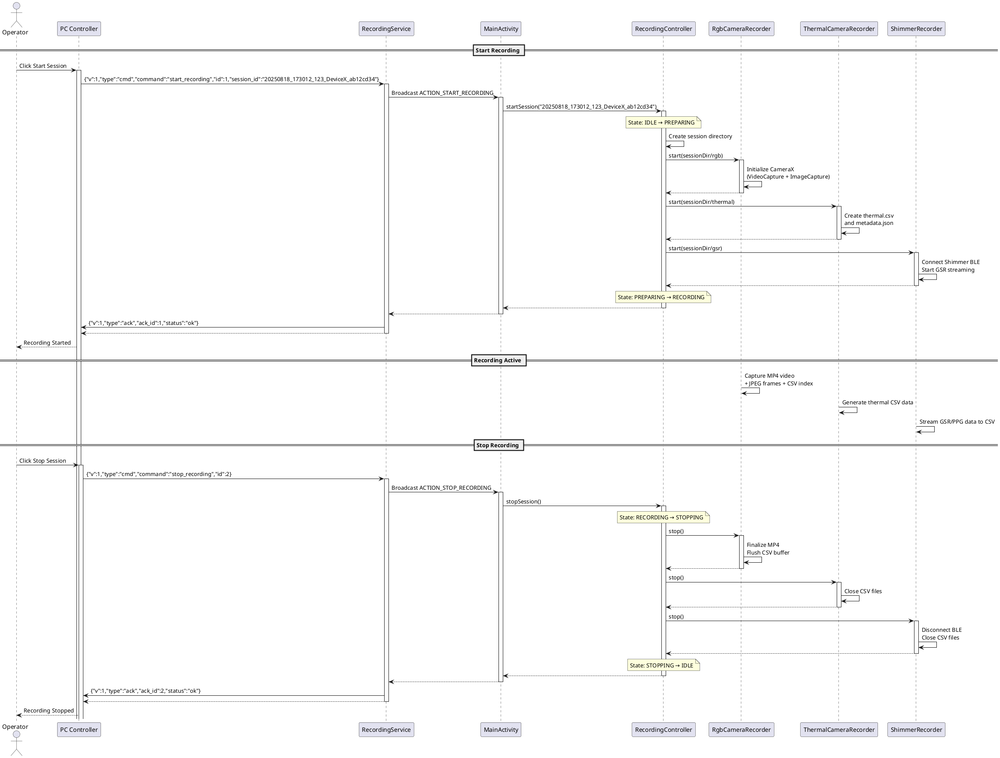
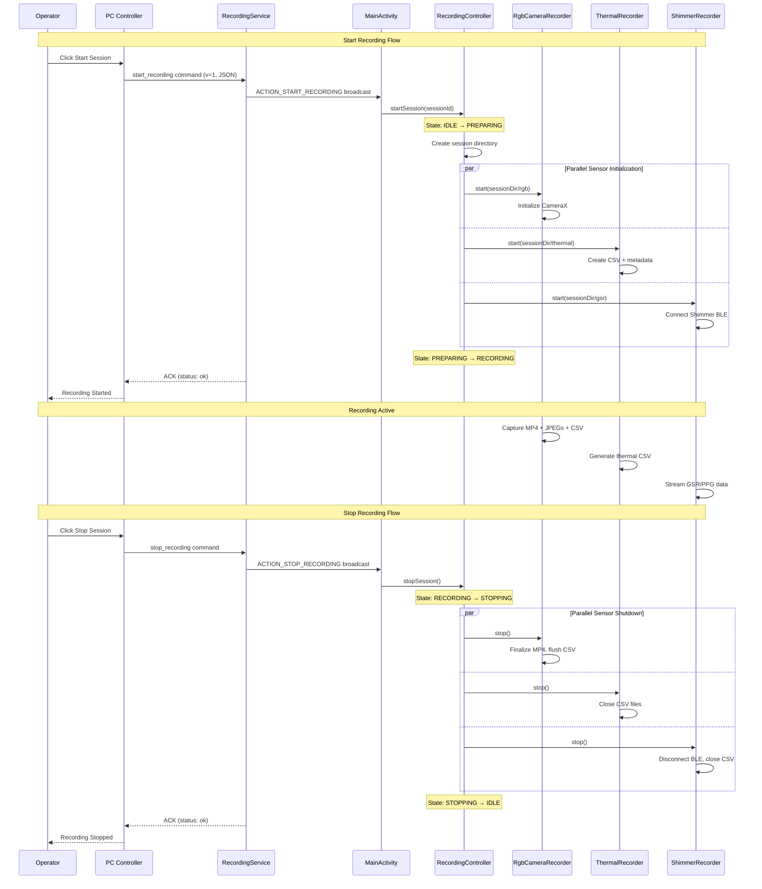
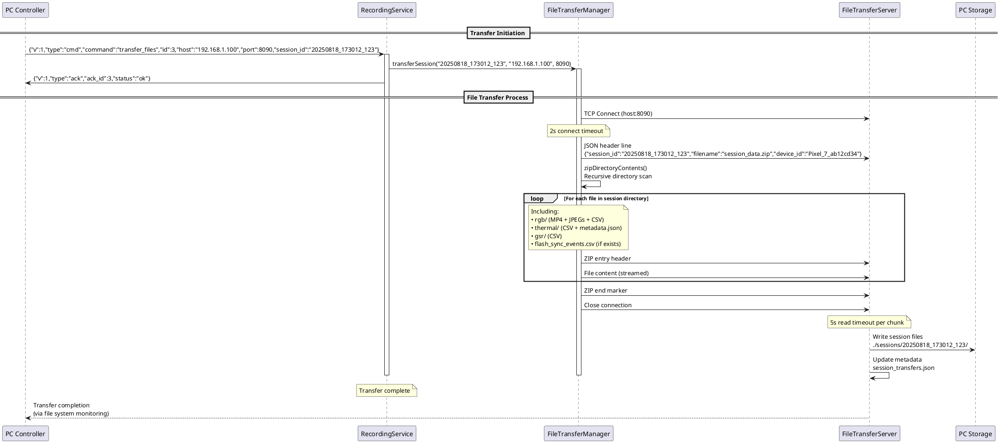
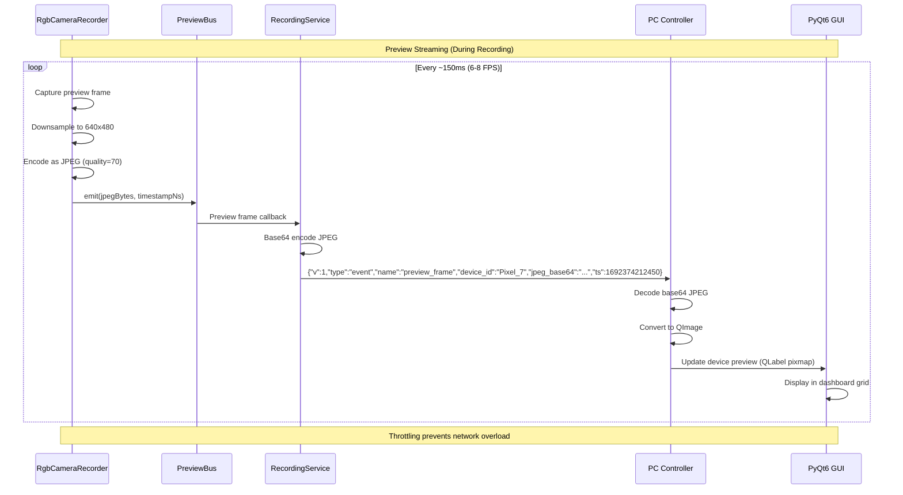

# Sequence Diagrams for Key Workflows

**Purpose**: Show command exchange and internal orchestration for critical system operations.

**Placement**: Chapter 4: Protocols or Use Cases section.

## Start/Stop Recording Sequence

**Purpose**: Demonstrate PC-initiated recording control and Android internal coordination.

### PlantUML Diagram



### Mermaid Alternative



## File Transfer Sequence

**Purpose**: Show push model from Android to PC receiver including ZIP streaming.

### PlantUML Diagram



### Key Transfer Details

**Header Format**:
```json
{"session_id": "20250818_173012_123", "filename": "session_data.zip", "size": 45678901, "device_id": "Pixel_7_ab12cd34"}
```

**ZIP Stream Contents**:
- `rgb/video_1692374212345678901.mp4` - H.264 video recording
- `rgb/frames/frame_*.jpg` - High-resolution JPEG stills
- `rgb/rgb.csv` - Frame timestamp index
- `thermal/thermal.csv` - Thermal sensor data (CSV)
- `thermal/metadata.json` - Sensor configuration
- `gsr/gsr.csv` - GSR and PPG measurements
- `flash_sync_events.csv` - Flash synchronization timestamps

**Error Handling**:
- Connection timeout: 2 seconds
- Read timeout: 5 seconds per chunk
- Automatic retry with exponential backoff
- Partial transfer detection and cleanup

**Performance Considerations**:
- No temporary ZIP file creation (streaming)
- ~10-50 MB/s transfer rate depending on network
- Memory usage ~1-2 MB (streaming buffers)

## Preview Frame Streaming

**Purpose**: Show continuous preview frame broadcast for dashboard display.

### Mermaid Diagram



**Throttling Logic**:
- PreviewBus implements 150ms minimum interval
- Last preview timestamp stored per recorder
- Frames dropped if interval < 150ms
- Target rate: 6-8 FPS for bandwidth efficiency

**Performance Impact**:
- Preview generation: ~5-10ms per frame
- Base64 encoding: ~2-5ms per frame
- Network transmission: ~10-20ms per frame
- Total latency: ~50-100ms end-to-end
