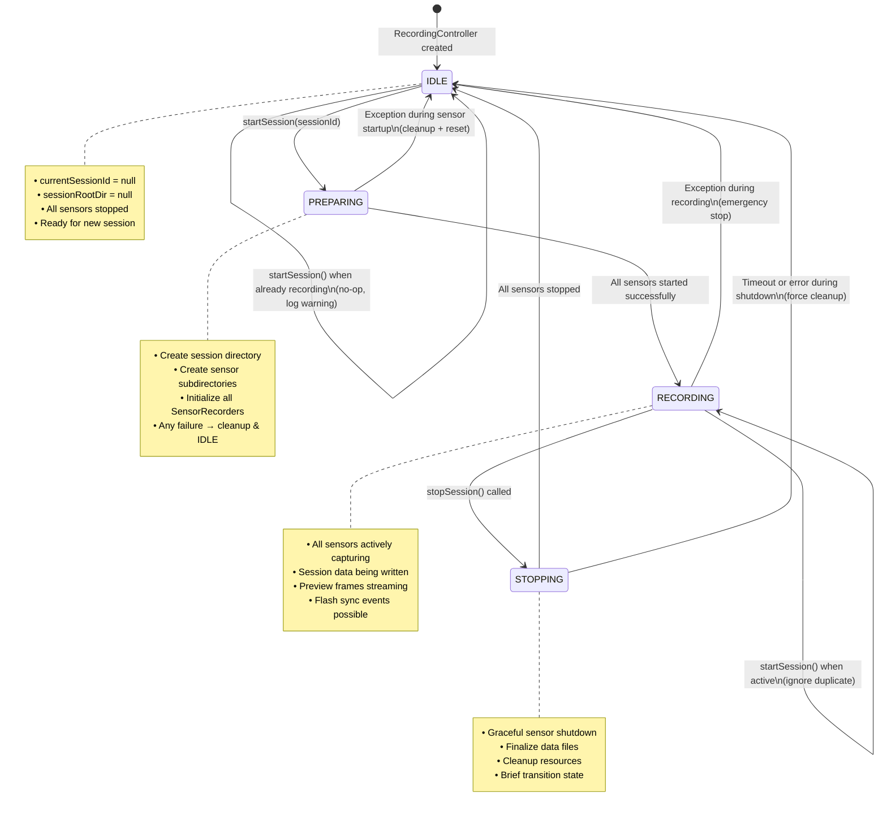

# RecordingController State Machine

**Purpose**: Show transitions and guards for the central Android recording orchestration component.

**Placement**: Chapter 4: Android Design section.

**Content**: States: IDLE → PREPARING → RECORDING → STOPPING → IDLE, with exception handling and early exit paths.

## State Machine Diagram

### Mermaid State Diagram



### PlantUML State Diagram

```plantuml
@startuml
[*] --> IDLE : Constructor

state IDLE {
    IDLE : currentSessionId = null
    IDLE : sessionRootDir = null
    IDLE : All sensors stopped
}

state PREPARING {
    PREPARING : Creating session directory
    PREPARING : Initializing sensors
    PREPARING : Any failure → cleanup
}

state RECORDING {
    RECORDING : All sensors active
    RECORDING : Data capture in progress
    RECORDING : Preview streaming
}

state STOPPING {
    STOPPING : Graceful sensor shutdown
    STOPPING : File finalization
    STOPPING : Resource cleanup
}

IDLE --> PREPARING : startSession(sessionId)\n[sessionId valid]
PREPARING --> RECORDING : All sensors started\nsuccessfully
RECORDING --> STOPPING : stopSession()
STOPPING --> IDLE : Cleanup complete

%% Exception paths
PREPARING --> IDLE : Exception during startup\n(safeStopAll() + reset)
RECORDING --> IDLE : Exception during recording\n(emergency cleanup)
STOPPING --> IDLE : Shutdown timeout\n(force cleanup)

%% Edge cases
IDLE --> IDLE : startSession() when\nalready has session\n(log warning)
RECORDING --> RECORDING : startSession() while\nrecording (ignore)
STOPPING --> STOPPING : stopSession() while\nstopping (ignore)
@enduml
```

## State Transition Details

### IDLE → PREPARING

**Trigger**: `startSession(sessionId: String?)`

**Preconditions**:
- Current state is IDLE
- No active recording session

**Actions**:
1. Generate sessionId if not provided (timestamp-based)
2. Set state to PREPARING
3. Create session root directory
4. Create subdirectories for each registered sensor
5. Call `start(subdir)` on all SensorRecorder instances

**Success**: State → RECORDING, sessionId stored
**Failure**: Exception caught, `safeStopAll()` called, state → IDLE

### PREPARING → RECORDING

**Trigger**: All sensor recorders successfully started

**Actions**:
1. Store sessionRootDir and currentSessionId
2. Set state to RECORDING
3. Sensors begin data capture

**Parallel Operations**:
- RGB: CameraX video recording + JPEG capture + CSV indexing
- Thermal: CSV data generation (stub)
- GSR: Shimmer BLE streaming + CSV writing
- Preview: Frame downsampling and PreviewBus emission

### RECORDING → STOPPING

**Trigger**: `stopSession()`

**Preconditions**:
- Current state is RECORDING

**Actions**:
1. Set state to STOPPING
2. Call `stop()` on all sensor recorders (parallel)
3. Allow sensors to finalize files and cleanup

**Error Handling**: Individual sensor stop() failures logged but don't prevent others

### STOPPING → IDLE

**Trigger**: All sensors stopped successfully

**Actions**:
1. Clear currentSessionId and sessionRootDir
2. Set state to IDLE
3. Ready for next recording session

**Cleanup**: Resources released, connections closed, files flushed

## Exception Handling

### Startup Failures (PREPARING → IDLE)

**Common Causes**:
- Camera permission denied
- Storage access denied
- Shimmer BLE connection failed
- Insufficient disk space

**Recovery**:
```kotlin
try {
    // Start all sensors
} catch (t: Throwable) {
    safeStopAll() // Best-effort cleanup
    _currentSessionId.value = null
    sessionRootDir = null
    _state.value = State.IDLE
    throw t // Propagate to caller
}
```

### Runtime Exceptions (RECORDING → IDLE)

**Common Causes**:
- Storage full during recording
- Camera hardware error
- BLE connection lost
- App backgrounded/killed

**Recovery**:
- Emergency state reset to IDLE
- Partial session data preserved
- Error logged for debugging
- UI notification of failure

### Shutdown Timeouts (STOPPING → IDLE)

**Causes**:
- Sensor hardware unresponsive
- File I/O blocking
- Thread deadlock

**Recovery**:
- Force state transition to IDLE after timeout
- Log timeout warning
- May leave partial/corrupted files

## State Guards and Validations

### Session ID Validation
- Must be unique within sessions directory
- Format: timestamp + device identifier
- Length limits (filesystem compatibility)

### Storage Checks
- Available disk space (minimum 1GB)
- Write permissions to sessions directory
- External storage mounted and accessible

### Sensor Availability
- Camera permission granted
- Bluetooth enabled (for GSR)
- Hardware sensors responsive

### Concurrent Access Protection
- StateFlow provides thread-safe state access
- Synchronous state transitions (no race conditions)
- Coroutine-based sensor operations (non-blocking)

## Implementation Notes

**Thread Safety**: All state changes through StateFlow, sensor operations on background coroutines

**Resource Management**: Each sensor responsible for its own cleanup, controller coordinates but doesn't manage sensor internals

**Error Propagation**: Sensor failures bubble up to UI via exceptions, state machine ensures consistent recovery

**Testing**: State transitions unit tested with FakeRecorder implementations, timeout scenarios covered
