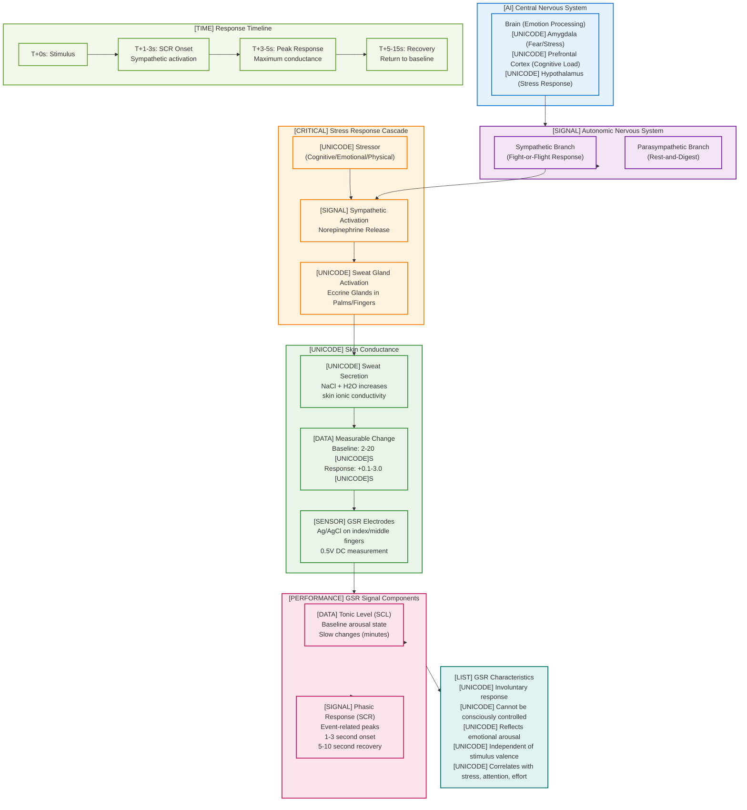

# Chapter 2: Background and Literature Review Visualizations

## Figure 2.1: Physiology of Galvanic Skin Response

## Figure 2.2: Thermal Cues of Stress - Facial ROI Analysis

```mermaid
flowchart TD
    %% Face diagram with ROIs
    subgraph FACE["[UNICODE] Facial Thermal Regions of Interest"]
        NOSE["[UNICODE] Nasal Region<br/>Primary stress indicator<br/>-0.3degC to -0.7degC cooling<br/>Sympathetic vasoconstriction"]

        FOREHEAD["[AI] Forehead<br/>Cognitive load indicator<br/>+0.2degC to +0.5degC warming<br/>Increased blood flow"]

        PERIORBITAL["[UNICODE] Periorbital Area<br/>Emotional arousal<br/>+/-0.1degC to +/-0.3degC<br/>Varies with stress type"]

        CHEEKS["[UNICODE] Cheek Region<br/>Social stress response<br/>Temperature changes<br/>Context-dependent"]
    end

    %% Physiological mechanisms
    subgraph MECHANISMS["[UNIT] Physiological Mechanisms"]
        VASOCONSTRICTION["[UNICODE] Vasoconstriction<br/>Sympathetic nervous system<br/>Reduced blood flow<br/>-> Temperature decrease"]

        VASODILATION["[THERMAL] Vasodilation<br/>Cognitive effort<br/>Increased blood flow<br/>-> Temperature increase"]

        PERSPIRATION["[UNICODE] Perspiration<br/>Evaporative cooling<br/>Sweat gland activation<br/>-> Localized cooling"]
    end

    %% Measurement specifications
    subgraph THERMAL_SPECS["[UNICODE] Thermal Camera Specifications"]
        CAMERA["[TARGET] Topdon TC001<br/>256[UNICODE]192 pixel resolution<br/>25Hz frame rate<br/>+/-0.1degC accuracy<br/>7.5-14[UNICODE]m spectral range"]

        PROCESSING["[INTEGRATION] Image Processing<br/>[UNICODE] ROI temperature extraction<br/>[UNICODE] Temporal filtering<br/>[UNICODE] Motion compensation<br/>[UNICODE] Baseline normalization"]
    end

    %% Research findings
    subgraph FINDINGS["[DATA] Research Findings"]
        RTI_STUDY["[TEST] RTI International (2024)<br/>Nasal cooling: 0.3-0.7degC<br/>Cognitive load correlation: r=0.68<br/>Response time: 10-30 seconds"]

        ZHANG_STUDY["[PERFORMANCE] Zhang et al. (2021)<br/>Multi-ROI approach<br/>89.7% stress classification<br/>FLIR Lepton 160[UNICODE]120, 9Hz"]

        LIMITATIONS["[WARNING] Known Limitations<br/>[UNICODE] Ambient temperature effects<br/>[UNICODE] Individual variation<br/>[UNICODE] Motion artifacts<br/>[UNICODE] Lighting conditions"]
    end

    %% Connections
    NOSE --> VASOCONSTRICTION
    FOREHEAD --> VASODILATION
    PERIORBITAL --> VASODILATION
    CHEEKS --> PERSPIRATION

    CAMERA --> PROCESSING
    PROCESSING --> RTI_STUDY
    PROCESSING --> ZHANG_STUDY

    %% Thermal response timeline
    subgraph THERMAL_TIMELINE["[TIME] Thermal Response Timeline"]
        TT0["T+0s: Stress Onset"]
        TT1["T+10-30s: Initial Response<br/>Vasoconstriction begins"]
        TT2["T+1-2min: Peak Change<br/>Maximum temperature shift"]
        TT3["T+3-5min: Stabilization<br/>New thermal equilibrium"]
    end

    TT0 --> TT1 --> TT2 --> TT3

    %% Styling
    classDef faceStyle fill:#ffebee,stroke:#d32f2f,stroke-width:2px
    classDef mechStyle fill:#e8eaf6,stroke:#3f51b5,stroke-width:2px
    classDef specStyle fill:#e0f2f1,stroke:#00796b,stroke-width:2px
    classDef findingStyle fill:#fff8e1,stroke:#ff8f00,stroke-width:2px
    classDef timeStyle fill:#f3e5f5,stroke:#7b1fa2,stroke-width:2px

    class FACE,NOSE,FOREHEAD,PERIORBITAL,CHEEKS faceStyle
    class MECHANISMS,VASOCONSTRICTION,VASODILATION,PERSPIRATION mechStyle
    class THERMAL_SPECS,CAMERA,PROCESSING specStyle
    class FINDINGS,RTI_STUDY,ZHANG_STUDY,LIMITATIONS findingStyle
    class THERMAL_TIMELINE,TT0,TT1,TT2,TT3 timeStyle
```

## Table 2.1: Comparison of Stress Indicators

| Indicator | Latency | Accuracy | Invasiveness | Cost | Real-time Capability | Research Maturity |
|-----------|---------|----------|--------------|------|---------------------|-------------------|
| **GSR (Electrodes)** | 1-3 seconds | High (90-95%) | High (skin contact) | Low ($200-500) | Yes | Very High |
| **Salivary Cortisol** | 20-30 minutes | High (85-90%) | Medium (sample collection) | Medium ($50-100/test) | No | High |
| **Blood Cortisol** | 15-20 minutes | Very High (95%+) | High (blood draw) | High ($100-200/test) | No | Very High |
| **Thermal Imaging** | 10-60 seconds | Medium (70-85%) | None (contactless) | High ($2000-5000) | Yes | Medium |
| **Heart Rate Variability** | 1-2 minutes | Medium (75-85%) | Low (chest strap/watch) | Medium ($100-300) | Yes | High |
| **Facial Expression** | Real-time | Low-Medium (60-75%) | None (video) | Low-Medium ($0-1000) | Yes | Medium |
| **Voice Stress** | Real-time | Low-Medium (65-80%) | None (audio) | Low ($100-500) | Yes | Low-Medium |

## Table 2.2: Sensor Specifications

### Shimmer3 GSR+ Sensor
| Specification | Value | Notes |
|---------------|-------|-------|
| **Sampling Rate** | 1-1000 Hz (typically 128 Hz) | Configurable, Nyquist theorem compliance |
| **Resolution** | 16-bit ADC | 65,536 discrete levels |
| **GSR Range** | 10 k[UNICODE] to 4.7 M[UNICODE] | Covers full physiological range |
| **Accuracy** | +/-5% of reading | Calibrated against reference standards |
| **Response Time** | <100ms | Electronic circuit latency |
| **Battery Life** | 24+ hours continuous | 450mAh Li-ion battery |
| **Wireless** | Bluetooth 2.1 + EDR | 10m range, 2.4GHz ISM band |
| **Form Factor** | 65[UNICODE]32[UNICODE]15mm, 23.5g | Wearable design |
| **Electrodes** | Ag/AgCl disposable | Standard 8mm diameter |
| **Output Format** | Raw ADC + calibrated [UNICODE]S | Real-time streaming |

### Topdon TC001 Thermal Camera
| Specification | Value | Notes |
|---------------|-------|-------|
| **Thermal Resolution** | 256[UNICODE]192 pixels | 49,152 thermal pixels |
| **Frame Rate** | 25 Hz | Real-time thermal video |
| **Spectral Range** | 8-14 [UNICODE]m | Long-wave infrared (LWIR) |
| **Thermal Sensitivity** | <0.04degC (40mK) | NETD specification |
| **Accuracy** | +/-2degC or +/-2% of reading | Calibrated temperature measurement |
| **Temperature Range** | -10degC to +550degC | Extended range capability |
| **Field of View** | 35deg [UNICODE] 27deg | Wide angle coverage |
| **Focus** | Fixed focus, 0.15m to [UNICODE] | No mechanical adjustment |
| **Interface** | USB-C (Android) | Direct smartphone connection |
| **Power** | USB powered (5V, 1A) | No separate battery required |
| **Weight** | 45g | Lightweight smartphone attachment |

## Caption Information

**Figure 2.1**: Physiology of Galvanic Skin Response showing the complete pathway from nervous system activation to measurable skin conductance changes. The diagram illustrates how emotional or cognitive stressors trigger sympathetic nervous system responses, leading to sweat gland activation and increased skin conductivity measured by GSR electrodes.

**Figure 2.2**: Thermal cues of stress highlighting key facial regions of interest for contactless stress detection. Nasal region cooling (-0.3degC to -0.7degC) serves as the primary indicator due to sympathetic vasoconstriction, while forehead warming indicates cognitive load through increased blood flow.

**Table 2.1**: Comprehensive comparison of stress measurement modalities showing GSR's advantages in latency and accuracy, contrasted with thermal imaging's contactless benefit despite moderate accuracy.

**Table 2.2**: Detailed sensor specifications for the Shimmer3 GSR+ and Topdon TC001 thermal camera, documenting the research-grade capabilities that enable precise physiological measurements.

**Thesis Placement**:
- Chapter 2, Section 2.1 (Physiological Foundations)
- Chapter 2, Section 2.2 (Contactless Measurement Technologies)
- Chapter 2, Section 2.3 (Comparative Analysis of Stress Indicators)
