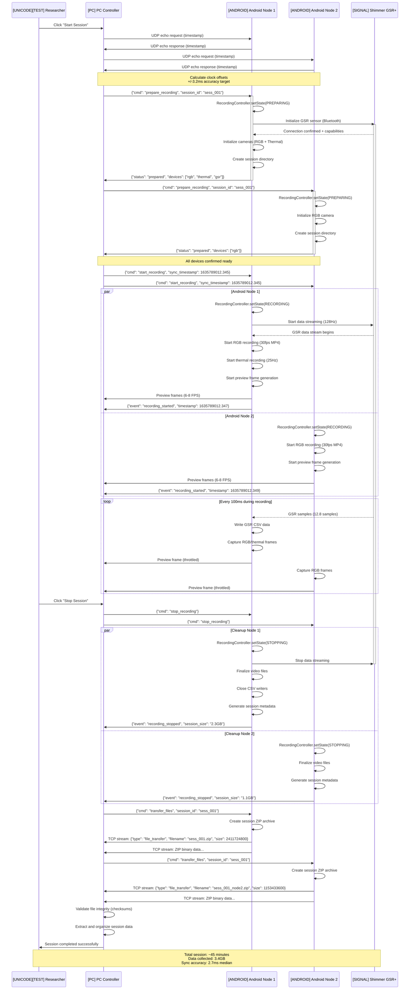

# Chapter 4: Sequence Diagrams and Screenshots

## Figure 4.5: Protocol Sequence Diagram - Start/Stop Recording

## Figure 4.6: Data Processing Pipeline

```mermaid
flowchart LR
    %% Input Sources
    subgraph INPUTS["[UNICODE] Input Sources"]
        RGB_CAM["[UNICODE] RGB Camera<br/>30fps, 1920[UNICODE]1080<br/>H.264 MP4 encoding"]
        THERMAL_CAM["[THERMAL] Thermal Camera<br/>25Hz, 256[UNICODE]192<br/>Radiometric data"]
        GSR_SENSOR["[SIGNAL] GSR Sensor<br/>128Hz sampling<br/>16-bit resolution"]
    end

    %% Android Processing
    subgraph ANDROID_PROC["[ANDROID] Android Processing"]

        subgraph RGB_PIPELINE["[UNICODE] RGB Pipeline"]
            RGB_CAPTURE["Camera2 API<br/>Dual capture"]
            MP4_WRITER["MP4 Writer<br/>Storage ready"]
            JPEG_PREVIEW["JPEG Preview<br/>Network streaming"]
        end

        subgraph THERMAL_PIPELINE["[THERMAL] Thermal Pipeline"]
            THERMAL_SDK["Topdon SDK<br/>Raw sensor data"]
            TEMP_EXTRACT["Temperature Extraction<br/>ROI processing"]
            THERMAL_CSV["CSV Writer<br/>Timestamped data"]
        end

        subgraph GSR_PIPELINE["[SIGNAL] GSR Pipeline"]
            BT_STREAM["Bluetooth Stream<br/>Real-time data"]
            GSR_CONVERT["ADC to [UNICODE]S<br/>Calibration applied"]
            GSR_CSV["CSV Writer<br/>High-frequency data"]
        end

        SESSION_DIR["[UNICODE] Session Directory<br/>Organized file structure<br/>Metadata generation"]
    end

    %% Data Transfer
    subgraph TRANSFER["[INTEGRATION] Data Transfer"]
        ZIP_ARCHIVE["[UNICODE] ZIP Archive<br/>Compression + integrity"]
        TCP_STREAM["[PROTOCOL] TCP Stream<br/>Progress monitoring"]
        CHECKSUM["[OK] Integrity Check<br/>SHA-256 validation"]
    end

    %% PC Processing
    subgraph PC_PROC["[PC] PC Processing"]

        subgraph RECEIVE["[UNICODE] Data Reception"]
            FILE_SERVER["File Transfer Server<br/>Multi-connection handling"]
            EXTRACT["Archive Extraction<br/>Directory organization"]
            VALIDATE["Data Validation<br/>Quality checks"]
        end

        subgraph ANALYSIS["[DATA] Data Analysis"]
            ALIGNMENT["Timestamp Alignment<br/>Cross-modal sync"]
            EXPORT["Multi-Format Export<br/>CSV, JSON, Parquet"]
            VISUALIZATION["Real-time Visualization<br/>Quality monitoring"]
        end

        subgraph STORAGE["[DATA] Long-term Storage"]
            ARCHIVE["Session Archive<br/>Compressed storage"]
            METADATA["Metadata Database<br/>Search & indexing"]
            BACKUP["Backup Integration<br/>Research data protection"]
        end
    end

    %% Output Formats
    subgraph OUTPUTS["[UNICODE] Output Formats"]
        RESEARCH_DATA["[TEST] Research Dataset<br/>[UNICODE] Synchronized timestamps<br/>[UNICODE] Multi-modal alignment<br/>[UNICODE] Quality metrics<br/>[UNICODE] Analysis-ready format"]

        REPORTS["[LIST] Session Reports<br/>[UNICODE] Data quality summary<br/>[UNICODE] Synchronization accuracy<br/>[UNICODE] Device performance<br/>[UNICODE] Error logs"]

        EXPORTS["[DATA] Export Formats<br/>[UNICODE] MATLAB compatibility<br/>[UNICODE] Python/pandas<br/>[UNICODE] R statistical analysis<br/>[UNICODE] Custom formats"]
    end

    %% Data Flow
    RGB_CAM --> RGB_CAPTURE
    RGB_CAPTURE --> MP4_WRITER
    RGB_CAPTURE --> JPEG_PREVIEW

    THERMAL_CAM --> THERMAL_SDK
    THERMAL_SDK --> TEMP_EXTRACT
    TEMP_EXTRACT --> THERMAL_CSV

    GSR_SENSOR --> BT_STREAM
    BT_STREAM --> GSR_CONVERT
    GSR_CONVERT --> GSR_CSV

    MP4_WRITER --> SESSION_DIR
    THERMAL_CSV --> SESSION_DIR
    GSR_CSV --> SESSION_DIR

    SESSION_DIR --> ZIP_ARCHIVE
    ZIP_ARCHIVE --> TCP_STREAM
    TCP_STREAM --> CHECKSUM

    CHECKSUM --> FILE_SERVER
    FILE_SERVER --> EXTRACT
    EXTRACT --> VALIDATE

    VALIDATE --> ALIGNMENT
    ALIGNMENT --> EXPORT
    ALIGNMENT --> VISUALIZATION

    EXPORT --> ARCHIVE
    VISUALIZATION --> METADATA
    ARCHIVE --> BACKUP

    ARCHIVE --> RESEARCH_DATA
    METADATA --> REPORTS
    EXPORT --> EXPORTS

    %% Preview Stream
    JPEG_PREVIEW -.->|Real-time| VISUALIZATION

    %% Data Quality Metrics
    METRICS["[DATA] Quality Metrics<br/>[UNICODE] Frame drop detection<br/>[UNICODE] Sync drift monitoring<br/>[UNICODE] Signal-to-noise ratio<br/>[UNICODE] Missing data analysis"]

    VALIDATE --> METRICS
    METRICS --> REPORTS

    %% Styling
    classDef inputStyle fill:#e3f2fd,stroke:#1976d2,stroke-width:2px
    classDef androidStyle fill:#e8f5e8,stroke:#388e3c,stroke-width:2px
    classDef transferStyle fill:#f3e5f5,stroke:#7b1fa2,stroke-width:2px
    classDef pcStyle fill:#fff3e0,stroke:#f57c00,stroke-width:2px
    classDef outputStyle fill:#fce4ec,stroke:#c2185b,stroke-width:2px
    classDef qualityStyle fill:#f1f8e9,stroke:#689f38,stroke-width:2px

    class INPUTS,RGB_CAM,THERMAL_CAM,GSR_SENSOR inputStyle
    class ANDROID_PROC,RGB_PIPELINE,THERMAL_PIPELINE,GSR_PIPELINE,RGB_CAPTURE,MP4_WRITER,JPEG_PREVIEW,THERMAL_SDK,TEMP_EXTRACT,THERMAL_CSV,BT_STREAM,GSR_CONVERT,GSR_CSV,SESSION_DIR androidStyle
    class TRANSFER,ZIP_ARCHIVE,TCP_STREAM,CHECKSUM transferStyle
    class PC_PROC,RECEIVE,ANALYSIS,STORAGE,FILE_SERVER,EXTRACT,VALIDATE,ALIGNMENT,EXPORT,VISUALIZATION,ARCHIVE,METADATA,BACKUP pcStyle
    class OUTPUTS,RESEARCH_DATA,REPORTS,EXPORTS outputStyle
    class METRICS qualityStyle
```

## Screenshots and UI Documentation

### Figure 4.4: Desktop GUI Screenshots

#### 4.4.1: Main Dashboard View
**[PLACEHOLDER FOR SCREENSHOT]**
- **Caption**: Main dashboard showing connected Android devices, real-time sensor status, and session controls. Device panel displays connection quality, battery levels, and sensor capabilities.
- **Key Elements**:
  - Device list with status indicators (green = connected, red = error)
  - Session control buttons (Start, Stop, Export)
  - Real-time preview windows for RGB and thermal cameras
  - System resource monitors (CPU, memory, network)

#### 4.4.2: Playback/Annotation Interface
**[PLACEHOLDER FOR SCREENSHOT]** *(Reference existing Fig 4.4 from current docs)*
- **Caption**: Data playback interface with synchronized timeline, multi-modal data visualization, and annotation tools for post-session analysis.
- **Key Elements**:
  - Timeline scrubber with synchronized playback
  - GSR signal plot with event markers
  - Thermal video with ROI overlays
  - RGB video with facial detection boxes

### Figure 4.7: Android Application Interface

#### 4.7.1: Connection Setup Screen
**[PLACEHOLDER FOR SCREENSHOT]**
- **Caption**: Android application connection screen showing automatic PC discovery and manual IP entry options.
- **Key Elements**:
  - Discovered PC controllers list
  - Manual IP address input field
  - Connection status indicators
  - Network quality indicators

#### 4.7.2: Recording Control Screen
**[PLACEHOLDER FOR SCREENSHOT]**
- **Caption**: Active recording interface displaying sensor status, preview windows, and session controls.
- **Key Elements**:
  - Recording status indicator (red = active)
  - Sensor status cards (GSR, RGB, Thermal)
  - Preview windows with live feeds
  - Error notifications area
  - Session timer and data size counters

## Caption Information

**Figure 4.5**: Complete protocol sequence diagram illustrating the end-to-end workflow from session initiation through data transfer. Shows time synchronization, parallel device coordination, and file transfer protocols with actual message formats and timing.

**Figure 4.6**: Data processing pipeline showing the complete flow from sensor capture through analysis-ready research datasets. Emphasizes real-time processing, quality validation, and multi-format export capabilities.

**Figures 4.4, 4.7**: User interface screenshots demonstrating the practical usability of both PC controller and Android applications, showing real-world data visualization and control interfaces.

**Thesis Placement**:
- Chapter 4, Section 4.3 (Communication Protocols)
- Chapter 4, Section 4.4 (Data Processing Architecture)
- Chapter 4, Section 4.5 (User Interface Design)
