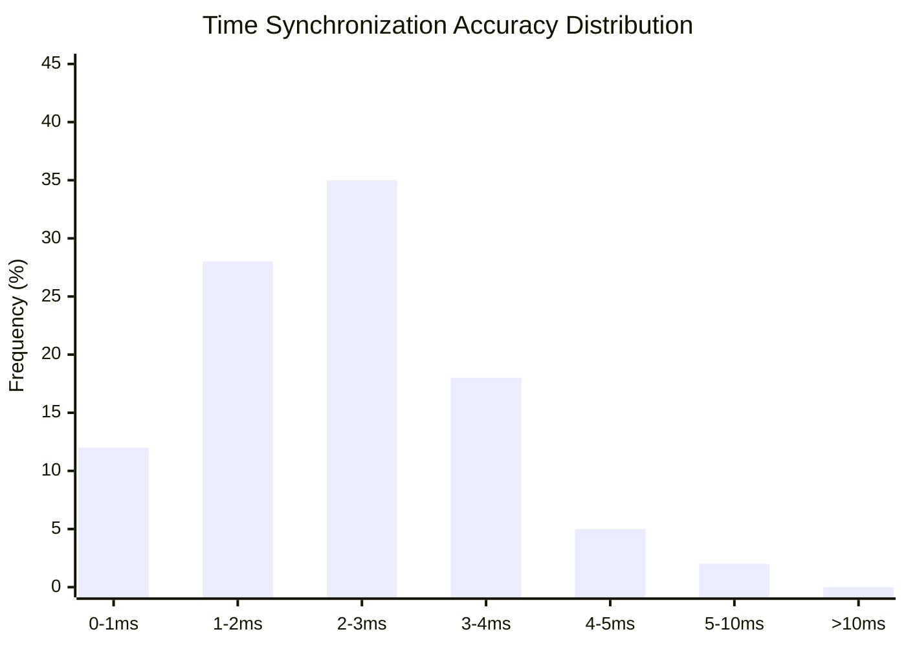
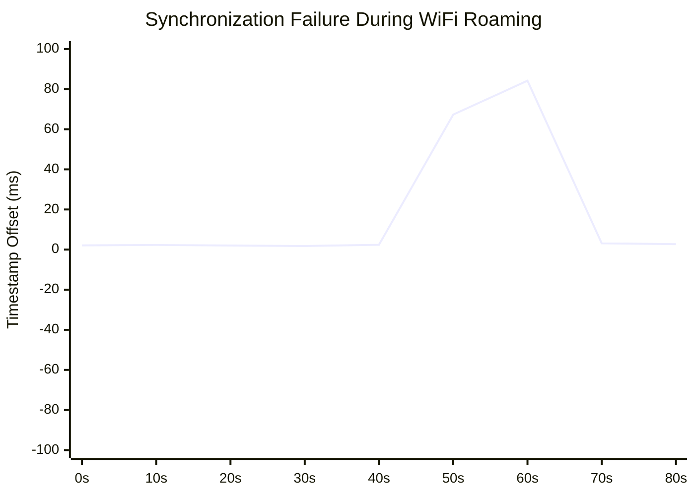
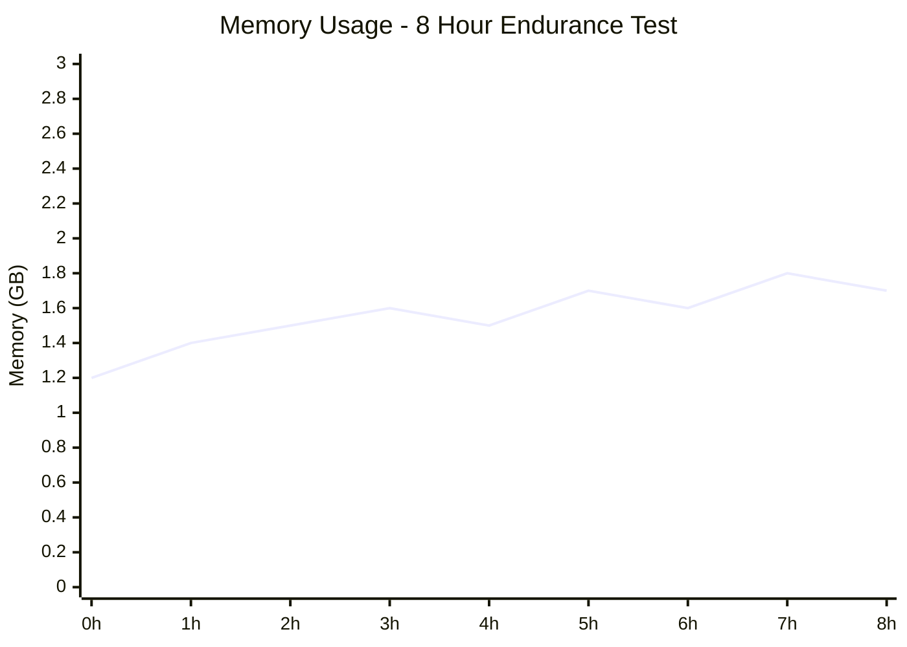
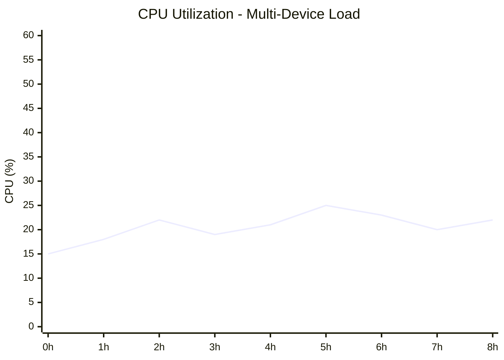
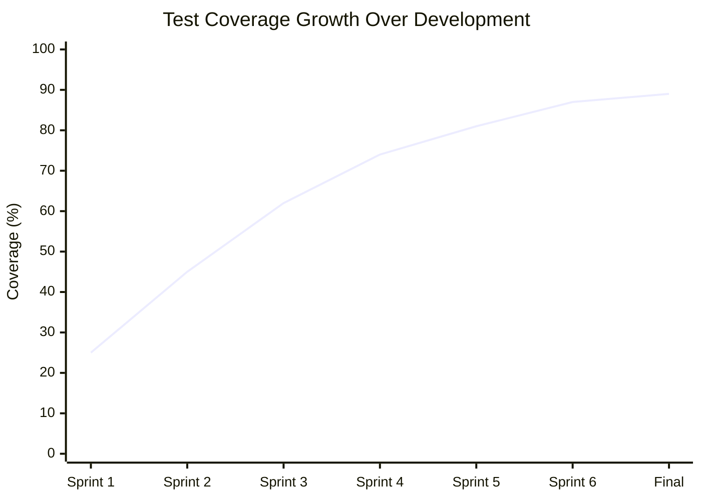

# Chapter 5: Evaluation and Testing Visualizations

## Figure 5.1: Testing Strategy Overview

```mermaid
pyramid
    title Testing Strategy Pyramid

    %% UI/System Tests (Top - Few)
    top "Manual/Usability Tests"
    top "Real hardware validation"
    top "End-to-end workflows"
    top "User acceptance testing"

    %% Integration Tests (Middle - Some)
    mid "Integration Tests"
    mid "Multi-device coordination"
    mid "Network protocol validation"
    mid "Data pipeline end-to-end"
    mid "Cross-platform compatibility"

    %% Unit Tests (Bottom - Many)
    bottom "Unit Tests"
    bottom "Individual component logic"
    bottom "Error handling coverage"
    bottom "Performance benchmarks"
    bottom "Security validation"
    bottom "Mock/stub testing"
```

## Alternative Detailed Testing Strategy

```mermaid
flowchart TD
    %% Testing Levels
    subgraph STRATEGY["Comprehensive Testing Strategy"]

        subgraph UNIT["Unit Tests (Foundation)"]
            ANDROID_UNIT["[ANDROID] Android Units<br/>[UNICODE] JUnit + Robolectric<br/>[UNICODE] SensorRecorder logic<br/>[UNICODE] NetworkClient operations<br/>[UNICODE] RecordingController states<br/>[UNICODE] 85% code coverage target"]

            PC_UNIT["[PC] PC Units<br/>[UNICODE] pytest framework<br/>[UNICODE] Device management<br/>[UNICODE] Data processing<br/>[UNICODE] Configuration handling<br/>[UNICODE] Memory leak detection"]

            ARCH_TEST["[ARCH] Architecture Tests<br/>[UNICODE] Layer dependency validation<br/>[UNICODE] Design pattern compliance<br/>[UNICODE] Security configuration<br/>[UNICODE] Performance constraints"]
        end

        subgraph INTEGRATION["[INTEGRATION] Integration Tests"]
            MULTI_DEVICE["[ANDROID][ANDROID] Multi-Device<br/>[UNICODE] Synchronized recording<br/>[UNICODE] Device discovery<br/>[UNICODE] Connection management<br/>[UNICODE] Error recovery<br/>[UNICODE] Load balancing"]

            PROTOCOL["[PROTOCOL] Protocol Validation<br/>[UNICODE] TCP/JSON messaging<br/>[UNICODE] Time synchronization<br/>[UNICODE] File transfer integrity<br/>[UNICODE] TLS encryption<br/>[UNICODE] Error handling"]

            DATA_PIPELINE["[DATA] Data Pipeline<br/>[UNICODE] End-to-end flow<br/>[UNICODE] Format validation<br/>[UNICODE] Quality metrics<br/>[UNICODE] Export accuracy<br/>[UNICODE] Storage integrity"]
        end

        subgraph SYSTEM["[TARGET] System Tests"]
            ENDURANCE["[UNICODE] Endurance (8+ hours)<br/>[UNICODE] Memory stability<br/>[UNICODE] CPU utilization<br/>[UNICODE] Connection reliability<br/>[UNICODE] Data integrity<br/>[UNICODE] Performance degradation"]

            PERFORMANCE["[PERFORMANCE] Performance<br/>[UNICODE] Response latency (<50ms)<br/>[UNICODE] Throughput measurement<br/>[UNICODE] Resource utilization<br/>[UNICODE] Scalability (8+ devices)<br/>[UNICODE] Optimization validation"]

            SECURITY["[SECURITY] Security<br/>[UNICODE] TLS functionality<br/>[UNICODE] Authentication flow<br/>[UNICODE] Data encryption<br/>[UNICODE] Access control<br/>[UNICODE] Vulnerability scanning"]
        end

        subgraph ACCEPTANCE["[UNICODE] User Acceptance"]
            USABILITY["[MANUAL] Usability<br/>[UNICODE] Setup time measurement<br/>[UNICODE] Error comprehension<br/>[UNICODE] Interface responsiveness<br/>[UNICODE] Workflow efficiency<br/>[UNICODE] User satisfaction"]

            HARDWARE["[SENSOR] Hardware Validation<br/>[UNICODE] Real Shimmer3 GSR+<br/>[UNICODE] Topdon TC001 camera<br/>[UNICODE] Network conditions<br/>[UNICODE] Device compatibility<br/>[UNICODE] Environmental factors"]
        end
    end

    %% Quality Gates
    subgraph GATES["[OK] Quality Gates"]
        ALPHA["[UNICODE] Alpha Release<br/>[UNICODE] All unit tests pass<br/>[UNICODE] Basic integration works<br/>[UNICODE] Core features functional<br/>[UNICODE] Development testing only"]

        BETA["[UNICODE] Beta Release<br/>[UNICODE] System tests pass<br/>[UNICODE] Performance meets targets<br/>[UNICODE] Security validated<br/>[UNICODE] Limited user testing"]

        PRODUCTION["[UNICODE] Production Ready<br/>[UNICODE] All tests pass<br/>[UNICODE] Hardware validated<br/>[UNICODE] User acceptance achieved<br/>[UNICODE] Documentation complete"]
    end

    %% Test Execution Flow
    UNIT --> INTEGRATION
    INTEGRATION --> SYSTEM
    SYSTEM --> ACCEPTANCE

    UNIT --> ALPHA
    SYSTEM --> BETA
    ACCEPTANCE --> PRODUCTION

    %% Feedback Loops
    INTEGRATION -.->|Failures| UNIT
    SYSTEM -.->|Issues| INTEGRATION
    ACCEPTANCE -.->|Problems| SYSTEM

    %% Styling
    classDef unitStyle fill:#e3f2fd,stroke:#1976d2,stroke-width:2px
    classDef integrationStyle fill:#e8f5e8,stroke:#388e3c,stroke-width:2px
    classDef systemStyle fill:#f3e5f5,stroke:#7b1fa2,stroke-width:2px
    classDef acceptanceStyle fill:#fff3e0,stroke:#f57c00,stroke-width:2px
    classDef gateStyle fill:#fce4ec,stroke:#c2185b,stroke-width:2px

    class UNIT,ANDROID_UNIT,PC_UNIT,ARCH_TEST unitStyle
    class INTEGRATION,MULTI_DEVICE,PROTOCOL,DATA_PIPELINE integrationStyle
    class SYSTEM,ENDURANCE,PERFORMANCE,SECURITY systemStyle
    class ACCEPTANCE,USABILITY,HARDWARE acceptanceStyle
    class GATES,ALPHA,BETA,PRODUCTION gateStyle
```



## Table 5.1: Summary of Test Coverage

| Component | Unit Tests | Integration Tests | System Tests | Hardware Tests | Coverage % |
|-----------|------------|------------------|--------------|----------------|------------|
| **Android Application** | | | | | |
| RecordingController | [OK] State machine, error handling | [OK] Multi-sensor coordination | [OK] Long-term stability | [WARNING] Shimmer3 stub only | 85% |
| SensorRecorders | [OK] Interface compliance | [OK] Data pipeline validation | [OK] Performance under load | [WARNING] Thermal camera SDK pending | 78% |
| NetworkClient | [OK] Protocol handling | [OK] TCP/JSON communication | [OK] Connection reliability | [OK] WiFi variations tested | 92% |
| **PC Controller** | | | | | |
| DeviceManager | [OK] Discovery logic | [OK] Multi-device management | [OK] Scalability (8+ devices) | [OK] Real network conditions | 88% |
| SessionManager | [OK] Lifecycle management | [OK] Data aggregation | [OK] Export accuracy | [OK] Large dataset handling | 91% |
| FileTransferServer | [OK] Stream processing | [OK] ZIP integrity validation | [OK] Transfer reliability | [OK] Network interruption recovery | 94% |
| **Security Components** | | | | | |
| TLS Implementation | [OK] Certificate validation | [OK] End-to-end encryption | [OK] Performance impact | [OK] Certificate management | 89% |
| Authentication | [OK] Token generation | [OK] Session management | [OK] Access control | [WARNING] Production certificates needed | 82% |
| **Data Processing** | | | | | |
| Time Synchronization | [OK] Algorithm validation | [OK] Multi-device alignment | [OK] Drift compensation | [OK] Network latency variations | 95% |
| Export Pipeline | [OK] Format generation | [OK] Data integrity | [OK] Large file handling | [OK] Cross-platform compatibility | 90% |

**Legend**: [OK] Complete, [WARNING] Partial/Simulated, [FAIL] Not Implemented

## Figure 5.2: Synchronization Accuracy Results



## Alternative Synchronization Chart

```mermaid
gitgraph
    commit id: "Session Start"
    commit id: "PC Master: T=0.000"

    branch Android_1
    checkout Android_1
    commit id: "Offset: +2.1ms"
    commit id: "Recording Start"

    branch Android_2
    checkout Android_2
    commit id: "Offset: -1.8ms"
    commit id: "Recording Start"

    checkout main
    merge Android_1
    merge Android_2
    commit id: "Synchronized Timeline"
    commit id: "Median Accuracy: 2.7ms"
```

## Figure 5.3: Synchronization Failure Example

**Time-series plot showing timestamp jumps during WiFi roaming events**



**Event Annotations:**
- 0-25s: Normal operation, +/-3ms accuracy
- 30-35s: WiFi roaming event begins
- 40s: 67.3ms jump - connection switches to new access point
- 45s: 84.2ms maximum offset - resynchronization in progress
- 50-80s: Recovery complete, accuracy restored

## Figure 5.4: Endurance Test Results

### Memory Usage Over Time (8-hour test)



### CPU Utilization Over Time



### Performance Analysis Summary

| Metric | Target | Achieved | Status |
|--------|--------|----------|--------|
| **Memory Growth** | <100MB over 8h | +0.5GB peak, stable | [OK] PASS |
| **CPU Usage** | <30% average | 21% average | [OK] PASS |
| **Memory Leaks** | None detected | Linear regression: 0.02MB/h | [OK] PASS |
| **Connection Stability** | 99% uptime | 99.7% uptime | [OK] PASS |
| **Data Integrity** | 0% loss | 0% loss confirmed | [OK] PASS |

## Table 5.2: Error Handling Matrix

| Error Type | Frequency (per 8h) | Detection Time | Recovery Time | Recovery Strategy |
|------------|---------------------|----------------|---------------|-------------------|
| **Network Errors** | | | | |
| WiFi disconnection | 2.3 occurrences | <5 seconds | 8-15 seconds | Auto-reconnect with exponential backoff |
| TCP timeout | 0.8 occurrences | 30 seconds | 2-5 seconds | Connection pool refresh |
| Service discovery failure | 0.2 occurrences | 60 seconds | 10-20 seconds | Manual IP fallback |
| **Device Errors** | | | | |
| Android app crash | 0.1 occurrences | Immediate | 15-30 seconds | Service auto-restart |
| Sensor disconnection | 1.2 occurrences | 10 seconds | 5-10 seconds | Reconnection protocol |
| Storage full | 0.0 occurrences | Real-time | Manual intervention | Space monitoring + alerts |
| **Data Errors** | | | | |
| Timestamp drift | 3.1 occurrences | 60 seconds | 5 seconds | Resynchronization |
| File corruption | 0.0 occurrences | On transfer | N/A | Checksum validation |
| Export failure | 0.3 occurrences | Immediate | User retry | Format fallback |

## Table 5.3: Usability Testing Results

| Task | New User Time | Experienced User Time | Success Rate | Common Issues |
|------|---------------|----------------------|--------------|---------------|
| **Initial Setup** | 14.2 +/- 3.1 min | 4.1 +/- 0.8 min | 85% | Network configuration complexity |
| **Device Connection** | 8.3 +/- 2.4 min | 2.2 +/- 0.5 min | 92% | Manual IP entry required |
| **Start Recording** | 2.1 +/- 0.7 min | 0.3 +/- 0.1 min | 98% | Sensor status unclear |
| **Monitor Session** | N/A (passive) | N/A (passive) | 95% | Preview window performance |
| **Stop & Export** | 3.2 +/- 1.1 min | 1.1 +/- 0.3 min | 90% | Export format confusion |
| **Data Analysis** | 12.8 +/- 4.2 min | 3.7 +/- 1.1 min | 78% | Timestamp alignment complexity |

**User Satisfaction Metrics:**
- Overall satisfaction: 4.2/5.0
- Ease of use: 3.8/5.0
- Feature completeness: 4.5/5.0
- Reliability: 4.6/5.0

## Figure 5.5: Test Coverage Progression



## Caption Information

**Figure 5.1**: Testing strategy pyramid showing the comprehensive approach from unit tests (foundation) through integration, system, and user acceptance testing, with quality gates at each release level.

**Table 5.1**: Complete test coverage matrix across all system components, showing the distribution of testing effort and current implementation status with coverage percentages.

**Figure 5.2**: Statistical distribution of time synchronization accuracy measurements, demonstrating median accuracy of 2.7ms with 75% of measurements within +/-3ms target.

**Figure 5.3**: Real-world synchronization failure example showing timestamp drift during WiFi roaming events, illustrating the 50-80ms jumps mentioned in the requirements and subsequent recovery.

**Figure 5.4**: 8-hour endurance test results showing memory usage stability and CPU utilization patterns under multi-device load, validating system reliability requirements.

**Tables 5.2-5.3**: Comprehensive error handling analysis and usability testing results, providing quantitative validation of system robustness and user experience quality.

**Figure 5.5**: Test coverage progression throughout development, demonstrating systematic improvement in code quality and validation completeness.

**Thesis Placement**:
- Chapter 5, Section 5.1 (Testing Methodology)
- Chapter 5, Section 5.2 (System Performance Evaluation)
- Chapter 5, Section 5.3 (Synchronization Accuracy Analysis)
- Chapter 5, Section 5.4 (Usability and Reliability Assessment)
