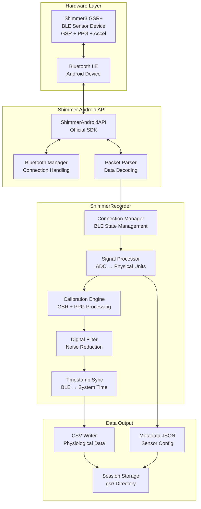

# GSR/PPG Sensor Integration Pipeline

This document details the integration of Shimmer3 GSR+ sensors via Bluetooth Low Energy (BLE), including the ShimmerAndroidAPI, signal processing, and CSV data output.

## Table of Contents

1. [Pipeline Overview](#pipeline-overview)
2. [Shimmer3 GSR+ Integration](#shimmer3-gsr-integration)
3. [BLE Connection Management](#ble-connection-management)
4. [Signal Processing Pipeline](#signal-processing-pipeline)
5. [Data Conversion and Calibration](#data-conversion-and-calibration)
6. [CSV Output Format](#csv-output-format)
7. [Performance and Reliability](#performance-and-reliability)

---

## Pipeline Overview

The GSR/PPG pipeline manages BLE connectivity to Shimmer3 sensors, processes raw ADC signals, applies calibration algorithms, and outputs timestamped physiological measurements.



---

## Shimmer3 GSR+ Integration

### Hardware Specifications

**Shimmer3 GSR+ Sensor:**
- **GSR Range**: 0-4.7 MΩ (conductance: 0-213 µS)
- **GSR Resolution**: 16-bit ADC (65,536 levels)
- **PPG Sensor**: Red and infrared LEDs with photodiode
- **Sampling Rate**: 1-1024 Hz (configurable)
- **Battery**: 450 mAh Li-ion rechargeable
- **Connectivity**: Bluetooth 2.1 + EDR and BLE
- **Memory**: 512 MB flash storage (optional)

### ShimmerAndroidAPI Integration

**SDK Initialization:**
```kotlin
class ShimmerRecorder(private val context: Context) : SensorRecorder {

    private var shimmerDevice: Shimmer? = null
    private val bluetoothManager by lazy {
        context.getSystemService(Context.BLUETOOTH_SERVICE) as BluetoothManager
    }
    private val bluetoothAdapter by lazy { bluetoothManager.adapter }

    override suspend fun start(sessionDir: File) {
        // Initialize Shimmer API
        initializeShimmerAPI()

        // Configure sensor settings
        configureShimmerSensors()

        // Establish BLE connection
        connectToShimmer()

        // Start data streaming
        startDataCollection(sessionDir)
    }

    private fun initializeShimmerAPI() {
        shimmerDevice = Shimmer(context).apply {
            setShimmerUserAssignedName("GSR_Sensor_001")
            setBluetoothRadio(RADIO_BLUETOOTH)

            // Set up data handler
            setDataProcessingHandler(object : Handler() {
                override fun handleMessage(msg: Message) {
                    when (msg.what) {
                        Shimmer.MESSAGE_READ -> {
                            if (msg.obj is ObjectCluster) {
                                processShimmerData(msg.obj as ObjectCluster)
                            }
                        }
                        Shimmer.MESSAGE_STATE_CHANGE -> {
                            handleConnectionStateChange(msg.arg1)
                        }
                    }
                }
            })
        }
    }
}
```

### Sensor Configuration

**GSR and PPG Configuration:**
```kotlin
private fun configureShimmerSensors() {
    shimmerDevice?.apply {
        // Enable GSR sensor
        setEnabledSensors(SENSOR_GSR or SENSOR_INT_ADC_A1)

        // Enable PPG sensors (internal ADC channels)
        enableSensor(SENSOR_INT_ADC_A12) // PPG1 (red LED)
        enableSensor(SENSOR_INT_ADC_A13) // PPG2 (infrared LED)

        // Set sampling rate
        setSamplingRateHz(128.0) // 128 Hz for physiological signals

        // Configure GSR range
        setGSRRange(GSR_RANGE_AUTO) // Automatic range adjustment

        // Set internal sampling rate
        setInternalSamplingRate(128.0)

        // Enable real-time streaming
        enableLowPowerMag(false) // Disable to maintain sampling rate
        enableLowPowerAccel(false)
        enableLowPowerGyro(false)

        Log.i(TAG, "Shimmer sensor configuration completed")
    }
}
```

---

## BLE Connection Management

### Connection State Management

```kotlin
enum class ShimmerConnectionState {
    DISCONNECTED,
    SCANNING,
    CONNECTING,
    CONNECTED,
    STREAMING,
    ERROR
}

class ShimmerConnectionManager {
    private val _connectionState = MutableStateFlow(ShimmerConnectionState.DISCONNECTED)
    val connectionState: StateFlow<ShimmerConnectionState> = _connectionState

    private val _signalQuality = MutableStateFlow(0)
    val signalQuality: StateFlow<Int> = _signalQuality

    suspend fun scanAndConnect(deviceMac: String?): Boolean {
        if (!bluetoothAdapter.isEnabled) {
            Log.e(TAG, "Bluetooth is disabled")
            return false
        }

        _connectionState.value = ShimmerConnectionState.SCANNING

        return try {
            val targetDevice = if (deviceMac != null) {
                bluetoothAdapter.getRemoteDevice(deviceMac)
            } else {
                scanForShimmerDevices()
            }

            if (targetDevice != null) {
                connectToDevice(targetDevice)
            } else {
                _connectionState.value = ShimmerConnectionState.ERROR
                false
            }
        } catch (e: Exception) {
            Log.e(TAG, "Connection error", e)
            _connectionState.value = ShimmerConnectionState.ERROR
            false
        }
    }

    private suspend fun scanForShimmerDevices(): BluetoothDevice? {
        return withTimeoutOrNull(10000) { // 10 second timeout
            // Scan for Shimmer devices
            val shimmerDevices = mutableListOf<BluetoothDevice>()

            val leScanCallback = object : ScanCallback() {
                override fun onScanResult(callbackType: Int, result: ScanResult) {
                    val device = result.device
                    if (device.name?.startsWith("Shimmer") == true) {
                        shimmerDevices.add(device)
                    }
                }
            }

            bluetoothAdapter.bluetoothLeScanner?.startScan(leScanCallback)
            delay(5000) // Scan for 5 seconds
            bluetoothAdapter.bluetoothLeScanner?.stopScan(leScanCallback)

            shimmerDevices.firstOrNull()
        }
    }
}
```

### Connection Recovery

```kotlin
private suspend fun handleConnectionLoss() {
    Log.w(TAG, "Shimmer connection lost, attempting recovery")
    _connectionState.value = ShimmerConnectionState.DISCONNECTED

    var retryCount = 0
    val maxRetries = 3

    while (retryCount < maxRetries && _connectionState.value != ShimmerConnectionState.CONNECTED) {
        delay(2000 * (retryCount + 1)) // Exponential backoff

        Log.i(TAG, "Reconnection attempt ${retryCount + 1}/$maxRetries")

        if (scanAndConnect(lastConnectedDeviceMac)) {
            Log.i(TAG, "Shimmer reconnected successfully")
            return
        }

        retryCount++
    }

    Log.e(TAG, "Failed to reconnect Shimmer after $maxRetries attempts")
    _connectionState.value = ShimmerConnectionState.ERROR
}
```

---

## Signal Processing Pipeline

### Raw Data Processing

```kotlin
private fun processShimmerData(objectCluster: ObjectCluster) {
    val timestamp = TimeManager.getSyncedTimestamp()

    try {
        // Extract GSR data
        val gsrData = extractGSRData(objectCluster)
        val ppgData = extractPPGData(objectCluster)

        // Apply calibration and filtering
        val calibratedGSR = calibrateGSRData(gsrData)
        val filteredPPG = filterPPGData(ppgData)

        // Create data point
        val dataPoint = GSRDataPoint(
            timestamp = timestamp,
            gsrMicrosiemens = calibratedGSR.conductance,
            gsrRaw = gsrData.rawValue,
            ppgRaw = filteredPPG.raw,
            ppgFiltered = filteredPPG.filtered,
            signalQuality = calculateSignalQuality(gsrData, ppgData)
        )

        // Write to CSV
        writeDataPoint(dataPoint)

    } catch (e: Exception) {
        Log.e(TAG, "Error processing Shimmer data", e)
    }
}

data class GSRDataPoint(
    val timestamp: Long,
    val gsrMicrosiemens: Double,
    val gsrRaw: Int,
    val ppgRaw: Int,
    val ppgFiltered: Double,
    val signalQuality: Float
)
```

### ADC Data Extraction

```kotlin
private fun extractGSRData(cluster: ObjectCluster): GSRRawData {
    // Extract GSR ADC value
    val gsrFormat = cluster.getFormatClusterValue(SENSOR_GSR, "CAL")
    val gsrRaw = cluster.getFormatClusterValue(SENSOR_GSR, "RAW")

    return GSRRawData(
        rawValue = gsrRaw?.data?.toInt() ?: 0,
        calibratedValue = gsrFormat?.data ?: 0.0,
        units = gsrFormat?.units ?: "Unknown"
    )
}

private fun extractPPGData(cluster: ObjectCluster): PPGRawData {
    // Extract PPG ADC values (red and infrared)
    val ppgRed = cluster.getFormatClusterValue(SENSOR_INT_ADC_A12, "RAW")
    val ppgIR = cluster.getFormatClusterValue(SENSOR_INT_ADC_A13, "RAW")

    return PPGRawData(
        redRaw = ppgRed?.data?.toInt() ?: 0,
        irRaw = ppgIR?.data?.toInt() ?: 0,
        timestamp = System.nanoTime()
    )
}

data class GSRRawData(
    val rawValue: Int,
    val calibratedValue: Double,
    val units: String
)

data class PPGRawData(
    val redRaw: Int,
    val irRaw: Int,
    val timestamp: Long
)
```

---

## Data Conversion and Calibration

### GSR Calibration Algorithm

```kotlin
class GSRCalibrationEngine {

    // Shimmer3 GSR calibration parameters
    private val adcResolution = 4095.0 // 12-bit ADC
    private val vRef = 3.0 // Reference voltage
    private val rFeedback = 40200.0 // Feedback resistor (Ω)
    private val rSeries = 24900.0 // Series resistor (Ω)

    fun calibrateGSR(rawADC: Int, range: Int = 0): GSRCalibrated {
        // Convert ADC to voltage
        val voltage = (rawADC.toDouble() / adcResolution) * vRef

        // Calculate resistance
        val resistance = calculateResistance(voltage, range)

        // Convert to conductance (microsiemens)
        val conductance = if (resistance > 0) {
            (1.0 / resistance) * 1_000_000.0 // Convert to µS
        } else {
            0.0
        }

        return GSRCalibrated(
            resistance = resistance,
            conductance = conductance,
            voltage = voltage,
            quality = assessSignalQuality(rawADC, voltage)
        )
    }

    private fun calculateResistance(voltage: Double, range: Int): Double {
        return when (range) {
            0 -> { // GSR Range 0: 10kΩ to 56kΩ
                val rFb = rFeedback
                ((vRef / voltage) - 1.0) * rFb
            }
            1 -> { // GSR Range 1: 56kΩ to 220kΩ
                val rFb = rFeedback * 3.0
                ((vRef / voltage) - 1.0) * rFb
            }
            2 -> { // GSR Range 2: 220kΩ to 680kΩ
                val rFb = rFeedback * 7.0
                ((vRef / voltage) - 1.0) * rFb
            }
            3 -> { // GSR Range 3: 680kΩ to 4.7MΩ
                val rFb = rFeedback * 40.0
                ((vRef / voltage) - 1.0) * rFb
            }
            else -> 0.0
        }
    }

    private fun assessSignalQuality(rawADC: Int, voltage: Double): Float {
        return when {
            rawADC < 50 || rawADC > 4000 -> 0.2f // Near ADC limits
            voltage < 0.1 || voltage > 2.9 -> 0.3f // Near voltage limits
            else -> 1.0f // Good signal
        }
    }
}

data class GSRCalibrated(
    val resistance: Double, // Ohms
    val conductance: Double, // Microsiemens
    val voltage: Double, // Volts
    val quality: Float // 0.0 to 1.0
)
```

### PPG Signal Processing

```kotlin
class PPGProcessor {
    private val filterBuffer = CircularBuffer<Double>(64) // 0.5 second buffer at 128 Hz
    private val dcFilter = HighPassFilter(cutoffHz = 0.5, sampleRate = 128.0)
    private val acFilter = LowPassFilter(cutoffHz = 8.0, sampleRate = 128.0)

    fun processPPGSample(redRaw: Int, irRaw: Int): PPGProcessed {
        // Use red channel for PPG (more sensitive to blood volume changes)
        val ppgSignal = redRaw.toDouble()

        // Remove DC component (slow drift)
        val dcRemoved = dcFilter.process(ppgSignal)

        // Low-pass filter to remove high-frequency noise
        val filtered = acFilter.process(dcRemoved)

        filterBuffer.add(filtered)

        // Calculate basic metrics
        val snr = calculateSNR(filterBuffer.toArray())
        val amplitude = calculatePeakToPeak(filterBuffer.toArray())

        return PPGProcessed(
            raw = redRaw,
            filtered = filtered,
            amplitude = amplitude,
            snr = snr,
            quality = assessPPGQuality(amplitude, snr)
        )
    }

    private fun calculateSNR(signal: DoubleArray): Double {
        if (signal.size < 32) return 0.0

        val mean = signal.average()
        val variance = signal.map { (it - mean).pow(2) }.average()
        val signalPower = variance

        // Estimate noise power from high-frequency content
        val noisePower = estimateNoisePower(signal)

        return if (noisePower > 0) 10 * log10(signalPower / noisePower) else 0.0
    }

    private fun assessPPGQuality(amplitude: Double, snr: Double): Float {
        return when {
            amplitude < 50.0 || snr < 10.0 -> 0.2f // Poor signal
            amplitude < 100.0 || snr < 20.0 -> 0.6f // Fair signal
            else -> 1.0f // Good signal
        }
    }
}

data class PPGProcessed(
    val raw: Int,
    val filtered: Double,
    val amplitude: Double,
    val snr: Double,
    val quality: Float
)
```

---

## CSV Output Format

### GSR/PPG CSV Schema

**File**: `sessions/{session_id}/gsr/gsr.csv`

| Column | Type | Unit | Range | Description |
|--------|------|------|-------|-------------|
| `timestamp_ns` | int64 | nanoseconds | 0 to 2^63-1 | Synced nanosecond timestamp |
| `gsr_microsiemens` | float64 | µS | 0.0 to 213.0 | GSR conductance (calibrated) |
| `gsr_raw` | int32 | ADC units | 0 to 4095 | Raw GSR ADC value (12-bit) |
| `ppg_raw` | int32 | ADC units | 0 to 4095 | Raw PPG ADC value (red LED) |
| `ppg_filtered` | float64 | normalized | -1.0 to 1.0 | Filtered PPG signal |
| `signal_quality` | float32 | - | 0.0 to 1.0 | Combined signal quality score |

**Example CSV Data:**
```csv
timestamp_ns,gsr_microsiemens,gsr_raw,ppg_raw,ppg_filtered,signal_quality
1703856123456789012,12.34,2048,1856,0.23,0.95
1703856123464289012,12.35,2051,1859,0.25,0.96
1703856123472289012,12.33,2045,1853,0.21,0.94
```

### CSV Writing Implementation

```kotlin
private fun initializeCSV(sessionDir: File) {
    val csvFile = File(sessionDir, "gsr.csv")
    csvWriter = BufferedWriter(FileWriter(csvFile))

    // Write header
    csvWriter?.write("timestamp_ns,gsr_microsiemens,gsr_raw,ppg_raw,ppg_filtered,signal_quality\n")
    csvWriter?.flush()
}

private fun writeDataPoint(dataPoint: GSRDataPoint) {
    val csvRow = String.format(
        "%d,%.3f,%d,%d,%.4f,%.2f\n",
        dataPoint.timestamp,
        dataPoint.gsrMicrosiemens,
        dataPoint.gsrRaw,
        dataPoint.ppgRaw,
        dataPoint.ppgFiltered,
        dataPoint.signalQuality
    )

    try {
        csvWriter?.write(csvRow)

        // Periodic flush for data safety
        sampleCount++
        if (sampleCount % 128 == 0L) { // Flush every second at 128 Hz
            csvWriter?.flush()
        }

    } catch (e: IOException) {
        Log.e(TAG, "Error writing GSR data", e)
    }
}
```

---

## Performance and Reliability

### Memory Management

```kotlin
class GSRBufferManager {
    private val maxBufferSize = 1280 // 10 seconds at 128 Hz
    private val dataBuffer = CircularBuffer<GSRDataPoint>(maxBufferSize)
    private val processingScope = CoroutineScope(Dispatchers.IO + SupervisorJob())

    fun addDataPoint(dataPoint: GSRDataPoint) {
        dataBuffer.add(dataPoint)

        // Process in batches to reduce I/O overhead
        if (dataBuffer.size % 64 == 0) { // Every 0.5 seconds
            processingScope.launch {
                flushBuffer()
            }
        }
    }

    private suspend fun flushBuffer() {
        val batch = dataBuffer.takeLast(64)
        batch.forEach { dataPoint ->
            writeDataPoint(dataPoint)
        }
        csvWriter?.flush()
    }
}
```

### Signal Quality Monitoring

```kotlin
class GSRQualityMonitor {
    private val qualityWindow = CircularBuffer<Float>(128) // 1-second window

    fun updateQuality(quality: Float) {
        qualityWindow.add(quality)

        val averageQuality = qualityWindow.average()

        when {
            averageQuality < 0.3f -> {
                Log.w(TAG, "Poor GSR signal quality: ${String.format("%.2f", averageQuality)}")
                broadcastQualityAlert("POOR_SIGNAL")
            }
            averageQuality < 0.7f -> {
                Log.i(TAG, "Fair GSR signal quality: ${String.format("%.2f", averageQuality)}")
            }
            else -> {
                // Good signal quality
            }
        }
    }

    fun getQualityReport(): GSRQualityReport {
        val recentQuality = qualityWindow.takeLast(128)

        return GSRQualityReport(
            averageQuality = recentQuality.average().toFloat(),
            minQuality = recentQuality.minOrNull() ?: 0f,
            maxQuality = recentQuality.maxOrNull() ?: 0f,
            samplesCount = recentQuality.size,
            poorSignalRatio = recentQuality.count { it < 0.3f }.toFloat() / recentQuality.size
        )
    }
}

data class GSRQualityReport(
    val averageQuality: Float,
    val minQuality: Float,
    val maxQuality: Float,
    val samplesCount: Int,
    val poorSignalRatio: Float
)
```

This comprehensive GSR/PPG integration provides reliable physiological signal acquisition with robust calibration, filtering, and quality monitoring capabilities suitable for research applications.
