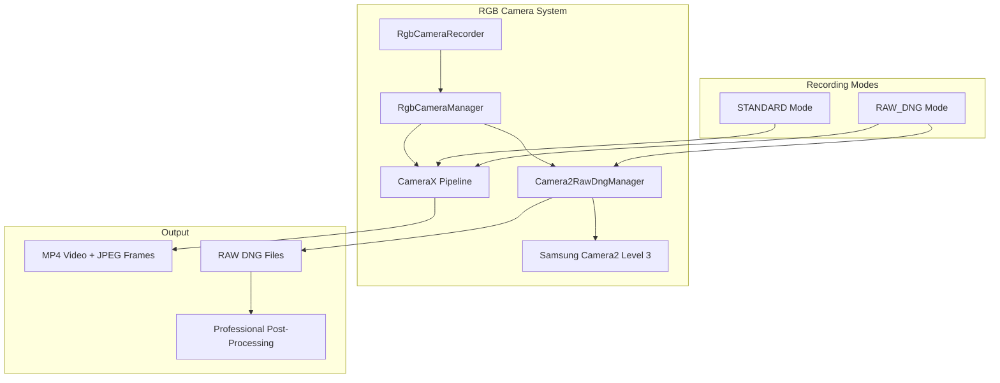

# Samsung Camera2 RAW DNG Integration

## Overview

The Multi-Modal Physiological Sensing Platform now supports professional RAW DNG capture from Samsung devices with Camera2 Level 3 (Stage3/Level3 processing) support. This feature enables researchers to capture unprocessed sensor data directly from Samsung's advanced camera pipeline.

## Supported Devices

### Samsung Galaxy S Series (Camera2 Level 3 Support)

**Fully Supported:**
- Galaxy S22 series (SM-S901*, SM-S906*, SM-S908*)
- Galaxy S23 series (SM-S911*, SM-S916*, SM-S918*)  
- Galaxy S24 series (SM-S921*, SM-S926*, SM-S928*)
- Galaxy S21 series (SM-G991*, SM-G996*, SM-G998*)

**Legacy Support:**
- Galaxy Note 20 series (SM-N981*, SM-N986*)

## Technical Implementation

### Architecture



### Key Classes

#### Camera2RawDngManager
- **Purpose**: Direct Camera2 API integration for Samsung RAW DNG capture
- **Features**: 
  - Samsung device detection with model-specific optimization
  - Camera2 Level 3 hardware capability verification
  - RAW_SENSOR, RAW10, RAW12 format support
  - Manual sensor controls for maximum image quality
- **Location**: `android_sensor_node/app/src/main/java/com/yourcompany/sensorspoke/sensors/rgb/Camera2RawDngManager.kt`

#### Enhanced RgbCameraManager
- **Purpose**: Unified camera management with dual-mode operation
- **Features**:
  - Seamless integration of CameraX and Camera2 APIs
  - Samsung-specific capability detection
  - RAW DNG availability reporting
- **Updates**: Added RAW DNG support fields to CameraInfo data class

#### Updated RgbCameraRecorder
- **Purpose**: Recording orchestration with RAW DNG mode support
- **Features**:
  - RecordingMode enum (STANDARD, RAW_DNG)  
  - Parallel recording: standard video + RAW DNG capture
  - Enhanced CSV logging with RAW filename references
- **Status**: RECORDING_RAW_DNG status for UI feedback

## Usage

### 1. Device Detection

```kotlin
val rgbCameraManager = RgbCameraManager(context, lifecycleOwner)
rgbCameraManager.initialize()

val cameraStatus = rgbCameraManager.getCameraStatus()
if (cameraStatus.isSamsungLevel3Device && cameraStatus.supportsRawDng) {
    // Enable RAW DNG controls
    showRawDngOption()
}
```

### 2. Recording Mode Selection

```kotlin
val rgbCameraRecorder = RgbCameraRecorder(context, lifecycleOwner)

// Enable RAW DNG mode for Samsung Level 3 devices
if (rgbCameraRecorder.isSamsungLevel3Device()) {
    rgbCameraRecorder.setRecordingMode(RgbCameraRecorder.RecordingMode.RAW_DNG)
}

// Start recording (will capture both standard video and RAW DNG)
rgbCameraRecorder.start(sessionDir)
```

### 3. UI Integration

The RGB preview fragment automatically detects Samsung Level 3 capability and shows RAW DNG toggle:

```kotlin
// Fragment automatically detects Samsung Level 3 support
fragment.setRgbCameraRecorder(rgbCameraRecorder)  // Updates UI accordingly
```

## File Output Structure

When RAW DNG mode is enabled, the session directory structure is enhanced:

```
/sessions/<sessionId>/
├── rgb/
│   ├── video_<timestamp>.mp4          # Standard video recording
│   ├── frames/                        # JPEG frame captures
│   │   ├── frame_<timestamp_1>.jpg
│   │   └── frame_<timestamp_2>.jpg
│   ├── raw_dng/                       # NEW: RAW DNG files  
│   │   ├── raw_<timestamp_1>_001.dng  # Professional RAW captures
│   │   ├── raw_<timestamp_2>_002.dng
│   │   └── raw_<timestamp_3>_003.dng
│   └── rgb.csv                        # Enhanced with RAW filenames
├── thermal/
├── gsr/
└── metadata.json
```

### Enhanced CSV Format

With RAW DNG mode, the CSV includes an additional column:

```csv
timestamp_ns,timestamp_ms,frame_count,filename,video_start_time_ms,actual_video_start_time_ms,video_relative_time_ms,estimated_video_frame,sync_quality,raw_dng_file
1703856123656789014,1703856123656,1,frame_1703856123656789014.jpg,1703856123500,1703856123510,146,4,0.998,raw_1703856123656789014_001.dng
1703856123806789015,1703856123806,2,frame_1703856123806789015.jpg,1703856123500,1703856123510,296,9,0.997,raw_1703856123806789015_002.dng
```

## Camera2 Level 3 Technical Details

### Samsung Stage3/Level3 Processing
- **Hardware Level**: `INFO_SUPPORTED_HARDWARE_LEVEL_3`
- **Required Capabilities**:
  - `REQUEST_AVAILABLE_CAPABILITIES_RAW`
  - `REQUEST_AVAILABLE_CAPABILITIES_MANUAL_SENSOR`  
  - `REQUEST_AVAILABLE_CAPABILITIES_MANUAL_POST_PROCESSING`

### RAW Format Support
- **Primary**: RAW_SENSOR (Bayer pattern, ~12MP for S22 series)
- **Extended**: RAW10, RAW12 (if available)
- **Typical Resolution**: 4032x3024 (Samsung S22 series)

### Manual Controls Applied
For maximum RAW quality, the implementation disables automatic processing:

```kotlin
captureRequestBuilder.apply {
    set(CaptureRequest.CONTROL_MODE, CameraMetadata.CONTROL_MODE_OFF)
    set(CaptureRequest.CONTROL_AE_MODE, CameraMetadata.CONTROL_AE_MODE_OFF)
    set(CaptureRequest.CONTROL_AWB_MODE, CameraMetadata.CONTROL_AWB_MODE_OFF)
    set(CaptureRequest.EDGE_MODE, CameraMetadata.EDGE_MODE_OFF)
    set(CaptureRequest.NOISE_REDUCTION_MODE, CameraMetadata.NOISE_REDUCTION_MODE_OFF)
    set(CaptureRequest.HOT_PIXEL_MODE, CameraMetadata.HOT_PIXEL_MODE_OFF)
}
```

## Testing

### Unit Tests
Comprehensive test suite covers:
- Samsung device model detection
- Camera2 Level 3 capability verification
- RAW format availability checks  
- Recording mode switching
- Error handling for non-supported devices

**Test Location**: `android_sensor_node/app/src/test/java/com/yourcompany/sensorspoke/sensors/rgb/Camera2RawDngManagerTest.kt`

### Integration Testing
1. **Samsung Device Testing**: Validate on actual Galaxy S22/S23/S24 devices
2. **Non-Samsung Fallback**: Ensure graceful degradation on other devices
3. **Performance Impact**: Monitor CPU/memory usage during dual recording
4. **Storage Requirements**: RAW DNG files ~15-25MB each

## Performance Considerations

### Resource Usage
- **CPU**: Minimal overhead - RAW capture runs in separate thread
- **Memory**: ~25MB per RAW DNG frame buffer
- **Storage**: RAW DNG files significantly larger than JPEG (~20x)
- **Battery**: Moderate increase due to enhanced processing

### Optimization
- Non-blocking RAW capture in background coroutines
- Efficient memory management with automatic cleanup
- Progressive JPEG + RAW DNG parallel processing

## Error Handling

### Graceful Degradation
- Non-Samsung devices: RAW DNG controls hidden, standard mode only
- Samsung without Level 3: Warning message, toggle disabled
- Camera2 API errors: Fallback to CameraX-only operation
- Storage limitations: User notification with space requirements

### Logging
All RAW DNG operations are logged with structured logging:

```kotlin
Log.i(TAG, "Samsung Level 3 device detected: ${deviceInfo.deviceModel}")
Log.i(TAG, "RAW DNG support: ${deviceInfo.supportsRawDng}, Formats: ${deviceInfo.availableRawFormats}")
Log.d(TAG, "RAW DNG captured: $rawFilename (${bytes.size} bytes)")
```

## Future Enhancements

### Planned Features
1. **Manual Exposure Controls**: UI for ISO, shutter speed, focus distance
2. **RAW Processing Pipeline**: Built-in DNG development options
3. **Batch Export**: Automated RAW DNG to processed image conversion
4. **Cloud Integration**: Direct RAW DNG upload for research workflows
5. **Extended Device Support**: Additional Samsung models as Level 3 support expands

### Research Applications
- **Computer Vision**: Unprocessed sensor data for algorithm development
- **Physiological Sensing**: Higher dynamic range for subtle color changes
- **Machine Learning**: Training data with maximum information preservation
- **Scientific Photography**: Research-grade image capture capabilities

---

This RAW DNG implementation provides professional-grade image capture capabilities while maintaining full compatibility with the existing multi-modal sensing platform architecture.