# System Flows and State Management

This document details the runtime sequences, state machines, and interaction flows within the multi-modal physiological sensing platform.

## Table of Contents

1. [Core Sequence Diagrams](#core-sequence-diagrams)
2. [State Machine Definitions](#state-machine-definitions)
3. [Error and Recovery Flows](#error-and-recovery-flows)
4. [Network Protocol Flows](#network-protocol-flows)

---

## Core Sequence Diagrams

### Start Recording End-to-End Flow

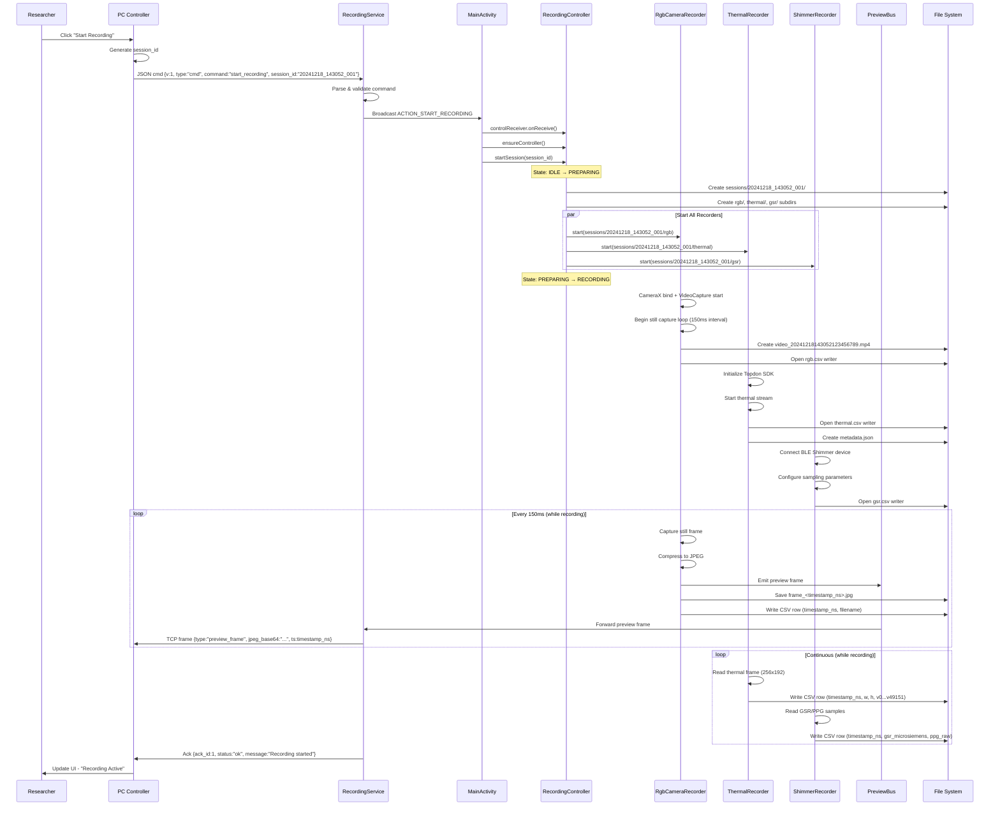

### Stop Recording Flow

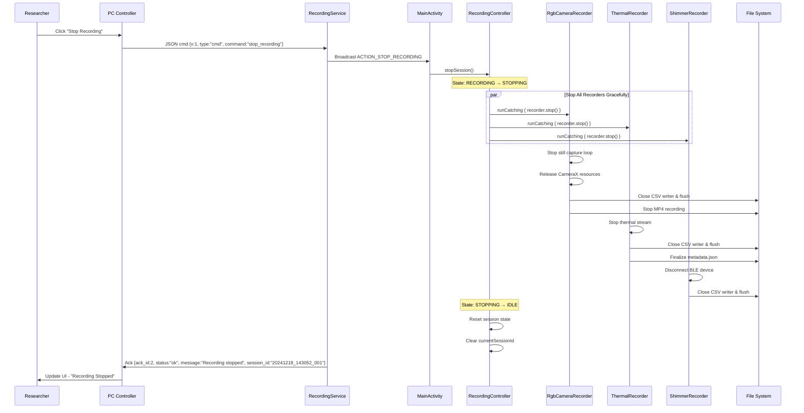

### File Transfer Flow (Device → PC)

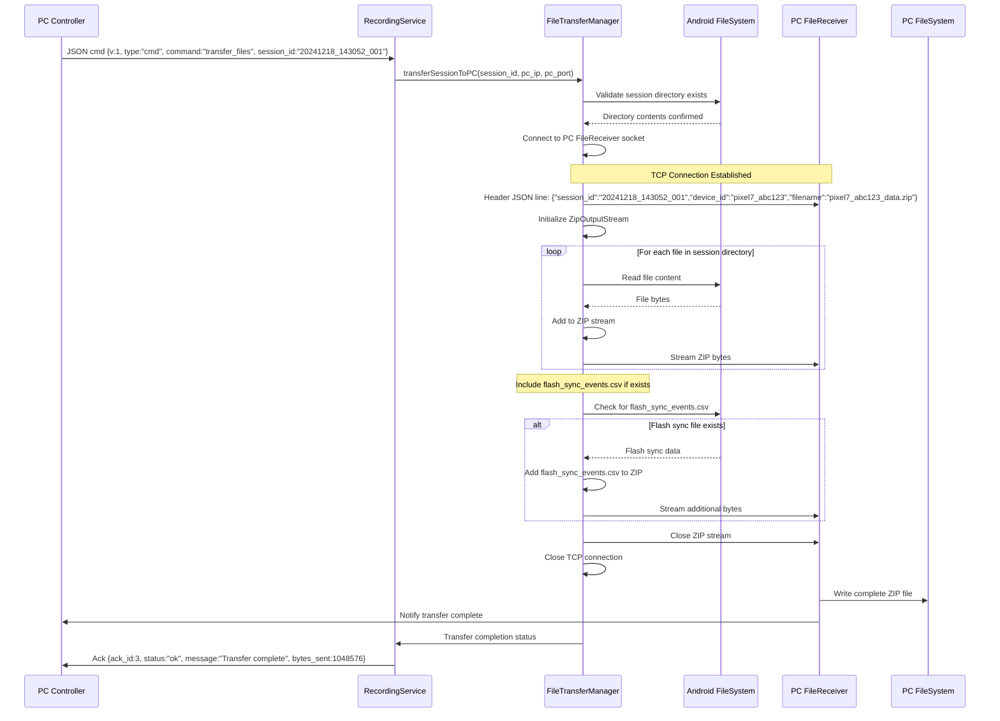

### Time Synchronization Flow

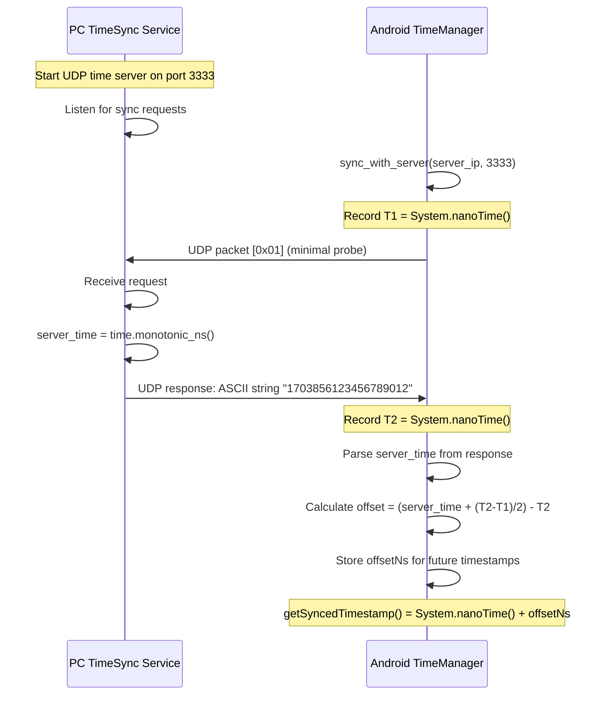

### Client Rejoin Flow

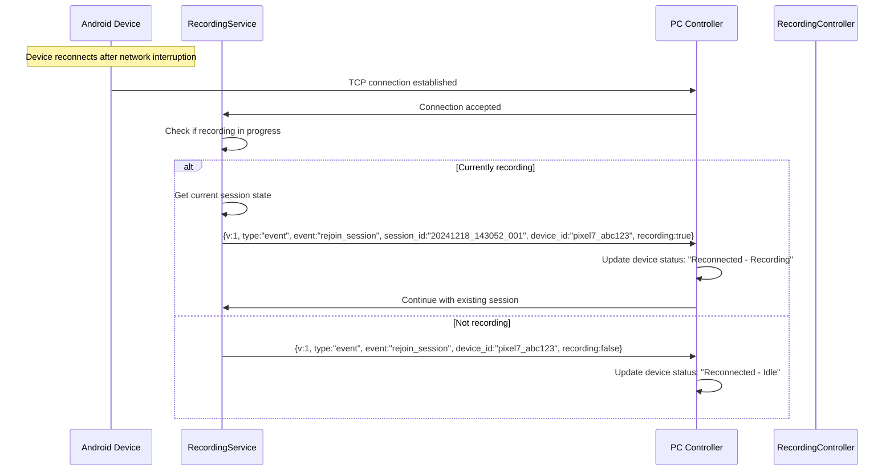

---

## State Machine Definitions

### RecordingController State Machine

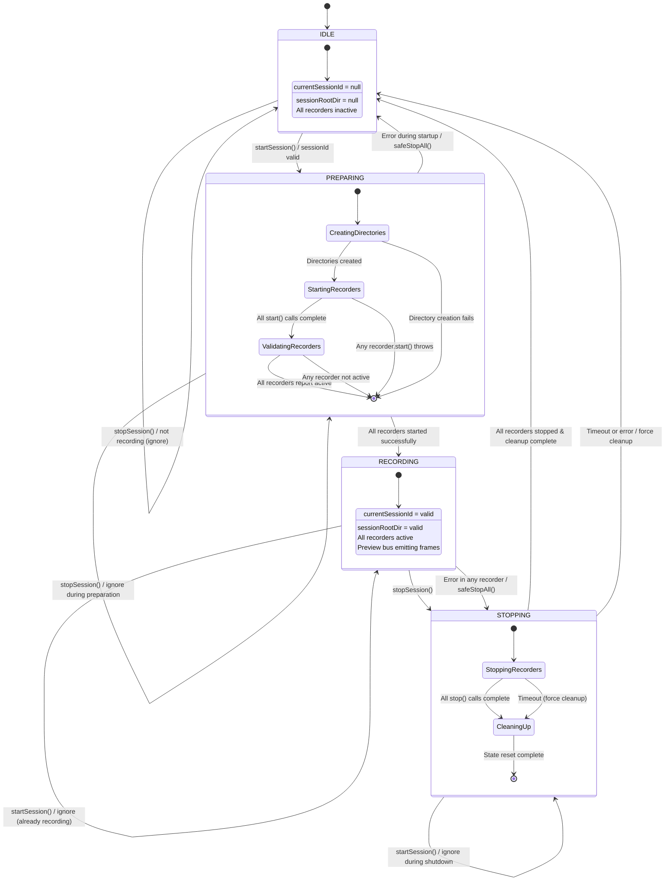

**State Descriptions:**

- **IDLE**: No active session, ready to start recording
- **PREPARING**: Session directory created, starting all sensor recorders
- **RECORDING**: All recorders active, data collection in progress
- **STOPPING**: Gracefully shutting down recorders and finalizing files

**Concurrency Rules:**
- Only one session active at a time per device
- State transitions are atomic and thread-safe via StateFlow
- Error during PREPARING or RECORDING triggers automatic cleanup via `safeStopAll()`

### PC Session Manager State Machine

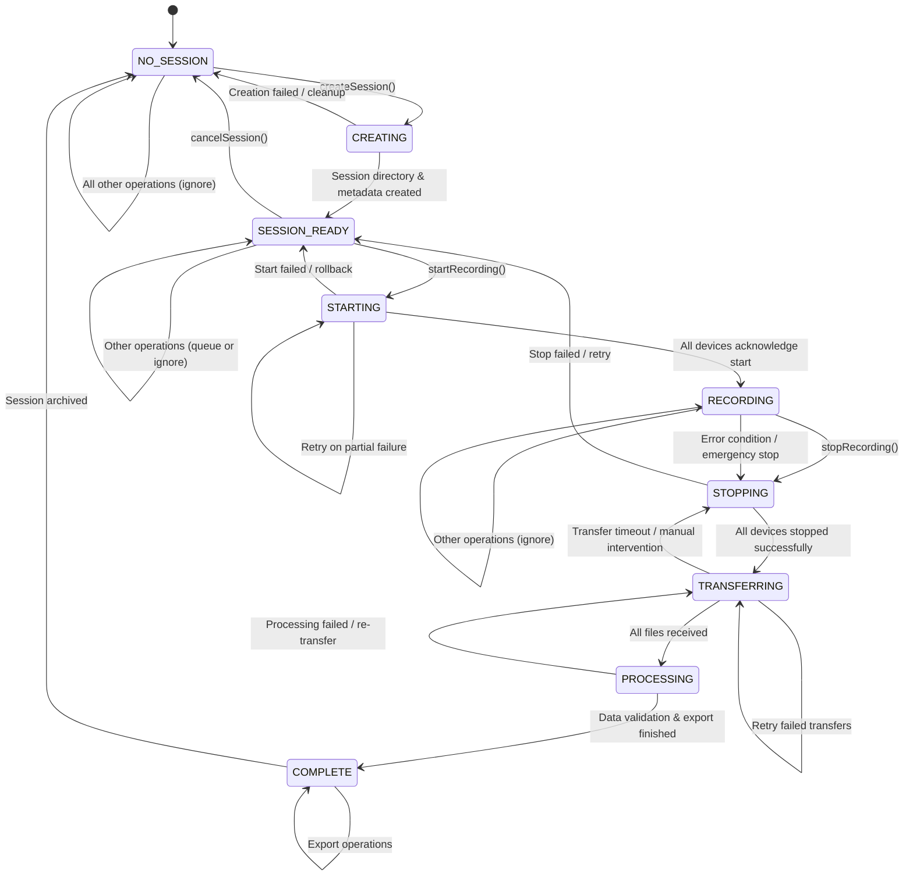

---

## Error and Recovery Flows

### Network Disconnection Recovery

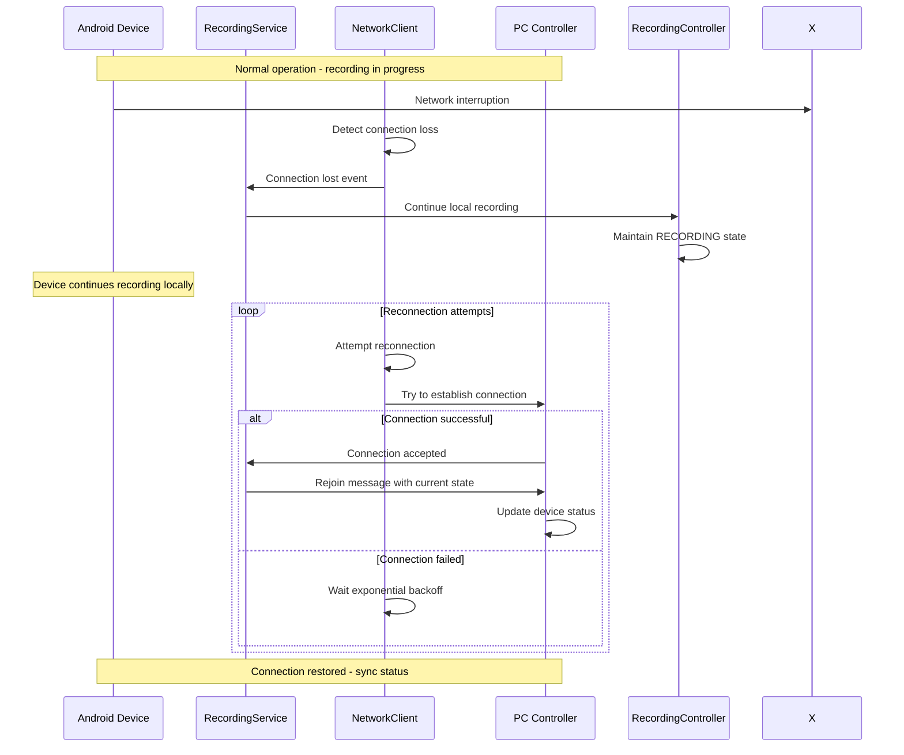

### Recorder Failure Recovery

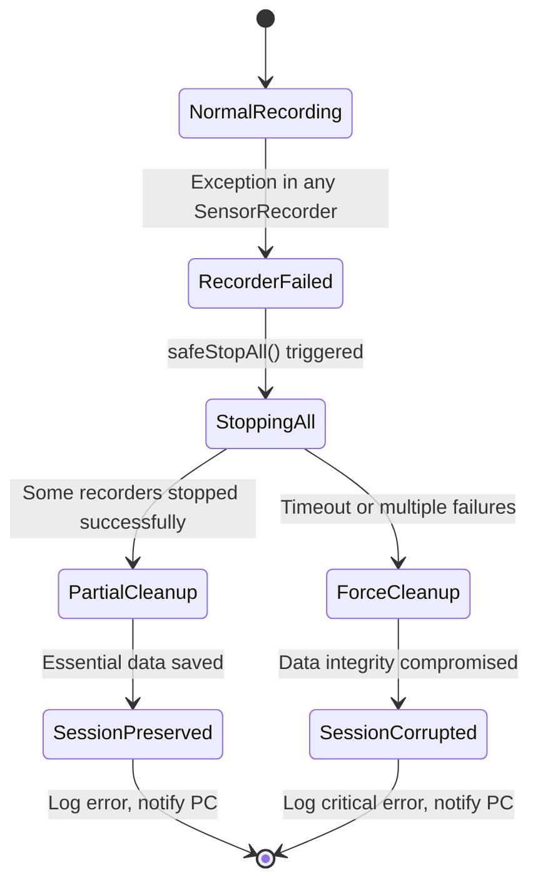

### Storage Space Recovery

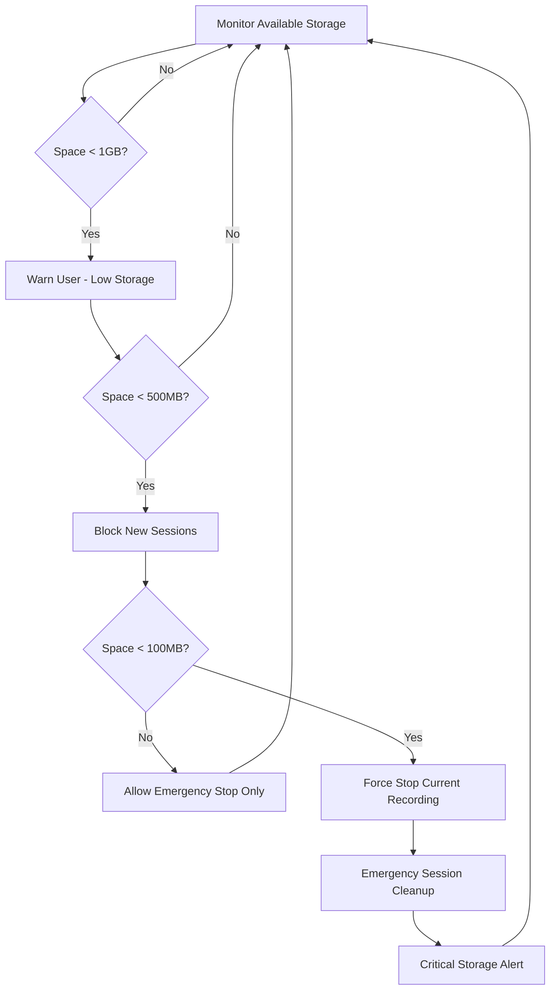

---

## Network Protocol Flows

### mDNS Service Discovery Flow

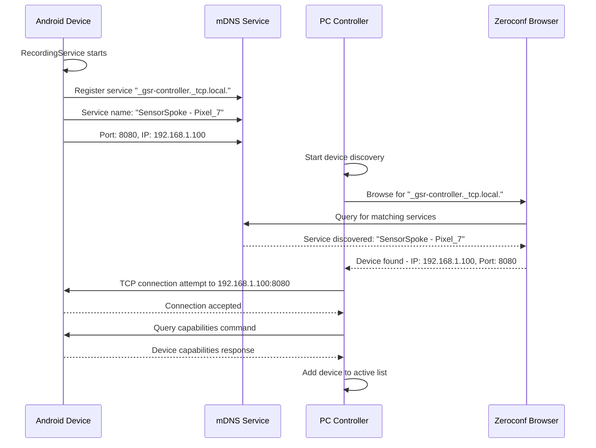

### Command Processing Flow

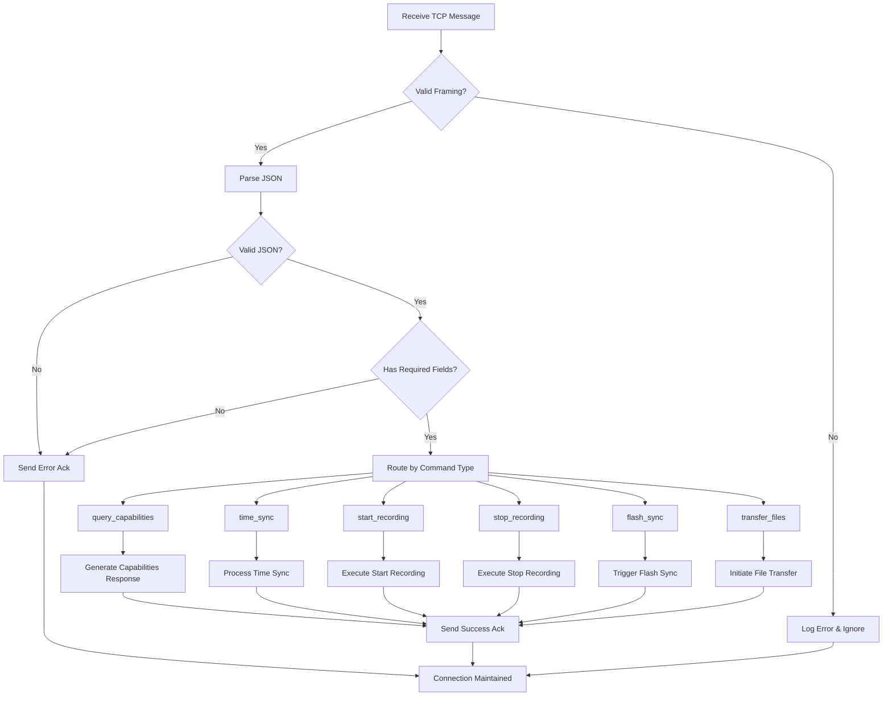

This comprehensive flow documentation provides clear understanding of system interactions, state management, and error handling across all major operational scenarios.
